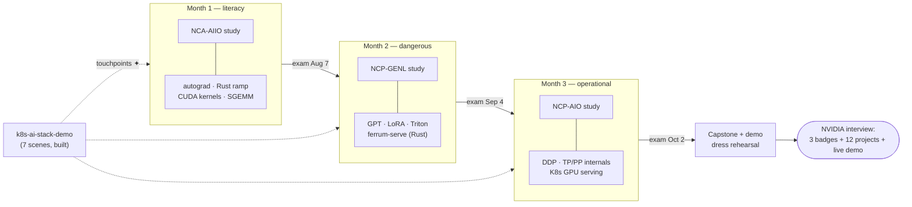

# MASTER PLAN — the navigation hub for the whole path

Three tracks, one 12-week campaign (Mon **2026-07-13** → Fri **2026-10-02**), ~6 h/day, 5 days/week.
**This document is the only bookmark you need** — every week below links to the exact files you'll work in.

| Track | Repo | Role | Time |
|-------|------|------|------|
| **PROVE** | [nvidia-cert-track](nvidia-cert-track/README.md) | NCA-AIIO → NCP-GENL → NCP-AIO | ~2 h/day |
| **BUILD** | [gpu-engineering-lab](gpu-engineering-lab/README.md) | 12 shipped projects: Python → Rust/CUDA → cluster | ~4 h/day |
| **SHOW** | [k8s-ai-stack-demo](k8s-ai-stack-demo/README.md) | the 7-scene evangelist demo (built — scheduled touchpoints) | ✦ marked below |

How they stack: **certs give the vocabulary → the lab gives the scars → the demo gives the story.**

**The whole campaign at a glance:**

## Before week 1 (this weekend)

- [ ] Read the readiness review: [READINESS-REVIEW.md](READINESS-REVIEW.md)
- [ ] Open the prerequisite support layer: [companion-lessons](companion-lessons/README.md)
- [ ] Read this page, then the daily rules: [STUDY-PATH.md](nvidia-cert-track/STUDY-PATH.md) and [tools/daily.md](nvidia-cert-track/tools/daily.md)
- [ ] Book the NCA-AIIO exam for Fri Aug 7 → [tools/booking-checklist.md](nvidia-cert-track/tools/booking-checklist.md)
- [ ] Import [month-1 flashcards](nvidia-cert-track/month-1-nca-aiio/flashcards.csv) into Anki
- [ ] Verify local toolchain: [setup/local-wsl2-cuda.md](gpu-engineering-lab/setup/local-wsl2-cuda.md) (CUDA ≥ 12.8, PyTorch cu128)
- [ ] Skim the build-track curriculum: [ROADMAP.md](gpu-engineering-lab/ROADMAP.md)
- [ ] Push both repos to GitHub — building in public starts at commit one

## The day (Mon–Fri)

Every training day has its own **day doc** — the complete operating manual for that day:
the 2 h study lesson (taught in place, with quick-check questions), the 4 h build
objective with definition-of-done, and a close-the-day checklist. Day docs chain
forward/backward and always link back up here.

**Navigation loop**: this page → week row below → `[day 1]` → `next day →` … →
Friday gate → back here for the next week.

**Prerequisite loop**: Sunday → the week's `[prep]` companion lesson → copy weak spots
into `notes.md` → Monday starts with execution, not discovery.

| Slot | What | Open |
|------|------|------|
| 2 h | study: lesson → quick check → Anki | today's `day-D.md` (enter via `[day 1]` below) |
| 4 h | build | the day doc's build block → project `README.md` |

**Friday (= day 5) is gate day**: self-check + exit criteria + [PROGRESS.md](nvidia-cert-track/PROGRESS.md) row; lab bench → README numbers → push. Rules: [STUDY-PATH.md](nvidia-cert-track/STUDY-PATH.md).

---

## MONTH 1 — literacy (NCA-AIIO, exam Fri Aug 7)

Cert assets: [syllabus](nvidia-cert-track/month-1-nca-aiio/syllabus.md) · [flashcards](nvidia-cert-track/month-1-nca-aiio/flashcards.csv) · [mock exam](nvidia-cert-track/month-1-nca-aiio/mock-exam.md)
Rust ramp starts week 1: [setup/rust-cuda-toolchain.md](gpu-engineering-lab/setup/rust-cuda-toolchain.md)

| Wk | Dates | PROVE — 2 h/day | Prep | BUILD — 4 h/day | Friday check |
|----|-------|-----------------|------|-----------------|--------------|
| 1 | Jul 13–17 | [plan](nvidia-cert-track/month-1-nca-aiio/week-1/plan.md) · [day 1](nvidia-cert-track/month-1-nca-aiio/week-1/day-1.md) · [notes](nvidia-cert-track/month-1-nca-aiio/week-1/notes.md) | [prep](companion-lessons/week-01.md) | [autograd from scratch + Rust ramp](gpu-engineering-lab/01-foundations/week-01-autograd-from-scratch/README.md) | [self-check](nvidia-cert-track/month-1-nca-aiio/week-1/self-check.md) |
| 2 | Jul 20–24 | [plan](nvidia-cert-track/month-1-nca-aiio/week-2/plan.md) · [day 1](nvidia-cert-track/month-1-nca-aiio/week-2/day-1.md) · [notes](nvidia-cert-track/month-1-nca-aiio/week-2/notes.md) | [prep](companion-lessons/week-02.md) | [CUDA-in-Rust basics](gpu-engineering-lab/01-foundations/week-02-cuda-basics/README.md) | [self-check](nvidia-cert-track/month-1-nca-aiio/week-2/self-check.md) |
| 3 | Jul 27–31 | [plan](nvidia-cert-track/month-1-nca-aiio/week-3/plan.md) · [day 1](nvidia-cert-track/month-1-nca-aiio/week-3/day-1.md) · [notes](nvidia-cert-track/month-1-nca-aiio/week-3/notes.md) | [prep](companion-lessons/week-03.md) | [SGEMM ladder vs cuBLAS](gpu-engineering-lab/01-foundations/week-03-matmul-optimization/README.md) | [self-check](nvidia-cert-track/month-1-nca-aiio/week-3/self-check.md) |
| 4 | Aug 3–7 | [plan](nvidia-cert-track/month-1-nca-aiio/week-4/plan.md) · [day 1](nvidia-cert-track/month-1-nca-aiio/week-4/day-1.md) → [mock](nvidia-cert-track/month-1-nca-aiio/mock-exam.md) → **EXAM Fri** | [prep](companion-lessons/week-04.md) | [rusty-kernels → PyTorch](gpu-engineering-lab/01-foundations/week-04-pytorch-custom-ops/README.md) *(light Friday)* | [self-check](nvidia-cert-track/month-1-nca-aiio/week-4/self-check.md) |

✦ **SHOW (wk 4, post-exam)**: re-walk the [demo's 15-layer diagram](k8s-ai-stack-demo/README.md) — you can now narrate every layer cold.

## MONTH 2 — dangerous (NCP-GENL, exam Fri Sep 4)

Cert assets: [syllabus](nvidia-cert-track/month-2-ncp-genl/syllabus.md) · [flashcards](nvidia-cert-track/month-2-ncp-genl/flashcards.csv) · [mock exam](nvidia-cert-track/month-2-ncp-genl/mock-exam.md)
Cert labs (do them the week their topic lands): [LoRA fine-tune](nvidia-cert-track/month-2-ncp-genl/labs/lab-finetune-lora.md) (wk 6) · [quantize + vLLM serve](nvidia-cert-track/month-2-ncp-genl/labs/lab-quantize-serve.md) (wk 7) · [DDP + NCCL logs](nvidia-cert-track/month-2-ncp-genl/labs/lab-distributed-ddp.md) (wk 7–8)

| Wk | Dates | PROVE — 2 h/day | Prep | BUILD — 4 h/day | Friday check |
|----|-------|-----------------|------|-----------------|--------------|
| 5 | Aug 10–14 | [plan](nvidia-cert-track/month-2-ncp-genl/week-5/plan.md) · [day 1](nvidia-cert-track/month-2-ncp-genl/week-5/day-1.md) · [notes](nvidia-cert-track/month-2-ncp-genl/week-5/notes.md) | [prep](companion-lessons/week-05.md) | [GPT from scratch](gpu-engineering-lab/02-llm-engineering/week-05-gpt-from-scratch/README.md) | [self-check](nvidia-cert-track/month-2-ncp-genl/week-5/self-check.md) |
| 6 | Aug 17–21 | [plan](nvidia-cert-track/month-2-ncp-genl/week-6/plan.md) · [day 1](nvidia-cert-track/month-2-ncp-genl/week-6/day-1.md) · [notes](nvidia-cert-track/month-2-ncp-genl/week-6/notes.md) | [prep](companion-lessons/week-06.md) | [LoRA from scratch](gpu-engineering-lab/02-llm-engineering/week-06-lora-from-scratch/README.md) | [self-check](nvidia-cert-track/month-2-ncp-genl/week-6/self-check.md) |
| 7 | Aug 24–28 | [plan](nvidia-cert-track/month-2-ncp-genl/week-7/plan.md) · [day 1](nvidia-cert-track/month-2-ncp-genl/week-7/day-1.md) · [notes](nvidia-cert-track/month-2-ncp-genl/week-7/notes.md) | [prep](companion-lessons/week-07.md) | [Triton kernels + INT8 quant](gpu-engineering-lab/02-llm-engineering/week-07-triton-quantization/README.md) | [self-check](nvidia-cert-track/month-2-ncp-genl/week-7/self-check.md) |
| 8 | Aug 31–Sep 4 | [plan](nvidia-cert-track/month-2-ncp-genl/week-8/plan.md) · [day 1](nvidia-cert-track/month-2-ncp-genl/week-8/day-1.md) → [mock](nvidia-cert-track/month-2-ncp-genl/mock-exam.md) → **EXAM Fri** | [prep](companion-lessons/week-08.md) | [ferrum-serve: Rust inference engine](gpu-engineering-lab/02-llm-engineering/week-08-mini-inference-server/README.md) *(light Friday)* | [self-check](nvidia-cert-track/month-2-ncp-genl/week-8/self-check.md) |

✦ **SHOW (wk 8)**: dry-run [demo.sh](k8s-ai-stack-demo/scripts/demo.sh) scenes 1–3 on kind/k3s — the YAML walk-through needs no GPU.

## MONTH 3 — operational (NCP-AIO, exam Fri Oct 2)

Cert assets: [syllabus](nvidia-cert-track/month-3-ncp-aio/syllabus.md) · [flashcards](nvidia-cert-track/month-3-ncp-aio/flashcards.csv) · [mock + lab scenarios](nvidia-cert-track/month-3-ncp-aio/mock-exam.md)
Cert labs: [GPU Operator](nvidia-cert-track/month-3-ncp-aio/labs/lab-gpu-operator.md) (wk 9) · [Slurm basics](nvidia-cert-track/month-3-ncp-aio/labs/lab-slurm-basics.md) (wk 9) · [MIG config](nvidia-cert-track/month-3-ncp-aio/labs/lab-mig-config.md) (wk 10) · [KAI / Run:ai](nvidia-cert-track/month-3-ncp-aio/labs/lab-runai-kai.md) (wk 10) · [break-and-fix drills](nvidia-cert-track/month-3-ncp-aio/labs/lab-troubleshoot.md) (wk 11–12)
Cloud rentals this month: [setup/cloud-multi-gpu.md](gpu-engineering-lab/setup/cloud-multi-gpu.md)

| Wk | Dates | PROVE — 2 h/day | Prep | BUILD — 4 h/day | Friday check |
|----|-------|-----------------|------|-----------------|--------------|
| 9 | Sep 7–11 | [plan](nvidia-cert-track/month-3-ncp-aio/week-9/plan.md) · [day 1](nvidia-cert-track/month-3-ncp-aio/week-9/day-1.md) · [notes](nvidia-cert-track/month-3-ncp-aio/week-9/notes.md) | [prep](companion-lessons/week-09.md) | [distributed training internals](gpu-engineering-lab/03-scale-and-serve/week-09-distributed-training/README.md) *(cloud 2×GPU)* | [self-check](nvidia-cert-track/month-3-ncp-aio/week-9/self-check.md) |
| 10 | Sep 14–18 | [plan](nvidia-cert-track/month-3-ncp-aio/week-10/plan.md) · [day 1](nvidia-cert-track/month-3-ncp-aio/week-10/day-1.md) · [notes](nvidia-cert-track/month-3-ncp-aio/week-10/notes.md) | [prep](companion-lessons/week-10.md) | [tensor + pipeline parallelism](gpu-engineering-lab/03-scale-and-serve/week-10-parallelism-internals/README.md) *(cloud)* | [self-check](nvidia-cert-track/month-3-ncp-aio/week-10/self-check.md) |
| 11 | Sep 21–25 | [plan](nvidia-cert-track/month-3-ncp-aio/week-11/plan.md) · [day 1](nvidia-cert-track/month-3-ncp-aio/week-11/day-1.md) · [notes](nvidia-cert-track/month-3-ncp-aio/week-11/notes.md) | [prep](companion-lessons/week-11.md) | [K8s GPU serving](gpu-engineering-lab/03-scale-and-serve/week-11-k8s-gpu-serving/README.md) | [self-check](nvidia-cert-track/month-3-ncp-aio/week-11/self-check.md) |
| 12 | Sep 28–Oct 2 | [plan](nvidia-cert-track/month-3-ncp-aio/week-12/plan.md) · [day 1](nvidia-cert-track/month-3-ncp-aio/week-12/day-1.md) → lab drills → [mock](nvidia-cert-track/month-3-ncp-aio/mock-exam.md) → **EXAM Fri** | [prep](companion-lessons/week-12.md) | [capstone: train→quantize→serve](gpu-engineering-lab/03-scale-and-serve/week-12-capstone/README.md) + [REPORT](gpu-engineering-lab/03-scale-and-serve/week-12-capstone/REPORT-template.md) | [self-check](nvidia-cert-track/month-3-ncp-aio/week-12/self-check.md) |

✦ **SHOW (wk 9)**: on the same rented node, run the demo's [TrainJob](k8s-ai-stack-demo/train/trainjob.yaml) + NCCL scenes for real — one rental, two repos fed.
✦ **SHOW (wk 10)**: re-verify the demo's pinned fast-moving APIs ([KAI manifests](k8s-ai-stack-demo/scheduling/), [DRA manifests](k8s-ai-stack-demo/dra/)) against upstream.
✦ **SHOW (wk 11, load-bearing)**: week-11's k3s stack IS the demo's platform layer — run all 7 scenes of [demo.sh](k8s-ai-stack-demo/scripts/demo.sh) on it, and **extend scene 6: ferrum-serve next to [vLLM](k8s-ai-stack-demo/serve/vllm-single.yaml)** — the tiny-image cold-start story no one else has.
✦ **SHOW (wk 12)**: dress rehearsal, recorded — 7 scenes + lab repo tour + [mock interview drill](03_mock_interview_qa.md).

---

## Gates (don't negotiate with yourself)

1. **Exam gate**: sit only at ≥ 80 % on the timed, closed-book mock (linked in each month above). Decide on mock day, not exam morning.
2. **Ship gate**: a build week ships only when its README's acceptance criteria pass; stretch goals may be cut, criteria may not.
3. **Priority**: exam weeks (4, 8, 12) PROVE wins; all other weeks BUILD wins; SHOW touchpoints are scheduled, not squeezed in.

Weekly log lives in [PROGRESS.md](nvidia-cert-track/PROGRESS.md) — one row every Friday, no exceptions.

## Reference shelf (root files)

- [READINESS-REVIEW.md](READINESS-REVIEW.md) — weaknesses, corrections, and readiness gates for this profile
- [companion-lessons](companion-lessons/README.md) — week-by-week math/programming/system prerequisites
- [01_pitch_and_demo.md](01_pitch_and_demo.md) — the pitch; update it in week 12
- [03_mock_interview_qa.md](03_mock_interview_qa.md) — interview drill, weeks 11–12
- [04_stack_reference_verified.md](04_stack_reference_verified.md) — verified stack facts, cite freely
- [00_study_plan.md](00_study_plan.md) / [02_hands_on_labs.md](02_hands_on_labs.md) — superseded by the two repos; historical reference
- [nvidia_prep_hub.html](nvidia_prep_hub.html) — earlier dashboard; this file replaces it as the hub

## Definition of undeniable (Oct 2 checklist)

- [ ] 3 badges (NCA-AIIO, NCP-GENL, NCP-AIO) on LinkedIn
- [ ] 12 lab projects public, every [README index row](gpu-engineering-lab/README.md) carrying measured numbers
- [ ] demo repo re-verified on current APIs + the ferrum-serve scene added
- [ ] one recorded end-to-end run: demo scenes + [capstone pipeline](gpu-engineering-lab/03-scale-and-serve/week-12-capstone/pipeline/steps.md)
- [ ] [pitch](01_pitch_and_demo.md) updated to reference all three tracks
- [ ] [interview drill](03_mock_interview_qa.md) done twice without notes
