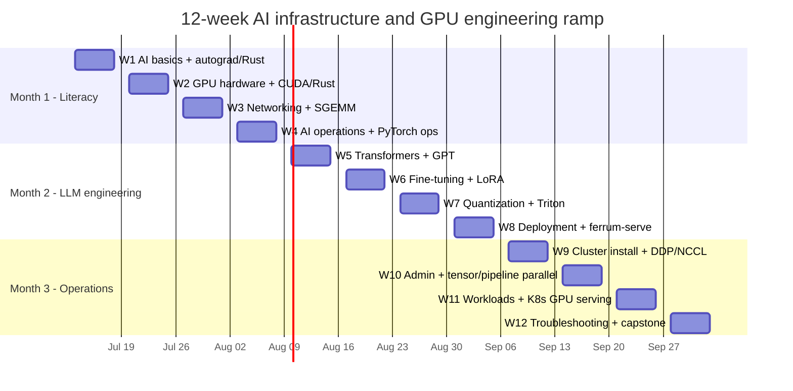

# ai-infra-gpu-engineering-ramp

**Last updated:** 2026-07-18 12:34 +02:00

## Usage Dashboard

<!-- STATS:START -->
| Metric | Value |
|--------|-------|
| ⭐ Stars | 0 |
| 🍴 Forks | 0 |
| 👀 Watchers | 0 |
| 📈 Traffic | _no snapshot yet — needs `TRAFFIC_TOKEN` secret (PAT with repo scope)_ |
<!-- STATS:END -->

A 12-week public ramp-up for AI infrastructure and GPU engineering. The repo combines
NVIDIA certification prep, from-scratch GPU/LLM engineering projects, C++/CUDA
parallelism drills, Kubernetes GPU operations labs, prerequisite companion lessons,
source-reading maps, and a final portfolio-ready demo path.

This is built as a study tool first and a public proof artifact second: every week has a
study plan, a build project, prerequisite support, a Friday gate, and a linkable result.

## Start Here

Morning work starts at [MASTER-PLAN.md](MASTER-PLAN.md). That page is the daily
navigation hub: current week, day doc, prerequisite lesson, build project, and Friday
self-check.

Before starting a new week, clear the matching page in
[companion-lessons](companion-lessons/README.md). Those lessons cover the math,
programming-language, CUDA, PyTorch, Triton, distributed-training, and Kubernetes
prerequisites that make the weekly plans executable.

For low-level reinforcement, use the matching module in
[cpp-cuda-track](cpp-cuda-track/README.md). It mirrors each major systems concept in
modern C++ and CUDA so the CPU/GPU execution-model differences stay concrete.

For distributed-training source reading, use the
[Hugging Face Ultra-Scale Playbook map](references/hf-ultrascale-playbook.md). It
adds transformer memory accounting, ZeRO/FSDP, 5D parallelism, kernel fusion,
profiling, and compute/communication overlap to the weeks where those ideas pay off.

The GitHub Pages site also includes a browser-local progress sidebar. Visitors can
tick off core weeks and optional support lanes; progress is stored in a cookie on
their own device, with no account or database.

## What This Repo Is For

- Build enough AI infrastructure depth to explain and operate the NVIDIA Kubernetes-AI stack.
- Earn structured proof through NCA-AIIO, NCP-GENL, and NCP-AIO certification prep.
- Build a GPU engineering portfolio: autograd, CUDA/Rust kernels, SGEMM, GPT, LoRA,
  Triton kernels, a Rust inference server, distributed training, and Kubernetes GPU serving.
- Drill C++/CUDA parallelism side by side: execution model, memory hierarchy, reductions,
  scans, tiling, streams, atomics, roofline, tensor cores, multi-device, and PyTorch extensions.
- Produce a demo-ready story for interviews, pre-sales, and developer-evangelist work.

## The Four Tracks

| Track | Purpose | Where |
|-------|---------|-------|
| PROVE | Certification study, self-checks, mock exams, flashcards | [nvidia-cert-track](nvidia-cert-track/README.md) |
| BUILD | Twelve shipped GPU/LLM/system projects with tests and benchmarks | [gpu-engineering-lab](gpu-engineering-lab/README.md) |
| DRILL | C++ vs CUDA mirror modules for low-level parallelism and performance intuition | [cpp-cuda-track](cpp-cuda-track/README.md) |
| SHOW | Kubernetes-AI stack demo and interview/pitch material | [k8s-ai-stack-demo](k8s-ai-stack-demo/README.md) |

## 12-Week Path

```mermaid
flowchart LR
    W01["W1<br/>AI basics<br/>Autograd + Rust"] --> W02["W2<br/>GPU systems<br/>CUDA in Rust"]
    W02 --> W03["W3<br/>Networking<br/>SGEMM + roofline"]
    W03 --> W04["W4<br/>AI ops<br/>PyTorch custom ops"]
    W04 --> W05["W5<br/>Transformers<br/>GPT from scratch"]
    W05 --> W06["W6<br/>Fine-tuning<br/>LoRA + QLoRA"]
    W06 --> W07["W7<br/>Optimization<br/>Triton + quantization"]
    W07 --> W08["W8<br/>Deployment<br/>Rust inference server"]
    W08 --> W09["W9<br/>Install/deploy<br/>DDP + NCCL"]
    W09 --> W10["W10<br/>Administration<br/>TP + PP internals"]
    W10 --> W11["W11<br/>Workloads<br/>K8s GPU serving"]
    W11 --> W12["W12<br/>Troubleshooting<br/>Capstone + exam"]
```

## Calendar View

## Topics Covered

| Week | Study focus | Build focus | Core insight |
|------|-------------|-------------|--------------|
| 1 | AI/ML/DL basics, training loop, GPU vs CPU | Autograd from scratch, Rust ramp | Backprop is the chain rule over a computation graph. |
| 2 | GPU hardware, memory, precision, NVLink | CUDA kernels in Rust, benchmark harness | Most beginner kernels are bounded by bytes moved. |
| 3 | InfiniBand/RoCE, DPUs, storage, data center design | SGEMM optimization ladder | Roofline shows whether math or memory is the bottleneck. |
| 4 | Kubernetes, Slurm, monitoring, MIG/time-slicing/vGPU | Rust kernels exposed to PyTorch | Stable softmax and normalization are production primitives. |
| 5 | Transformers, prompting, RAG, data prep | GPT from scratch | Attention shape math explains model behavior and cost. |
| 6 | Fine-tuning, PEFT, LoRA, evaluation | LoRA and QLoRA from scratch | Low-rank updates adapt behavior without training the full model. |
| 7 | Quantization, GPU acceleration, TensorRT-LLM | Triton kernels, INT8/INT4 quantization | Faster inference often comes from reducing memory traffic. |
| 8 | Deployment, monitoring, safety, review | Rust inference server with batching and paged KV | Serving is queueing plus memory management plus model execution. |
| 9 | BCM, Slurm/K8s setup, NCCL | Distributed training internals | All-reduce cost explains scaling efficiency. |
| 10 | Slurm admin, Run:ai/KAI, MIG, K8s admin | Tensor and pipeline parallelism | Parallelism trades memory limits for communication cost. |
| 11 | NGC, workload deployment, troubleshooting | Kubernetes GPU serving stack | A GPU service is healthy only when scheduling, runtime, app, and metrics all agree. |
| 12 | Timed lab drills, troubleshooting, mock exam | End-to-end capstone and portfolio polish | The final artifact must prove claims with reproducible evidence. |

## Source Reading Lane

| Weeks | Source | What it adds |
|-------|--------|--------------|
| 5-12 | [Hugging Face Ultra-Scale Playbook map](references/hf-ultrascale-playbook.md) | Memory ledgers, global batch math, ZeRO/FSDP, TP/PP/context/expert parallelism, FlashAttention, profiling, and overlap math. |

## C++/CUDA Mirror Track

| Week | Mirror module | Why it fits |
|------|---------------|-------------|
| 1 | [01 execution model](cpp-cuda-track/01-execution-model/README.md) | CPU threads vs GPU grids/blocks/warps grounds the whole ramp. |
| 2 | [02 memory hierarchy](cpp-cuda-track/02-memory-hierarchy/README.md) + [03 SAXPY](cpp-cuda-track/03-data-parallel-saxpy/README.md) | Cache lines, coalescing, bandwidth, and grid-stride kernels reinforce GPU hardware week. |
| 3 | [06 matmul tiling](cpp-cuda-track/06-matmul-tiling/README.md) + [09 roofline](cpp-cuda-track/09-profiling-roofline/README.md) | SGEMM and networking both become bottleneck math instead of vocabulary. |
| 4 | [12 PyTorch extension capstone](cpp-cuda-track/12-capstone-pytorch-extension/README.md) | Pairs directly with custom ops and PyTorch dispatch concepts. |
| 5 | [04 reduction](cpp-cuda-track/04-reduction/README.md) | Attention, softmax, and normalization all rely on reductions. |
| 6 | [05 scan/histogram](cpp-cuda-track/05-scan-histogram/README.md) | Adapter/evaluation weeks benefit from contention and aggregation intuition. |
| 7 | [10 advanced GPU](cpp-cuda-track/10-advanced-gpu/README.md) | Tensor cores, warp intrinsics, and fusion support quantization/Triton week. |
| 8 | [07 async overlap](cpp-cuda-track/07-async-overlap/README.md) | Streams, events, and overlap map onto serving latency/throughput work. |
| 9 | [11 multi-device](cpp-cuda-track/11-multi-device/README.md) | P2P, NVLink, NCCL, NUMA, and ring all-reduce pair with distributed training. |
| 10 | [08 atomics and memory model](cpp-cuda-track/08-sync-atomics-memory-model/README.md) | Parallelism internals need synchronization and memory-order discipline. |
| 11 | [09 profiling roofline](cpp-cuda-track/09-profiling-roofline/README.md) | K8s serving claims need Nsight/perf-backed measurement habits. |
| 12 | [12 PyTorch extension capstone](cpp-cuda-track/12-capstone-pytorch-extension/README.md) | Final integration: one op, CPU and CUDA backends, benchmarked against PyTorch. |

## Main Entry Points

- [MASTER-PLAN.md](MASTER-PLAN.md) - daily operating dashboard.
- [READINESS-REVIEW.md](READINESS-REVIEW.md) - weaknesses, corrections, and gates.
- [companion-lessons](companion-lessons/README.md) - prerequisite support by week.
- [references](references/README.md) - source-reading maps for books and long-form references.
- [nvidia-cert-track](nvidia-cert-track/README.md) - certification study path.
- [gpu-engineering-lab](gpu-engineering-lab/README.md) - build projects.
- [cpp-cuda-track](cpp-cuda-track/README.md) - C++/CUDA mirror drills.
- [k8s-ai-stack-demo](k8s-ai-stack-demo/README.md) - demo and Kubernetes-AI stack walkthrough.

## Tech Reference

The stack this ramp is built on. Versions are pulled from the repo's own pins on every
push, so demo upgrades propagate here automatically.

<!-- TECH:START -->
| Tech | Area | Version | Where it's pinned / verified |
|------|------|---------|------------------------------|
| **Rust (stable)** | Language | `stable (rustup default)` | Book 3rd ed. targets edition 2024; lab crates pin per-project |
| **Rust nightly (Rust-CUDA)** | GPU kernels | `nightly-2025-11-03` | Pinned by rustc_codegen_nvvm — see week-02 rust-toolchain.toml |
| **Rust edition** | Language | `2021` | Lab crates |
| **Python** | Language | `>=3.10` | week-04 pyproject.toml |
| **PyTorch** | ML framework | `>=2.7` | week-04 custom ops (rusty-kernels) |
| **candle** | Inference (Rust) | `0.9` | week-08 ferrum-serve |
| **tokio** | Async runtime (Rust) | `1.45` | week-08 ferrum-serve |
| **CUDA Toolkit** | GPU platform | `12.8+ (Blackwell minimum)` | RTX 5090 on WSL2 — verify with `nvcc --version` |
| **GPU / driver** | Hardware | `RTX 5090 (Blackwell), WSL2 + Ubuntu` | Local rig |
| **Triton (language)** | GPU kernels (Python) | `3.x` | Week 7 quantization + kernels |
| **Kubernetes** | Orchestration | `v1.34 (DRA GA)` | 04_stack_reference_verified.md — DRA core GA v1.34 |
| **NVIDIA GPU Operator** | K8s GPU stack | `v25.10+` | Required for nvidia-dra-driver-gpu (see stack reference) |

_Versions auto-detected from repo pins (`Cargo.toml`, `pyproject.toml`, `rust-toolchain.toml`) where possible, else from [tech-stack.json](tech-stack.json). Regenerated on every push._
<!-- TECH:END -->

## Status

The curriculum shell, weekly plans, prerequisite lessons, and project scaffolds are in
place. Weekly results tables are filled as projects ship.

This is an independent study repository and is not affiliated with or endorsed by NVIDIA.
