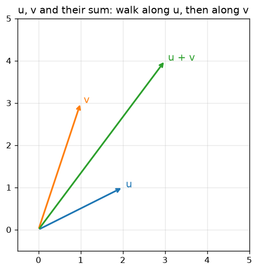
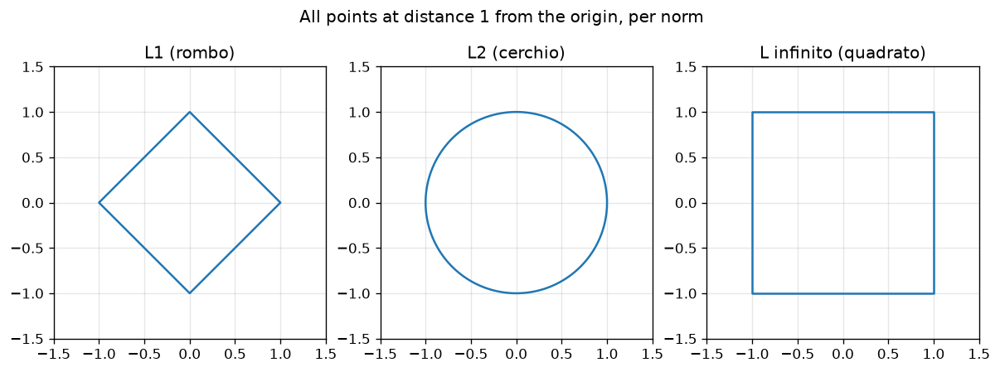

# Module 01 · Linear algebra

Linear algebra is the language of data. A dataset is a matrix. An example is a
vector. A neural network, under the hood, is almost nothing but matrix
multiplication. This module builds that language piece by piece.

## Lessons

| Lesson | Topic | What you'll be able to do |
|---|---|---|
| [01 · Vectors](https://github.com/trocca/ai-infra-gpu-engineering-ramp/tree/main/ai-math/01-linear-algebra/01-vettori) | Vectors, sum, dot product | Describe a data point as a list of numbers and make a prediction with a dot product |
| [02 · Matrices and matmul](https://github.com/trocca/ai-infra-gpu-engineering-ramp/tree/main/ai-math/01-linear-algebra/02-matrici-e-matmul) | Matrices, transpose, matmul | Predict over the whole dataset in one shot with `X @ w` |
| [03 · Norms and distances](https://github.com/trocca/ai-infra-gpu-engineering-ramp/tree/main/ai-math/01-linear-algebra/03-norme-e-distanze) | L1, L2, L∞ norms, distances, cosine | Measure how similar two data points are, and see why normalization matters |
| [04 · Eigenvalues and SVD](https://github.com/trocca/ai-infra-gpu-engineering-ramp/tree/main/ai-math/01-linear-algebra/04-autovalori-svd) | Eigenvalues, eigenvectors, SVD | Find the important directions of a matrix and compress it |

The lessons build on each other — do them in order. Each lesson closes with
`pytest`: when the tests pass, the lesson is done.

The "unit balls" of the L1, L2 and L∞ norms — the same distance 1 from the
center, three different geometries (figure generated by
`03-norme-e-distanze/lesson.py`):

## Book references

- **Mathematics for Machine Learning**: chapter 2 (Linear Algebra), sections
  2.1–2.4 for lessons 01 and 02; chapter 3 (Analytic Geometry), sections 3.1–3.4
  for lesson 03; chapter 4 (Matrix Decompositions) for lesson 04.

## The bridge to the rest of the path

The matmul `X @ w` you learn here is the same operation the
[C++ ↔ CUDA track](../../track/06-matmul-tiling/) optimizes with shared-memory
tiling: first understand *what* it computes, then *how* to compute it fast.
