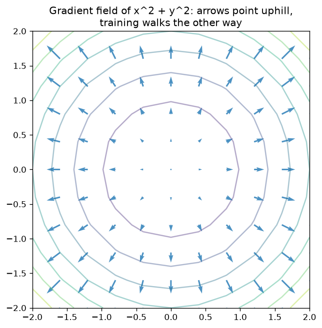

# Module 02 · Calculus

Differential calculus answers a single question, repeated in a thousand forms: if I
nudge this knob a tiny bit, how much does the result change? That "sensitivity" is
called the derivative. Neural networks learn exactly this way: they measure how much
each weight moves the error, and turn the knobs in the right direction.

## Lessons

| Lesson | Topic | What you'll be able to do |
|---|---|---|
| [01 · The derivative as a slope](https://github.com/trocca/ai-infra-gpu-engineering-ramp/tree/main/ai-math/02-calcolo/01-derivata-come-pendenza) | Derivative, finite differences, autograd | Compute the slope of a function in three different ways and verify they agree |
| [02 · Partial derivatives and the gradient](https://github.com/trocca/ai-infra-gpu-engineering-ramp/tree/main/ai-math/02-calcolo/02-derivate-parziali-gradiente) | Partial derivatives, gradient | Measure the slope with respect to every knob, and read ∇ without fear |
| [03 · Chain rule](https://github.com/trocca/ai-infra-gpu-engineering-ramp/tree/main/ai-math/02-calcolo/03-chain-rule) | The chain rule | Differentiate composed functions by multiplying slopes link by link |
| [04 · Matrix calculus and Jacobians](https://github.com/trocca/ai-infra-gpu-engineering-ramp/tree/main/ai-math/02-calcolo/04-matrix-calculus-jacobiani) | Jacobians, gradients of vectors | Handle the shapes of derivatives when inputs and outputs are vectors |

Lesson 03 is the most important of the module: if the chain rule is clear to you,
backpropagation (module 05) will be a formality.

## Book references

- **Mathematics for Machine Learning**: chapter 5 (Vector Calculus) — section 5.1
  for lesson 01, section 5.2 for lessons 02 and 03, section 5.3 for lesson 04,
  section 5.6 as a preview of backpropagation.
- **The Matrix Calculus You Need For Deep Learning** (Parr, Howard): partial
  derivatives, chain rule and the Jacobian told for deep learning practitioners.

## The common thread

The 5-house dataset returns here in a new role: the loss — the model's error
score — seen as a function of one weight. In lesson 01 you'll discover it is a
parabola, and that its slope tells you which way to correct the weight. It is the
seed of gradient descent in [module 04](../04-ottimizzazione/).
