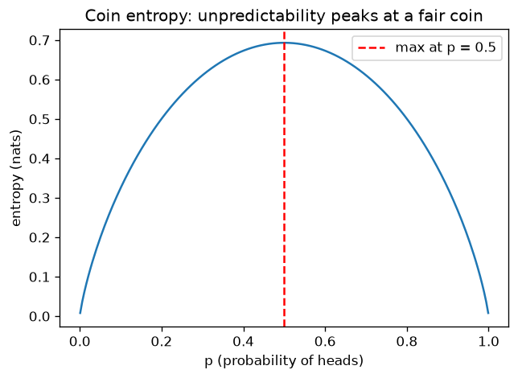

# Module 03 · Probability

Real data is noisy, real models are uncertain. Probability is the language for
reasoning well about uncertainty. In this module you'll also discover one of deep
learning's secrets: nearly all the losses actually used in practice (MSE, cross
entropy) are not invented — they are direct consequences of probabilistic ideas.

## Lessons

| Lesson | Topic | What you'll be able to do |
|---|---|---|
| [01 · Random variables and distributions](https://github.com/trocca/ai-infra-gpu-engineering-ramp/tree/main/ai-math/03-probabilita/01-variabili-casuali-distribuzioni) | Random variables, distributions, expected value | Simulate random processes and predict their average behavior |
| [02 · Likelihood and MLE](https://github.com/trocca/ai-infra-gpu-engineering-ramp/tree/main/ai-math/03-probabilita/02-verosimiglianza-mle) | Likelihood, log likelihood, MLE | Estimate parameters from data by maximizing the likelihood |
| [03 · Entropy, KL, cross entropy](https://github.com/trocca/ai-infra-gpu-engineering-ramp/tree/main/ai-math/03-probabilita/03-entropia-kl-cross-entropy) | Surprise, entropy, KL, cross entropy | Understand where the classification loss really comes from |

Lesson 03 closes the circle: the cross entropy you'll find in every neural network
is where the likelihood of lesson 02 meets entropy.

## Book references

- **Mathematics for Machine Learning**: chapter 6 (Probability and Distributions),
  sections 6.1–6.2 for lesson 01, 6.4 for expected value and variance, 6.5 for the
  Gaussian; chapter 8, section 8.3 for maximum likelihood.
- **Introduction to Probability** (Blitzstein, Hwang): chapters 3–5 as support.
- **Understanding Deep Learning** (Prince): chapter 5 (Loss Functions), the bridge
  between probability and losses.

## The common thread

The error score changes face: in lesson 02 you'll discover that minimizing the MSE
of the house model is the same as maximizing a Gaussian likelihood. And in lesson
03 you'll see that the classification loss is the model's average surprise when
confronted with the truth. Losses aren't invented: they're derived.
