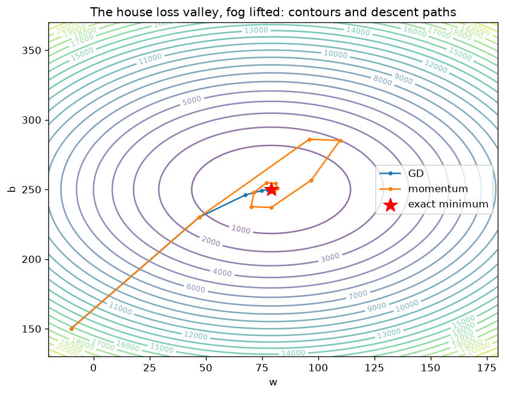
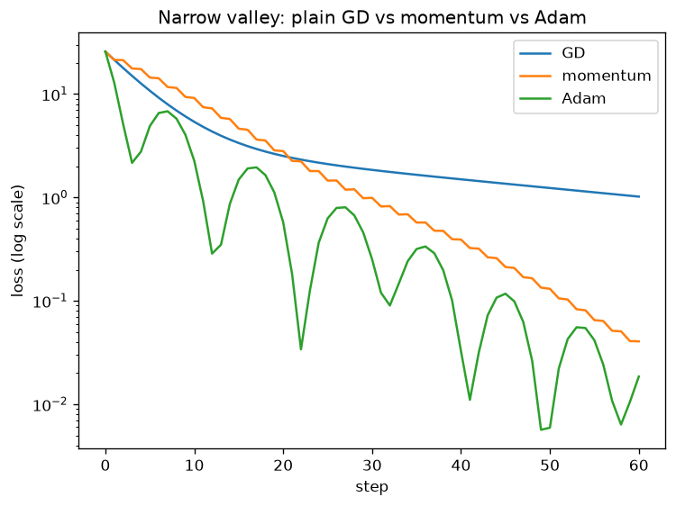

# Module 04 · Optimization

Here everything you've built starts moving. You can measure the error (the loss),
you can compute the slope (the gradient). Optimizing means using those slopes to
descend toward the minimum error, one step at a time. It is the engine behind
training any neural network, from a two-weight model to an LLM.

The metaphor that runs through the whole module: a ball rolling down a valley in
the fog. It can't see the whole valley — it only feels the slope under itself. And
yet, step after step, it finds the bottom.

## Lessons

| Lesson | Topic | What you'll be able to do |
|---|---|---|
| [01 · Gradient descent by hand](https://github.com/trocca/ai-infra-gpu-engineering-ramp/tree/main/ai-math/04-ottimizzazione/01-gradient-descent-a-mano) | Gradient descent, learning rate | Write the descent loop by hand and pick the right step size |
| [02 · SGD and minibatches](https://github.com/trocca/ai-infra-gpu-engineering-ramp/tree/main/ai-math/04-ottimizzazione/02-sgd-minibatch) | SGD, minibatches, epochs | Train on data in chunks, understanding the noise that comes with it |
| [03 · Momentum and Adam](https://github.com/trocca/ai-infra-gpu-engineering-ramp/tree/main/ai-math/04-ottimizzazione/03-momentum-adam) | Momentum, Adam | Implement the two most-used optimizers and verify them against `torch.optim` |
| [04 · Loss landscape](https://github.com/trocca/ai-infra-gpu-engineering-ramp/tree/main/ai-math/04-ottimizzazione/04-loss-landscape) | Loss surfaces, trajectories | Draw the whole valley and watch the ball roll down |

Lesson 03 is pure verification in code: your hand-written Adam must produce, step
by step, the same numbers as `torch.optim.Adam`.

## Book references

- **Mathematics for Machine Learning**: chapter 7 (Continuous Optimization) —
  section 7.1 for gradient descent, momentum and SGD; section 7.3 for convexity.
- **Understanding Deep Learning** (Prince): chapter 6 (Fitting Models).
- **Convex Optimization** (Boyd, Vandenberghe): chapters 2–3, for the curious only.

## The bridge to the rest of the path

The training loop you write here by hand is the same one the
[C++ ↔ CUDA track](../../track/) accelerates: SGD over minibatches is why training
is made of repeated matmuls, and the [reduction](../../track/04-reduction/) you
optimize there is the sum that computes the loss here.
