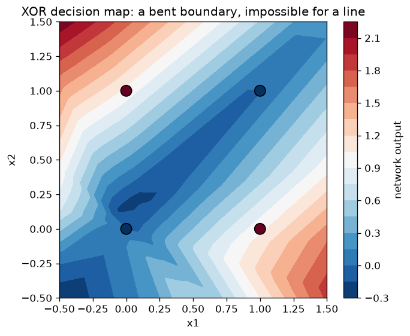
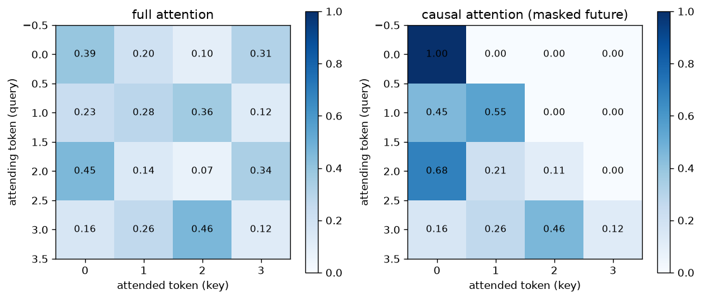

# Modulo 05 · Reti neurali dalla matematica

La sintesi. Ogni pezzo costruito nei moduli precedenti (matrici, gradienti, chain
rule, likelihood, cross entropy, gradient descent, Adam) si incastra qui, e alla
fine del modulo avrai scritto a mano: una regressione lineare che impara, un
classificatore, una rete neurale vera senza `nn.Module`, backpropagation verificata
anello per anello, e la matematica dell'attention che fa funzionare i transformer.

Nessuna magia rimasta: solo matmul, pendenze e sorprese medie.

## Lezioni

| Lezione | Argomento | Cosa saprai fare alla fine |
|---|---|---|
| [01 · Regressione lineare da zero](https://github.com/trocca/ai-infra-gpu-engineering-ramp/tree/main/ai-math/05-reti-neurali/01-regressione-lineare-da-zero) | Il ciclo di training completo | Addestrare il primo modello vero sulle 5 case |
| [02 · Regressione logistica](https://github.com/trocca/ai-infra-gpu-engineering-ramp/tree/main/ai-math/05-reti-neurali/02-regressione-logistica) | Sigmoid, binary cross entropy | Costruire un classificatore e leggerne le probabilità |
| [03 · MLP da zero senza nn](https://github.com/trocca/ai-infra-gpu-engineering-ramp/tree/main/ai-math/05-reti-neurali/03-mlp-da-zero-senza-nn) | Hidden layer, ReLU, XOR | Costruire una rete che risolve un problema impossibile per i modelli lineari |
| [04 · Autograd sotto il cofano](https://github.com/trocca/ai-infra-gpu-engineering-ramp/tree/main/ai-math/05-reti-neurali/04-autograd-sotto-il-cofano) | Il grafo di calcolo, backprop a mano | Rifare il lavoro di `backward()` a mano e verificarlo al decimale |
| [05 · Attention e transformer](https://github.com/trocca/ai-infra-gpu-engineering-ramp/tree/main/ai-math/05-reti-neurali/05-attention-e-transformer) | Query, key, value, softmax, maschera causale | Calcolare a mano il meccanismo che fa funzionare gli LLM |

Le lezioni sono una scala: ogni gradino usa il precedente.

## Riferimenti ai libri

- **Understanding Deep Learning** (Prince), il testo principale del modulo:
  capitolo 2 (supervised learning) per la lezione 01, capitolo 5 (loss functions)
  per la 02, capitoli 3–4 (shallow e deep networks) per la 03, capitolo 7
  (gradients and initialization) per la 04, capitolo 12 (transformers) per la 05.
- **Mathematics for Machine Learning**: capitolo 9 (linear regression) per la
  lezione 01; capitolo 5, sezione 5.6 (backpropagation) per la lezione 04.

## Il ponte verso il resto del percorso

L'attention che calcoli a mano nella lezione 05 è la stessa che il
[capitolo ML](../../how-machines-learn/) racconta a parole e che i moduli LLM del
repo ([GPT from scratch](https://github.com/trocca/ai-infra-gpu-engineering-ramp/tree/main/gpu-engineering-lab))
implementano in grande. Da qui in poi, un paper sui transformer è solo notazione
nuova su matematica che hai già eseguito nel debugger.
