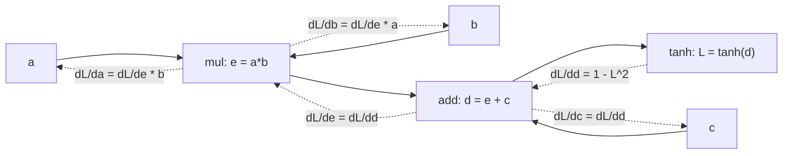
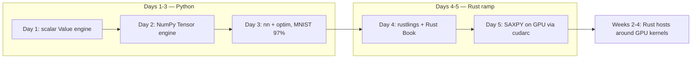

# Week 01 — Autograd From Scratch (+ the Rust ramp)

> **Phase 1, Week 1** · Reverse-mode automatic differentiation engine in pure Python + NumPy,
> validated gradient-for-gradient against `torch.autograd` — then two days of Rust from zero,
> ending with your first GPU launch from a Rust binary.

Prerequisite support: [Week 01 companion lesson](../../../companion-lessons/week-01.md).

## Goal

Two goals this week, matching the repo's hybrid thesis (*Python where the ecosystem is, Rust
where performance matters* — the same bet NVIDIA made with Dynamo's Rust core):

1. **Days 1–3 (autograd)**: build a reverse-mode autodiff engine from first principles —
   scalars, then NumPy tensors with broadcasting-aware backward — and train an MLP to
   **≥97% test accuracy on MNIST** using only your own `Tensor`, `nn`, and `optim` code.
   PyTorch appears *only* as the oracle inside the test suite.
2. **Days 4–5 (Rust ramp)**: rustlings + the Rust Book from zero, capped by
   `rust-hello-gpu/` — a small crate that queries the GPU and runs SAXPY on it through
   [cudarc](https://github.com/coreylowman/cudarc) using a provided PTX kernel, verified
   against a NumPy reference by a provided pytest. Every kernel week after this one has a
   Rust host; this is the on-ramp.

By Friday you should be able to explain, at a whiteboard, exactly what happens when someone
calls `loss.backward()` — and read a Rust function without flinching.

**What `backward()` actually does — forward ops (solid) build the graph, then gradients flow back in reverse topological order (dashed):**

## Why this is industry-relevant

- Every framework you will ever profile or extend (PyTorch, JAX, Triton-backed compilers)
  is a reverse-mode autodiff engine wrapped around a tensor library. Kernel engineers who
  understand the graph *above* the kernel write better kernels: they know which gradients get
  fused, which buffers must be saved for backward, and why activation memory dominates.
- Broadcasting-aware backward (the "sum-over-broadcast-dims" rule) is the #1 source of subtle
  gradient bugs in hand-written backward kernels — you will hit it again in Week 4's fused
  LayerNorm backward.
- The GPU-systems world is moving to Rust hosts around CUDA devices — NVIDIA Dynamo,
  HuggingFace Candle, Burn/CubeCL. "Python for the ecosystem, Rust for the systems layer" is
  a defensible, current position — and this repo demonstrates you can execute it.
- "Implement backprop for X" remains one of the most common ML-systems interview questions.

## Background reading

**Days 1–3 (do before Monday):**

| Resource | What to get out of it |
|---|---|
| Karpathy, *The spelled-out intro to neural networks and backpropagation* — <https://www.youtube.com/watch?v=VMj-3S1tku0> | The scalar `Value` mental model. Watch at 1.5×, code along *without* pausing to copy. |
| micrograd repo — <https://github.com/karpathy/micrograd> | Skim `engine.py` once, then **close it**. Your scalar engine must come out of your head. |
| CS231n backprop notes — <https://cs231n.github.io/optimization-2/> | Staged computation, local gradients, the chain rule as a graph traversal. |
| CS231n case study — <https://cs231n.github.io/neural-networks-case-study/> | Softmax + cross-entropy gradient derivation (`probs - one_hot`). Derive it yourself first. |
| NumPy broadcasting rules — <https://numpy.org/doc/stable/user/basics.broadcasting.html> | You cannot write `unbroadcast()` without knowing these cold. |

**Days 4–5 (the Rust ramp — see also `../../setup/rust-cuda-toolchain.md`):**

| Resource | What to get out of it |
|---|---|
| rustlings — <https://github.com/rust-lang/rustlings> | Do it all (~6–8 h across Days 4–5 + evenings). Muscle memory for ownership/borrowing. |
| The Rust Book ch. 1–10 — <https://doc.rust-lang.org/book/> | Skim-read; return as needed. Ch. 4 (ownership) and 6 (enums/match) are the load-bearing ones. |
| Rust Book ch. 15 (smart pointers) + 19.1 (unsafe) — same link | `Arc`/`Box` show up immediately in cudarc; `unsafe` is normal around raw device pointers. |
| cudarc README + examples — <https://github.com/coreylowman/cudarc> | The host-side API you'll use in `rust-hello-gpu` and all of Weeks 2–4. |

## Day-by-day plan (4 h/day)

**The week's shape — Python autograd first, then the Rust on-ramp every later kernel week builds on:**

### Day 1 (Mon) — Scalar `Value` engine
- Implement `src/scalar_engine.py`: a `Value` node holding `data`, `grad`, `_backward`,
  `_prev` (parents), and an op label.
- Ops: `+`, `*`, `**` (const exponent), `-`, `/`, `tanh`, `exp`, `relu`, plus the reflected
  variants (`__radd__` etc.) so `2 + v` works.
- Implement `backward()`: build a **topological order** of the graph (post-order DFS), seed
  `grad = 1.0` at the output, then walk the topo order in reverse calling each `_backward`.
- Gate: `pytest tests/test_scalar.py` fully green.

### Day 2 (Tue) — Tensor engine on NumPy
- Implement `src/tensor.py`: `Tensor` wrapping an `np.ndarray`, same graph machinery as Day 1.
- Ops: `+`, `*`, `-`, `/`, `matmul`, `sum`, `mean`, `max`, `relu`, `exp`, `log`, `transpose`,
  `reshape`, `gather_rows`.
- The hard part: **broadcasting-aware backward**. Implement `_unbroadcast(grad, shape)` that
  sums gradient over dimensions that were broadcast. Every binary op's backward routes
  through it.
- Gate: `pytest tests/test_tensor_grads.py` green through the broadcasting/matmul classes.

### Day 3 (Wed) — `nn`, `optim`, MNIST (the dense day)
- `src/nn.py`: `Module` base, `Linear` (Kaiming init), `ReLU`, `Sequential`, and a
  numerically-stable `softmax_cross_entropy` (max-subtraction + log-sum-exp).
- `src/optim.py`: `SGD` (with momentum) and `Adam` — match the PyTorch docs' update rules
  exactly; the tests lockstep-compare five update steps against `torch.optim`.
- `src/train_mnist.py`: data loading (raw IDX or `fetch_openml` — no torchvision),
  minibatching, train/eval loops. MLP 784→256→128→10, Adam, ~10–15 epochs ⇒ **≥97.0%**.
- This day is intentionally full: the model code is short if Days 1–2 were solid. Kick off
  the MNIST run and let it train while you start Day 4's reading. Record the max relative
  gradient error vs PyTorch (≤1e-6 in float64) and seconds/epoch (median of ≥5 epochs after
  a warmup epoch — your engine will be 10–100× slower than PyTorch; report it honestly).

### Day 4 (Thu) — Rust from zero
- Install the toolchain per `../../setup/rust-cuda-toolchain.md`: `rustup`, `clippy`,
  `rustfmt`. Verify `cargo --version` inside WSL2.
- rustlings until it hurts (target: through the ownership/borrowing/structs/enums sections).
- Rust Book ch. 1–6 alongside — read the chapter when rustlings blocks you, not before.
- Evening (optional): Jon Gjengset's *Considering Rust* talk for the mental model.

### Day 5 (Fri) — First GPU launch from Rust + publish
- Finish rustlings core sections; skim Book ch. 15 + 19.1 (you need `Arc` and a working
  respect for `unsafe` today).
- Implement `rust-hello-gpu/src/main.rs` (skeleton provided; `Cargo.toml` complete):
  device query via cudarc, then SAXPY on the GPU using the **provided PTX string** — your
  TODOs are host-side only: context, alloc, memcpy, launch config, launch, copy back.
- Gate: `pytest tests/test_rust_hello.py` — it shells out to `cargo run --release` and
  checks the numbers against a NumPy reference.
- Write `RESULTS.md` (autograd numbers + a short "first contact with Rust" note: what fought
  you, what clicked). Commit + push.

## Deliverables

- [ ] `src/scalar_engine.py`, `src/tensor.py` — autograd engines, all tests pass
- [ ] `src/nn.py`, `src/optim.py`, `src/train_mnist.py` — ≥97% MNIST via `make train`
- [ ] `rust-hello-gpu/` — `cargo run --release` prints the device name and a verified SAXPY
- [ ] `RESULTS.md` with accuracy + gradient-error numbers and the Rust-ramp note

## Acceptance criteria

1. `make test` passes: every gradient matches `torch.autograd` with **relative error ≤ 1e-6**
   (float64) across randomized shapes and broadcast patterns, and the `rust-hello-gpu`
   output matches NumPy to ≤1e-5 max-abs (test_rust_hello.py encodes this).
2. `make train` reaches **≥97.0% MNIST test accuracy** from a fresh clone (deterministic
   seed), using only this repo's code in the model/optimizer path.
3. No `torch` import anywhere under `src/` — PyTorch lives only in `tests/`.
4. Rust exit criteria for the week (self-check, honor system): you can explain ownership vs
   borrowing, why `CudaSlice` freeing memory on drop is RAII, and why kernel launches are
   `unsafe` in cudarc.

## Benchmark methodology reminder (laptop honesty)

Days 1–3 are CPU-only, but the repo contract still applies: any number you publish is the
**median of ≥50 timed iterations after warmup** (per-batch timings) or ≥5 epochs after a
warmup epoch (epoch timings), with machine specs stated. On a laptop: plugged in, fixed
power profile, note throttling if variance >10%.

## Stretch goals

- `Conv2d` with a correct (im2col is fine) backward — gradcheck it against PyTorch.
- Computational-graph visualization: emit Graphviz DOT from the `_prev` links.
- A `no_grad()` context manager matching PyTorch semantics.
- Rust: swap the provided PTX for CUDA-C compiled at runtime with `cudarc::nvrtc` — a
  five-line change that previews Week 2's escape hatch.

## Interview talking points this project earns

1. "I implemented reverse-mode autodiff from scratch — I can walk through what
   `loss.backward()` does: topological sort, reverse traversal, local vector-Jacobian
   products, and gradient accumulation at fan-out nodes."
2. "The subtlest bug was broadcasting backward — I can explain why the gradient of a
   broadcast add must be *summed* over the broadcast dimensions, and how I validated it with
   randomized shape fuzzing against torch.autograd."
3. "I can derive the softmax + cross-entropy gradient (`probs − one-hot`) and explain why
   fusing them is numerically and performance motivated — which is what I later built as a
   GPU kernel in Week 4."
4. "I learned Rust specifically to hold the systems side of a GPU stack — my first week of
   Rust ended with a verified GPU launch through the driver API, and the rest of the repo is
   Rust hosts around PTX kernels, the same architecture as NVIDIA Dynamo."

## Definition of done

- [ ] All background reading done, micrograd repo closed before writing code
- [ ] `make test` green (autograd + rust-hello), max rel-error vs PyTorch ≤ 1e-6 recorded
- [ ] `make train` ⇒ ≥97% test accuracy, seed-deterministic
- [ ] rustlings core sections complete; `rust-hello-gpu` runs clean under `cargo clippy`
- [ ] `RESULTS.md` written with numbers, not adjectives
- [ ] Pushed to GitHub with a clean commit history telling the Day 1→5 story
