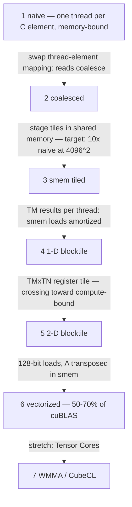

# Week 03 — SGEMM Optimization Ladder (Rust host, Rust kernels)

> **Phase 1, Week 3** · Climb from a naive matmul to a kernel within striking distance of
> cuBLAS — one optimization concept per rung, each rung profiled and explained. Host in Rust
> (cudarc + its cuBLAS bindings), kernels in Rust (Rust-CUDA → PTX) with the per-rung
> escape hatch documented below.

Prerequisite support: [Week 03 companion lesson](../../../companion-lessons/week-03.md).

## Goal

Implement single-precision GEMM (`C = α·A·B + β·C`, all row-major, square sizes 128→4096)
six times, each version adding exactly one optimization idea, and finish at **≥50–70% of
cuBLAS** on 4096². This is *the* classic GPU-engineering portfolio piece: it exercises the
entire memory hierarchy (DRAM → L2 → shared memory → registers) and forces you to reason
about arithmetic intensity, not just bandwidth.

**The ladder is language-agnostic.** The GPU only ever sees PTX/SASS; whether rustc_codegen_nvvm
or nvcc emitted it changes nothing about tiling, coalescing, or register pressure. That's
why the canonical C++ writeups below transfer 1:1 — and why finishing this week in Rust is
a stronger signal, not a weaker one.

The ladder:

| Rung | Kernel | The one idea it adds |
|---|---|---|
| 1 | `sgemm_naive` | one thread per C element, straight from the math |
| 2 | `sgemm_coalesced` | swap the thread↔element mapping so A/B reads coalesce |
| 3 | `sgemm_smem_tiled` | stage TILE×TILE blocks of A and B in shared memory |
| 4 | `sgemm_1d_blocktile` | each thread computes a column of several C elements (registers) |
| 5 | `sgemm_2d_blocktile` | each thread computes a TM×TN register tile of C |
| 6 | `sgemm_vectorized` | 128-bit (float4-style) loads, A transposed in smem |
| 7 (stretch) | `sgemm_wmma` | Tensor Cores — via the escape hatch (`nvcuda::wmma`) or CubeCL |

**The ladder as a flow — each arrow is the one idea, with the payoff the acceptance criteria expect:**



**Where the bytes come from at each major rung — DRAM, then shared memory, then registers:**

```
Rung 1 — naive: each thread streams 2K global loads to make one C element.

Rung 3 — smem tile: the block stages TILE x TILE tiles ONCE, reuses them TILE times.

      A (global)         B (global)
     ┌────┬──────┐      ┌────┬────┐       smem_A, smem_B loaded once per
     │####│ ...  │      │####│ ...│       K-step by the whole block, then
     └────┴──────┘      ├────┤    │       read TILE times from shared mem.
        │               │ ...│    │
        ▼               └────┴────┘       global traffic per C element:
     smem_A[TILE][TILE]    │              2K  ->  2K / TILE
                           ▼
                        smem_B[TILE][TILE] --> each thread: 1 C element

Rung 5 — register tile: each thread owns a TM x TN patch of C in registers.

     a-strip (TM from smem_A)  x  b-strip (TN from smem_B)  =  outer product:
     TM + TN smem reads buy TM * TN FMAs — arithmetic intensity climbs again,
     and the kernel graduates from memory-bound toward compute-bound.
```

**Escape hatch, per rung** (policy: `../../setup/rust-cuda-toolchain.md`): if Rust-CUDA
fights you >30 min on a rung — likely candidates are rung 6 (vectorized loads) and rung 7
(WMMA has no Rust-CUDA surface) — write that rung as CUDA-C and paste it into the
`NVRTC_OVERRIDES` table in `runner/src/main.rs`; the runner compiles it with NVRTC and uses
it instead of the Rust kernel of the same name. Host stays Rust either way. Every hatch
taken gets a line in "What didn't work".

## Why this is industry-relevant

- GEMM is the substrate of deep learning; every attention layer, every MLP, every LoRA is
  GEMMs. Understanding why cuBLAS is fast is understanding why GPUs are shaped as they are.
- The rung-by-rung structure mirrors how kernel work actually happens: hypothesis → one
  change → profile → explain. Your Nsight evidence per rung *is* the portfolio.
- "Walk me through optimizing a matmul" is a literal interview question for CUDA roles.
  After this week you answer with your own numbers — and you can add "and my whole harness
  is Rust, same architecture NVIDIA chose for Dynamo's core."

## Background reading

| Resource | Why |
|---|---|
| Simon Boehm, *How to Optimize a CUDA Matmul Kernel* — <https://siboehm.com/articles/22/CUDA-MMM> | The canonical writeup of this exact ladder. Concepts transfer 1:1 to Rust kernels. Read rung N's section only AFTER you've attempted rung N. |
| CUTLASS docs, *Efficient GEMM in CUDA* — <https://github.com/NVIDIA/cutlass/blob/main/media/docs/cpp/efficient_gemm.md> | The hierarchical blocking picture (threadblock/warp/thread tiles). |
| CUDA C++ Programming Guide — shared memory ch. — <https://docs.nvidia.com/cuda/cuda-c-programming-guide/#shared-memory> | Tiling reference, bank conflicts. |
| Rust-CUDA guide — <https://github.com/Rust-GPU/Rust-CUDA> | `shared_array!`, thread indexing, what the codegen can and can't do yet. |
| *Roofline: An Insightful Visual Performance Model* — <https://people.eecs.berkeley.edu/~kubitron/cs252/handouts/papers/RooflineVyNoYellow.pdf> | You'll place all 6 rungs on a roofline Friday. |
| Nsight Compute profiling guide — <https://docs.nvidia.com/nsight-compute/ProfilingGuide/> | Occupancy + memory sections; rung-by-rung evidence. |

## Layout

```
Cargo.toml           workspace (kernels, runner) + path dep on week-02's gpu-bench
rust-toolchain.toml  pinned nightly (same pin as week 02)
kernels/src/lib.rs   the six rungs — concept comments given, bodies TODO
runner/src/main.rs   COMPLETE: alloc, cuBLAS reference + timing, correctness
                     gate, benchmark sweep, JSON, NVRTC override table
bench/plot_ladder.py COMPLETE: GFLOPS bars + %-of-cuBLAS line + scaling chart
```

## Day-by-day plan (4 h/day)

### Day 1 (Mon) — Rungs 1–2 + trust the harness
- Read `runner/src/main.rs`: the runner is COMPLETE (allocation, cuBLAS row-major-trick
  reference, correctness gate, benchmarking via week-02's `gpu-bench`, JSON). You only fill
  in kernel bodies — launch configs are derived from the tile constants and already wired.
- Rung 1 `sgemm_naive`: get *correct* first — the runner checks max-abs error vs cuBLAS at
  every size and skips benchmarking incorrect rungs.
- Rung 2 `sgemm_coalesced`: change only the thread→element mapping so consecutive lanes
  touch consecutive memory. Measure the jump; explain it in one sentence in your notes.
- Compute GFLOPS = `2·M·N·K / t` (the runner does). Know why the 2 is there.

### Day 2 (Tue) — Rung 3, shared-memory tiling
- Stage TILE×TILE tiles of A and B through `shared_array!`; accumulate over the K loop in a
  register; `sync_threads()` discipline (justify BOTH syncs).
- Gate: **≥10× the naive kernel at 4096²** (acceptance criterion). If short: check bank
  conflicts and whether your tile loads coalesce.

### Day 3 (Wed) — Rungs 4–5, register blocking
- Rung 4: each thread produces TM results (a column strip) — arithmetic intensity: more C
  per thread ⇒ each smem load amortized over more FMAs.
- Rung 5: 2-D thread tile TM×TN with an outer-product accumulation pattern. This is the rung
  where you graduate from memory-bound toward compute-bound — verify in ncu, don't assert.
- Watch the generated PTX for local-memory spills (`ncu` or `--emit=asm` on the kernel
  crate): register arrays must stay in registers; if they spill, restructure the indexing.

### Day 4 (Thu) — Rung 6 + Nsight Compute deep-dive
- Rung 6: 128-bit vectorized global→shared loads (cuda_std `vek` vector types — or take the
  escape hatch, this is its most likely customer) and store A transposed in shared memory so
  the inner loop reads both tiles conflict-free.
- Profile all rungs with `ncu --set full`: record occupancy, achieved DRAM %, L2 hit rate,
  smem throughput, top stall reason per rung. Fill the table in RESULTS.md.
- If attempting rung 7 (WMMA/Tensor Cores) start here — see stretch goals.

### Day 5 (Fri) — The chart, the roofline, the writeup
- `make bench` sweeps sizes {128, 256, 512, 1024, 2048, 4096} × all rungs + cuBLAS.
- `python bench/plot_ladder.py` → GFLOPS bars per rung + %-of-cuBLAS line + scaling chart.
- Build the roofline: peak FP32 and measured DRAM bandwidth (from Week 2!) give the ridge;
  place every rung on it.
- RESULTS.md: the table, the charts, one honest paragraph per rung — what you predicted,
  what ncu showed, what surprised you, which rungs took the escape hatch and why. Push.

## Deliverables

- [ ] `kernels/src/lib.rs` (and/or NVRTC overrides) with 6 working rungs, all checked vs
      cuBLAS by the runner
- [ ] `results/sgemm_ladder.json` from `make bench`
- [ ] Ladder chart + roofline committed
- [ ] Per-rung Nsight table + escape-hatch log in RESULTS.md

## Acceptance criteria

1. **Correctness**: every rung passes the runner's check vs cuBLAS at every size —
   max-abs error ≤ 2e-2 with the runner's magnitude-1 random inputs (fp32
   accumulation-order tolerance; the runner encodes this).
2. **Tiling pays**: rung 3 ≥ **10×** rung 1 at 4096².
3. **Endgame**: best kernel ≥ **50–70% of cuBLAS** at 4096² (50% = pass, 70% = strong).
4. `make bench` reproduces every number; charts regenerate with one command.

## Benchmark methodology (laptop reminder)

Median of ≥50 timed launches after ≥5 warmup launches per (kernel, size) — `gpu-bench` does
this. On the power-limited 5090 Laptop: plugged in, fixed power profile, log
`nvidia-smi -l 1` clocks during the sweep, and *interleave* rungs rather than benchmarking
one rung for minutes straight (thermal drift biases later rungs). At 4096², one GEMM is
~137 GFLOP — expect several ms even near cuBLAS speed.

## Stretch goals

- **Rung 7 — Tensor Cores**: via the escape hatch (`nvcuda::wmma`, TF32 or FP16-in/FP32-out)
  or via **CubeCL** (<https://github.com/tracel-ai/cubecl> — the most production-real
  "kernels in Rust" path today; see the setup doc). Compare against cuBLAS with TF32 math
  mode enabled — that's the fair baseline. Document the fp32→tf32 accuracy change.
- Autotune BM/BN/BK/TM/TN via `cfg`-style const generics or a shell loop; heatmap the results.
- Non-multiple-of-tile sizes (predication) — e.g. 1000² as extra-credit correctness.
- Double buffering (`cp.async`) for the smem pipeline — escape-hatch territory, worth it.

## What didn't work (fill in as you go)

> _Per-rung toolchain notes: what Rust-CUDA handled, where it spilled registers or lacked
> intrinsics, which rungs went to NVRTC and why. This section is the honest record that
> makes the Rust-kernel claim credible._

## Interview talking points this week earns

1. "I've written the whole SGEMM ladder from scratch and can explain each rung's speedup in
   terms of arithmetic intensity — bytes from DRAM/smem per FMA — with my own ncu numbers."
2. "I can explain why naive matmul is memory-bound and where it crosses to compute-bound on
   my hardware, and show the roofline I measured."
3. "I know why cuBLAS still beats my best kernel: I profiled the gap rather than
   hand-waving it — occupancy vs tile-size trade-offs, pipeline depth, instruction mix."
4. "I know exactly what today's Rust-on-GPU toolchain can and cannot express — I have a
   per-rung record of where rustc_codegen_nvvm held up and where I dropped to NVRTC'd
   CUDA-C behind the same Rust host."

## Definition of done

- [ ] 6 rungs correct at all sweep sizes (runner exit code 0)
- [ ] ≥10× naive from tiling; ≥50% of cuBLAS at 4096² from the best rung
- [ ] Ladder chart + roofline + ncu table committed
- [ ] RESULTS.md tells the rung-by-rung story with numbers + escape-hatch log
- [ ] Pushed
