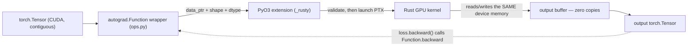

# Week 04 — PyTorch Custom Ops in Rust: `rusty-kernels`

> **Phase 1 capstone** · Fused softmax and fused LayerNorm with Rust kernels and a Rust
> host, exposed to Python through **PyO3 + maturin**, zero-copy against PyTorch tensors,
> wired into autograd, gradcheck-clean, benchmarked, packaged, CI'd.

Prerequisite support: [Week 04 companion lesson](../../../companion-lessons/week-04.md).

## Goal

Build `rusty_kernels`, a pip-installable package exposing `rusty_kernels.softmax(x, dim=-1)`
and `rusty_kernels.layer_norm(x, w, b)` backed by your own GPU kernels, wired into autograd
via `torch.autograd.Function`, gradcheck-clean, and benchmarked honestly against eager
PyTorch and `torch.compile` across transformer-shaped inputs.

This closes the Phase 1 loop — and it's the hybrid thesis in one artifact: **PyTorch (the
ecosystem) calls into a Rust extension (the systems layer) that launches GPU kernels** —
the same shape as NVIDIA Dynamo (Rust core, Python front) and HuggingFace's Rust stack.

## Why fusion matters (the pitch you'll give in interviews)

- **Memory-bound ops**: softmax and LayerNorm do a handful of FLOPs per element but eager
  PyTorch executes them as several kernels (max, sub, exp, sum, div…), each doing a full
  round-trip through DRAM. Fusing to a single kernel reads the input once and writes the
  output once — for memory-bound ops that is the entire speedup, and it's why
  FlashAttention, `torch.compile`, and every inference engine obsess over fusion.
- **Kernel-launch overhead**: at small shapes, several ~µs launches dominate the math. One
  launch amortizes it.
- **Online softmax** (single-pass max+sum rescaling) is the algorithmic core of
  FlashAttention — implement it here and you can whiteboard the real thing.

**The whole speedup in one picture — bytes moved by eager vs fused softmax on a memory-bound op:**

```
Eager (5+ kernel launches, each a full DRAM round-trip)

  x ─►[max]─► HBM ─►[sub]─► HBM ─►[exp]─► HBM ─►[sum]─► HBM ─►[div]─► y
  bytes moved ~ 8-10 x |x|          (+ one ~us launch overhead per box)

Fused (one launch)

  x ─►[ online max+sum, then normalize ]─► y
  bytes moved ~ 2 x |x|   — read the input once, write the output once
```

## Architecture

```
PyTorch (Python)
  └─ rusty_kernels/ops.py        autograd.Function wrappers        (TODO, yours)
       └─ rusty_kernels._rusty   PyO3 extension crate, ext/         (plumbing COMPLETE)
            └─ kernels/          Rust GPU kernels -> PTX            (bodies TODO, yours)
```

**The zero-copy call path — Python owns the tensor, Rust launches a kernel on its memory, autograd closes the loop:**



- **Bindings**: PyO3 + maturin (`pyproject.toml` + both `Cargo.toml`s are COMPLETE).
  `maturin develop --release` builds and installs into the active venv.
- **Zero-copy tensor exchange — the Day 1 decision you write up**: the extension never
  copies tensor data. Two candidate mechanisms:
  1. **`data_ptr()` + shapes** (what the scaffold wires): Python passes
    `tensor.data_ptr()` as an integer plus shape/dtype; Rust launches on that raw memory.
    Simple, explicit, but Python must guarantee contiguity, lifetime, and stream ordering.
  2. **DLPack** (`torch.utils.dlpack`): a self-describing capsule with dtype/shape/strides
    — safer, more general, more code on both sides.
  Day 1 deliverable: a paragraph in RESULTS.md defending the choice and its failure modes.
- **Stream story (v0, documented)**: the scaffold synchronizes torch's current stream
  before each op and runs the kernel on the extension's own stream, synchronizing before
  return. Correct and simple; costs ~µs per call. Making it stream-ordered (passing
  `torch.cuda.current_stream().cuda_stream` into the extension and launching on it) is a
  Day-4/stretch task — measure what the syncs cost first, then decide if it's worth it.
- **Escape hatch** (as in Weeks 2–3): kernels are Rust via Rust-CUDA; any kernel may drop
  to NVRTC'd CUDA-C behind the same Rust host, logged in "What didn't work".

## Environment

- RTX 5090 Laptop GPU (Blackwell, **sm_120**) under WSL2 Ubuntu, CUDA **≥ 12.8**, PyTorch
  cu128: `pip install torch --index-url https://download.pytorch.org/whl/cu128`.
- Sanity: `python -c "import torch; print(torch.cuda.get_device_capability())"` → `(12, 0)`.
- Rust: same pinned nightly as Weeks 2–3 (`rust-toolchain.toml`), maturin ≥ 1.7 in the venv.

## Background reading

| Resource | Why |
|---|---|
| PyO3 user guide — <https://pyo3.rs> | Modules, functions, error mapping — the binding layer. |
| maturin — <https://www.maturin.rs> | Build/develop workflow, mixed Rust/Python layout. |
| DLPack protocol + `torch.utils.dlpack` — <https://docs.pytorch.org/docs/stable/dlpack.html> | The other side of the Day-1 decision. |
| Milakov & Gimelshein, *Online normalizer calculation for softmax* — <https://arxiv.org/abs/1805.02867> | The one-pass softmax algorithm you implement Day 2. |
| Welford's algorithm — <https://en.wikipedia.org/wiki/Algorithms_for_calculating_variance#Welford's_online_algorithm> | One of your two LayerNorm variance options (Day 3). |
| LayerNorm paper — <https://arxiv.org/abs/1607.06450> | Forward AND backward math; derive dL/dx yourself before coding it. |
| `torch.autograd.gradcheck` — <https://docs.pytorch.org/docs/stable/generated/torch.autograd.gradcheck.html> | Why gradcheck wants float64 and what it perturbs. |

## Day-by-day plan (4 h/day)

### Day 1 (Mon) — PyO3/maturin end-to-end + the binding decision
- `maturin develop --release` until `import rusty_kernels` works (the extension builds the
  kernel crate to PTX via `ext/build.rs` — same machinery as Weeks 2–3).
- Implement the `passthrough` kernel (copy in→out) in `kernels/src/lib.rs` and drive it:
  `rusty_kernels.ops.passthrough(x)` must round-trip a CUDA tensor. This proves the whole
  chain — maturin, PyO3, data_ptr hand-off, PTX load, launch — before any real math.
- Read `ext/src/lib.rs` (COMPLETE) until you can explain every validation and every
  `unsafe`. Write the data_ptr-vs-DLPack decision paragraph.

### Day 2 (Tue) — Fused softmax forward
- `kernels/src/lib.rs::softmax_forward_*`: one block per row, **online softmax** — a single
  pass tracking running max `m` and rescaled sum `d`, then one normalization pass. Your
  Week-2 warp/block reduction patterns are directly reusable (the (m, d) pair merges with
  the same shuffle choreography — the combine rule is the rescaling trick itself).
- Wire `rusty_kernels.softmax` in `ops.py` (forward-only today: two-pass torch fallback for
  backward keeps gradcheck honest) and pass the softmax tests in `tests/test_ops.py`.

### Day 3 (Wed) — Fused LayerNorm forward + backward
- Forward: per-row mean/variance. **Choose**: Welford (one pass, numerically robust, more
  per-thread state) or two-pass (simpler, one extra L2-warm read). Write the 3-sentence
  trade-off note — this exact choice is an interview question.
- Backward: derive dL/dx, dL/dγ, dL/dβ on paper (the dx formula has two "mean of grad"
  correction terms — derive, don't paste). dγ/dβ reduce over ROWS: second kernel or
  atomics — measure both if time allows.
- Wire `torch.autograd.Function` in `ops.py`; **float64 gradcheck must pass** — that's why
  every kernel stub comes in `_f32` and `_f64` variants (f64 is slow; it exists for
  correctness only). fp16 variants: required by the tests for forward — implement natively
  or document an upcast fallback and its cost.

### Day 4 (Thu) — Benchmarks
- `python bench/bench_ops.py`: transformer-ish shapes — rows ∈ {512, 2048, 8192, 16384} ×
  hidden ∈ {768, 1024, 2048, 4096, 8192} — vs (a) eager, (b) `torch.compile`, fp32 + fp16.
- Expect to WIN clearly vs eager on memory-bound shapes, and to roughly TIE (or lose) vs
  `torch.compile` — which also fuses. Report it honestly; explaining *why* compile ties you
  is a better story than a rigged win.
- Measure the v0 sync overhead (small shapes make it visible); attempt the stream-ordered
  upgrade if the numbers justify it.
- `ncu` one of your kernels vs the eager sequence to show the DRAM-traffic delta.

### Day 5 (Fri) — Package polish + publish
- `maturin build --release` produces a wheel; `pip install` it into a fresh venv and run
  the tests — the "works from wheel" check.
- Copy `.github-workflow-snippet.yml` to the repo root as `.github/workflows/ci.yml` —
  Python lint + CPU import smoke + Rust fmt/clippy/test (no GPU in CI; GPU tests skip).
- RESULTS.md: speedup tables, charts, the Welford note, the binding-decision paragraph,
  limitations (row-size ceiling, dtypes, contiguity), "What didn't work". Push.
  **Phase 1 done** — write the retrospective paragraph in the repo root README.

## Deliverables

- [ ] `rusty_kernels` installable via `maturin develop --release` (and buildable as a wheel)
- [ ] Fused softmax forward; fused LayerNorm forward + backward via autograd.Function
- [ ] `tests/test_ops.py` green, including float64 gradcheck
- [ ] `bench/bench_ops.py` JSON + charts vs eager and torch.compile
- [ ] CI workflow live on the repo (python + rust jobs)

## Acceptance criteria

1. **Correctness**: max-abs error vs `torch.nn.functional` ≤ **1e-3** (fp16) and ≤ **1e-6**
   (fp32) on every test shape (encoded in `tests/test_ops.py`).
2. **Gradients**: `torch.autograd.gradcheck` passes for LayerNorm (float64).
3. **Speed**: measurable speedup (>1.1×) over *eager* PyTorch on at least the memory-bound
   shapes (large rows × large hidden) in fp32; results vs `torch.compile` reported honestly
   either way.
4. One command each: `make test`, `make bench`.

## Benchmark methodology (laptop reminder)

`torch.cuda.Event` timing, ≥10 warmup + ≥50 timed iterations per (op, shape, dtype), median
reported; `torch.cuda.synchronize()` before reading events; clocks/power logged via
`nvidia-smi -l 1`; plugged in, fixed power profile. For `torch.compile` baselines, exclude
compilation time (warmup absorbs it) and say so in the caption.

## Stretch goals

- Fused softmax **backward** in a kernel (`dx = (dy − (dy·y)·1) * y`).
- Stream-ordered launches (pass torch's stream handle into the extension) — kill the syncs.
- Dropout fusion (softmax+dropout, Philox RNG) — the transformer fast path.
- fp16/bf16 with fp32 accumulators + vectorized loads from Week 3.
- Publish the wheel to TestPyPI from CI via `maturin-action`.

## What didn't work (fill in as you go)

> _Toolchain friction, escape hatches, PyO3 sharp edges, the sync-overhead numbers that did
> or didn't justify stream plumbing._

## Interview talking points this week earns

1. "I've shipped a Python extension in Rust end-to-end: PyO3 + maturin, zero-copy tensor
   exchange with PyTorch, input validation at the boundary, autograd integration, CI, wheel."
2. "I implemented online softmax and can explain how the same rescaling trick makes
   FlashAttention possible."
3. "I derived and implemented LayerNorm backward, and I can discuss Welford vs two-pass
   variance — numerical stability vs memory traffic — with measurements."
4. "I can defend the interop design space: data_ptr vs DLPack for ownership and layout,
   stream ordering vs synchronization for correctness — with the microbenchmarks I took."
5. "I benchmarked against torch.compile, not just eager, and can explain what Inductor
   fused and where a hand-written kernel still wins (and where it doesn't)."

## Definition of done

- [ ] `make test` green (GPU tests local; CPU-only import test in CI)
- [ ] Gradcheck passes; error bounds met at every shape
- [ ] Benchmark chart committed with eager AND torch.compile lines
- [ ] Binding-decision + Welford paragraphs in RESULTS.md
- [ ] CI badge green on GitHub (python + rust jobs)
- [ ] Phase 1 retrospective paragraph in the repo root README
