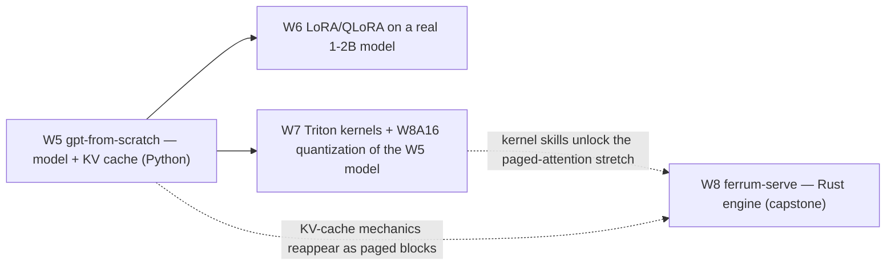

# Phase 2 — LLM Engineering (Weeks 5–8)

Own the LLM stack at implementation level: the model, the fine-tuning, the kernels,
the serving. Everything runs locally on the RTX 5090 Laptop GPU (24 GB, Blackwell
sm_120, PyTorch cu128) under WSL2, in parallel with NCP-GENL certification study.

| Week | Project | The one-line pitch |
|---|---|---|
| 05 | [gpt-from-scratch](week-05-gpt-from-scratch/) | Decoder-only transformer in pure PyTorch: hand-written attention (validated vs SDPA), RoPE, SwiGLU, KV-cache generation, trained on TinyStories |
| 06 | [lora-from-scratch](week-06-lora-from-scratch/) | LoRA and QLoRA by hand on a real 1–2B model, parity-checked against HF PEFT |
| 07 | [triton-quantization](week-07-triton-quantization/) | Triton kernels — fused softmax, RMSNorm, FlashAttention forward — plus W8A16 weight-only quantization |
| 08 | [mini-inference-server](week-08-mini-inference-server/) | **Capstone:** ferrum-serve — a mini inference engine in **Rust** (Candle + axum): paged KV cache, continuous batching, SSE streaming, load-tested against real vLLM |

The projects chain: week 05's model is quantized in week 07, and week 07's kernel
skills unlock week 08's true-paged-attention stretch goal. Week 08 also carries the
repo's hybrid-language thesis: **Python where the ecosystem is (weeks 5–7), Rust
where performance matters (the serving layer)**.

**How the four projects chain into the month's capstone:**

## How each week works

- `README.md` — the project brief: goal, background reading, day-by-day plan,
  acceptance criteria, stretch goals, interview talking points.
- `src/` — skeletons: signatures, docstrings, and TODOs that explain WHAT to build
  and the key idea — never the implementation. The building is the learning.
- `tests/` — **complete** harnesses using PyTorch / HF PEFT / SDPA as oracles.
  Weeks 5–7 (Python): tests report SKIPPED until you implement, then must go
  green (`make test`). Week 8 (Rust): `cargo test` compiles against `todo!()`
  skeletons and starts RED — you turn it green.
- `bench/` — **complete** benchmark harnesses: median of ≥ 50 runs post-warmup,
  JSON + plots, honest about laptop power/thermal limits.
- `Makefile` — one command per workflow step.

Weekly rhythm: Mon–Thu build, Friday benchmark + document + publish
(week 08's Friday is deliberately light — NCP-GENL exam week).
