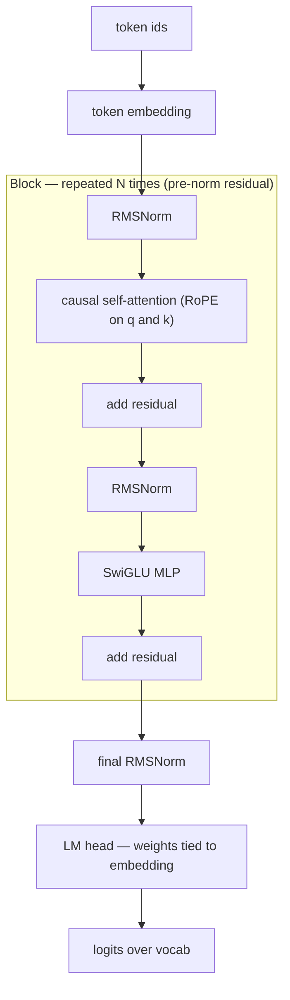
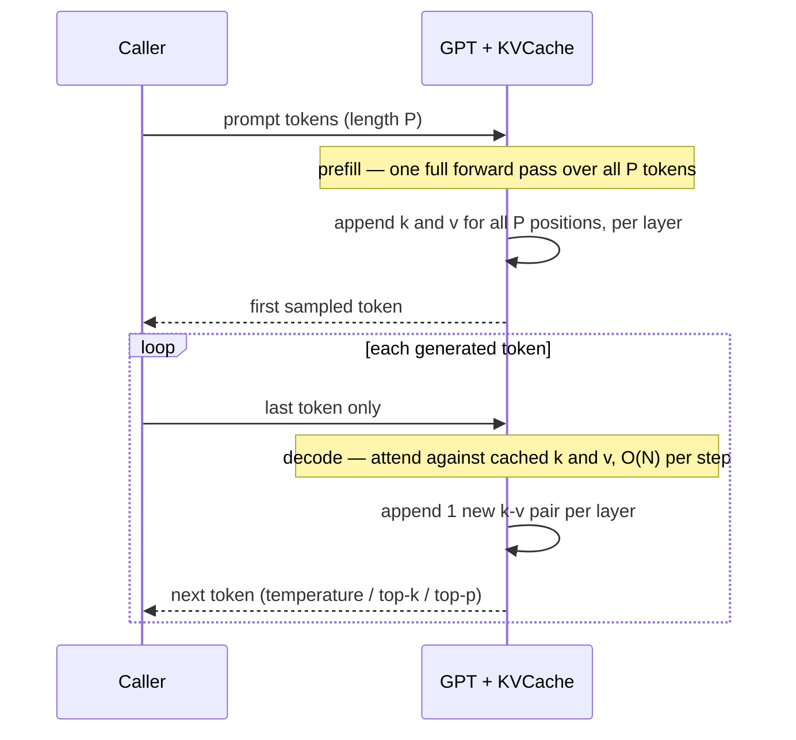

# Week 05 — GPT From Scratch

> Phase 2, week 1 of 4. Decoder-only transformer in pure PyTorch — no `nn.Transformer`,
> no `nn.MultiheadAttention`, no `x = model(x)` hand-waving. Every matrix multiply is yours.

Prerequisite support: [Week 05 companion lesson](../../../companion-lessons/week-05.md).

## Goal

Build, train, and profile a 10–50M parameter GPT-style language model end to end on the
local RTX 5090 Laptop GPU (24 GB, Blackwell/sm_120, WSL2):

- Causal self-attention written by hand, validated against `torch.nn.functional.scaled_dot_product_attention`.
- A modern block: RMSNorm (pre-norm), RoPE positional encoding, SwiGLU MLP, weight tying.
- A real training loop: bf16 autocast, gradient accumulation, cosine LR schedule, logging.
- KV-cache inference with temperature / top-k / top-p sampling, benchmarked honestly.
- A `torch.profiler` breakdown of where a training step actually spends its time.

**The model you assemble on Days 1–2 — every arrow is code you write:**

## Why this matters (industry relevance)

Every LLM job interview eventually lands on "walk me through attention" or "why is
generation slow without a KV cache?". Engineers who have only *called* transformers
stall here; engineers who have *built* one don't. This week also feeds directly into
weeks 07 (you'll rewrite attention as a Triton kernel) and 08 (this model becomes the
engine inside your mini inference server), and overlaps heavily with the NCP-GENL
LLM-architecture domain.

## Background reading (do this before Monday)

- Karpathy, *Neural Networks: Zero to Hero* — the "Let's build GPT" video:
  https://www.youtube.com/watch?v=kCc8FmEb1nY
- Karpathy, nanoGPT (reference architecture, do not copy):
  https://github.com/karpathy/nanoGPT
- Vaswani et al., *Attention Is All You Need* (2017): https://arxiv.org/abs/1706.03762
- Su et al., *RoFormer: Enhanced Transformer with Rotary Position Embedding* (2021):
  https://arxiv.org/abs/2104.09864
- Zhang & Sennrich, *Root Mean Square Layer Normalization* (2019): https://arxiv.org/abs/1910.07467
- Shazeer, *GLU Variants Improve Transformer* (2020): https://arxiv.org/abs/2002.05202
- TinyStories dataset: https://huggingface.co/datasets/roneneldan/TinyStories
- tiktoken: https://github.com/openai/tiktoken

## Day-by-day plan (4 h/day, Mon–Fri)

### Day 1 (Mon) — Tokenizer + one attention head + causal mask
- Pick a tokenizer: BPE via `tiktoken` (`gpt2` encoding, vocab 50257 — zero training,
  recommended) OR train a small `sentencepiece` model on TinyStories (more work, smaller
  vocab, better tokens-per-story). Wire your choice into `src/data.py`.
- Implement `causal_attention(q, k, v)` in `src/attention.py` from the raw formula:
  scores, scale by `1/sqrt(d_head)`, causal mask with `-inf`, softmax, weighted sum.
- Implement the multi-head `CausalSelfAttention` module (fused qkv projection, head
  split/merge, output projection).
- Verify: `pytest tests/test_attention.py` — your math path must match SDPA ≤ 1e-5 in fp32.

### Day 2 (Tue) — Full block, assemble the model
- `src/rope.py`: precompute cos/sin cache, apply rotation to q and k. Pass
  `tests/test_rope.py` (reference = complex-number rotation + relative-position property).
- `src/model.py`: `RMSNorm`, `SwiGLUMLP`, `Block` (pre-norm residual), `GPT` with
  token embedding, N blocks, final norm, LM head **tied** to the embedding.
- Sanity: instantiate the `d12` config (~30M params), run a forward pass, check loss at
  init is ≈ `ln(vocab_size)` (≈ 10.8 for vocab 50257). If it isn't, your init is wrong.

### Day 3 (Wed) — Training loop, train on TinyStories
- `src/data.py`: download TinyStories, tokenize a subset (~100M tokens is plenty),
  write a uint16 memmap `.bin`, serve random contiguous windows.
- `src/train.py`: AdamW, bf16 autocast (native on Blackwell — do NOT use GradScaler
  with bf16), gradient accumulation to reach an effective batch of ~0.5M tokens,
  linear warmup + cosine decay, grad-norm clipping, CSV logging (wandb optional),
  periodic eval loss + checkpointing.
- Kick off a run that fits an evening: e.g. `d12` model, a few thousand steps.
  Watch the loss: TinyStories is easy — val loss should drop below ~2.0 nats
  (perplexity < ~7.5) or something is broken.

### Day 4 (Thu) — KV-cache generation + sampling

**Why the cache makes generation fast — pay the quadratic prefill once, then linear cached decode steps:**

- `src/generate.py`: `KVCache` (preallocated k/v tensors + per-layer append),
  incremental single-token decode path through the model, and sampling with
  temperature, top-k, and top-p (nucleus).
- Verify: `pytest tests/test_kv_cache.py` — cached greedy decode must be
  token-for-token identical to full-recompute decode.
- Benchmark: `make bench` — median tok/s over ≥50 generations post-warmup, with vs
  without cache, at prompt+gen lengths up to 512. Save JSON + plot.

### Day 5 (Fri) — Profile, document, publish
- Wrap a few training steps in `torch.profiler` (CPU+CUDA activities, with stack
  traces). Answer in the writeup: what % of step time is attention matmuls? MLP?
  optimizer? Is the GPU idle waiting on the dataloader? What does bf16 autocast
  actually change in the trace?
- Write `RESULTS.md`: loss curve, tok/s table, profiler findings, sample generations.
- Push. Update the root README results table.

## Deliverables

- `src/` implemented; all tests green: `make test`
- Trained checkpoint + loss curve (`assets/loss_curve.png`)
- `bench/results/generate_bench.json` + tok/s plot
- `RESULTS.md` with profiler analysis and 3+ sample generations

## Acceptance criteria

- [ ] Hand-written attention matches `F.scaled_dot_product_attention` ≤ 1e-5 (fp32)
- [ ] Loss at init ≈ ln(vocab); val loss on TinyStories reaches sane perplexity (< ~7.5 ppl for a 30M model on ~1 epoch of a 100M-token subset)
- [ ] KV-cache generation ≥ 5× faster than naive full-recompute at sequence length 512
- [ ] Cached and uncached greedy decode produce identical tokens (test-enforced)
- [ ] Generated stories are coherent-ish: grammatical sentences, characters persist for a few lines (TinyStories models won't be Shakespeare — say so honestly)

## A note on honest benchmarking

This is a **laptop** 5090: power-limited, thermally-limited, and numbers drift with
clock behavior. Every benchmark in this repo therefore reports the **median of ≥ 50
timed runs after warmup**, uses `torch.cuda.synchronize()` around timers, records the
power limit (`nvidia-smi -q -d POWER`), and never compares against numbers taken on
other hardware. Report what YOUR machine does, and state the conditions.

## Stretch goals

- `torch.compile(model)` — measure training-step and generation speedup, note graph
  breaks (fullgraph vs not), and document compile time as a cost.
- Sliding-window attention (Mistral-style): mask window w, verify perplexity impact,
  measure memory at long context.

## Interview talking points

After this week you should be able to whiteboard, without notes:

1. Why attention scores are scaled by `1/sqrt(d_head)` (variance of dot products grows with d; keeps softmax out of saturation).
2. Why RoPE gives *relative* position sensitivity from an *absolute* rotation (rotation angles subtract inside the dot product) and why it extrapolates better than learned embeddings.
3. Why generation without a KV cache is O(N²) per token and with it O(N) — and why decode is then **memory-bandwidth-bound**, not compute-bound.
4. Why pre-norm + RMSNorm won over post-norm + LayerNorm (training stability at depth; RMSNorm drops mean-centering — cheaper, works as well).
5. What weight tying buys you (params ↓, and a regularization effect coupling input/output token geometry).
6. What top-p sampling fixes that top-k doesn't (adaptive candidate set when the distribution is flat vs peaked).

## Definition of done

- [ ] `make test` passes
- [ ] `make bench` produces JSON + plot
- [ ] Checkpoint trained, loss curve committed
- [ ] `RESULTS.md` written (profiler analysis included)
- [ ] Root README results row updated, pushed to GitHub
