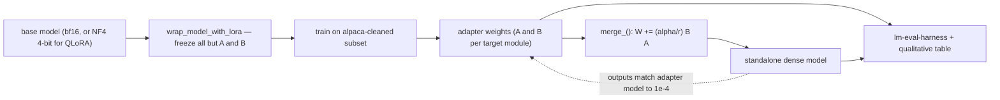
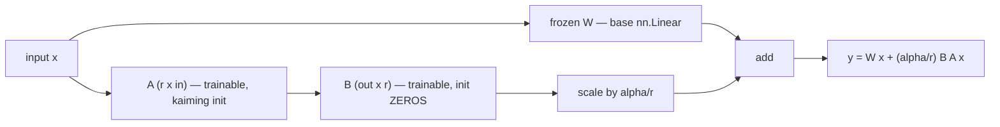

# Week 06 — LoRA From Scratch (then QLoRA)

> Phase 2, week 2 of 4. Parameter-efficient fine-tuning implemented by hand on a real
> 1–2B model, then validated line-by-line against HuggingFace PEFT.

Prerequisite support: [Week 06 companion lesson](../../../companion-lessons/week-06.md).

## Goal

Implement LoRA yourself — the `LoRALinear` module, the model surgery that injects it,
the merge back into dense weights — and use it to fine-tune a real instruct model on
the RTX 5090 Laptop (24 GB). Then swap the base model to 4-bit NF4 (QLoRA) and measure
exactly what that buys. Finish by proving your implementation is equivalent to PEFT:
same config → same trainable-parameter count, comparable loss curve.

**Base model** — pick one (both are genuinely downloadable):
- `Qwen/Qwen2.5-1.5B-Instruct` — **ungated**, `huggingface-cli download` just works. Default choice.
- `meta-llama/Llama-3.2-1B-Instruct` — **gated**: you must accept Meta's license on the
  HF model page and use an HF token (`huggingface-cli login`). Fine if you already have access.

Dataset: a subset of `yahma/alpaca-cleaned` (ungated, ~52k instruction pairs — use 3–10k).

**The week's pipeline — adapters trained around a frozen base, merged back to dense, both proven equivalent:**

## Why this matters (industry relevance)

LoRA is how virtually all applied fine-tuning ships: it is the difference between
"needs an 8×H100 node" and "runs on one 24 GB GPU". Every LLM-platform team maintains
adapter infrastructure (per-customer adapters, multi-LoRA serving). Knowing WHY r, α,
target modules, and NF4 quantization behave as they do — not just which YAML keys set
them — is exactly the NCP-GENL customization domain, and a standard interview area.

## Background reading

- Hu et al., *LoRA: Low-Rank Adaptation of Large Language Models* (2021):
  https://arxiv.org/abs/2106.09685
- Dettmers et al., *QLoRA: Efficient Finetuning of Quantized LLMs* (2023):
  https://arxiv.org/abs/2305.14314
- HF PEFT docs (your reference implementation): https://huggingface.co/docs/peft
- bitsandbytes 4-bit docs: https://huggingface.co/docs/bitsandbytes
- Liu et al., *DoRA: Weight-Decomposed Low-Rank Adaptation* (2024) [stretch]:
  https://arxiv.org/abs/2402.09353
- lm-evaluation-harness: https://github.com/EleutherAI/lm-evaluation-harness

## Day-by-day plan

### Day 1 (Mon) — LoRALinear + model surgery

**`LoRALinear` in one picture — the output starts at exactly Wx because B is zeros:**

- `src/lora.py`: implement `LoRALinear` wrapping a frozen `nn.Linear`:
  A: (r × in) init kaiming-uniform, B: (out × r) init ZEROS (so the wrapped layer
  starts exactly equal to the base layer), scaling α/r, optional dropout on the
  LoRA path, `merge_()` / `unmerge_()`.
- Implement `wrap_model_with_lora(model, target_modules, r, alpha, dropout)`:
  walk `model.named_modules()`, replace matching `nn.Linear`s programmatically
  (no hardcoded model-specific paths — match by suffix like `q_proj`).
- Freeze everything except A/B. Run `pytest tests/test_lora.py` — the identity-at-init,
  gradient-flow, and merge tests should pass today; the PEFT parity tests too.

### Day 2 (Tue) — bf16 LoRA fine-tune on the real model
- `src/train_lora.py`: load the base model in bf16 with
  `attn_implementation="sdpa"`, gradient checkpointing ON, wrap with YOUR LoRA
  (targets: `q_proj,k_proj,v_proj,o_proj` to start; r=16, α=32).
- Tokenize alpaca-cleaned into prompt/response format; mask the prompt tokens
  out of the loss (label = -100).
- Train ~1 epoch on a 3–10k subset. Budget check: a 1.5B bf16 model + optimizer
  states for LoRA params only + activations with checkpointing fits comfortably
  in 24 GB at seq 1024 / micro-batch 4–8. Log VRAM (`torch.cuda.max_memory_allocated`),
  loss, tok/s to CSV.

### Day 3 (Wed) — QLoRA
- Same run, but base model loaded with `BitsAndBytesConfig(load_in_4bit=True,
  bnb_4bit_quant_type="nf4", bnb_4bit_compute_dtype=torch.bfloat16,
  bnb_4bit_use_double_quant=True)`. Your `LoRALinear` must tolerate a base layer
  whose weight is a bnb `Params4bit` (call the base layer as a black box —
  never touch `.weight` directly on the QLoRA path).
- Produce the comparison table: peak VRAM, min/step time, final loss — bf16-LoRA
  vs QLoRA. Expect: big VRAM drop on weights, some step-time cost from dequant.

### Day 4 (Thu) — Evaluation
- `src/eval.py` + lm-eval-harness on 2–3 cheap tasks (e.g. `hellaswag`,
  `arc_easy`, `winogrande`) — base vs fine-tuned. Small models on small data
  move little on benchmarks; report honestly, that IS the finding.
- `src/merge.py`: merge adapters into dense weights, save a standalone model.
  Verify merged == adapter outputs (test-enforced ≤ 1e-4 in fp32).
- Build the qualitative table: 8–10 fixed prompts, base vs fine-tuned generations,
  side by side in `RESULTS.md`.

### Day 5 (Fri) — Parity vs PEFT + writeup
- Run the same config through HF PEFT (`LoraConfig` + `get_peft_model`).
  Check: trainable-param count matches yours EXACTLY; loss curves overlap to
  eyeball tolerance on the same data/seed/schedule.
- Writeup: what r bought you, VRAM/time tables, eval table, PEFT parity note.
  Push; update root README.

## Deliverables

- `src/lora.py` implemented; `make test` green
- Two training runs logged (bf16 LoRA, QLoRA) + comparison table
- lm-eval results JSON (pre/post), merged model reproducibility check
- `RESULTS.md` with before/after generations table

## Acceptance criteria

- [ ] Trainable-param count matches PEFT exactly for the same (r, α, target_modules)
- [ ] Wrapped model output == base model output at init (B=0), ≤ 1e-6
- [ ] Training loss decreases monotonically on smoothed curve; no NaNs
- [ ] Merged dense model reproduces adapter-model outputs ≤ 1e-4 (fp32 compare)
- [ ] QLoRA vs LoRA table complete: peak VRAM, step time, final loss
- [ ] Eval table complete (2–3 tasks, pre/post), reported honestly even if flat

## A note on honest benchmarking

Laptop GPU: power/thermal limited. Report medians over enough steps, state power
limits, and never claim "X% faster than an A100 number from a blog". VRAM numbers:
report `torch.cuda.max_memory_allocated()` AND `nvidia-smi` (they differ — say why:
allocator caching + non-torch allocations).

## Stretch goals

- **DoRA**: decompose W into magnitude · direction, LoRA the direction only. Compare
  loss vs plain LoRA at equal trainable params.
- **Rank ablation**: r ∈ {4, 16, 64} at fixed α/r ratio — plot final loss + eval vs
  trainable params. Where does it saturate?

## Interview talking points

1. Why low-rank: fine-tuning updates have low intrinsic rank (empirically), so
   ΔW = B·A with r ≪ min(d_in, d_out) captures most of it at ~0.1–1% of the params.
2. Why B is initialized to zero (adapter starts as identity — training starts from
   exactly the pretrained model, no cold-start shock) and A is not (else grad of A is
   zero too and nothing ever moves).
3. What α/r scaling does: decouples the update magnitude from the choice of r, so LR
   doesn't need retuning when you sweep r.
4. Why QLoRA works: gradients don't need to flow INTO the base weights, only THROUGH
   them — so a frozen 4-bit base + bf16 adapters trains fine; NF4 is information-
   theoretically matched to normally-distributed weights; double quantization shaves
   the quantization constants themselves.
5. Why merged inference is free: ΔW folds into W once — zero added latency, unlike
   adapters/prefix methods that stay in the forward pass.
6. Serving angle: unmerged adapters enable multi-tenant LoRA serving (one base model,
   many adapters, batched together — cf. S-LoRA / vLLM multi-LoRA).

## Definition of done

- [ ] `make test` green (includes PEFT parity)
- [ ] Both runs completed and logged; comparison table in RESULTS.md
- [ ] Eval JSON + qualitative generations table committed
- [ ] Merged model check passed
- [ ] Pushed; root README updated
