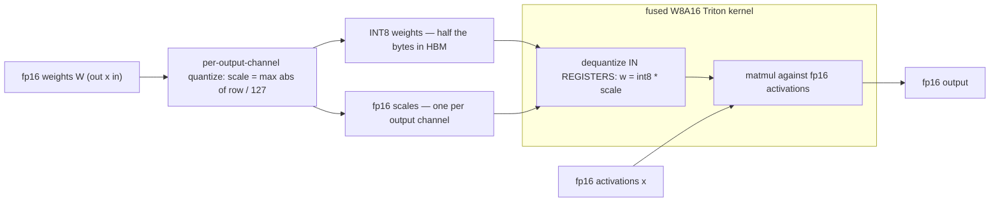

# Week 07 — Triton Kernels + Weight-Only Quantization

> Phase 2, week 3 of 4. Drop below PyTorch: write the GPU kernels yourself in Triton —
> fused softmax, RMSNorm, a FlashAttention forward pass — then use them for
> weight-only INT8 quantization with a fused dequant-matmul.

Prerequisite support: [Week 07 companion lesson](../../../companion-lessons/week-07.md).

## Goal

- Write real Triton kernels for the ops that dominate transformer inference:
  fused softmax, RMSNorm, and a single-head FlashAttention **forward** with online
  softmax and KV tiling.
- Prove correctness against torch oracles at fp16 tolerances, and prove the memory
  claim that makes FlashAttention matter: O(N) vs O(N²) activation memory.
- Build weight-only INT8 quantization end to end: per-channel packing, a fused
  dequantize-matmul kernel (W8A16), and an honest perplexity delta on a real model.

Hardware note: RTX 5090 Laptop, Blackwell sm_120, PyTorch cu128. Triton ships with
PyTorch (`torch.compile` uses it) — verify `python -c "import triton; print(triton.__version__)"`
inside WSL2 before Monday.

## Why this matters (industry relevance)

This is the week the portfolio stops looking like coursework. "Implemented
FlashAttention forward in Triton, matched SDPA to fp16 tolerance, measured the memory
crossover" is a sentence that changes interviews — it demonstrates you understand GPU
memory hierarchy, not just PyTorch APIs. Weight-only quantization (W8A16-style) is how
most local/edge LLM inference actually ships today (llama.cpp, TensorRT-LLM,
AWQ/GPTQ checkpoints), because decode is weight-bandwidth-bound — halve the bytes,
roughly halve the decode time.

## Background reading

- Triton tutorials **01–06** (do 01 vector-add, 02 fused softmax, 03 matmul at
  minimum, before Monday): https://triton-lang.org/main/getting-started/tutorials/index.html
- Dao et al., *FlashAttention* (2022): https://arxiv.org/abs/2205.14135
- Dao, *FlashAttention-2* (2023): https://arxiv.org/abs/2307.08691
- Milakov & Gimelshein, *Online normalizer calculation for softmax* (2018):
  https://arxiv.org/abs/1805.02867
- Lin et al., *AWQ: Activation-aware Weight Quantization* (2023): https://arxiv.org/abs/2306.00978
- Frantar et al., *GPTQ* (2022): https://arxiv.org/abs/2210.17323

## Day-by-day plan

### Day 1 (Mon) — Fused softmax + RMSNorm kernels
- `src/softmax_triton.py`: row-wise fused softmax — one program per row, load once,
  max-subtract, exp, normalize, store once. Tutorial-02-guided, but WRITTEN BY YOU
  (close the browser tab while typing).
- `src/rmsnorm_triton.py`: same one-row-per-program structure; you wrote the math in
  week 05, now fuse it (single read of x, single write of y).
- `pytest tests/test_softmax.py tests/test_rmsnorm.py` must pass; run
  `python bench/bench_kernels.py --op softmax rmsnorm` — you should beat or match
  eager torch (which does multiple memory round-trips), and roughly match compiled torch.

### Days 2–3 (Tue–Wed) — FlashAttention forward, single head

**The FlashAttention deal — stream K/V tiles through on-chip memory; the N×N score matrix never touches HBM:**

```
HBM (large, slow)                        SRAM / registers (small, fast)

 Q [N x d] ── load one query block ──►    q_tile [Br x d]      per query block:
 K [N x d] ── stream KV blocks ──────►    k_tile [Bc x d] ┐    for each kv tile:
 V [N x d] ── stream KV blocks ──────►    v_tile [Bc x d] ┘      s = q k^T (on chip)
                                                                 new max m? rescale
 S = Q K^T  [N x N]  — NEVER stored —     m, l, acc live         acc by exp(m_old - m_new)
                                          in registers           acc += softmax(s) v
 O [N x d] ◄── written once per query block ── acc / l

 activation memory: yours O(N)  vs  the math backend's O(N^2) score matrix
```

- `src/flash_fwd_triton.py`: causal, single-head-batched (grid over B*H and query
  blocks). Per query block: iterate over KV blocks, maintain running max `m`, running
  denominator `l`, and un-normalized accumulator `acc`; rescale on every new max
  (online softmax). Never materialize the (N × N) score matrix in HBM.
- Day 2 target: non-causal version numerically correct at one size.
  Day 3: causal masking, arbitrary sizes, autotuned block sizes; pass
  `tests/test_flash.py` (oracle: SDPA); benchmark vs SDPA-flash and the math
  backend across seq 256→8k, plus the **memory** plot:
  math backend peak memory grows O(N²), yours O(N).

### Day 4 (Thu) — Weight-only INT8 (W8A16)

**W8A16 end to end — weights cross the memory bus as INT8 and become fp16 only in registers:**



- `src/quant/pack.py`: per-output-channel symmetric INT8 — scale = max|W_row| / 127,
  quantize, and a dequant reference. Quality metric: relative Frobenius error.
- `src/quant/matmul_w8a16.py`: Triton matmul that loads INT8 weights + fp16 scales,
  dequantizes IN REGISTERS, multiplies against fp16 activations (that is the
  "W8A16" recipe — weights 8-bit, activations 16-bit).
- Evaluate: swap the linear layers of the week-05 model (or `Qwen/Qwen2.5-1.5B-Instruct`
  — ungated) to int8 and measure perplexity on a held-out TinyStories/WikiText slice,
  fp16 vs int8, plus weight-memory savings.

### Day 5 (Fri) — Benchmark, document, publish
- `make bench` — full sweep, JSON + plots (median of ≥50 runs post-warmup, CUDA
  events, fixed clocks reported).
- `RESULTS.md`: kernel-vs-torch tables, flash memory plot, ppl delta table, and an
  honest paragraph on where your kernels LOSE to cuBLAS/cuDNN and why that is expected.

## Deliverables

- Four working kernels; `make test` green on GPU
- `bench/results/*.json` + plots: latency sweeps and the O(N) vs O(N²) memory figure
- Perplexity table: fp16 vs int8, plus memory savings
- `RESULTS.md`

## Acceptance criteria

- [ ] Softmax and RMSNorm match torch ≤ 1e-2 abs in fp16 (≤ 1e-5 in fp32)
- [ ] Flash forward matches SDPA ≤ 1e-2 abs in fp16, causal and non-causal
- [ ] Flash forward beats the SDPA **math** backend on latency at seq ≥ 2k and stays
      within a reasonable factor (~2–4×) of SDPA's flash backend (losing to a
      years-tuned kernel is expected — report the factor)
- [ ] Peak-memory plot demonstrates O(N) for yours vs O(N²) for math backend
- [ ] INT8 model perplexity within ~1% relative of fp16, at ~2× weight-memory saving
- [ ] All benchmarks: median of ≥ 50 runs post-warmup, JSON + plots committed

## A note on honest benchmarking

Laptop GPU: clocks move with temperature and power limits. For kernel timings use
`triton.testing.do_bench` or CUDA events (both used in `bench/bench_kernels.py`),
report medians, note `nvidia-smi -q -d POWER,CLOCK` at bench time, interleave the
implementations you compare, and never quote a single-run number.

## Stretch goals

- INT4 packing (two nibbles per byte) + W4A16 matmul; ppl vs memory trade-off curve.
- FlashAttention **backward** (much harder: recomputation + two more matmuls per tile).
- Autotune sweep writeup: which BLOCK_M/BLOCK_N/num_warps won at each seq length, and why.

## Interview talking points

1. Why fusion wins: eager softmax is several kernel launches and HBM round-trips;
   one fused kernel reads x once, writes y once — the op is bandwidth-bound, so
   bytes-moved IS the runtime.
2. Online softmax from memory: keep (m, l, acc); on a new tile rescale by
   exp(m_old − m_new). Why it's exact, not an approximation.
3. Why FlashAttention is O(N) memory and typically faster despite doing MORE flops
   (recompute beats re-read because compute is cheap relative to HBM bandwidth).
4. The SRAM/HBM roofline argument: arithmetic intensity of attention with vs without
   tiling.
5. Why weight-only quantization (W8A16) targets decode: batch-1 decode is
   weight-bandwidth-bound, so halving weight bytes ≈ halving decode latency, while
   activations stay fp16 to keep accuracy without activation-quant calibration pain.
6. Per-channel vs per-tensor scales: outlier channels wreck a single tensor-wide
   scale; per-output-channel scales cost almost nothing in a fused kernel.

## Definition of done

- [ ] `make test` green on the 5090
- [ ] `make bench` produces JSON + all three plots (latency, memory, ppl table)
- [ ] `RESULTS.md` written, including the "where cuBLAS still wins" paragraph
- [ ] Pushed; root README updated
