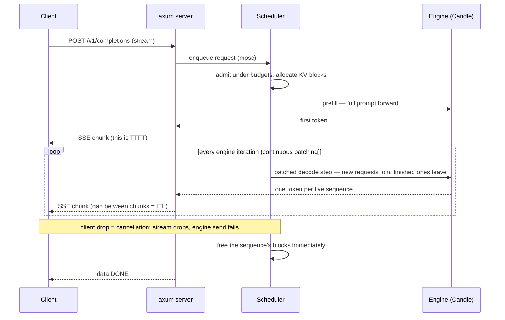

# Week 08 — ferrum-serve: a Mini Inference Engine in Rust   [MONTH CAPSTONE]

> Phase 2, week 4 of 4 — the month's capstone, and the repo's Rust thesis made
> concrete: Python where the ecosystem is (weeks 5–7), **Rust where performance
> matters**. Implement the ideas that make vLLM fast — paged KV cache, continuous
> batching, streaming — in Rust on the Candle stack, then load-test against real
> vLLM on the same GPU and report an honest %-of-vLLM number.
>
> Exam week: Friday is deliberately light.

Prerequisite support: [Week 08 companion lesson](../../../companion-lessons/week-08.md).
Source reading: [HF Ultra-Scale Playbook — serving memory and precision carryover](../../../references/hf-ultrascale-playbook.md#week-8---serving-memory-and-precision-carryover).

## Goal

An OpenAI-compatible LLM inference server, built from first principles in Rust:

```
                     ┌────────────────────────────────────────────────┐
   HTTP (SSE)        │              engine thread                     │
  ┌───────────┐      │  ┌───────────┐    ┌────────────────────────┐   │
  │   axum    │─────▶│  │ Scheduler │───▶│      model runner      │   │
  │ server.rs │◀─────│  │scheduler. │    │ engine.rs + Candle     │   │
  └───────────┘ token│  │    rs     │    │ (Qwen2.5-1.5B, CUDA)   │   │
     stream    (mpsc)│  └─────┬─────┘    └───────────┬────────────┘   │
                     │        │                      │                │
                     │  ┌─────▼──────────────────────▼─────┐          │
                     │  │  BlockManager (paged KV blocks,  │          │
                     │  │   ref-counts)     blocks.rs      │          │
                     │  └──────────────────────────────────┘          │
                     └────────────────────────────────────────────────┘
```

- **Paged KV cache** (`blocks.rs`): fixed-size blocks + per-sequence block tables +
  ref-counts — no contiguous max-seq-len reservations, near-zero fragmentation.

  **`blocks.rs` in one picture — sequences map logical positions to scattered physical blocks; ref-counts enable sharing:**

  ```
  KV pool (fixed-size blocks, e.g. 16 tokens each)        block tables

   ┌────┬────┬────┬────┬────┬────┬────┬────┐          seq A: [0, 3, 5]
   │ B0 │ B1 │ B2 │ B3 │ B4 │ B5 │ B6 │ B7 │          seq B: [1, 4]
   └────┴────┴────┴────┴────┴────┴────┴────┘          seq C: [2, 3]  <- B3 shared
   used  used used rc=2 used used free free              via fork; refcount = 2
    A     B    C   A,C   B    A

   free list: [6, 7]      no contiguous max-seq-len reservation:
                          a sequence grows one block at a time,
                          and freed blocks are reusable by anyone
  ```
- **Continuous batching** (`scheduler.rs`): requests join and leave the running batch
  every iteration — no waiting for the slowest sequence.
- **Model runner** (`engine.rs`): Candle forward passes (Qwen2.5-1.5B-Instruct from
  safetensors via hf-hub) wired to the block manager, on a dedicated engine thread.
- **Server** (`server.rs`): axum + SSE, OpenAI-compatible `/v1/completions`,
  cancellation-by-drop, graceful SIGTERM shutdown (week 11's K8s deployment
  depends on that shutdown behavior).

**One request's life — arrive, prefill, join the running batch, stream, free blocks on finish or client drop:**



**Model**: `Qwen/Qwen2.5-1.5B-Instruct` (ungated, downloads with no token) is the
default. `meta-llama/Llama-3.2-1B-Instruct` works too but is **gated** — accept the
license on the HF page and `huggingface-cli login` first.

## Your first large Rust program — read this

The weeks 1–4 ramp (rustlings, cudarc, PyO3) taught you syntax and FFI; this week
teaches Rust **systems design**: ownership as an architecture tool. The project is
structured to keep the borrow checker on your side:

- `blocks.rs` and `scheduler.rs` are pure logic — no async, no GPU, no lifetimes
  beyond `&self`/`&mut self`. Start here. The Scheduler *owns* the BlockManager;
  single mutator, no locks. When the borrow checker fights you in `schedule()`,
  that fight is the curriculum — iterate over a cloned id list or split your fields.
- `engine.rs` runs on its own thread; `server.rs` talks to it only through channels.
  Cancellation is not an `is_disconnected()` poll like in Python — it is ownership:
  client disconnects → axum drops the stream → the channel receiver drops → the
  engine's send fails → free the blocks. Design like this and whole bug classes
  don't exist.
- **Red→green workflow**: the test suites in `ferrum-serve/tests/` are COMPLETE and
  compile against the `todo!()` skeletons. `cargo test` starts all-red (every test
  panics with "not yet implemented") and your job is to turn it green, test by test.
  Read a failing test before writing code — the tests ARE the spec.
- Habits from day 1: `cargo clippy -- -D warnings` and `cargo fmt` before every
  commit (`make lint`). Clippy is a free Rust tutor; let it nag you.

## Day-1 scoping note (honesty clause)

KV blocks are integrated by **gathering** each sequence's blocks into a contiguous
KV tensor per layer per step, then running ordinary attention. This teaches all of
the memory management with zero custom kernels. **TRUE paged attention** — the
attention kernel indexing the block table directly, no gather — is the stretch goal,
and it is the single biggest technical difference between ferrum-serve and real vLLM.
State this explicitly in the benchmark writeup; the comparison is dishonest without it.

## Why this matters (industry relevance)

Inference serving is where LLM engineering meets production — and the industry's
serving layer is moving to Rust: **NVIDIA wrote Dynamo's core in Rust** (announced
GTC 2025) for exactly the properties you'll experience this week — no GC pauses in
the request path, fearless concurrency, small static binaries. PagedAttention and
continuous batching are THE two ideas that made GPU serving economical; being able
to derive them *and* implement them in a systems language is a rare combination.
The TTFT/ITL/goodput vocabulary is also NCP-GENL deployment-domain material.

## Background reading

- Kwon et al., *Efficient Memory Management for LLM Serving with PagedAttention*
  (SOSP 2023): https://arxiv.org/abs/2309.06180
- Yu et al., *Orca: A Distributed Serving System for Transformer-Based Generative
  Models* (OSDI 2022): https://www.usenix.org/conference/osdi22/presentation/yu
- vLLM docs — metrics & benchmarking (TTFT/ITL): https://docs.vllm.ai/en/latest/
- NVIDIA Dynamo (Rust core — the "why Rust for serving" argument, made by NVIDIA):
  https://github.com/ai-dynamo/dynamo
- Candle: https://github.com/huggingface/candle — read
  `candle-transformers/src/models/qwen2.rs` and a `candle-examples` generation
  example end to end before Day 1.
- axum: https://docs.rs/axum — extractors, `State`, SSE, graceful shutdown.
- tokio channels chapter: https://tokio.rs/tokio/tutorial/channels
- `setup/rust-cuda-toolchain.md` in this repo — toolchain + version-pinning policy.

## Day-by-day plan

### Day 1 (Mon) — Candle hello + block manager design
- Toolchain sanity: `cd ferrum-serve && cargo test` — everything compiles and fails
  red. That's correct.
- **Candle hello**: implement `engine::load_model` and `engine::generate_single` —
  download Qwen2.5-1.5B safetensors via hf-hub, tokenize, greedy-decode one prompt
  on CUDA. This de-risks the whole week, and its output is the week's correctness
  oracle. (Budget half the day; hf-hub + VarBuilder + qwen2 config wiring is fiddly
  the first time.)
- **Design on paper**: read `tests/blocks_test.rs` top to bottom, then write the
  struct fields for `BlockManager` (free list, ref-counts, tables) into the TODO.

### Day 2 (Tue) — Block manager + scheduler, tests green
- Implement `blocks.rs` until `cargo test --test blocks_test` is green
  (including the fork/ref-count tests — that's the prefix-caching primitive).
- Implement `scheduler.rs` until `cargo test --test scheduler_test` is green:
  FIFO admission under three budgets, decode-first slot reservation, finish/cancel
  freeing blocks immediately.
- All green = the hard logic of the week is done, on CPU, before any GPU code.

### Day 3 (Wed) — Engine + server: streaming, cancellation, shutdown
- `engine.rs`: `PagedKvCache` (write/gather), the engine-thread loop
  (`spawn_engine`), prefill + batched decode via the scheduler.
- `server.rs`: `/v1/completions` with SSE (OpenAI chunk shape), `/stats`,
  `shutdown_signal` + graceful drain.
- Smoke: `make smoke`; 10 concurrent `curl -N` streams while `/stats` shows blocks
  recycling; ctrl-C a stream and watch its blocks return; `kill -TERM` the server
  mid-stream and verify a clean drain + exit 0.
- Correctness gate: temperature-0 server output == `generate_single` output,
  token for token, at any concurrency.

### Day 4 (Thu) — Load test vs vLLM
- `bench/loadtest.py` (COMPLETE — kept from the Python design, deliberately: the
  load-test client's language is irrelevant, it just speaks HTTP/SSE; what matters
  is that BOTH servers get the identical referee).
- Run the closed-loop matrix (concurrency 1→16) and open-loop (Poisson) against
  ferrum-serve, then against `vllm serve` per `bench/compare_vllm.md` — same model,
  same GPU, same client.
- Collect the Rust-only metrics table (compare_vllm.md §7): stripped binary size,
  docker image size, cold-start-to-first-token — these feed week 11's K8s story.

### Day 5 (Fri — LIGHT, exam week) — Publish
- Plots, `RESULTS.md` (honest %-of-vLLM + the gather-vs-paged-attention caveat +
  binary/image/cold-start table), root README results row. 30–60 min.
- The rest of the day belongs to NCP-GENL prep.

## Deliverables

- `cargo test` green; `cargo clippy -- -D warnings` clean
- Server demo: streaming, cancellation, `/stats`, graceful SIGTERM drain
- `bench/results/*.json` + TTFT/throughput curves, ferrum-serve vs vLLM
- Binary size / image size / cold-start table
- `RESULTS.md` with the honest %-of-vLLM number and a "what vLLM does that I don't"
  section (true paged-attention kernels, CUDA graphs, chunked prefill, prefix
  caching, speculative decoding, tensor parallelism...)

## Acceptance criteria

- [ ] `cargo test` fully green (blocks + scheduler suites)
- [ ] Temperature-0 outputs token-identical to single-request `generate_single`,
      for every request, at any concurrency
- [ ] No block leaks: after any workload including cancellations and SIGTERM,
      free blocks return to 100% (`/stats`)
- [ ] Sustains ≥ 8 concurrent streams without error on the 24 GB GPU
- [ ] TTFT / ITL / throughput vs concurrency curves for both servers
- [ ] Honest %-of-vLLM throughput number, methodology per `bench/compare_vllm.md`,
      gather-vs-paged-attention caveat stated
- [ ] Rust-only metrics table: stripped binary size, docker image size,
      cold-start-to-first-token vs vLLM

## A note on honest benchmarking

Same GPU, same weights, same prompts, same sampling, same client for both servers.
Laptop 5090: fix the power profile, record clocks (`nvidia-smi -q -d POWER,CLOCK`),
≥ 50 recorded requests per point after warmup, medians AND p95 (serving is a tails
business). Expect to lose to vLLM substantially — a pure-gather engine losing to
years-tuned CUDA kernels is the expected result; the honest number plus the gap
analysis IS the deliverable.

## Stretch goals

- **Prefix caching**: `BlockManager::fork` already ref-counts — hash prompt-prefix
  blocks, share them across requests, add copy-on-write on divergence. Measure TTFT
  on a shared-system-prompt workload.
- **TRUE paged attention**: a custom kernel (CUDA-C via cudarc/NVRTC per the
  escape-hatch policy in `setup/rust-cuda-toolchain.md`, or a candle custom op)
  that reads the block table directly — then re-run the benchmark and update the
  honesty caveat.
- **`/v1/chat/completions`**: apply the model's chat template server-side.

## Interview talking points

**Lead with this: "NVIDIA wrote Dynamo's core in Rust — here's mine in miniature."**
A from-scratch Rust serving engine with paged KV and continuous batching is a
first-five-minutes story that turns the interview into a systems discussion you
control. Be ready to go deep on:

1. Why paged KV: contiguous max-seq-len reservations fragment VRAM like
   pre-virtual-memory RAM; block tables fix internal AND external fragmentation —
   the memory-efficiency win behind vLLM's original 2-4x throughput claim.
2. Continuous batching: iteration-level scheduling refills a finished sequence's
   slot at the NEXT step; utilization stops depending on length variance (Orca).
3. Prefill vs decode asymmetry — compute-bound vs memory-bandwidth-bound — and why
   the scheduler treats them differently.
4. Why Rust for the serving layer: no GC pauses and no GIL in the request path;
   cancellation and shutdown fall out of ownership (dropped receiver = cancelled
   request); tiny static binaries → the cold-start numbers in your table. Then the
   honest flip side: the ML-ecosystem cost (Candle vs PyTorch), and where you paid it.
5. TTFT vs ITL vs throughput: which scheduler knob moves which metric; what
   open-loop load reveals that closed-loop hides (queueing collapse).
6. What real vLLM adds and roughly what each is worth: true paged-attention
   kernels vs your gather, CUDA graphs for decode launch overhead, chunked
   prefill, prefix caching, spec decode.
7. The borrow-checker war story: how ownership shaped the scheduler/engine split —
   interviewers who write Rust will probe exactly here.

## Definition of done

- [ ] `cargo test` green, clippy clean, `Cargo.lock` committed
- [ ] Server demo works (streaming, cancellation, /stats, SIGTERM drain)
- [ ] Load-test JSON + plots for both servers committed
- [ ] `RESULTS.md`: %-of-vLLM, gap analysis, honesty caveat, Rust metrics table
- [ ] Root README month-2 results row added; pushed
- [ ] ...and NCP-GENL exam prep got its Friday hours
