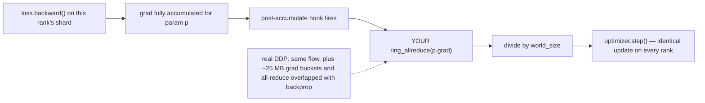
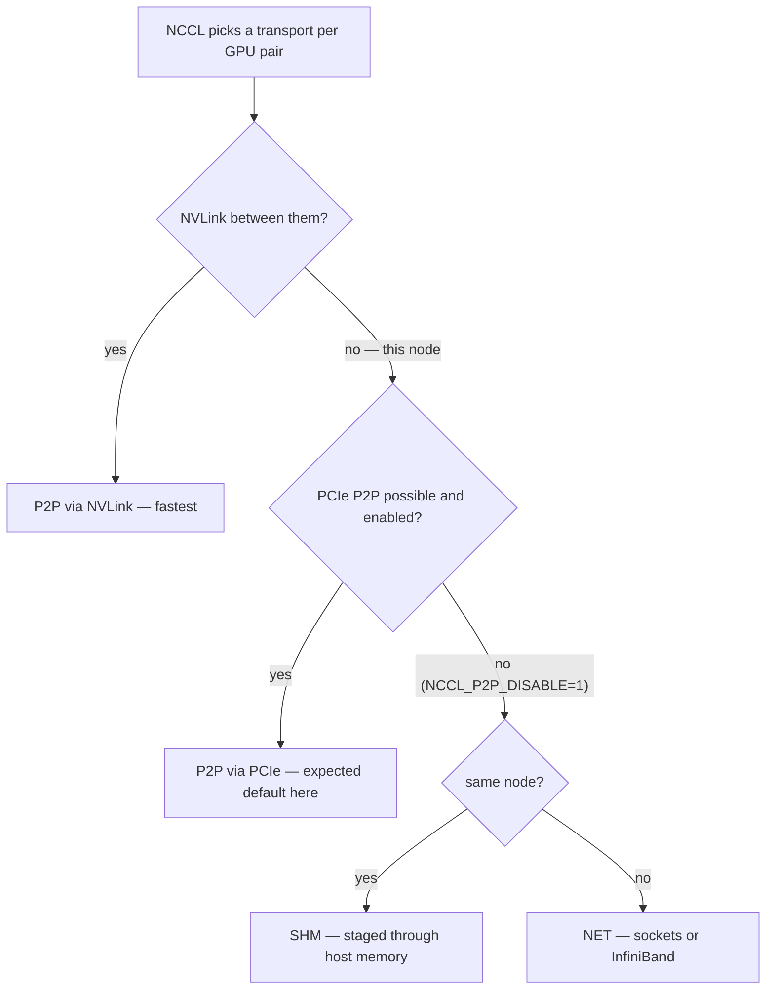

# Week 09 — Distributed Training From First Principles

> **Phase 3, Week 1 of 4** · ~4 h/day × 5 days · Cloud: 1 node × 2 GPUs (L4/A10G class, no NVLink) · Budget: ~$10–20

Prerequisite support: [Week 09 companion lesson](../../../companion-lessons/week-09.md).

## Goal

Understand what `DistributedDataParallel` **actually does** by building it yourself:

1. Bootstrap `torch.distributed` by hand (rank, world size, rendezvous) — no launcher magic.
2. Implement **ring all-reduce** from scratch using P2P ops (`isend`/`irecv`) and validate it against `dist.all_reduce`.
3. Build a **manual DDP** (gradient hooks → your ring all-reduce), train the week-05 GPT with it, and prove loss parity with real DDP and FSDP2.
4. Go one layer deeper: run **nccl-tests**, read `NCCL_DEBUG=INFO` output, and explain which transport (P2P / SHM / NET) your no-NVLink node actually uses and why the bandwidth numbers are what they are.

By Friday you should be able to answer, with your own measurements: *"Why is my 2-GPU speedup 1.7× and not 2.0×?"*

## Why this matters (industry relevance)

Every large model is trained with some combination of data/tensor/pipeline parallelism sitting on top of NCCL collectives. Engineers who can only call `DDP(model)` are common; engineers who can explain reduce-scatter + all-gather phases, busbw vs algbw, and what `NCCL_P2P_DISABLE=1` does to a PCIe box are rare. This week is also directly relevant to NCP-AIO exam domains (multi-node job launch, NCCL troubleshooting) — you're studying both at once.

Cross-reference: your separate demo repo already covers **NCCL transports at the K8s level** (and KAI gang scheduling, DRA ResourceClaims). This week goes *below* that layer — the collectives themselves.

## Background reading (before Day 1)

- PyTorch Distributed overview — https://docs.pytorch.org/tutorials/beginner/dist_overview.html
- `torch.distributed` API docs (P2P ops, process groups) — https://docs.pytorch.org/docs/stable/distributed.html
- Ring all-reduce classic explainer (Horovod/Baidu lineage) — https://andrew.gibiansky.com/blog/machine-learning/baidu-allreduce/
- Horovod paper (why ring all-reduce beat parameter servers) — https://arxiv.org/abs/1802.05799
- NCCL docs, esp. environment variables & transports — https://docs.nvidia.com/deeplearning/nccl/user-guide/docs/env.html
- nccl-tests repo (you will run this) — https://github.com/NVIDIA/nccl-tests
- DDP internals design note (bucketing, hooks, overlap) — https://docs.pytorch.org/docs/stable/notes/ddp.html
- FSDP2 docs — https://docs.pytorch.org/docs/stable/distributed.fsdp.fully_shard.html

## Day-by-day plan

### Day 1 (local RTX 5090, free) — distributed bootstrap + naive data parallel
- Init `torch.distributed` with the `gloo` backend and `env://` rendezvous: set `MASTER_ADDR`, `MASTER_PORT`, `RANK`, `WORLD_SIZE` yourself first, *then* switch to `torchrun` and confirm it just sets the same env vars.
- Multi-process on ONE machine: 2 CPU processes (gloo), then 2 processes sharing your single GPU for API familiarity (not for speed).
- Write **manual parameter-averaging data parallel**: each rank computes grads on its shard, then average parameters (or grads) with explicit `dist.send`/`dist.recv` — the dumbest thing that works. Feel the pain; that pain is why collectives exist.
- Deliverable: `src/train_dist.py` runs on gloo/CPU with world_size=2 and both ranks converge identically.

### Day 2 (cloud, 2 GPUs) — ring all-reduce from scratch

**The algorithm you implement — reduce-scatter then all-gather around the ring, 2(N−1) steps each moving 1/N of the data:**

```
4 ranks in a ring, each holding a vector split into 4 chunks [c0 c1 c2 c3]

        r0 ──► r1
        ▲       │      each step: send one chunk to the right neighbor,
        │       ▼      receive one from the left
        r3 ◄── r2

Phase 1 — reduce-scatter (N-1 = 3 steps): ADD what you receive into your copy.
After 3 steps each rank owns ONE fully-summed chunk:

   r0: [ .  c1* .  . ]   r1: [ .  .  c2* . ]      * = summed over
   r2: [ .  .  .  c3*]   r3: [ c0* .  .  . ]          all 4 ranks

Phase 2 — all-gather (3 more steps): circulate the finished chunks the same
way, OVERWRITING instead of adding, until every rank has [c0* c1* c2* c3*].

Bandwidth-optimal (each link busy every step, no central bottleneck) —
exactly why ring all-reduce beat parameter servers.
```

- Implement `ring_allreduce(tensor)` in `src/ring_allreduce.py` using `dist.isend`/`dist.irecv`:
  - Phase 1 **reduce-scatter**: N−1 steps; each rank ends owning the fully-reduced value of one chunk.
  - Phase 2 **all-gather**: N−1 steps; circulate the reduced chunks until everyone has everything.
- Validate numerically vs `dist.all_reduce` (tests provided — they run on gloo/CPU too, so debug locally before burning cloud dollars).
- Benchmark yours vs NCCL's `all_reduce` across tensor sizes (1 KB → 256 MB). Yours will lose. Quantify by how much and hypothesize why (kernel launch overhead, no protocol switching LL/LL128/Simple, no channels).

### Day 3 (cloud, 2 GPUs) — manual DDP vs real DDP vs FSDP2

**What manual DDP does per parameter — and the two tricks real DDP adds on top:**



- `src/manual_ddp.py`: register per-parameter grad hooks (`register_post_accumulate_grad_hook`) that call YOUR ring all-reduce, then average.
- Train the week-05 GPT (same config, same seed, same data order) three ways: manual DDP, `torch.nn.parallel.DistributedDataParallel`, FSDP2 (`fully_shard`).
- Acceptance: loss curves overlay (manual vs real DDP within noise; document any divergence and find the bug — it's usually grad averaging vs summing, or hook timing).
- Measure **scaling efficiency**: tokens/sec on 1 GPU vs 2 GPUs. Report `eff = T₂/(2·T₁)` and *explain* the gap (comm time, no overlap in your manual version, PCIe bandwidth).

### Day 4 (cloud, 2 GPUs) — NCCL deep-dive

**The transport ladder you probe — what `NCCL_DEBUG=INFO` will show, and what the env vars force:**



- Build & run nccl-tests: `all_reduce_perf -b 8 -e 256M -f 2 -g 2`. Record the table; explain **busbw vs algbw** (for all-reduce, busbw = algbw × 2(n−1)/n) in your own words in the README.
- Run your training job with `NCCL_DEBUG=INFO` and grep the transport lines: on a no-NVLink node expect `via P2P/... (PCIe)` or SHM. Fill in the transport table below.
- Experiments (rerun all_reduce_perf for each): `NCCL_P2P_DISABLE=1` (forces SHM/NET path), `NCCL_ALGO=Ring` vs `Tree`, `NCCL_PROTO=Simple` vs default. One-line takeaway per experiment.
- **Then shut the node down.** Log actual cost in `bench/results/cost_log.md`.

### Day 5 (local, free) — analysis + publish
- Generate plots with `bench/scaling.py --plot`: bandwidth vs message size (yours vs NCCL), scaling-efficiency bar chart, loss-curve overlay.
- Write the results section below with real numbers. Publish (Friday rule).

## Deliverables

| File | Status you produce |
|---|---|
| `src/ring_allreduce.py` | implemented, passes tests |
| `src/manual_ddp.py` | implemented, loss parity shown |
| `src/train_dist.py` | implemented, runs 1-GPU and 2-GPU |
| `src/launch.sh` | provided COMPLETE — torchrun invocations |
| `tests/test_ring_allreduce.py` | provided COMPLETE — must pass on CPU |
| `bench/scaling.py` | provided COMPLETE — produces JSON + plots |
| `bench/results/*.json`, `bench/results/cost_log.md` | your measurements |

## Acceptance criteria

- [ ] `make test` passes locally (gloo/CPU, 2 processes — no GPU needed).
- [ ] Ring all-reduce output matches `dist.all_reduce` to ≤1e-5 (fp32) across shapes, including sizes not divisible by world_size.
- [ ] Manual-DDP loss curve matches real DDP (overlay plot committed).
- [ ] Scaling efficiency 1→2 GPUs reported **with a written explanation of the gap**.
- [ ] NCCL transport table filled in (below) with `NCCL_DEBUG=INFO` evidence.
- [ ] nccl-tests busbw table committed + busbw-vs-algbw explanation in your own words.
- [ ] Cost log shows actual spend ≤ $20.

### NCCL transport table (fill in on Day 4)

| Setting | Transport observed | all_reduce busbw @ 256 MB | Notes |
|---|---|---|---|
| default | | | |
| `NCCL_P2P_DISABLE=1` | | | |
| `NCCL_ALGO=Tree` | | | |

## Stretch goals

- Gradient **bucketing** in manual DDP (flatten grads into ~25 MB buckets like real DDP) + **comm/compute overlap** (launch all-reduce for bucket *k* while backprop computes bucket *k−1*). Measure the step-time win.
- Rent a 4-GPU node for 1–2 h and extend the scaling curve to 4 GPUs.

## Interview talking points

- "I implemented ring all-reduce with isend/irecv and validated it against NCCL — reduce-scatter then all-gather, 2(N−1) steps, each step moves 1/N of the data."
- "On a PCIe-only 2×L4 node I measured X GB/s busbw; P2P over PCIe vs SHM differed by Y% — here's the NCCL_DEBUG evidence."
- "My hand-rolled DDP hit Z% scaling efficiency vs W% for real DDP; the difference is bucketing + overlap, which I then implemented (stretch)."
- Why parameter servers lost to ring all-reduce (bandwidth-optimal, no central bottleneck) — and where trees win (latency at large N, hence NCCL_ALGO=Tree).

## Cost estimate

~8–10 h of 2×L4 @ ~$1.20/h ≈ **$10–20**. Rules: develop/debug on CPU-gloo locally, rent only for Days 2–4, shut down the node at the end of each session, log every session in `bench/results/cost_log.md`.

## Definition of done

- [ ] All acceptance boxes checked
- [ ] Plots + JSON in `bench/results/`, referenced from this README with real numbers
- [ ] `make reproduce` documented (what runs locally vs needs cloud)
- [ ] Published Friday; cost log updated
