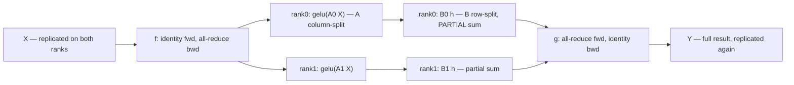

# Week 10 — Tensor & Pipeline Parallelism From Scratch

> **Phase 3, Week 2 of 4** · ~4 h/day × 5 days · Cloud: 1 node × 2 GPUs (L4/A10G, no NVLink) · Budget: ~$10–25

Prerequisite support: [Week 10 companion lesson](../../../companion-lessons/week-10.md).
Source reading: [HF Ultra-Scale Playbook — model parallelism and 5D strategy](../../../references/hf-ultrascale-playbook.md#week-10---model-parallelism-and-5d-strategy).

## Goal

Implement the two "model parallelism" families yourself, on 2 GPUs:

1. **Megatron-style tensor parallelism (TP)**: `ColumnParallelLinear` / `RowParallelLinear` with the famous *f* and *g* conjugate autograd functions, then a TP MLP block and TP attention (heads split across ranks) inside the week-05 GPT.
2. **GPipe-style pipeline parallelism (PP)**: split the model into 2 stages, implement the fill–drain microbatch schedule, and measure the pipeline **bubble** as a function of microbatch count.

The punchline (Day 4): size a model that does **not** fit on one L4 (24 GB) and show it training on two. Parallelism as necessity, not luxury.

## Why this matters

Megatron TP and pipeline scheduling are the backbone of every frontier training stack (Megatron-LM, DeepSpeed, NeMo). "Explain the f and g operators" and "derive the pipeline bubble fraction" are literal interview questions for training-infrastructure roles. This also complements NCP-AIO: you'll *feel* why TP wants NVLink (your no-NVLink node will show TP's all-reduce cost brutally) while PP tolerates slow links — the exact topology-awareness reasoning behind rail-optimized clusters and NVLink domains.

Cross-reference: your demo repo's NCCL-transports material explains *what* the wire looks like; this week explains *what the model math sends over it*.

## Background reading (before Day 1)

- Megatron-LM paper, §3 is the whole game — https://arxiv.org/abs/1909.08053
- GPipe paper (microbatching, fill–drain, bubble) — https://arxiv.org/abs/1811.06965
- PipeDream 1F1B schedule (stretch) — https://arxiv.org/abs/1806.03377
- A clear "f and g" walk-through — https://insujang.github.io/2022-08-15/megatron-lm/
- PyTorch autograd.Function docs (you'll write two) — https://docs.pytorch.org/docs/stable/notes/extending.html
- torch.distributed collectives reference — https://docs.pytorch.org/docs/stable/distributed.html
- (After you build it) PyTorch's own DTensor/TP API for comparison — https://docs.pytorch.org/docs/stable/distributed.tensor.parallel.html

### The one idea to internalize before writing code

Megatron pairs each split linear with two conjugate ops:

- **f**: identity in forward, **all-reduce in backward** (input to a column-parallel layer)
- **g**: **all-reduce in forward**, identity in backward (output of a row-parallel layer)

Column-split then row-split an MLP (`Y = B·gelu(A·X)`) and you need exactly **one** all-reduce in forward and **one** in backward per block. Same trick for attention with heads split across ranks. If you can whiteboard why, you're done reading.

**The TP MLP block — column-split then row-split; g all-reduces forward, f all-reduces backward:**



## Day-by-day plan

### Day 1 (local, CPU/gloo, free) — parallel linear layers + f/g
- Implement in `src/tp_layers.py`:
  - `_CopyToParallelRegion` (f) and `_ReduceFromParallelRegion` (g) as `torch.autograd.Function`s.
  - `ColumnParallelLinear` (weight split along output dim; optional `gather_output`).
  - `RowParallelLinear` (weight split along input dim; all-reduce of partial outputs).
- Correct weight init: initialize the FULL weight with a fixed seed on every rank, then slice your shard — this makes TP output *exactly* match the single-process baseline, which is what the tests check.
- `make test` — the provided suite spawns world_size=2 on CPU/gloo. All green before renting anything.

### Day 2 (cloud, 2 GPUs) — TP transformer
- `src/tp_model.py`: TP MLP block (column → gelu → row) and TP attention (Q,K,V column-parallel, heads/2 per rank, output proj row-parallel) wired into the week-05 GPT.
- Validate: same seed, same input → TP=2 logits vs single-GPU logits, max abs diff ≤ 1e-3 (fp32). Then a short training run: loss curve overlays the baseline.
- Count your collectives: exactly 2 all-reduces per layer per forward (1 MLP + 1 attn). Verify by counting `dist.all_reduce` calls with a wrapper — if you see more, find the redundancy.

### Day 3 (cloud, 2 GPUs) — GPipe pipeline

**The fill–drain schedule you implement — the bubble is the idle time, shrinking as microbatch count m grows:**

```
p = 2 stages, m = 4 microbatches.  Fk/Bk = fwd/bwd of microbatch k, . = idle
(cells drawn equal width; in practice backward costs ~2x forward)

 time ──────────────────────────────────────►
 stage0 | F1  F2  F3  F4  .   .   B4  B3  B2  B1
 stage1 | .   F1  F2  F3  F4  B4  B3  B2  B1  .
          └fill┘              └────drain────┘

 bubble fraction = (p-1)/(m+p-1) = 1/5 = 20% here
 raise m to 16 and it drops to 1/17 ~ 6% — that's the Day-3 plot
```

- `src/pipeline.py`: split the GPT into stage0 (embeddings + first half of blocks) / stage1 (rest + head), P2P activations between ranks (`send`/`recv` of activations forward, grads backward).
- Fill–drain schedule over m microbatches; gradient accumulation across microbatches; loss computed on the last stage, per-microbatch grads flow back.
- Measure **bubble fraction** vs m ∈ {1, 2, 4, 8, 16}: expected ≈ (p−1)/(m+p−1) with p=2 stages. Plot measured vs theory (they won't match perfectly — explain the residual: comm time, uneven stage split).
- Loss parity vs single-GPU baseline (identical global batch = sum of microbatches).

### Day 4 (cloud, 2 GPUs) — the punchline experiment

**The punchline in memory bars — what one training step must hold per GPU, and what each parallelism shards:**

```
bf16 training step, per GPU (illustrative proportions)

 1x L4     |==params==|==grads==|=======Adam m,v=======|=====activations=====|  > 22 GB -> OOM

 TP=2      |=params=|=grads=|===Adam m,v===|====activations*====|                fits
           weights, grads, optimizer sharded WITHIN every layer

 PP=2      |=params=|=grads=|===Adam m,v===|==acts (microbatched)==|             fits
           sharded BY layer: each GPU holds only its stage

 * TP still replicates some activations (LayerNorm inputs etc.) —
   the gap sequence parallelism closes; see the stretch note
```

- Configure a GPT that **OOMs on one L4** (pick d_model/layers so params+optimizer+activations > 22 GB; verify the OOM and screenshot/log it — that log is a deliverable).
- Run it with TP=2 and with PP=2. Record: peak memory per GPU (`torch.cuda.max_memory_allocated`), tokens/sec, step time.
- Fill the memory/throughput table in the results section. Expected shape of the answer on PCIe: TP hurts more on throughput (all-reduce in the critical path every layer), PP wastes some compute to bubbles but communicates only at the stage boundary.
- Shut the node down; log cost.

### Day 5 (local, free) — the parallelism taxonomy writeup
- Write `PARALLELISM.md`: DP vs TP vs PP vs FSDP — what each shards (data / weights-within-layer / layers / weights+grads+optimizer), what each communicates and when, what link speed each demands, when each wins — **with your measured numbers from weeks 9–10 as evidence**.
- Publish (Friday rule).

## Deliverables

| File | Status you produce |
|---|---|
| `src/tp_layers.py` | implemented, tests pass |
| `src/tp_model.py` | implemented, logits parity shown |
| `src/pipeline.py` | implemented, bubble plot produced |
| `src/run_experiments.py` | implemented, emits JSON for all tables |
| `tests/test_tp_layers.py` | provided COMPLETE — CPU/gloo, world_size=2 |
| `PARALLELISM.md` | written Day 5 |

## Acceptance criteria

- [ ] `make test` green locally (no GPU).
- [ ] TP=2 logits match single-GPU baseline ≤ 1e-3 max abs diff (fp32), same seed.
- [ ] PP=2 loss curve matches single-GPU baseline run (overlay committed).
- [ ] Bubble-fraction plot: measured vs theoretical (p−1)/(m+p−1), with residual explained.
- [ ] Memory table proves the Day-4 model OOMs on 1 GPU (log committed) but trains on 2 under both TP and PP, with per-GPU peak memory and tokens/sec.
- [ ] Exactly-2-all-reduces-per-layer verification documented.

### Results table (fill in Day 4)

| Config | Fits? | Peak mem/GPU | Tokens/sec | Step time | Comm pattern |
|---|---|---|---|---|---|
| 1× L4, no parallelism | OOM (log) | — | — | — | — |
| TP=2 | | | | | all-reduce ×2/layer, fwd+bwd |
| PP=2 (m=8) | | | | | P2P at stage boundary |

## Stretch goals

- **1F1B schedule** (PipeDream-flush): interleave forward/backward per microbatch to cut peak activation memory; compare peak memory vs fill–drain at m=8.
- Async P2P (`isend`/`irecv`) overlap of stage communication with compute.
- Half-page note on **sequence parallelism** (Korthikanti et al., https://arxiv.org/abs/2205.05198): which activations TP leaves un-sharded and how SP fixes it.

## Interview talking points

- Whiteboard f/g: why column-then-row needs exactly one fwd + one bwd all-reduce; why f's backward is an all-reduce (the input was *replicated*, so its grads are *partial* on each rank).
- Bubble math from your own plot: "at p=2, m=8 the theoretical bubble is 1/9 ≈ 11%; I measured X% and the gap is activation-transfer time."
- Topology awareness: "on PCIe, my TP=2 lost N% throughput vs PP=2 for the same model — that's why TP stays inside an NVLink domain and PP/DP cross nodes."
- Where FSDP sits: shards like TP saves memory, communicates like DP (all-gather params, reduce-scatter grads) — and when it beats both.

## Cost estimate

~8–12 h of 2×L4 @ ~$1.20/h ≈ **$10–25**. Same discipline as week 09: everything debuggable on CPU/gloo runs locally first; cloud time is for validation and measurement only.

## Definition of done

- [ ] All acceptance boxes checked
- [ ] Plots + JSON committed, README results table filled with real numbers
- [ ] `PARALLELISM.md` written with measured evidence
- [ ] Cost log updated; published Friday
