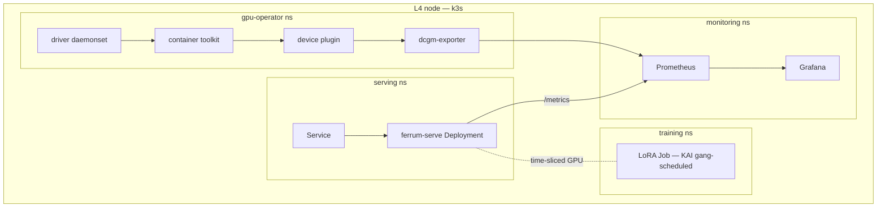

# Week 11 — The Full NVIDIA K8s Serving Stack on One Node

> **Phase 3, Week 3 of 4** · ~4 h/day × 5 days · Cloud: 1× L4 node (~$0.70/h) · Budget: ~$6

Prerequisite support: [Week 11 companion lesson](../../../companion-lessons/week-11.md).
Source reading: [HF Ultra-Scale Playbook — benchmarking, observability, and cluster reality](../../../references/hf-ultrascale-playbook.md#week-11---benchmarking-observability-and-cluster-reality).

## Goal

Stand up the production NVIDIA Kubernetes serving stack on a single rented GPU node — end to end, from bare Ubuntu to Grafana dashboard — and prove you can **recreate all of it from this repo in under 30 minutes**:

- **k3s** (single-node Kubernetes)
- **NVIDIA GPU Operator** (driver, container toolkit, device plugin, DCGM exporter — as pods)
- **Your week-08 ferrum-serve server** in a container, behind a Deployment + Service with probes and GPU limits (fallback: stock vLLM if week-08 isn't serving-ready)
- **kube-prometheus-stack + dcgm-exporter metrics**, plus your OWN app metrics (TTFT, queue depth) on one mixed Grafana dashboard
- **KAI Scheduler** running a gang-scheduled batch fine-tune Job that SHARES the GPU with the serving deployment via time-slicing — the serve-and-train-on-one-GPU story

This is your NCP-AIO study made concrete: GPU Operator, scheduling, monitoring, and workload management are exam domains — here you operate all of them for real.

Cross-reference: your separate demo repo already covers KAI gang scheduling, MIG/time-slicing/MPS trade-offs, and DRA ResourceClaims in depth. Link to it from your writeup; this week's KAI section deliberately reuses those patterns rather than re-deriving them.

## Why this matters

"Deployed a model" is table stakes. "Ran GPU Operator, wired DCGM metrics into a mixed GPU+app dashboard, and gang-scheduled a training job to share a GPU with a latency-sensitive server via KAI + time-slicing, and can rebuild it from git in 30 minutes" is an AI-infrastructure engineer's sentence. It is also, nearly verbatim, the NCP-AIO job-task analysis.

## Background reading (before Day 1)

- NVIDIA GPU Operator docs — https://docs.nvidia.com/datacenter/cloud-native/gpu-operator/latest/
- GPU Operator time-slicing docs — https://docs.nvidia.com/datacenter/cloud-native/gpu-operator/latest/gpu-sharing.html
- dcgm-exporter — https://github.com/NVIDIA/dcgm-exporter (metric reference: `DCGM_FI_DEV_GPU_UTIL`, `DCGM_FI_DEV_FB_USED`, `DCGM_FI_PROF_*`)
- KAI Scheduler — https://github.com/NVIDIA/KAI-Scheduler (queues, gang scheduling, GPU sharing)
- kube-prometheus-stack chart — https://github.com/prometheus-community/helm-charts/tree/main/charts/kube-prometheus-stack
- k3s docs — https://docs.k3s.io/
- CDI (Container Device Interface) primer — https://github.com/cncf-tags/container-device-interface

## Day-by-day plan

### Day 1 — cluster + GPU Operator
- Rent the L4 node (plain Ubuntu 22.04/24.04, NO pre-installed driver — let the Operator do it; that's the lesson).
- `scripts/00-k3s-install.sh` then `scripts/01-gpu-operator.sh` (both COMPLETE — read them before running; you must be able to explain every flag).
- Verify: `kubectl get pods -n gpu-operator` all Running/Completed; run the CUDA vectorAdd test pod; `kubectl describe node | grep nvidia.com/gpu`.
- Understand and write down: what `runtimeClassName: nvidia` does, how the toolkit configures containerd, what CDI changes vs the legacy hook. (k3s note: the Operator must be pointed at k3s's containerd socket — the install script does this; find the line.)

### Day 2 — containerize + deploy your server
- Finish the `Dockerfile` (skeleton provided — the layer ordering/caching decisions are TODOs, that's the learning).
- Fill the TODO sections in `k8s/deployment.yaml`: GPU resource limits, `runtimeClassName`, liveness/readiness probes (readiness must gate on model-loaded, not just TCP), resource requests.
- `make deploy-app`; port-forward; hit `/generate`; kill the pod and watch it self-heal.

### Day 3 — observability
- `make deploy-monitoring` (kube-prometheus-stack with `k8s/monitoring-values.yaml`; values file provided with TODO sections for the DCGM scrape config).
- Instrument your server with `prometheus-client`: **TTFT histogram**, **queue depth gauge**, tokens/sec counter; add a `/metrics` endpoint and a ServiceMonitor.
- Build ONE Grafana dashboard mixing DCGM panels (GPU util, FB memory, SM occupancy if `DCGM_FI_PROF_SM_ACTIVE` is available on L4) with app panels (TTFT p50/p95, queue depth). Export JSON to `k8s/grafana-dashboard.json`. The PromQL for the app panels is a TODO in the values file — writing those queries is the learning.

### Day 4 — KAI + GPU sharing
- Install KAI Scheduler (helm command in `scripts/01-gpu-operator.sh`, section 3); create the `default`/`train`/`serve` queue hierarchy (`k8s/kai/queue.yaml`).
- Apply time-slicing config (`k8s/timeslicing-config.yaml`) so the single L4 advertises multiple `nvidia.com/gpu` replicas.
- Fill the TODOs in `k8s/kai/batch-job.yaml` (scheduler name, queue label, gang-scheduling annotations) and run a small fine-tune Job (your week-06 LoRA script is ideal) alongside the serving deployment.
- Measure and DOCUMENT the interference: TTFT p95 with and without the training job running. Time-slicing gives no isolation — show it honestly, then write three sentences on when you'd reach for MIG or MPS instead (link your demo repo's MIG/time-slicing/MPS comparison).

### Day 5 — the real acceptance test + writeup
- **Teardown & recreate**: `make teardown` (or delete the whole node), then from a clean node: `make everything`. Stopwatch it. ≤30 min or find and fix what's manual.
- Writeup: mermaid architecture diagram in this README, dashboard screenshot committed, interference numbers, "what broke and how I debugged it" section (the debugging stories are the interview gold).
- Kill the node. Log cost.

## Deliverables

- `k8s/` manifests (see tree) with your TODOs filled
- `Dockerfile` (multi-stage, cache-friendly)
- `k8s/grafana-dashboard.json` (exported from Grafana)
- Dashboard screenshot in `docs/` referenced here
- Interference measurement table (below)
- Mermaid architecture diagram (below, replace the placeholder)

## Acceptance criteria

- [ ] `kubectl delete` everything (or fresh node) → `make everything` → serving + monitoring + KAI job all healthy in **≤ 30 minutes**, timed and logged.
- [ ] Dashboard screenshot in README showing GPU AND app metrics on one dashboard.
- [ ] Both workloads run on the one GPU simultaneously; interference table filled with real TTFT numbers.
- [ ] You can explain (written in this README): runtimeClassName, why the Operator owns the driver, what dcgm-exporter scrapes, what gang scheduling prevents.

### Interference table (fill in Day 4)

| Scenario | TTFT p50 | TTFT p95 | GPU util | Notes |
|---|---|---|---|---|
| Serving alone | | | | |
| Serving + LoRA Job (time-sliced) | | | | |

## Stretch goals

- **HPA on queue depth**: expose the queue-depth gauge through prometheus-adapter as a custom metric and drive a HorizontalPodAutoscaler (on a single node it will just demonstrate the mechanism — say so honestly).
- Swap your server for **NVIDIA NIM** and compare deployment experience + TTFT.
- DRA ResourceClaim instead of device-plugin `nvidia.com/gpu` limits (bridge to your demo repo's DRA material).

## Interview talking points

- The GPU Operator pod chain: driver → toolkit → device plugin → DCGM, and what breaks when each is missing (you saw the intermediate states on Day 1).
- Time-slicing vs MPS vs MIG: no isolation / memory-shared concurrency / hardware isolation — with YOUR interference numbers as evidence.
- Why gang scheduling matters even for a 1-pod job (partial-allocation deadlock in multi-pod training; KAI queues give quota + fairness).
- "My whole stack recreates from git in N minutes" — GitOps instinct, stated with a stopwatch number.

## Cost estimate

~2 sessions × 4 h × $0.70/h ≈ **$6**. The node is only needed Days 1–5 while actively working; everything is in git, so tear down between sessions — that discipline IS the acceptance test.

## Definition of done

- [ ] All acceptance boxes checked
- [ ] `make everything` / `make teardown` both work from a clean node
- [ ] Dashboard JSON + screenshot committed
- [ ] Interference numbers + MIG/MPS/time-slicing paragraph written (with demo-repo cross-link)
- [ ] Cost log updated; published Friday
