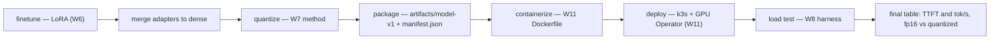

# Week 12 — Capstone: Fine-tune → Quantize → Serve, and Portfolio Polish

> **Phase 3, Week 4 of 4** · ~4 h/day, **Friday light — NCP-AIO exam week** · Mostly local; ~1 short cloud session Day 2

Prerequisite support: [Week 12 companion lesson](../../../companion-lessons/week-12.md).
Source reading: [HF Ultra-Scale Playbook — capstone defense and scale-up story](../../../references/hf-ultrascale-playbook.md#week-12---capstone-defense-and-scale-up-story).

## Goal

Stitch twelve weeks into one story a reviewer can run:

**LoRA fine-tune (W6) → merge → quantize (W7) → serve with ferrum-serve + fused kernels (W4/W7) on the K8s stack (W11) → load-tested end-to-end numbers (W8)** — as ONE command: `make pipeline`.

Then polish the repo so a 5-minute reviewer (an NVIDIA hiring manager skimming before an interview) sees exactly what you built, what you measured, and how honestly you reported it.

**The whole capstone as one arrow-chain — `make pipeline` covers the first four boxes, Day 2 the rest:**

## Why this matters

Individual weeks prove skills; the capstone proves you can **integrate**. "I have a one-command pipeline that fine-tunes, quantizes, deploys to K8s, and load-tests, with committed numbers at each stage" is a systems-engineering claim almost no portfolio repo can make. It also forces you to find every place where week N's output doesn't actually plug into week N+1's input — that debugging is the last 20% that separates demos from engineering.

## Day-by-day plan

### Day 1 (local) — the pipeline
- Build `pipeline/Makefile`: `finetune → merge → quantize → package` stages (see `pipeline/steps.md` for the per-stage contracts).
- Each stage: idempotent, resumable (skips if its artifact exists and inputs unchanged), writes a `manifest.json` (git SHA, config, input/output hashes, metrics).
- Small on purpose: the week-05/06 model at a size that fine-tunes on the RTX 5090 in under an hour. The pipeline is the deliverable, not the model quality.
- Acceptance for the day: `make -C pipeline pipeline` from clean produces `artifacts/model-v1/` with weights + tokenizer + manifest.

### Day 2 (cloud, short session ~3 h) — deploy + measure
- Spin up the W11 stack (`make everything` from week-11 — you timed it, it's ≤30 min).
- Deploy the Day-1 artifact; run the week-08 load-test harness against it.
- Record the FINAL end-to-end table: TTFT p50/p95, tokens/sec/user, peak GPU memory, requests/sec at saturation — for (a) the fp16 merged model and (b) the quantized artifact. That quantization delta measured *through the whole serving stack* is your headline number.
- Grafana screenshot during the load test. Teardown. Log cost.

### Day 3 (local) — repo polish
- Every week's README: results table filled with real numbers, no "TODO" left in published text.
- Root README: the **5-minute portfolio tour** — what this repo is, the phase map, three headline numbers, how to reproduce, honest-limitations section.
- Architecture diagrams (mermaid) where missing; record a demo GIF or asciinema of `make pipeline` + a curl against the served model.

### Day 4 (local) — the report + the post
- Write `REPORT.md` from `REPORT-template.md`: what I built, the numbers, what didn't work (be specific — failed approaches are credibility), and "what I'd do with 8×H100".
- Draft the LinkedIn/blog post (300–500 words, one plot, link to repo).

### Day 5 (LIGHT — exam week) — ship
- CI green end to end; tag `v1.0`; rehearse the 5-minute repo tour out loud once.
- Then close the laptop and go pass NCP-AIO.

## Deliverables

- `pipeline/Makefile` + `pipeline/steps.md` — the one-command pipeline
- `REPORT.md` (from the provided `REPORT-template.md`)
- Root README portfolio tour + demo GIF
- Final end-to-end numbers table (below)
- `v1.0` tag, CI green

### Final numbers (fill in Day 2)

| Artifact | TTFT p50 | TTFT p95 | tok/s/user @ 8 users | Peak GPU mem | Notes |
|---|---|---|---|---|---|
| fp16 merged | | | | | |
| quantized (W7 method) | | | | | |

## Acceptance criteria

- [ ] `make -C pipeline pipeline` runs clean-to-artifact on the RTX 5090, one command.
- [ ] The artifact deploys on the W11 stack and survives the W8 load test; numbers committed.
- [ ] `REPORT.md` complete — including the failures section and the 8×H100 section.
- [ ] Every week's README (weeks 1–12) has real measured numbers in its results table.
- [ ] Tag `v1.0`; CI green; demo GIF in root README.

## How to present this repo in an NVIDIA interview

**The 5-minute tour script (rehearse it):**

1. *(30 s)* Framing: "12 weeks, first-principles GPU engineering — every abstraction I use, I first built naive, measured, then compared against the production version. Honest numbers throughout, including the losses."
2. *(60 s)* One kernel story (W3/W4): naive → optimized progression, the roofline plot, the number you're proud of.
3. *(60 s)* One inference story (W8): continuous batching / KV-cache — show the throughput-vs-naive plot.
4. *(90 s)* The distributed story (W9–10): "I implemented ring all-reduce and Megatron TP myself; here's my bubble-fraction plot matching (p−1)/(m+p−1); here's why TP needs NVLink, measured on a PCIe box."
5. *(60 s)* The ops story (W11–12): the pipeline command, the Grafana dashboard, serve-and-train on one GPU with KAI, recreate-from-git in under 30 min.
6. *(30 s)* Close: "REPORT.md lists what didn't work and what I'd do with 8×H100."

**Which weeks answer which classic interview questions:**

| Interview question | Week |
|---|---|
| "Explain memory coalescing / why is this kernel slow?" | W3–W4 |
| "How does flash attention work?" | W4/W7 |
| "How would you speed up LLM inference?" (KV cache, batching, quantization) | W7–W8 |
| "What does DDP do under the hood?" / "Explain all-reduce" | W9 |
| "Difference between tensor and pipeline parallelism? When each?" | W10 |
| "How do you share GPUs between teams?" (MIG/time-slicing/MPS, scheduling) | W11 + demo repo |
| "How do you monitor GPU infrastructure?" | W11 |
| "Walk me through deploying a model to production" | W11–W12 |
| "Tell me about a hard bug" | pick from any week's "what broke" notes |

**Cross-links to carry into the interview:** the NCP-AIO cert (ops breadth), the demo repo (KAI gang scheduling, Kubeflow TrainJob v2, MIG/time-slicing/MPS, NCCL transports, DRA ResourceClaims — the "I also operate this at the platform layer" evidence).

## Definition of done

- [ ] All acceptance boxes checked
- [ ] Tour script rehearsed once, out loud, timed under 6 minutes
- [ ] Blog/LinkedIn draft saved (publish after the exam)
- [ ] Phase-3 total cost tallied in the root cost log (target: ≤ $50)
