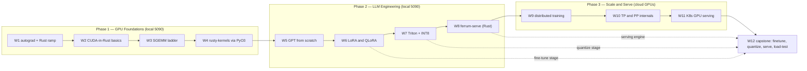

# 12-Week Roadmap — 4 h/day × 5 days/week (~240 h)

This is the authoritative curriculum. Each week = one shippable project. The weekly
rhythm is fixed:

- **Mon–Thu (4 h/day)**: build. Each week's README has the day-by-day breakdown.
- **Friday (4 h)**: benchmark → document → publish. Run the `bench/` harness, drop the
  numbers and plots into the project README, update the index table in the root README,
  push. **A week isn't done until the results table is public.**
- Weeks 4, 8, 12 have a lighter Friday: those are also certification exam weeks
  (NCA-AIIO / NCP-GENL / NCP-AIO in the companion `nvidia-cert-track` repo).

Before Monday, clear the matching page in [`../companion-lessons`](../companion-lessons/README.md).
Those pages hold the math, Rust/Python/PyTorch, CUDA, Triton, distributed-training, and
Kubernetes prerequisites that support the week's project.

The project contract every week must satisfy:

1. **Built from first principles** — the point is understanding, not gluing libraries.
2. **Validated against a reference** — tests compare outputs to PyTorch/cuBLAS/HF/vLLM.
3. **Benchmarked honestly** — measured speedup or %-of-reference, with hardware, sizes,
   and methodology stated; failures and dead-ends documented in the README ("what didn't
   work" sections are interview gold).
4. **Reproducible** — one command to rerun tests, one to rerun benchmarks.

**The 12 weeks at a glance — three phases, each capped by a capstone week, converging on week 12:**

---

## Phase 1 — GPU Foundations (weeks 1–4)

Goal: go from "I use PyTorch" to "I know what PyTorch does, and I can write and profile
the GPU code underneath it — in Rust."

**The language thesis for this repo**: Python where the ecosystem is (model internals,
fine-tuning, distributed training), Rust where performance and reliability matter
(kernels, the serving layer). Same bet NVIDIA made writing Dynamo's core in Rust.
No prior Rust assumed — week 1 carries the ramp.

### Week 01 — Autograd from scratch (Python) + Rust ramp
Days 1–3: reverse-mode autodiff engine (scalar, then NumPy-tensor based), `nn`-style
layers, train an MLP on MNIST, gradients verified against PyTorch. Days 4–5: Rust
bootcamp — rustlings + The Rust Book core chapters (ownership, borrowing, traits,
error handling, FFI basics), install the CUDA-Rust toolchain, run a first cudarc
device-query + SAXPY-via-PTX. Skills: backprop mechanics + enough Rust to be dangerous.

### Week 02 — CUDA-in-Rust basics + benchmark suite
First kernels under WSL2, written in Rust: vector add, SAXPY, reductions (naive →
shared memory → warp shuffle), memory-coalescing experiments. Host side on **cudarc**
(driver API, streams, memcpy); kernel side via **Rust-CUDA / rustc_codegen_nvvm**
(kernels in Rust) with inline-PTX/CUDA-C escape hatches documented when the toolchain
bites. Build the reusable timing/benchmark harness (CUDA events, JSON output, plot
script) used for the rest of the repo. First contact with Nsight Systems/Compute —
profilers don't care what language emitted the PTX. Skills: CUDA execution model,
memory hierarchy, RAII for device memory, profiling.

### Week 03 — The SGEMM optimization ladder (Rust)
The classic, in Rust: naive matmul → global-memory coalescing → shared-memory tiling →
register blocking / 2-D thread tiling → vectorized loads → (stretch) Tensor Core
WMMA/CubeCL version. Each rung benchmarked against **cuBLAS** (via cudarc's cublas
bindings); final chart = % of cuBLAS across sizes + roofline analysis. Skills: the
single most interview-relevant GPU exercise that exists — with a safety story on top.

### Week 04 — Rust kernels → PyTorch via PyO3 (capstone)
Package fused softmax and fused LayerNorm kernels (written in Rust) as a Python wheel:
PyO3 + maturin, zero-copy tensor exchange with PyTorch via DLPack/`data_ptr`, wrapped
in `autograd.Function` with tests vs `torch.nn` and benchmarks vs eager and
`torch.compile`. Ships as the `rusty-kernels` mini-library with CI. Skills: the full
path from Rust kernel to `pip install` — the hybrid thesis made concrete.

---

## Phase 2 — LLM Engineering (weeks 5–8)

Goal: own the LLM stack — model, fine-tuning, kernels, and serving — at the
implementation level.

### Week 05 — GPT from scratch
Decoder-only transformer in pure PyTorch (attention, RoPE, KV cache — no
`nn.Transformer`). Train a 10–50 M-param model on TinyStories on the 5090 with mixed
precision; implement sampling (temperature/top-k/top-p) and KV-cache generation; profile
where the time goes. Skills: transformer internals, training loops, `torch.profiler`.

### Week 06 — LoRA from scratch
Implement LoRA by hand (the two-matrix adapter, init, scaling, merge), apply it to a
real 1–3 B model (Llama-3.2-1B / Qwen2.5-1.5B), then QLoRA via 4-bit base weights.
Compare against HF PEFT for correctness, and full fine-tune vs LoRA on memory/quality.
Evaluate with lm-eval-harness. Skills: PEFT internals, quantized training, evaluation.

### Week 07 — Triton kernels & quantization
OpenAI Triton: fused softmax → RMSNorm → single-head FlashAttention forward pass,
benchmarked against PyTorch SDPA. Then weight-only INT8/INT4 quantization: pack weights,
write the dequant-matmul kernel, measure perplexity impact vs speed/memory win. Skills:
Triton programming model, why FlashAttention works, quantization trade-offs.

### Week 08 — ferrum-serve: Rust inference engine (capstone)
A Rust inference server implementing the ideas that make vLLM fast, on the stack
NVIDIA chose for Dynamo: **Candle** for model execution (Qwen2.5-1.5B / Llama-3.2-1B),
your own continuous (in-flight) batching scheduler, paged KV-cache block manager, and
an **axum** HTTP front-end with SSE streaming and an OpenAI-compatible
`/v1/completions` route. Load-test it; report TTFT / ITL / throughput curves vs batch
size, benchmarked side-by-side with real vLLM on the same model and GPU — plus the
Rust-only wins: binary size, image size, cold-start time. Skills: the entire modern
inference-serving playbook, in the language the serving world is moving toward.

---

## Phase 3 — Scale & Serve (weeks 9–12)

Goal: multi-GPU and production. Cloud weeks: rent 1 node × 2 GPUs (L4/A10G),
~$0.60–1.20/h × ~10–15 h/week. Companion territory to NCP-AIO.

### Week 09 — Distributed training internals (cloud: 2 GPUs)
Hand-roll data parallelism: manual gradient all-reduce (implement ring all-reduce
yourself over `torch.distributed` point-to-point first), then compare to real DDP and
FSDP2. Run nccl-tests; read NCCL_DEBUG logs to identify transports (P2P/SHM/NET).
Skills: what DDP actually does, NCCL collectives, scaling-efficiency measurement.

### Week 10 — Tensor & pipeline parallelism internals (cloud: 2 GPUs)
Implement Megatron-style column/row-parallel linear layers (with the f/g collective
functions) and a GPipe-style pipeline schedule with microbatching, from scratch on
2 GPUs. Validate outputs vs single-GPU baseline; measure bubble overhead. Skills:
the parallelism taxonomy everyone talks about, actually implemented.

### Week 11 — Kubernetes GPU serving (cloud: 1–2 GPU node)
Containerize the week-08 Rust engine — multi-stage build to a distroless image a
fraction of a PyTorch image's size, with millisecond cold-start (measure and report
both; that's the Rust-in-production punchline) — and deploy on k3s with GPU Operator:
Helm chart, DCGM-exporter → Prometheus → Grafana dashboard (GPU util, TTFT, queue
depth), HPA on a custom metric, plus a KAI-scheduled batch fine-tune job sharing the
node — the serve-and-train-on-one-cluster story. Skills: the full NVIDIA K8s stack in
one demo; bridges directly to the NCP-AIO cert and my scheduling demo repo.

### Week 12 — Capstone: train → optimize → serve
The end-to-end story stitched from the pieces: LoRA fine-tune in PyTorch (W6) →
quantize (W7) → serve with ferrum-serve (W8) on K8s with monitoring (W11), plus repo
polish: every README's results table complete, architecture diagrams, demo
GIFs/asciinema, CI badges green, and a root-README "portfolio tour" written for a
5-minute reviewer. Light exam-week Friday.

---

## Cross-references to the study track

| This repo | Certifies as |
|-----------|--------------|
| W2–W4 profiling, DCGM, GPU arch | NCA-AIIO domains 1–2 |
| W5–W8 everything | NCP-GENL (optimization 17%, GPU accel 14%, fine-tuning 13%, deployment 9%…) |
| W9–W11 NCCL, K8s, GPU Operator, scheduling | NCP-AIO administration & workload domains |
