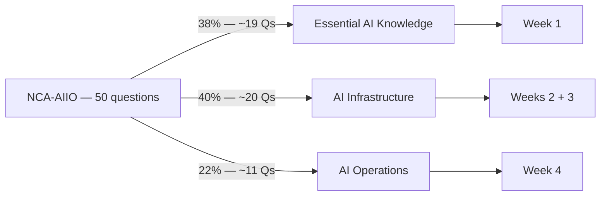

# NCA-AIIO — NVIDIA-Certified Associate: AI Infrastructure and Operations

> **Details verified July 2026 against the official exam page — re-check before booking.**

## Exam at a glance

| Item | Detail |
|---|---|
| Certification | NVIDIA-Certified Associate: AI Infrastructure and Operations (NCA-AIIO) |
| Level | Associate |
| Price | $125 USD |
| Duration | 1 hour |
| Questions | 50 multiple-choice |
| Validity | 2 years |
| Delivery | Online, proctored |
| Language | English |
| Official prerequisite | Basic understanding of data center infrastructure |

**Who it's for:** IT professionals, ops engineers, and pre-sales/solutions people who need a working understanding of NVIDIA's AI stack — from GPUs and DGX systems through networking, orchestration, and monitoring. For a Developer Evangelist / pre-sales role on the Kubernetes-AI stack, this is the foundation cert: it covers the "why" behind GPU Operator, MIG, DCGM, InfiniBand, and the rest of the platform you'll demo daily.

## Official domains and weights

**How the 50 questions split across domains — and where each is covered in this folder:**



### 1. Essential AI Knowledge — 38% (~19 of 50 questions)
- NVIDIA software stack: CUDA, cuDNN, TensorRT, NGC, NVIDIA AI Enterprise
- Training vs inference — workload characteristics and infrastructure implications
- AI / ML / DL concepts and terminology
- GPU vs CPU architecture — why GPUs win at parallel workloads
- Common AI use cases across industries
- The AI development lifecycle (data prep → training → validation → deployment → monitoring)

### 2. AI Infrastructure — 40% (~20 of 50 questions)
- Hardware requirements for AI workloads
- GPU server architectures: DGX and HGX, NVLink and NVSwitch
- Multi-GPU and multi-node scaling
- Power and cooling considerations (air vs liquid, rack density)
- On-prem vs cloud vs hybrid deployment trade-offs
- Clustering concepts (DGX SuperPOD, BasePOD)
- Networking: InfiniBand vs Ethernet/RoCE, GPUDirect RDMA
- DPUs: NVIDIA BlueField, offloading infrastructure services

### 3. AI Operations — 22% (~11 of 50 questions)
- Data center management for AI
- Cluster orchestration: Kubernetes and Slurm basics
- GPU monitoring: DCGM, nvidia-smi, key metrics (utilization, memory, temperature, power, ECC errors)
- MIG (Multi-Instance GPU) basics
- Virtualization: vGPU considerations

## Official links

- Exam page: https://www.nvidia.com/en-us/learn/certification/ai-infrastructure-operations-associate/
- Certification portal (booking, results, badge): https://nvidia.interplay.iamable.io/ — reachable from the "Take the exam" link on the exam page
- NVIDIA certification hub: https://www.nvidia.com/en-us/learn/certification/
- NVIDIA Training / DLI catalog: https://www.nvidia.com/en-us/training/

## Recommended prep (mostly free)

1. **AI Infrastructure and Operations Fundamentals** — free NVIDIA DLI self-paced course; the single closest match to the exam blueprint. Do this across weeks 1–3.
2. **NGC catalog** (https://catalog.ngc.nvidia.com) — browse containers, models, Helm charts so NGC questions are concrete, not abstract.
3. **NVIDIA docs**: DGX platform docs, DCGM user guide, MIG user guide, GPU Operator docs, NVIDIA networking (InfiniBand/Spectrum-X) overviews.
4. **NVIDIA Technical Blog** (developer.nvidia.com/blog) — posts on NVLink/NVSwitch, GPUDirect RDMA, BlueField DPUs, Tensor Cores, FP8.
5. This folder: weekly plans, skeleton notes, self-checks, 80+ flashcards, and a 50-question mock exam.

## Booking checklist

- [ ] Create/verify your NVIDIA certification portal account (use the email you want on the certificate)
- [ ] Book the exam via the portal — pick an end-of-week-4 slot (target: week of 2026-08-03); pay $125
- [ ] Government-issued photo ID ready — name must match your portal account exactly
- [ ] Online proctoring requirements: reliable internet, webcam + microphone, quiet private room, clean desk (no papers, second monitors unplugged/covered)
- [ ] Run the proctoring provider's system/compatibility check on the actual machine you'll use, several days before
- [ ] Re-check the official exam page for any changes to format, price, or policies before you book
- [ ] Day of exam: arrive (log in) 15 minutes early; have ID in hand; close all other applications

## How this folder is organized

```
month-1-nca-aiio/
├── syllabus.md          ← you are here
├── flashcards.csv       ← 80+ Anki-importable cards, all domains
├── mock-exam.md         ← 50 scenario MCQs, answer key at bottom
├── week-1/              ← Essential AI Knowledge (38%)
├── week-2/              ← AI Infrastructure part 1: GPUs, DGX/HGX, NVLink (40%)
├── week-3/              ← AI Infrastructure part 2: networking, DPUs, datacenter (40%)
└── week-4/              ← AI Operations (22%) + full review + mock + exam
    (each week: plan.md, notes.md, self-check.md)
```

Study rhythm: 5 days/week, ~2 h/day. Fridays end with the week's exit-criteria checklist and self-check questions. Do flashcards daily from week 2 onward (10–15 min). Take the mock exam closed-book on week 4 day 3.
