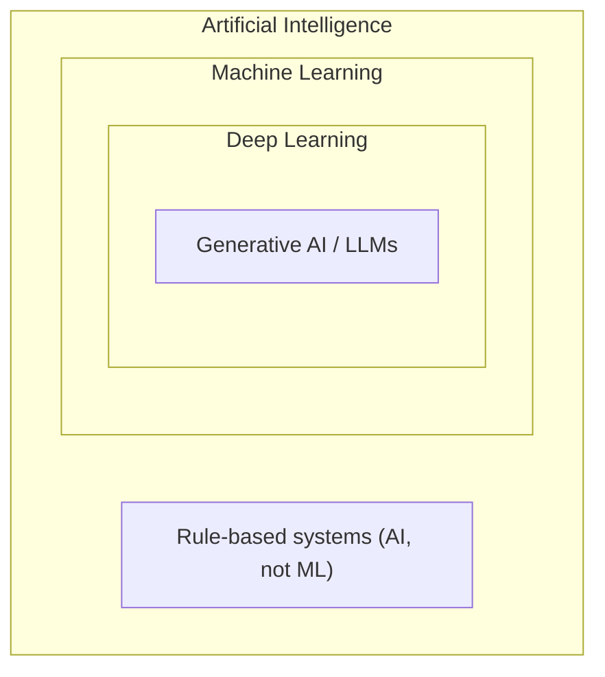
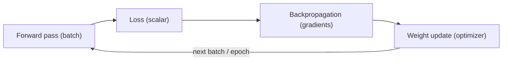

# Week 1 · Day 1 — AI / ML / DL fundamentals + common use cases

[← Master Plan](../../../MASTER-PLAN.md) · [Week 1 overview](plan.md) · [next day →](day-2.md)

## Study block (2 h)

Start by enrolling in the free NVIDIA DLI course **"AI Infrastructure and Operations Fundamentals"** (nvidia.com/en-us/training/) and completing the intro + "Introduction to AI" modules (~30 min). It mirrors the NCA-AIIO blueprint closely — treat it as your primary text for the week. Then work through the lesson below.

### The hierarchy: AI ⊃ ML ⊃ DL

**Artificial intelligence** is the umbrella: any technique that makes machines mimic human-like capability — including old-school rule-based expert systems that involve no learning at all. **Machine learning** is the subset where behavior is *learned from data* rather than hand-coded: you feed examples, an algorithm fits parameters, and the fitted model generalizes to unseen inputs. **Deep learning** is the subset of ML that uses *deep neural networks* — many stacked layers of learned transformations — and is the reason GPUs matter: DL's core math is dense matrix multiplication at enormous scale. Exam trap: "all AI is ML" is false (chess engines with hand-written evaluation are AI, not ML); "all DL is ML" is true.

**The nesting — each ring is a strict subset of the one around it:**

### The three learning paradigms

- **Supervised learning** — training data comes with labels; the model learns input → label. Classification (spam/not-spam, tumor/no-tumor) and regression (price prediction) live here. Most enterprise AI is supervised.
- **Unsupervised learning** — no labels; the model finds structure. Clustering (customer segmentation), dimensionality reduction, anomaly detection (fraud without labeled fraud cases). Exam tell: if the question says "unlabeled data," the answer is unsupervised.
- **Reinforcement learning** — an *agent* takes actions in an *environment* and learns from *reward* signals over time. Robotics, game-playing, recommendation tuning. Tell: the words agent/action/reward/environment.

Interesting middle case the exam likes: **self-supervised learning** — labels are generated from the data itself (predict the next word). This is how LLMs are pretrained, which is why they can consume internet-scale unlabeled text.

### What a neural network is, and what "training" means

A neural network is layers of units, each computing a weighted sum of its inputs plus a bias, passed through a nonlinear **activation function** (ReLU, tanh, softmax at the output). The **weights** are the learnable parameters — "the model" is literally these numbers.

Training is a loop you must be able to narrate cold (you're also *building* it in your lab project this week):

1. **Forward pass** — push a **batch** of examples through the network to get predictions.
2. **Loss** — a single scalar measuring how wrong the predictions are (cross-entropy for classification, MSE for regression).
3. **Backpropagation** — apply the chain rule backward through the network to compute the **gradient** of the loss with respect to every weight: "which direction should each weight move to reduce the loss?"
4. **Gradient descent** — nudge every weight a small step (the **learning rate**) against its gradient. Optimizers like SGD-with-momentum and Adam are refinements of this step.
5. Repeat over the whole dataset; one full pass is an **epoch**. Training = many epochs of many batches.

**One training step — the loop you narrate cold:**

Infrastructure consequence (this is why the exam cares): backprop requires keeping **activations** from the forward pass in memory until the backward pass consumes them, plus gradients and optimizer states. That's why training needs far more GPU memory than inference — a fact you'll quantify on Day 2.

### Generative AI and LLMs, exam depth

- **Transformer**: the dominant DL architecture since 2017; its core is **attention**, which lets every token weigh its relevance to every other token in parallel — perfectly suited to GPU parallelism (unlike sequential RNNs it replaced).
- **Foundation model**: a very large model pretrained on broad data, adaptable to many downstream tasks. LLMs are foundation models for text.
- Three ways to adapt one, one sentence each: **prompting** — steer behavior via input text, no weight changes, zero training cost; **fine-tuning** — continue training on domain data, weights change, needs training infrastructure; **RAG** (retrieval-augmented generation) — retrieve relevant documents at query time and stuff them into the prompt, so the model answers from fresh/private data without retraining. Customer-conversation angle: RAG when knowledge changes daily or must stay in a database; fine-tuning when you need style/format/task behavior baked in; prompting first because it's free.

### Use cases by industry (15 min — skim NVIDIA's industry pages)

The exam asks "which is an example of…" questions. Anchor one example per vertical: **healthcare** — medical imaging (MONAI), drug discovery (BioNeMo); **finance** — fraud detection (anomaly detection on transactions); **retail** — recommender systems (NVIDIA Merlin heritage), demand forecasting; **automotive** — autonomous vehicles (NVIDIA DRIVE); **telco/enterprise** — conversational AI, chatbots, virtual assistants (Riva for speech, NIM for LLM serving); **manufacturing** — visual inspection, digital twins (Omniverse).

Fill in `notes.md` section 1 as you go — especially the hierarchy diagram and the training-loop steps in your own words.

### Read next

- NVIDIA DLI, *AI Infrastructure and Operations Fundamentals* — intro + "Introduction to AI" modules (the assigned 30 min above).
- NVIDIA glossary pages: "What is deep learning?" and "What are foundation models?" (nvidia.com/en-us/glossary/).
- NVIDIA industry solutions pages — healthcare, financial services, retail (10-minute skim for the use-case map).
- Optional, pairs with your build block: CS231n backprop notes — <https://cs231n.github.io/optimization-2/>.

### Quick check

1. A bank uses unlabeled transaction data to flag unusual spending patterns. Which learning paradigm is this?

Answer
Unsupervised learning (anomaly detection on unlabeled data). If the transactions were labeled fraud/not-fraud, it would be supervised classification.

2. Put these in order for one training step: loss computation, weight update, forward pass, backpropagation.

Answer
Forward pass → loss computation → backpropagation (compute gradients) → weight update (gradient descent / optimizer step).

3. A customer wants their chatbot to answer from an internal policy wiki that changes weekly, without retraining. Prompting, fine-tuning, or RAG?

Answer
RAG — retrieve current wiki content at query time and inject it into the prompt. Fine-tuning would bake in stale knowledge and require retraining every week.

4. True or false: a rule-based expert system is machine learning.

Answer
False. It's AI (machine mimics human decision-making) but not ML — nothing is learned from data; the rules are hand-coded.

## Build block (4 h)

**Today: the scalar `Value` autograd engine** — the same backprop math you studied above, implemented from scratch. [Project brief](../../../gpu-engineering-lab/01-foundations/week-01-autograd-from-scratch/README.md)

- Implement `src/scalar_engine.py`: a `Value` node holding `data`, `grad`, `_backward`, `_prev`, and an op label.
- Ops: `+`, `*`, `**` (const exponent), `-`, `/`, `tanh`, `exp`, `relu`, plus reflected variants (`__radd__` etc.) so `2 + v` works.
- Implement `backward()`: post-order DFS topological sort, seed `grad = 1.0` at the output, walk the topo order in reverse calling each `_backward`.
- Definition of done: `pytest tests/test_scalar.py` fully green.
- Hint: at a node used by two downstream consumers, gradients must **accumulate** (`+=`, never `=`) — this is the classic first bug.

## Close the day (15 min)

- Do today's due Anki cards (start a Domain 1 deck with the hierarchy, the three paradigms, and the training-loop steps).
- Write one line in [notes.md](notes.md): the hardest thing today and why.
- Log any blockers (DLI enrollment issues, test failures you'll carry into tomorrow).
