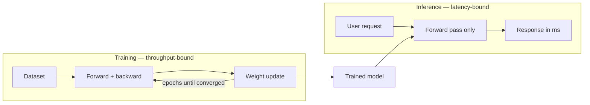

# Week 1 · Day 2 — Training vs inference

[← Master Plan](../../../MASTER-PLAN.md) · [Week 1 overview](plan.md) · [← previous day](day-1.md) · [next day →](day-3.md)

## Study block (2 h)

Start with the DLI course's training-vs-inference module (~40 min), then build the comparison table below into `notes.md`. This distinction is the single highest-leverage concept in the exam: it powers Domain 1 questions directly and almost every Domain 2 sizing question indirectly.

### The two phases, one sentence each

**Training** produces the model: a long-running, throughput-oriented batch job that repeatedly runs forward + backward + update over a dataset until the loss converges. **Inference** uses the model: a latency-sensitive request/response service that runs *only the forward pass* on new inputs, forever, in production. Training happens once (or per retrain); inference happens millions of times a day.

**Training produces the model once; inference runs it forever:**

### The four-axis comparison table (memorize this shape)

| Axis | Training | Inference |
|---|---|---|
| **Compute pattern** | Throughput-heavy, long-running batch; runs for hours–weeks; interruption = checkpoint/restart | Latency-sensitive request/response; measured in ms; runs 24/7 |
| **Precision** | Mixed precision: FP32/TF32 master path with BF16/FP16 compute (FP8 on Hopper+) | Aggressively reduced: FP16, FP8, INT8, FP4 (Blackwell) via quantization |
| **Memory pressure** | Weights **+ gradients + optimizer states + activations** — Adam roughly triples per-parameter state; activations scale with batch size | Weights + working activations; for LLMs, the **KV cache** (grows with context length × concurrent requests) |
| **Hardware shape** | Scale-**up**: big multi-GPU nodes/clusters, fast interconnect (NVLink, InfiniBand) because gradients must be synchronized every step | Scale-**out**: many smaller/cheaper instances, sometimes MIG partitions of one GPU, sometimes edge devices |

Rules of thumb worth having in your head: FP16/BF16 weights ≈ **2 bytes per parameter**, so a 70B-parameter model is ~140 GB just in weights at 16-bit — it doesn't fit one 80 GB H100 for inference without quantization or multi-GPU. For training with Adam in mixed precision, budget roughly **16–20 bytes per parameter** (weights + gradients + FP32 optimizer states) *before* activations — this is why training clusters are big even for models that infer on one GPU.

### Why the memory asymmetry exists

Backprop needs the forward pass's activations to compute gradients, so training must hold them (or recompute them — "activation checkpointing" trades compute for memory). Inference discards each layer's activations as soon as the next layer consumes them. The one inference-specific memory hog is the LLM **KV cache**: attention keys/values for every generated token are kept so the model doesn't recompute them, and it grows linearly with sequence length and with the number of concurrent users. KV cache is why LLM inference is often **memory-bandwidth-bound, not compute-bound** — a fact that returns in week 2 (HBM) and in every vLLM/NIM sizing conversation you'll ever have.

### Throughput vs latency, and why batch size matters

A GPU is a throughput machine: it's only efficient when thousands of threads are busy. A single inference request rarely saturates it, so servers **batch** concurrent requests together — larger batches raise throughput (queries/sec) but each request waits for the batch, raising latency. This is *the* fundamental inference serving trade-off. Modern LLM servers (Triton, TensorRT-LLM, vLLM, NIM) use **in-flight/continuous batching**: new requests join the batch between token-generation steps instead of waiting for the whole batch to finish, getting most of the throughput without the worst-case latency. Read one NVIDIA Technical Blog post on TensorRT and one on inference batching (~30 min) to see the vendor framing.

### Pre-sales angle: when a customer asks

- "We're fine-tuning a 7B model nightly and serving it to 200 internal users" → training side is small (a single 8-GPU node may do), inference side is latency-bound → right-size separately; don't sell one cluster shape for both.
- "Why can't we train on the cheaper inference GPUs?" → training needs the memory (gradients/optimizer/activations), the interconnect (gradient all-reduce), and sustained power; inference-optimized parts (e.g., L4/L40S-class) lack NVLink scale and memory capacity.
- "Why is our LLM slow even though GPU utilization looks low?" → memory-bandwidth-bound decode; the fix is batching, quantization (FP8/INT8), or a higher-bandwidth GPU — not more FLOPS.

Common exam traps: (1) inference runs the forward pass only — any answer implying backprop at inference is wrong; (2) *lower* precision belongs to inference, mixed to training; (3) "training is latency-sensitive" — no, it's throughput-sensitive; a training step taking 800 ms vs 750 ms matters only in aggregate; (4) MIG (splitting one GPU into up to 7 isolated instances) is an *inference/multi-tenant* story, not a way to speed up one training job.

### Read next

- DLI course — training vs inference module (assigned above).
- NVIDIA Technical Blog: the TensorRT overview post ("NVIDIA TensorRT" intro) — what an inference optimizer does (layer fusion, precision calibration, kernel selection).
- NVIDIA Technical Blog: a batching-for-inference post (search "inference batching" / "in-flight batching TensorRT-LLM") — the throughput-vs-latency curve.
- Skim: NVIDIA glossary "What is MLPerf?" — training vs inference have *separate* benchmark suites, which is itself the lesson.

### Quick check

1. Name the four memory consumers during training and the one that exists only at inference time for LLMs.

Answer
Training: weights, gradients, optimizer states, activations. Inference-only: the KV cache (attention keys/values kept per token per concurrent request).

2. A workload needs 24/7 availability, p99 latency under 100 ms, and scales with user count. Training or inference infrastructure, and scale-up or scale-out?

Answer
Inference; scale-out (many instances behind a load balancer, possibly MIG-partitioned GPUs) — latency SLO and request/response pattern are the tells.

3. Why does increasing batch size raise inference throughput but hurt per-request latency?

Answer
Bigger batches keep more GPU threads busy per kernel launch (better utilization → more queries/sec), but each request must wait for the batch to be assembled and processed together, adding queueing delay.

4. Roughly how much memory do the weights alone of a 70B-parameter model need in FP16, and what follows for single-GPU inference?

Answer
~140 GB (2 bytes/param × 70B). It exceeds an 80 GB H100, so you need multi-GPU inference (tensor parallelism), a bigger-memory GPU (H200/B200), or quantization (FP8/INT8/FP4) to shrink the weights.

## Build block (4 h)

**Today: the `Tensor` engine on NumPy** — same graph machinery as yesterday, now over arrays. [Project brief](../../../gpu-engineering-lab/01-foundations/week-01-autograd-from-scratch/README.md)

- Implement `src/tensor.py`: `Tensor` wrapping an `np.ndarray`, with `+`, `*`, `-`, `/`, `matmul`, `sum`, `mean`, `max`, `relu`, `exp`, `log`, `transpose`, `reshape`, `gather_rows`.
- The hard part: **broadcasting-aware backward** — implement `_unbroadcast(grad, shape)` that sums the gradient over broadcast dimensions; route every binary op's backward through it.
- Definition of done: `pytest tests/test_tensor_grads.py` green through the broadcasting and matmul test classes.
- Hint: handle the two broadcast cases separately — leading dimensions that were *added* (sum them away entirely) and existing size-1 dimensions that were *stretched* (sum with `keepdims=True`).

## Close the day (15 min)

- Anki: add the four-axis table (one card per axis) plus bytes-per-parameter rules of thumb; review Day 1 cards.
- One line in [notes.md](notes.md): the hardest thing today.
- Log blockers (e.g., which broadcast test cases still fail — tomorrow builds directly on them).
