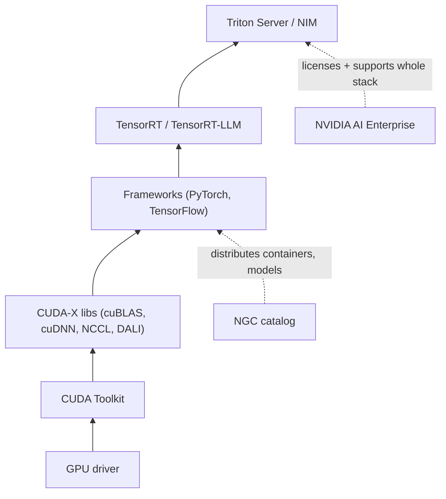

# Week 1 · Day 4 — CUDA ecosystem + NVIDIA software stack

[← Master Plan](../../../MASTER-PLAN.md) · [Week 1 overview](plan.md) · [← previous day](day-3.md) · [next day →](day-5.md)

## Study block (2 h)

DLI software-stack module first (~30 min), then build the bottom-up stack map into `notes.md` (~60 min), then spend 20–30 minutes actually clicking around **catalog.ngc.nvidia.com** — find the PyTorch container, one pretrained model, one Helm chart. NGC questions become trivial once you've seen the catalog.

### The stack, bottom-up — one job per layer

The exam's favorite move is naming a component and asking what layer it lives at or what its job is. Learn the stack as a dependency ladder:

1. **GPU driver** — kernel-mode software that lets the OS talk to the GPU at all. Everything above requires it. (Compatibility questions live here: a CUDA version requires a minimum driver version.)
2. **CUDA Toolkit** — the developer platform: the `nvcc` compiler, CUDA runtime, debugging/profiling tools, and core math libraries. CUDA is *the* programming model exposing the GPU for general-purpose compute (grids of thread blocks running kernels).
3. **CUDA-X libraries** — GPU-accelerated building blocks so nobody writes raw kernels for solved problems:
   - **cuBLAS** — dense linear algebra (the matmuls).
   - **cuDNN** — deep-learning primitives (convolutions, attention, normalizations) that frameworks call.
   - **NCCL** ("nickel") — multi-GPU/multi-node *collective communications* (all-reduce, broadcast) over NVLink/InfiniBand; the layer that makes distributed training work.
   - **DALI** — GPU-accelerated data loading/augmentation, fixing CPU input-pipeline bottlenecks.
   - **RAPIDS** — GPU data science: cuDF (pandas-like), cuML (scikit-learn-like).
4. **Frameworks** — PyTorch, TensorFlow, JAX. They sit *on* cuDNN/cuBLAS/NCCL; users write Python, the stack routes math to the GPU.
5. **Inference layer**:
   - **TensorRT** — an inference *optimizer and runtime*: takes a trained model, applies layer fusion, precision calibration (FP16/INT8/FP8), kernel auto-selection; outputs a fast engine.
   - **TensorRT-LLM** — TensorRT specialized for LLMs (in-flight batching, paged KV cache, tensor parallelism).
   - **Triton Inference Server** — open-source *serving* software: hosts many models from multiple frameworks (TensorRT, PyTorch, ONNX) behind HTTP/gRPC with dynamic batching, model ensembles, metrics. Trap: Triton serves models; TensorRT optimizes them — they compose, one doesn't replace the other. (Also don't confuse with OpenAI's "Triton" kernel language.)
   - **NIM (NVIDIA Inference Microservices)** — prebuilt, containerized inference microservices: an optimized model + TensorRT-LLM/Triton + a standard (OpenAI-compatible) API in one container you pull and run. The "easy button" for deploying LLM inference.
6. **NGC** — NVIDIA's catalog of GPU-optimized *containers*, *pretrained models*, and *Helm charts*. Not software itself — a distribution hub. Exam tell: "where do you get a tested, GPU-optimized PyTorch container?" → NGC.
7. **NVIDIA AI Enterprise (NVAIE)** — the commercial, licensed, *supported* distribution of this whole stack: security patches, long-term support branches, certification on mainstream servers/VMware/clouds, enterprise support SLAs, and it includes NIM. Exam tell: any question with "production support," "enterprise SLA," or "certified" in it → NVAIE.

**The NVIDIA software stack, bottom-up — each layer runs on the one below:**

### How the layers compose (the one-paragraph story)

A data scientist pulls a PyTorch container **from NGC**, which contains PyTorch built on **cuDNN/cuBLAS**, running on the **CUDA Toolkit** over the **driver**. Multi-GPU training synchronizes gradients through **NCCL** while **DALI** feeds data. The trained model is optimized by **TensorRT**, served by **Triton** — or shipped as a **NIM** — and the whole thing is licensed and supported in production through **NVIDIA AI Enterprise**. Be able to tell this story unprompted; it answers a half-dozen exam questions at once.

### Pre-sales angle

- "We already use open-source PyTorch — why pay for NVAIE?" → not for features but for *risk*: supported/patched builds, compatibility guarantees across driver/CUDA/framework versions, certified platforms, someone to call. It's the RHEL-vs-Fedora argument.
- "Build vs buy for LLM serving?" → DIY (vLLM/Triton assembled yourself) = flexibility, no license; NIM = day-one optimized deployment, standard API, support — favored when time-to-production and supportability outweigh customization.
- "Why did our framework upgrade break?" → version coupling: framework ↔ cuDNN ↔ CUDA ↔ driver. NGC containers exist precisely to ship tested combinations.

### Read next

- DLI course — NVIDIA software stack module (assigned above).
- catalog.ngc.nvidia.com — the hands-on 20-minute browse (assigned above).
- NVIDIA AI Enterprise product page — skim the "what's included" and supported-platforms sections.
- Triton Inference Server docs landing page — just the architecture overview diagram.

### Quick check

1. Place these in stack order, bottom-up: Triton, driver, cuDNN, PyTorch, CUDA Toolkit.

Answer
Driver → CUDA Toolkit → cuDNN → PyTorch → Triton (serving a model exported/optimized from the framework).

2. TensorRT vs Triton Inference Server — what does each do, and do they compete?

Answer
TensorRT optimizes a trained model into a fast inference engine (fusion, precision calibration); Triton is a server that hosts and serves models (including TensorRT engines) with batching and APIs. They compose — optimizer + server — not compete.

3. A customer needs multi-node training; which library synchronizes gradients across GPUs, and what operation is it best known for?

Answer
NCCL — collective communications library; best known for all-reduce, which averages gradients across all GPUs each training step.

4. Which offering answers "we need a supported, security-patched, certified stack for production, with someone to call"?

Answer
NVIDIA AI Enterprise — the licensed, supported distribution of the NVIDIA AI stack (which also includes NIM).

## Build block (4 h)

**Today: Rust from zero — the systems-language on-ramp.** [Project brief](../../../gpu-engineering-lab/01-foundations/week-01-autograd-from-scratch/README.md)

- Install the toolchain per `setup/rust-cuda-toolchain.md`: `rustup`, `clippy`, `rustfmt`; verify `cargo --version` inside WSL2.
- rustlings until it hurts — target: through the ownership/borrowing/structs/enums sections.
- Rust Book ch. 1–6 alongside: read a chapter when rustlings blocks you, not before.
- Definition of done: rustlings ownership/borrowing/structs/enums sections complete; toolchain verified in WSL2.
- Hint: when the borrow checker fights you, ask "who *owns* this value and how long must it live?" before reaching for `clone()` — most rustlings solutions are a `&` in the right place.
- Optional evening: Jon Gjengset's *Considering Rust* talk.

## Close the day (15 min)

- Anki: one card per stack layer (name → one-line job), plus TensorRT-vs-Triton and NGC-vs-NVAIE distinctions; review prior days.
- One line in [notes.md](notes.md): the hardest thing today.
- Log blockers (toolchain snags matter — tomorrow's GPU launch depends on today's install).
