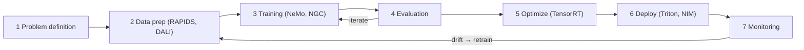

# Week 1 · Day 5 — AI development lifecycle + week review

[← Master Plan](../../../MASTER-PLAN.md) · [Week 1 overview](plan.md) · [← previous day](day-4.md) · [next day →](../week-2/day-1.md)

## Study block (2 h)

Friday is lifecycle + consolidation: one last lesson, then the closed-book self-check and week close-out.

### The AI development lifecycle (40 min, into `notes.md`)

Walk it end-to-end and attach an NVIDIA tool to every stage — the exam asks both "what comes next?" and "which tool serves stage X?":

1. **Business problem definition** — what to predict, what success metric, what data exists. No tool; the stage everyone skips and regrets.
2. **Data collection & preparation** — gathering, cleaning, labeling, augmentation. Often cited as ~80% of project effort. NVIDIA tools: **RAPIDS/cuDF** (GPU ETL), **DALI** (training-time loading/augmentation), NeMo Curator (LLM data curation).
3. **Model selection & training** — pick/pretrain/fine-tune. Tools: **PyTorch/TensorFlow on NGC containers**, **NeMo** (LLM training/fine-tuning), **NCCL** underneath multi-GPU, **Base Command** for cluster/job management.
4. **Evaluation & validation** — held-out test metrics, bias/robustness checks. Decide ship / iterate.
5. **Optimization for deployment** — make it fast and small: **TensorRT / TensorRT-LLM** (fusion, precision calibration), quantization (FP8/INT8).
6. **Deployment** — put it behind an API: **Triton Inference Server**, **NIM**; on **NVIDIA AI Enterprise** for supported production.
7. **Monitoring & retraining** — watch latency, throughput, and **model drift** (the world changes; accuracy decays). Drift triggers retraining → the loop closes. Deploy is *not* the end.

**The lifecycle is a cycle, not a line — drift closes the loop:**

**Where MLOps fits** (20 min): MLOps is DevOps discipline applied to this loop — versioning data/models/code, automated pipelines, CI/CD for models, monitoring, reproducibility. Key exam distinctions: the lifecycle is a *cycle*, not a line; drift is *why* monitoring exists; and the retraining loop is why training infrastructure isn't a one-off purchase — a pre-sales point worth remembering.

### Self-check + week close-out (60 min)

- **(45 min)** Run [self-check.md](self-check.md) **closed-book**. Score it honestly. Re-study anything you missed — the misses are the whole point.
- Tick every exit criterion you've genuinely met in [plan.md](plan.md) — the boxes are: hierarchy + paradigms in under a minute; training loop without notes; training-vs-inference on four axes; GPU-vs-CPU with a CPU-wins case; the ten stack components placed with one-line jobs; the lifecycle walked with a tool per stage; ≥80% on the self-check.
- Fill in the week 1 row in [PROGRESS.md](../../PROGRESS.md): self-check score, exit criteria status, hours logged, one-line retro.
- **(15 min, if time)** Skim [week 2 plan](../week-2/plan.md) and seed Domain 1 flashcards for daily review starting Monday.

### Quick check (calibration — do these before opening self-check.md)

1. A deployed model's accuracy slowly degrades although nothing in the code changed. What is this called, and which lifecycle stage catches it?

Answer
Model drift (data/concept drift — the live data distribution shifted from training data). The monitoring stage catches it and triggers retraining.

2. Which lifecycle stage typically consumes the most project effort, and which two NVIDIA tools serve it?

Answer
Data collection & preparation (~80% of effort). RAPIDS/cuDF for GPU-accelerated ETL and DALI for data loading/augmentation (NeMo Curator for LLM data also counts).

3. Order these tools by lifecycle stage: Triton, RAPIDS, TensorRT, PyTorch.

Answer
RAPIDS (data prep) → PyTorch (training) → TensorRT (optimization for deployment) → Triton (deployment/serving).

## Build block (4 h)

**Today: first GPU launch from Rust + publish week 1.** [Project brief](../../../gpu-engineering-lab/01-foundations/week-01-autograd-from-scratch/README.md)

- Finish rustlings core sections; skim Rust Book ch. 15 + 19.1 (`Arc` and a working respect for `unsafe`).
- Implement `rust-hello-gpu/src/main.rs` (skeleton provided): device query via cudarc, then SAXPY using the provided PTX — your TODOs are host-side only (context, alloc, memcpy, launch config, launch, copy back).
- Gate: `pytest tests/test_rust_hello.py` green (shells out to `cargo run --release`, checks against NumPy to ≤1e-5).
- Benchmark honestly per the repo contract (medians, machine specs), then write `RESULTS.md`: MNIST accuracy, max relative gradient error vs PyTorch, seconds/epoch, plus the "first contact with Rust" note.
- Definition of done: `make test` and `make train` green from fresh clone; `RESULTS.md` has numbers, not adjectives; commit + push with a clean Day 1→5 history.
- Hint: if the SAXPY output is all zeros, check that you copied device→host *after* the launch completed on the same stream — synchronization order is the classic first cudarc bug.

## Close the day (15 min)

- Anki: lifecycle-stage → tool cards; review the full week 1 deck (it's Friday — clear all dues).
- One line in [notes.md](notes.md): the hardest thing this week, not just today.
- Log blockers carrying into week 2 (unpinned Rust nightly? WSL2 CUDA version? — week 2's lab starts with the toolchain).
