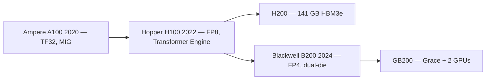
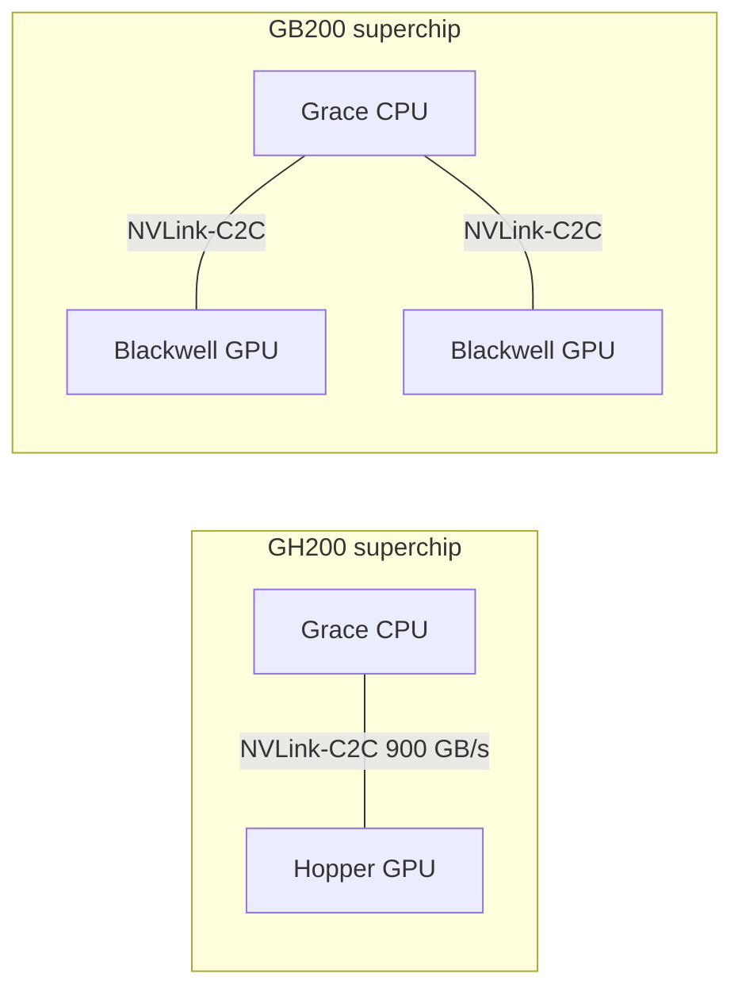

# Week 2 · Day 1 — Datacenter GPU generations

[← Master Plan](../../../MASTER-PLAN.md) · [Week 2 overview](plan.md) · [← previous day](../week-1/day-5.md) · [next day →](day-2.md)

## Study block (2 h)

Start with 15 min of Domain 1 flashcards (daily habit from now on). Then the generation tour. Depth calibration for the exam: you must recognize **which generation introduced which feature** — not SM counts or clock speeds.

### Why generations matter

NVIDIA ships a new datacenter architecture roughly every two years, and each one is remembered for two or three signature features. NCA-AIIO questions are almost always of the form "which architecture introduced X?" or "a customer needs Y — which GPU?" Build the table below in `notes.md` and make one flashcard per row.

**The generational ladder — one signature feature pair per hop:**

### Ampere — A100 (2020)

- **TF32**: a 19-bit format (FP32's 8-bit exponent range, ~10-bit mantissa) that Tensor Cores use *transparently* for FP32 matmul — big speedup on unchanged code. Ampere's headline.
- **MIG (Multi-Instance GPU)**: partition one A100 into up to **7** fully isolated GPU instances, each with its own memory and SM slice — the multi-tenant/inference-density feature.
- 3rd-gen NVLink (600 GB/s per GPU), 3rd-gen Tensor Cores (adds BF16 and 2:4 structured sparsity), 40 or 80 GB **HBM2e** (~2 TB/s on the 80 GB part).

### Hopper — H100 / H200 (2022)

- **FP8** on 4th-gen Tensor Cores, managed by the **Transformer Engine** — logic + software that switches between FP8 and FP16 per layer while preserving accuracy. This pair is Hopper's identity; it's *the* LLM-era training/inference feature.
- NVLink 4: **900 GB/s** per GPU. 80 GB HBM3 at ~3.35 TB/s (SXM).
- **H200**: same Hopper GPU, upgraded memory — **141 GB HBM3e at ~4.8 TB/s**. Exists because LLM inference is memory-bound; more capacity + bandwidth = bigger models and KV caches per GPU. If a question hinges on memory alone, the answer is often H200.
- Also Hopper: 2nd-gen MIG, confidential computing, DPX instructions — recognize the names.

### Blackwell — B200 / GB200 (2024)

- **Dual-die design**: two reticle-limit dies joined by a ~10 TB/s die-to-die link, acting as one CUDA GPU — NVIDIA's answer to single dies hitting manufacturing size limits.
- **FP4 and FP6** support with a 2nd-gen Transformer Engine — pushing inference precision below 8 bits.
- NVLink 5: **1.8 TB/s** per GPU. 192 GB HBM3e at up to ~8 TB/s on B200.
- **GB200**: a *superchip* — 1 Grace CPU + **2** Blackwell GPUs on one board, linked coherently. Basis of the GB200 NVL72 rack system (72 GPUs in one NVLink domain — Day 3's topic).

### The CPU side: Grace and superchips

- **Grace**: NVIDIA's Arm-based datacenter CPU (72 Neoverse V2 cores, LPDDR5X) — high memory bandwidth per watt, built to feed GPUs rather than compete with x86 on general compute.
- **Grace Hopper (GH200)**: 1 Grace + 1 Hopper joined by **NVLink-C2C**, a 900 GB/s *coherent* chip-to-chip link — the GPU can use CPU memory as addressable, cache-coherent extended memory (vs ~64 GB/s per direction over PCIe Gen5 x16 in a classic x86+GPU pairing). Exam distinction: GH200 = CPU+GPU superchip; GB200 = CPU+2×GPU superchip.

**The two superchips — same coherent NVLink-C2C idea, different GPU count:**

### Spec comparison to anchor the numbers (15 min with the datasheets)

| | A100 (SXM) | H100 (SXM) | B200 |
|---|---|---|---|
| Year / arch | 2020 / Ampere | 2022 / Hopper | 2024 / Blackwell |
| Memory | 80 GB HBM2e | 80 GB HBM3 (H200: 141 GB HBM3e) | 192 GB HBM3e |
| Mem bandwidth | ~2 TB/s | ~3.35 TB/s (H200: ~4.8) | ~8 TB/s |
| NVLink per GPU | 600 GB/s (gen 3) | 900 GB/s (gen 4) | 1.8 TB/s (gen 5) |
| New precision | TF32, BF16 | FP8 (+ Transformer Engine) | FP4/FP6 |
| Signature extra | MIG (7 instances) | Transformer Engine | Dual-die, GB200 superchip |

Pre-sales angle: generation choice is a workload conversation — training frontier LLMs → Blackwell (FP8/FP4 + NVLink 5 domains); memory-bound inference of big models → H200/B200 (capacity + bandwidth); multi-tenant inference density on a budget → A100/H100 with MIG; installed-base expansion → match the existing fleet for homogeneous scheduling.

### Read next

- NVIDIA H100 architecture overview (developer.nvidia.com — Hopper architecture in-depth post) *or* the Blackwell architecture overview page — one, read properly.
- A100 vs H100 vs B200 datasheet tables — verify the table above yourself (memory, bandwidth, NVLink numbers).
- NVIDIA Grace Hopper / GB200 product pages — the superchip diagrams (5-minute skim).

### Quick check

1. Which architecture introduced each: MIG, FP8, FP4, TF32?

Answer
MIG — Ampere; FP8 — Hopper (with Transformer Engine); FP4 — Blackwell; TF32 — Ampere.

2. What is the difference between GH200 and GB200?

Answer
GH200 = Grace Hopper superchip: 1 Grace CPU + 1 Hopper GPU over NVLink-C2C. GB200 = 1 Grace CPU + 2 Blackwell GPUs. Both are coherent CPU+GPU superchips.

3. A customer's 100B-parameter model doesn't fit in their H100s' memory for inference; they can't rearchitect to more GPUs. Which single-GPU upgrade addresses this, and why?

Answer
H200 (141 GB HBM3e) or B200 (192 GB) — same software stack, dramatically more memory capacity and bandwidth; memory, not compute, is the constraint.

4. What problem does Blackwell's dual-die design solve?

Answer
Single dies hit the manufacturing reticle size limit; Blackwell joins two full-size dies with a ~10 TB/s link that lets them behave as one GPU, continuing scaling beyond one die's transistor budget.

## Build block (4 h)

**Today: toolchain + vector add + SAXPY — your first kernels on the very Blackwell architecture you just studied (RTX 5090 Laptop, `sm_120`).** [Project brief](../../../gpu-engineering-lab/01-foundations/week-02-cuda-basics/README.md)

- Pin the Rust-CUDA nightly (check the repo for the current pin; update `rust-toolchain.toml`), then `cargo build --release` until the PTX builds. Budget real time; log every snag in the README's "What didn't work".
- Read `common/src/lib.rs` (the `gpu-bench` crate) top to bottom — it times everything you build this month.
- Implement `kernels/src/lib.rs::vector_add` (one thread per element, bounds check) and `saxpy` (grid-stride loop); fill the `TODO(Day 1)` grid-size lines in the two bins.
- Definition of done: `cargo run --release --bin vector_add` passes the CPU-correctness check and prints achieved bandwidth in the vicinity of 80–90% of peak.
- Hint: for the grid-size TODO, compute blocks as `ceil(n / block_size)` — integer division truncates, and the missing `+ block_size - 1` is the classic off-by-one that fails only on non-multiple sizes.

## Close the day (15 min)

- Anki: one card per architecture row (year, memory, NVLink gen, signature features); 15-min Domain 1 review is now daily.
- One line in [notes.md](notes.md): the hardest thing today.
- Log blockers — especially toolchain state; every remaining lab day builds on today's pin.
