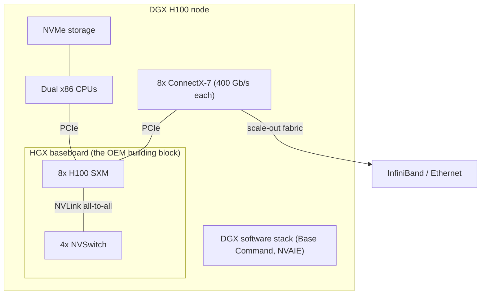
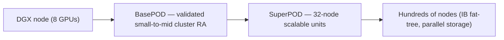

# Week 2 · Day 2 — DGX vs HGX, SuperPOD

[← Master Plan](../../../MASTER-PLAN.md) · [Week 2 overview](plan.md) · [← previous day](day-1.md) · [next day →](day-3.md)

## Study block (2 h)

Flashcards first (15 min). Today: how GPUs become *systems*. This is pure Domain 2 material and pure pre-sales material — the DGX/HGX distinction is a "how do you want to buy?" question wearing hardware clothes.

### DGX — the turnkey appliance

**DGX** is NVIDIA's fully-integrated, NVIDIA-branded AI server: "an AI supercomputer in a box." A **DGX H100** contains 8× H100 **SXM** GPUs on an NVSwitch baseboard (all-to-all NVLink inside the node), dual x86 CPUs, ConnectX-7 NICs (one 400 Gb/s port per GPU for scale-out), NVMe storage, and the preinstalled **DGX software stack** (DGX OS, Base Command, NVIDIA AI Enterprise). You buy it from NVIDIA/partners as one SKU with one support contract covering hardware *and* software. DGX B200 is the same idea on Blackwell. The value proposition is time-to-train and single-throat-to-choke support — not unique silicon.

**Anatomy of a DGX H100 node — the HGX GPU complex plus everything around it:**

### HGX — the OEM building block

**HGX** is not a server you can buy; it's the **GPU baseboard/platform** — 8× SXM GPUs + NVSwitch chips on one board — that NVIDIA supplies to OEMs (Dell, Supermicro, Lenovo, HPE…) who design their *own* servers around it: their choice of CPUs, RAM, storage, NICs, chassis, and their support/procurement relationships. An "HGX H100 system" from Dell has the *same GPU complex* as a DGX H100; everything around it is Dell's.

**The exam angle, verbatim-worthy**: DGX = turnkey NVIDIA system + integrated software + NVIDIA support; HGX = the building block OEMs use for custom/vendor-choice designs. If a question says "customer wants to standardize on their existing OEM vendor and customize storage/networking" → HGX. "Fastest path to production, single support contract, reference-architecture scaling" → DGX.

### MGX — the modular reference architecture

**MGX** is a modular *reference design* for OEMs covering a broader range of configurations than the 8-GPU HGX board — different GPU counts, PCIe or SXM, x86 or **Grace** CPUs, air or liquid cooling — with guaranteed compatibility across generations. Mental model: HGX = the standardized 8-GPU flagship baseboard; MGX = the flexible catalog for everything else (inference nodes, Grace-based nodes, telco/edge configs).

### Scaling up the ladder: BasePOD and SuperPOD

- **DGX BasePOD**: a *reference architecture* for building clusters from DGX nodes — prescribed compute + InfiniBand/Ethernet fabric + certified storage partners + management software (**Base Command** for scheduling/orchestration). Think "validated blueprint for a small-to-mid cluster."
- **DGX SuperPOD**: the larger, turnkey engineered cluster product — historically built in units of **32 DGX nodes** ("scalable units"), scaling to hundreds of nodes with a full InfiniBand fat-tree, parallel storage, and NVIDIA deployment services. GB200 NVL72 racks are the Blackwell-era SuperPOD building block.
- The point of both: nobody should design an AI cluster from scratch; the RA encodes known-good ratios of compute : network : storage. Skim an actual SuperPOD RA PDF's architecture diagrams today — the exam rewards having *seen* the topology.

**The scaling ladder — from one node to an engineered cluster:**

### SXM vs PCIe form factors (15 min)

- **SXM**: NVIDIA's mezzanine socket — GPU mounted flat on the HGX board. Enables the **full power envelope** (700 W H100 SXM vs 300–350 W PCIe) and **NVLink to all peers via NVSwitch**.
- **PCIe**: standard slot card — fits commodity servers, lower power/cost, but inter-GPU traffic rides PCIe (~64 GB/s per direction Gen5 x16); at most an **NVLink bridge pairs two adjacent cards**, no all-to-all.
- Rule: serious multi-GPU training → SXM; single-GPU inference/departmental → PCIe is fine and cheaper. Exam tell: "all 8 GPUs communicate at full NVLink bandwidth simultaneously" implies SXM + NVSwitch, never PCIe.

### Pre-sales sorting hat

- "First AI cluster, no HPC staff, deadline" → DGX (BasePOD/SuperPOD RA).
- "Global procurement standardized on Supermicro; custom storage fabric" → HGX system from that OEM.
- "Mixed inference fleet, some Grace, some PCIe boxes" → MGX-based designs.
- "8 GPUs must train one model efficiently" → SXM/NVSwitch regardless of the badge on the chassis.

### Read next

- NVIDIA DGX platform page — the DGX H100/B200 system specs.
- A DGX SuperPOD reference architecture PDF — skim the architecture diagrams only (topology, storage, fabric).
- NVIDIA HGX platform page — note the phrase "baseboard" and the OEM list.
- Optional: an OEM's HGX server spec sheet (e.g., Dell XE9680) — see the DGX-vs-OEM contrast concretely.

### Quick check

1. Customer wants to buy "HGX" directly from NVIDIA like a DGX. What's wrong with that request?

Answer
HGX isn't an end product — it's the 8-GPU SXM baseboard/platform NVIDIA supplies to OEMs, who build and sell complete servers around it. To buy a complete system you buy a DGX from NVIDIA or an HGX-based server from an OEM.

2. Name two things a DGX H100 includes that an HGX baseboard alone does not.

Answer
Any two of: CPUs, system RAM, NVMe storage, ConnectX NICs, chassis/cooling, the preinstalled DGX software stack (DGX OS, Base Command, NVIDIA AI Enterprise), single-vendor NVIDIA support.

3. BasePOD vs SuperPOD in one sentence.

Answer
Both are reference architectures for scaling DGX nodes into clusters (compute + fabric + storage + management); BasePOD targets smaller validated clusters, SuperPOD is the large-scale engineered product built from 32-node scalable units with full InfiniBand fabric and deployment services.

4. Why can't a PCIe H100 server give all-to-all full-bandwidth GPU communication?

Answer
PCIe cards have no NVSwitch connectivity — at best an NVLink bridge joins two adjacent cards; everything else traverses PCIe (~64 GB/s per direction), an order of magnitude below NVLink. All-to-all NVLink requires SXM GPUs on an NVSwitch baseboard.

## Build block (4 h)

**Today: the reduction ladder — three generations of a sum-reduction kernel.** [Project brief](../../../gpu-engineering-lab/01-foundations/week-02-cuda-basics/README.md)

- `reduce_naive`: interleaved-addressing shared-memory tree — deliberately the slow textbook version (divergence + bank conflicts are the point; Day 4 profiles them).
- `reduce_shared`: sequential addressing + first-add-during-load + grid-stride input loop.
- `reduce_warp`: the NVRTC escape-hatch kernel — CUDA-C string in `reduce_warp.rs`, body TODO: `__shfl_down_sync` for the final 32 lanes, one shared slot per warp for the block combine.
- Definition of done: all three validate against the CPU float64 sum; harness prints the `cublasSasum` baseline comparison (Friday's acceptance bar: warp variant ≥80% of it).
- Hint: in the naive version, make the *addressing* interleaved (`index = 2 * stride * tid`) exactly as in Harris's slides — if you accidentally write the sequential version first, you'll have nothing to profile against on Day 4.

## Close the day (15 min)

- Anki: DGX/HGX/MGX one-liners, BasePOD/SuperPOD, SXM-vs-PCIe; plus daily Domain 1 review.
- One line in [notes.md](notes.md): the hardest thing today.
- Log blockers (e.g., warp-shuffle kernel correctness — it must be solid before Day 4 profiling).
