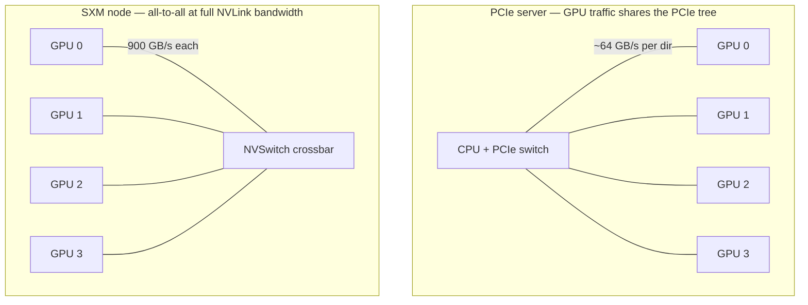
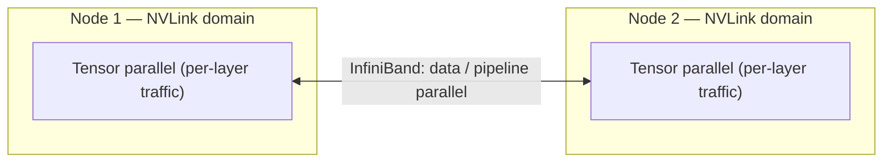

# Week 2 · Day 3 — NVLink, NVSwitch, multi-GPU scaling

[← Master Plan](../../../MASTER-PLAN.md) · [Week 2 overview](plan.md) · [← previous day](day-2.md) · [next day →](day-4.md)

## Study block (2 h)

Flashcards first (15 min). Today connects yesterday's boxes: *why* the interconnect inside them decides whether 8 GPUs behave like one big GPU or like 8 lonely ones.

### The interconnect ladder, with numbers

Memorize the bandwidth *ordering* and the rough magnitudes:

| Link | Rough bandwidth | Role |
|---|---|---|
| PCIe Gen5 x16 | ~64 GB/s per direction (~128 GB/s bidir) | CPU↔GPU, GPU↔NIC, GPU↔GPU when nothing better exists |
| NVLink 4 (Hopper) | **900 GB/s** total per GPU (18 links) | Direct GPU↔GPU |
| NVLink 5 (Blackwell) | **1.8 TB/s** total per GPU | Direct GPU↔GPU |
| NVLink-C2C | 900 GB/s | Coherent CPU↔GPU inside Grace superchips |

So NVLink is ~7–14× PCIe. That gap is the entire multi-GPU story: any algorithm that must move tensors between GPUs every step lives or dies on this number.

### NVLink vs NVSwitch — link vs switch

- **NVLink** is a point-to-point GPU-to-GPU link. With links alone, each GPU can only talk directly to GPUs it's wired to — fine for 2–4 GPUs, but 8-way all-to-all would need too many ports per GPU.
- **NVSwitch** is a *switch chip*: all 8 GPUs in an HGX/DGX node connect to a set of NVSwitches, and any GPU can talk to any other **at full NVLink bandwidth, all simultaneously** — a non-blocking crossbar. Analogy that lands in exams and sales calls alike: NVLink = cables, NVSwitch = the network switch they plug into.
- **NVLink Switch System / NVLink domains**: Hopper-and-later NVSwitch generations can extend NVLink *beyond one node* through external NVLink switches. The flagship is **GB200 NVL72**: one liquid-cooled rack, 36 Grace CPUs + **72 Blackwell GPUs, all in a single NVLink domain** — 72 GPUs that see each other at 1.8 TB/s each, behaving like one giant accelerator. Beyond the NVLink domain, nodes/racks federate over **InfiniBand or Ethernet (Spectrum-X)** — that's week 3's material; today just place the boundary.

**PCIe-only vs SXM + NVSwitch — hub-and-spoke vs non-blocking crossbar:**

### Why training needs all this: the all-reduce

**Data parallelism** (the default): every GPU holds a *full copy* of the model and processes a different slice of each batch. After every step, gradients must be *averaged across all GPUs* — an **all-reduce** collective, performed by **NCCL** over whatever fabric exists (NVLink inside a node, InfiniBand across nodes). The data moved per step is proportional to the *model size* — gigabytes, every step, potentially every second. That recurring gradient sync is why interconnect bandwidth is a first-class sizing input, not plumbing.

When the model itself doesn't fit one GPU, you split the model instead:

- **Tensor parallelism** — split individual layers (weight matrices) across GPUs; requires communication *inside every layer's forward and backward*, so it's the most bandwidth-hungry — keep it within an NVLink/NVSwitch domain.
- **Pipeline parallelism** — split the model by *layers* into stages on different GPUs; micro-batches flow through like an assembly line; communication is only activations at stage boundaries — tolerates slower links.
- (FSDP/ZeRO-style sharded data parallelism sits between: full treatment lands in your DDP/FSDP lab work later; one line suffices for the exam.)

Rule of thumb worth quoting: tensor parallel *within* the node (NVLink), pipeline/data parallel *across* nodes (InfiniBand).

**Parallelism placement — chatty splits stay on NVLink, tolerant splits cross the fabric:**

### Why 8 GPUs ≠ 8× speedup

Every step is compute + communication; communication doesn't shrink as you add GPUs (all-reduce volume is fixed by model size), so its *share* of step time grows — **Amdahl's law with a network flavor**. Two vocabulary terms the exam likes:

- **Strong scaling**: fixed total problem, more GPUs → per-GPU work shrinks, comms overhead dominates, efficiency falls.
- **Weak scaling**: problem grows with GPU count (bigger global batch) → per-GPU work constant, efficiency stays high. Large-model training is mostly a weak-scaling story.

Pre-sales angle: when a customer says "we'll just add GPUs," ask what the *scaling efficiency* is — if their fabric is PCIe or oversubscribed Ethernet, more GPUs may buy embarrassingly little. Conversely, this is the honest justification for SXM/NVSwitch systems and for NVL72: they raise the ceiling where communication starts to strangle scaling. Skim an NVIDIA blog post on NCCL/all-reduce today (15 min) to wire the hardware story to software you already know.

### Read next

- NVIDIA blog / docs: an NCCL all-reduce explainer (search "NCCL all-reduce" on developer.nvidia.com) — how ring/tree algorithms use NVLink.
- NVIDIA NVLink & NVSwitch page — verify the 900 GB/s and 1.8 TB/s numbers and the NVL72 claim.
- Optional: the GB200 NVL72 product page — the "72 GPUs, one NVLink domain" framing in NVIDIA's own words.

### Quick check

1. Rank by bandwidth: PCIe Gen5 x16, NVLink 4, NVLink 5, and give one number for each.

Answer
PCIe Gen5 x16 (~64 GB/s per direction) < NVLink 4 (900 GB/s per H100) < NVLink 5 (1.8 TB/s per Blackwell GPU).

2. What does NVSwitch add that point-to-point NVLink alone cannot provide?

Answer
All-to-all connectivity: every GPU in the node reaches every other GPU at full NVLink bandwidth simultaneously (non-blocking), instead of only directly-wired neighbors.

3. Which parallelism style is most sensitive to interconnect bandwidth, and where should it be placed?

Answer
Tensor parallelism — it communicates inside every layer's forward and backward pass — so it belongs within an NVLink/NVSwitch domain (inside a node or an NVL72 rack), not across the InfiniBand fabric.

4. A training job scales at 95% efficiency to 8 GPUs but 60% at 64 GPUs across nodes. Name the effect and the usual culprit.

Answer
Strong-scaling breakdown / communication overhead: fixed all-reduce volume per step becomes a growing share of step time once traffic crosses the slower inter-node fabric; compute shrinks per GPU but communication doesn't.

## Build block (4 h)

**Today: memory-coalescing experiments — measure the memory system you'll describe tomorrow.** [Project brief](../../../gpu-engineering-lab/01-foundations/week-02-cuda-basics/README.md)

- Implement `strided_read` and `offset_read` in the kernels crate (defeat dead-code elimination — the bin comments explain the trick).
- Run `cargo run --release --bin bandwidth_sweep`, then `python bench/plot_results.py results`.
- Definition of done: the sweep chart clearly shows the bandwidth cliff as stride crosses the 128-byte transaction boundary, annotated with the cache-line arithmetic that explains it.
- Hint: plot *achieved GB/s vs stride in elements*, and mark where stride × 4 bytes crosses 32 and 128 bytes — the cliff should sit exactly where each warp's requests stop fitting in single transactions.

## Close the day (15 min)

- Anki: interconnect ladder numbers, NVLink-vs-NVSwitch, the three parallelisms (one line each), strong-vs-weak scaling; daily Domain 1 review.
- One line in [notes.md](notes.md): the hardest thing today.
- Log blockers (a clean sweep chart is Friday deliverable material — flag it now if it's noisy).
