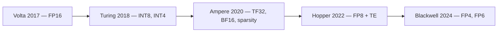
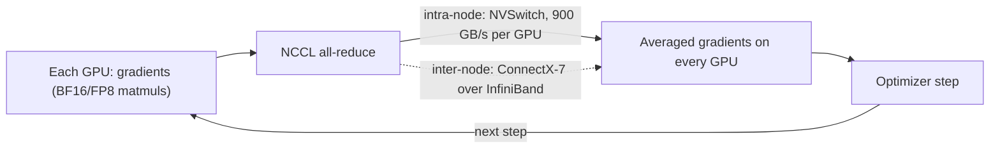

# Week 2 · Day 5 — Tensor Cores + week review

[← Master Plan](../../../MASTER-PLAN.md) · [Week 2 overview](plan.md) · [← previous day](day-4.md) · [next day →](../week-3/day-1.md)

## Study block (2 h)

Flashcards first (15 min). Then a short Tensor Core consolidation, one tie-together exercise, and the closed-book week close-out.

### Tensor Cores: the generation recap (30 min)

A Tensor Core executes a small **matrix multiply-accumulate** (D = A×B + C on small tiles) as a single operation, in mixed precision — multiply in the reduced format, accumulate in FP32. Each architecture generation is defined by which formats its Tensor Cores speak:

- **Volta (V100, 2017)** — 1st gen: introduced Tensor Cores, FP16 only. The moment "AI GPU" became a category.
- **Turing (2018)** — 2nd gen: added INT8/INT4 inference modes.
- **Ampere (A100, 2020)** — 3rd gen: **TF32** (transparent FP32-path acceleration) and **BF16**; added **2:4 structured sparsity** — if in every group of 4 weights 2 are zero (enforced by pruning), the hardware skips them, claiming up to **2× throughput** on sparse matmuls. Exam depth: know the 2:4 pattern and the 2× claim; real-world adoption caveats aren't tested.
- **Hopper (H100, 2022)** — 4th gen: **FP8**, paired with the **Transformer Engine** that manages per-layer FP8/FP16 selection and scaling.
- **Blackwell (B200, 2024)** — 5th gen: **FP4/FP6** with the 2nd-gen Transformer Engine.

**Five Tensor Core generations — each hop adds lower-precision formats:**

One clean sentence for the exam: *CUDA cores run general parallel code one scalar op at a time; Tensor Cores run matrix math one tile at a time, and each generation added lower-precision formats — TF32/sparsity (Ampere), FP8 (Hopper), FP4 (Blackwell).*

### Tie-together exercise (20 min, on paper)

Sketch a DGX H100 node from memory: 8× H100 SXM, 4 NVSwitches, dual CPUs, 8 ConnectX-7 NICs, NVMe. Then trace one training step's **all-reduce**: gradients computed on each GPU (Tensor Cores did the matmuls in BF16/FP8) → NCCL runs ring/tree all-reduce over NVLink through NVSwitch at 900 GB/s per GPU → averaged gradients land back on every GPU → optimizer step. If this were 2 nodes, the inter-node hop rides the ConnectX NICs over InfiniBand — next week's topic, arriving right on cue. If you can draw this and narrate it, Domain 2's compute half is yours.

**Check your sketch against this all-reduce trace (draw yours first):**

### Self-check + week close-out (55 min)

- **(45 min)** Run [self-check.md](self-check.md) **closed-book**; score honestly; restudy every miss before the weekend erases it.
- Tick the exit criteria in [plan.md](plan.md): architecture → signature feature; DGX/HGX/MGX one-liners + BasePOD/SuperPOD; NVLink/NVSwitch/PCIe ranked; all-reduce + the three parallelisms; HBM and the bandwidth argument; the precision zoo ordered with generation tags; SXM vs PCIe; ≥80% self-check.
- Fill in the week 2 row in [PROGRESS.md](../../PROGRESS.md): score, exit-criteria status, hours, one-line retro.
- **(10 min)** Skim [week 3 plan](../week-3/plan.md) — networking and storage pick up exactly where today's NIC hop left off.

### Quick check (calibration — before opening self-check.md)

1. Which generation introduced Tensor Cores at all, and which added structured sparsity?

Answer
Volta (V100, 2017) introduced them; Ampere (A100) added 2:4 structured sparsity (2 of every 4 weights zero → up to 2× claimed throughput).

2. What does 2:4 structured sparsity require of the model, and what does the hardware promise in return?

Answer
The model must be pruned so that in every group of 4 weights, 2 are exactly zero (a structured pattern the hardware can index). In return, Ampere+ Tensor Cores skip the zeros for up to 2× matmul throughput and halved weight storage for the sparse layers.

3. In the DGX H100 all-reduce trace, name the hardware each stage uses: gradient computation, intra-node reduction, inter-node reduction.

Answer
Gradient computation: Tensor Cores (+CUDA cores) on each H100. Intra-node: NCCL over NVLink 4 through NVSwitch (900 GB/s per GPU, all-to-all). Inter-node: NCCL over ConnectX-7 NICs on InfiniBand (or Spectrum-X Ethernet).

## Build block (4 h)

**Today: benchmark, plot, publish week 2.** [Project brief](../../../gpu-engineering-lab/01-foundations/week-02-cuda-basics/README.md)

- `make bench` — runs every bin, aggregates `results/*.json`, regenerates both charts (reduction ladder + bandwidth sweep).
- Write `RESULTS.md`: results table (median over ≥50 runs), both charts with labeled axes and machine/clock info in captions, one Nsight-evidence paragraph per reduction rung, the clock/power log summary, and the honest **"What didn't work"** toolchain section.
- Definition of done: `reduce_warp` ≥80% of `cublasSasum` (substitution stated), coalescing cliff explained in 32/128-byte transaction terms, `make bench` reproduces every published number from a fresh clone, pushed.
- Hint: if the warp reduction misses 80%, check grid sizing first — too few blocks starves Blackwell's SM count long before the shuffle logic matters.

## Close the day (15 min)

- Anki: Tensor Core generation ladder (Volta→Blackwell, one card per gen); clear all due cards — Monday starts week 3 with a bigger deck.
- One line in [notes.md](notes.md): the hardest thing this week, not just today.
- Log blockers carrying into week 3 (unprofiled kernels, unpushed results, or exam topics still shaky after the self-check).
