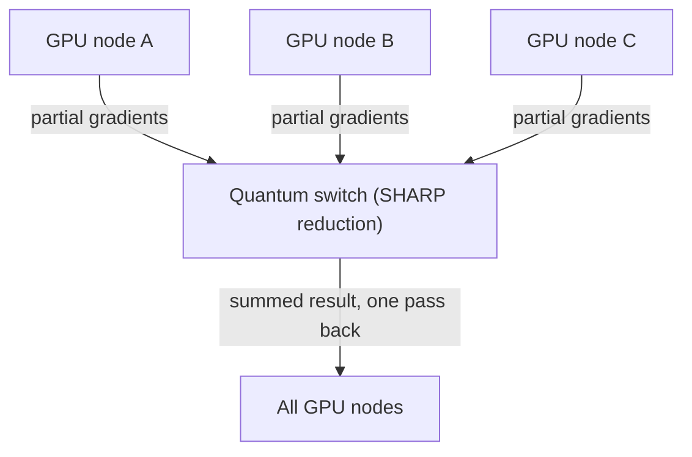
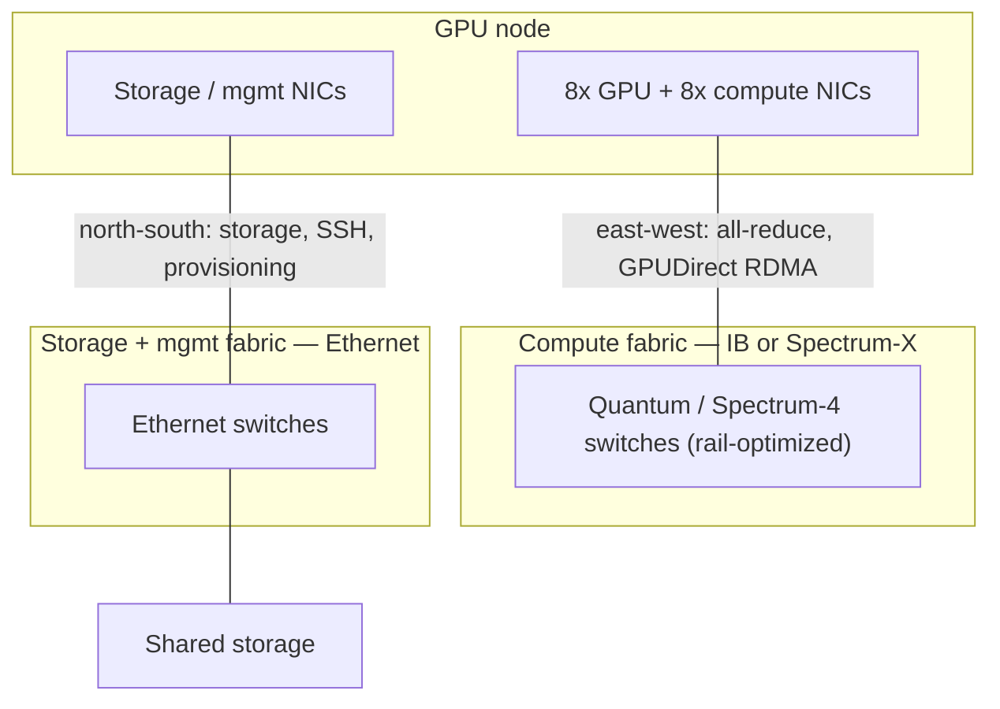

# Week 3 · Day 1 — AI networking fundamentals: InfiniBand vs Ethernet/RoCE

[← Master Plan](../../../MASTER-PLAN.md) · [Week 3 overview](plan.md) · [← previous day](../week-2/day-5.md) · [next day →](day-2.md)

## Study block (2 h)

Start with 15 minutes of flashcards (Domains 1 + 2), then work through this lesson into [notes.md](notes.md).

### Why AI training traffic breaks normal networking assumptions

A traditional datacenter network is built for many small, uncorrelated flows — web requests, database queries — where statistical multiplexing smooths everything out. Distributed AI training is the opposite in every way:

- **Synchronized bursts.** Data-parallel training ends every step with a collective operation (usually all-reduce) in which *every* GPU exchanges gradients with *every other* GPU at the same instant. The network goes from idle to saturated in microseconds, fleet-wide.
- **Elephant flows.** A handful of enormous, long-lived flows instead of millions of mice. ECMP hashing, designed for many small flows, can dump two elephants onto the same link and leave others idle.
- **Tail latency is everything.** The all-reduce cannot complete until the *slowest* packet arrives. One congested link stalls every GPU in the job. If 1,024 GPUs each cost dollars per hour, a 5% tail-latency problem is a 5% cluster-wide tax.
- **Loss is catastrophic.** TCP treats drops as normal congestion signals; RDMA transports historically handle loss very badly (go-back-N retransmission). AI fabrics therefore aim for *lossless* operation.

Hold onto that framing — every technology today is an answer to those four bullets.

### InfiniBand: the purpose-built answer

InfiniBand (IB) is a complete network stack designed for HPC, and it is the default fabric for NVIDIA DGX SuperPOD training clusters.

- **Lossless by design**: credit-based flow control means a sender only transmits when the receiver has advertised buffer credits. Packets are never dropped due to congestion — no drops, no retransmit storms.
- **RDMA native**: Remote Direct Memory Access is the transport, not a bolt-on. A NIC (in IB language, an **HCA — Host Channel Adapter**) writes directly into remote memory with no remote CPU involvement, giving single-digit-microsecond latency.
- **In-network computing — SHARP** (Scalable Hierarchical Aggregation and Reduction Protocol): NVIDIA Quantum switches perform the reduction (the summing of gradients) *inside the switch ASIC*, so data crosses the fabric roughly once instead of multiple times. Exam keyword: "switch performs the reduction" → SHARP.
- **Centrally managed**: a **subnet manager** (in NVIDIA deployments, **UFM — Unified Fabric Manager**) computes routes and configures the fabric. Deterministic, but it's a distinct operational skill set from Ethernet.
- **Hardware, early 2026**: Quantum-2 switches = NDR **400 Gb/s** per port with ConnectX-7 adapters; Quantum-X800 = XDR **800 Gb/s** with ConnectX-8. You don't need SKU trivia — know NDR 400G / XDR 800G and the names Quantum, ConnectX, UFM, SHARP.

**SHARP — the switch itself sums the gradients, so data crosses the fabric once:**

### RoCE: RDMA on Ethernet

**RoCE v2** (RDMA over Converged Ethernet) runs the same RDMA verbs over routable UDP/IP on Ethernet. Same zero-copy, kernel-bypass benefit — but Ethernet is lossy by default, so RoCE needs the fabric tuned toward losslessness:

- **PFC** (Priority Flow Control): per-priority pause frames to stop drops — effective but risks head-of-line blocking and pause storms if misconfigured.
- **ECN** (Explicit Congestion Notification) + DCQCN: switches mark packets under congestion; endpoints slow down before queues overflow.

The trade: broader vendor ecosystem, operational familiarity (every enterprise runs Ethernet), easier convergence with the rest of the datacenter — at the cost of careful tuning to approach IB behavior.

### Spectrum-X: NVIDIA's answer for the Ethernet camp

**Spectrum-X** is NVIDIA's Ethernet *platform* purpose-built for AI: the **Spectrum-4 switch** (51.2 Tb/s ASIC) working as a tightly coupled pair with the **BlueField-3 SuperNIC** at the endpoint. The switch does fine-grained adaptive routing (spraying packets across paths to defeat the elephant-flow/ECMP problem); the SuperNIC puts out-of-order packets back together and runs the congestion-control loop with switch telemetry. NVIDIA's claim: standard Ethernet interoperability with ~1.6× the effective bandwidth of generic Ethernet for AI, approaching IB behavior.

### Customer-facing decision framing

- **Maximum performance and scale, dedicated training cluster, greenfield** → **InfiniBand** (it's what SuperPOD reference architectures specify).
- **Ethernet-standardized organization, cloud alignment, converged ops team** → **Spectrum-X** (best AI Ethernet) or well-tuned **RoCE**.
- **Exam trap**: "lossless credit-based flow control" is InfiniBand; "PFC/ECN to *approximate* lossless" is RoCE. Don't cross them.

### The two-fabric pattern

Real clusters run *separate* fabrics: a **compute fabric** (east–west, GPU-to-GPU, typically IB or Spectrum-X, rail-optimized — more on rails tomorrow) and a **storage/management fabric** (Ethernet, north–south, storage traffic, provisioning, SSH). If a question mentions "in-band management network" or "storage network," that's not the compute fabric.

**One cluster, two fabrics — GPU east-west traffic never shares wire with storage/mgmt:**

### Read next

- NVIDIA Quantum InfiniBand platform overview — nvidia.com/en-us/networking/products/infiniband/
- NVIDIA Spectrum-X platform page — nvidia.com/en-us/networking/spectrumx/
- NVIDIA blog: "What is RDMA?" / RoCE explainer (search NVIDIA Developer Blog)
- Skim: DGX SuperPOD Reference Architecture, network fabric section

### Quick check

1. Why does one congested link slow down an entire 1,024-GPU training job?

Answer
The training step ends with a synchronized collective (all-reduce) that cannot complete until the last gradient packet arrives. Every GPU waits at the barrier, so tail latency on one link stalls the whole job.

2. A customer wants gradient reductions performed inside the network switches. Which technology, and on which fabric?

Answer
SHARP (Scalable Hierarchical Aggregation and Reduction Protocol), available on NVIDIA Quantum InfiniBand switches. It performs in-network reduction so gradient data crosses the fabric roughly once.

3. What makes InfiniBand lossless, and what do RoCE fabrics use instead?

Answer
IB uses credit-based flow control — senders transmit only against advertised receiver buffer credits, so congestion drops can't occur. RoCE runs on lossy Ethernet and approximates losslessness with PFC (priority pause) and ECN-based congestion control (DCQCN).

4. Name the two components that make Spectrum-X more than "just fast Ethernet."

Answer
The Spectrum-4 switch (adaptive routing / packet spraying with telemetry) working end-to-end with the BlueField-3 SuperNIC (reorders sprayed packets, runs congestion control). The endpoint–switch pairing is the platform.

## Build block (4 h)

**SGEMM ladder, rungs 1–2** — get correct before fast. [Project brief](../../../gpu-engineering-lab/01-foundations/week-03-matmul-optimization/README.md)

- Read `runner/src/main.rs` end to end — it's complete (alloc, cuBLAS reference, correctness gate, bench sweep, JSON). You only write kernel bodies.
- Rung 1 `sgemm_naive`: one thread per C element; pass the correctness gate at every size.
- Rung 2 `sgemm_coalesced`: change *only* the thread→element mapping so consecutive lanes read consecutive addresses; measure the jump and explain it in one sentence in your notes.
- Know why GFLOPS = 2·M·N·K / t (one multiply + one add per inner-loop element).
- Definition of done: both rungs correct at 128→4096; rung-2 speedup recorded.
- Hint: if rung 2 isn't several times faster than rung 1, your "coalesced" mapping probably still strides — check which index varies with `threadIdx.x`.

## Close the day (15 min)

- Add today's Anki cards: SHARP, credit-based flow control, PFC/ECN, Spectrum-X components, HCA/UFM, two-fabric pattern.
- Write one "hardest thing today" line in [notes.md](notes.md).
- Log any blockers (toolchain, unclear concepts) and what you'll try first tomorrow.
