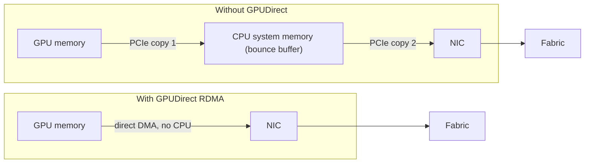
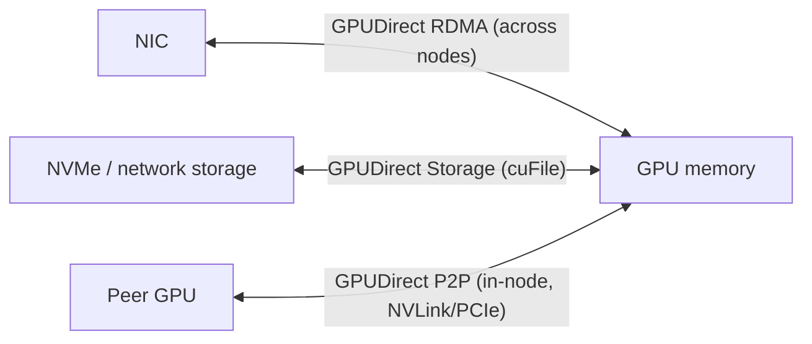
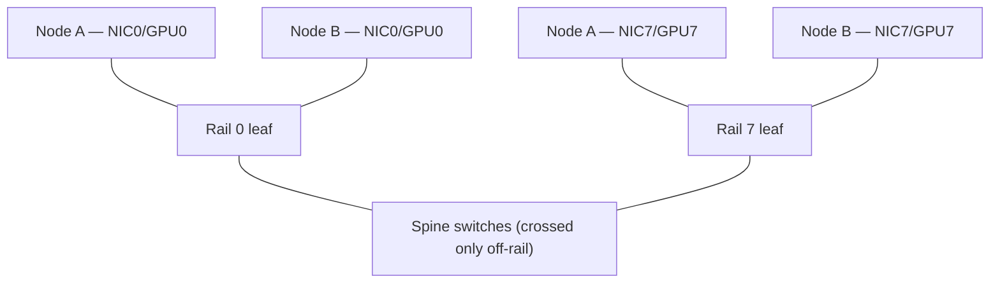

# Week 3 · Day 2 — GPUDirect RDMA and friends

[← Master Plan](../../../MASTER-PLAN.md) · [Week 3 overview](plan.md) · [← previous day](day-1.md) · [next day →](day-3.md)

## Study block (2 h)

15 minutes of flashcards first, then the GPUDirect family into [notes.md](notes.md).

### The baseline problem: the bounce buffer

Picture a multi-node training job on day 1's fabric. GPU 0 on node A must send a gradient shard to GPU 3 on node B. *Without* GPUDirect, the path is ugly:

1. GPU copies data from GPU memory → a staging buffer in CPU system memory (over PCIe).
2. The NIC reads that system-memory buffer (over PCIe again) and puts it on the wire.

That's an extra copy, extra PCIe transits, CPU cycles burned on data movement, and added latency — multiplied by every gradient exchange of every step. The entire GPUDirect family exists to delete intermediaries from data paths. When you see "eliminate the CPU bounce buffer" on the exam, it's a GPUDirect question.

**The bounce-buffer path vs the GPUDirect RDMA path:**

### The family, member by member

- **GPUDirect RDMA** — the NIC reads/writes **GPU memory directly** over PCIe, no system-memory staging, no CPU in the data path. This is the multi-node workhorse: **NCCL** uses it so all-reduce traffic flows GPU → NIC → fabric → NIC → GPU. Requires an RDMA-capable NIC (ConnectX / BlueField) and the peer-memory kernel support that ships with recent NVIDIA drivers.
- **GPUDirect Storage (GDS)** — the same idea for storage: NVMe drives or NVMe-oF/network storage DMA **directly into GPU memory**, bypassing the CPU bounce buffer. Uses the `cuFile` API. Payoff is highest for data-hungry pipelines: faster dataset loading and checkpoint restore, lower CPU utilization.
- **GPUDirect P2P (peer-to-peer)** — GPU↔GPU copies **within one node** without touching system memory, over PCIe or (much better) NVLink. This is what makes single-node multi-GPU `cudaMemcpyPeer` and NCCL intra-node paths fast.

Keep the taxonomy straight by remembering *which two devices talk directly*: RDMA = NIC↔GPU across nodes; Storage = disk↔GPU; P2P = GPU↔GPU in-node. Exam questions love to swap these.

**The family in one picture — which two devices talk directly:**

### What it takes to actually work

GPUDirect is not a checkbox; it's a stack alignment problem — good pre-sales trivia and a real exam angle:

- RDMA-capable NIC (ConnectX-6/7/8, BlueField) with matching firmware.
- NVIDIA driver + `nvidia-peermem` (peer memory) module so the NIC can pin/translate GPU memory.
- For collectives: NCCL picks GPUDirect RDMA automatically when topology allows; verify with NCCL debug logs.
- **In Kubernetes: the NVIDIA Network Operator** deploys and configures the RDMA/NIC side (OFED driver container, device plugins, secondary networks) the same way the GPU Operator handles the GPU side. GPU Operator + Network Operator together = GPUDirect-ready K8s nodes. Tie this to your day-job GPU Operator knowledge — it's a near-certain exam pairing.

### Rail-optimized topology (recognize the term)

A DGX H100 node has 8 GPUs and 8 compute-fabric NICs — one NIC *per GPU*. In a **rail-optimized** design, NIC *i* of every node connects to the same leaf switch group ("rail" *i*): 8 rails, one per GPU position. GPU 3 on node A talks to GPU 3 on node B entirely within rail 3 — one switch hop on a leaf, no crossing the spine for the common collective patterns. Combined with GPUDirect RDMA, each GPU effectively owns a private lane to its peers. You don't need to design one; you need to recognize "rail-optimized" as *the SuperPOD-style compute-fabric topology that gives each GPU its own NIC/switch path* and pairs with NCCL's ring/tree collectives.

**Rail-optimized topology — same-position GPUs meet on their own leaf rail (rails 1–6 omitted):**

### Customer framing

- "Multi-node training scales poorly; CPUs are pegged during all-reduce" → check GPUDirect RDMA is actually active (peermem loaded, NCCL using it).
- "Data loading starves the GPUs; storage is fast but CPU is the bottleneck" → GPUDirect Storage.
- "Slow GPU↔GPU transfers inside one server" → P2P over NVLink (and check the topology with `nvidia-smi topo -m`).

### Read next

- GPUDirect overview hub — developer.nvidia.com/gpudirect
- GPUDirect Storage design guide intro — docs.nvidia.com/gpudirect-storage/
- NVIDIA blog: any recent post on multi-node training data paths / NCCL + GPUDirect RDMA
- NVIDIA Network Operator docs, overview page (skim — know what it installs)

### Quick check

1. What copy does GPUDirect RDMA eliminate, exactly?

Answer
The staging copy through CPU system memory. Without it, GPU data is first copied to a host bounce buffer, then read by the NIC. With it, the NIC DMAs GPU memory directly over PCIe — no host copy, no CPU in the data path.

2. Match the GPUDirect member to the pair of devices it connects directly: (a) RDMA, (b) Storage, (c) P2P.

Answer
(a) NIC ↔ GPU memory (across nodes, over the fabric); (b) storage/NVMe ↔ GPU memory; (c) GPU ↔ GPU within a node (PCIe or NVLink).

3. In Kubernetes, which operator prepares nodes for GPUDirect RDMA networking, and what's its GPU-side sibling?

Answer
The NVIDIA Network Operator (OFED/RDMA drivers, NIC device plugins, secondary networks); its sibling is the GPU Operator (GPU driver, container toolkit, device plugin, DCGM exporter).

4. What does "rail-optimized" mean and why does it help all-reduce?

Answer
Each of a node's 8 NICs (one per GPU) connects to its own switch "rail"; GPU i on every node communicates within rail i. Collective traffic between same-position GPUs stays one hop on its rail instead of contending across the spine, cutting congestion and tail latency.

## Build block (4 h)

**SGEMM rung 3 — shared-memory tiling.** [Project brief](../../../gpu-engineering-lab/01-foundations/week-03-matmul-optimization/README.md)

- Stage TILE×TILE blocks of A and B through `shared_array!`; accumulate the K loop in a register.
- Justify BOTH `sync_threads()` calls in a comment (one before use, one before overwrite — write *why*).
- Gate: **≥10× rung 1 at 4096²** — this is the week's acceptance criterion #2.
- Definition of done: rung 3 correct at all sizes, ≥10× naive, one-paragraph explanation of where the speedup comes from (smem reuse factor = TILE).
- Hint: if you're short of 10×, check that the *tile loads themselves* coalesce (consecutive threads → consecutive global addresses) and look for smem bank conflicts in `ncu`.

## Close the day (15 min)

- Anki: bounce buffer, GPUDirect RDMA/Storage/P2P device pairs, nvidia-peermem, Network Operator, rail-optimized.
- One "hardest thing today" line in [notes.md](notes.md).
- Blockers: note anything unclear about NCCL/GPUDirect interplay to re-read tomorrow.
