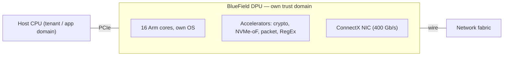

# Week 3 · Day 3 — DPUs and BlueField

[← Master Plan](../../../MASTER-PLAN.md) · [Week 3 overview](plan.md) · [← previous day](day-2.md) · [next day →](day-4.md)

## Study block (2 h)

Flashcards (15 min), then today's lesson into [notes.md](notes.md). This is a high-yield exam topic with a small, memorizable core.

### The three-processors story

NVIDIA frames the modern datacenter around three processor classes, and the exam adopts this framing verbatim:

- **CPU** — general-purpose compute: the application logic, the OS.
- **GPU** — accelerated compute: the parallel math (training, inference, analytics).
- **DPU** — **data processing unit**: the *infrastructure* — moving, securing, and virtualizing data — offloaded from the CPU and run on a dedicated device.

The pitch behind the DPU: in a busy virtualized/multi-tenant server, 20–30% of CPU cores can end up consumed by "datacenter tax" — virtual switching, storage virtualization, encryption, firewalling. Those are cores the customer paid for but can't sell or use for applications. A DPU takes that work onto its own silicon *and* moves it off the host trust domain.

### BlueField: what's on the card

A **BlueField DPU** is essentially three things fused onto one PCIe card:

1. A **ConnectX high-speed NIC** (BlueField-3: up to 400 Gb/s),
2. A set of **Arm CPU cores** (BlueField-3: 16 Arm cores) running their own OS, independent of the host,
3. **Hardware accelerators** for specific tasks: crypto (IPsec/TLS inline encryption), storage (NVMe-oF), packet processing, RegEx/deep packet inspection.

Because the DPU runs its own software stack, it is a computer *in front of* the computer — it can enforce policy on the host even if the host is compromised or is a bare-metal tenant you don't trust.

**BlueField on the card — a computer in front of the computer:**

### The three offload categories (memorize as N-S-S: networking, storage, security)

- **Networking**: virtual switching (OVS offload), overlay networks (VXLAN encap/decap), routing/telemetry — line-rate in hardware instead of burning host cores.
- **Storage**: NVMe over Fabrics (NVMe-oF) target/initiator offload, elastic block storage emulation — the host sees a local NVMe drive that is actually remote (e.g., **SNAP** technology); the DPU handles the plumbing.
- **Security**: next-gen firewall functions, inline encryption at line rate, and **zero-trust microsegmentation** — security enforced *below* the host OS, isolating infrastructure from tenant workloads. This isolation story is why every hyperscaler-style bare-metal cloud runs a DPU-like card.

### DOCA — the software story

**DOCA** is the SDK and runtime framework for programming BlueField. The analogy NVIDIA repeats (and the exam expects): **DOCA is to DPUs what CUDA is to GPUs** — the stable software layer that lets applications target successive DPU generations. DOCA includes drivers, libraries (DOCA Flow for packet steering, storage and crypto libs), and reference services.

### BlueField-3 SuperNIC vs DPU (fine but testable distinction)

Same silicon family, two roles: the **DPU** is the full infrastructure-offload computer (runs services on its Arm cores); the **SuperNIC** variant is optimized as the *endpoint of an AI fabric* — powering Spectrum-X congestion control and packet reordering (yesterday's lesson), GPUDirect-friendly, one per GPU in rail-optimized designs. If the question is about offloading OVS/storage/security → DPU. If it's about the Ethernet AI-fabric endpoint paired with Spectrum-4 → SuperNIC.

### Customer-facing decision framing

- "Our hypervisor networking/security stack eats CPU cores we want for VMs/tenants" → BlueField DPU offload.
- "We rent bare-metal GPU servers to customers but must keep our infrastructure control plane isolated from them" → DPU (infrastructure runs on the DPU, host is fully tenant-owned).
- "We're building an AI-optimized Ethernet fabric" → BlueField-3 SuperNIC + Spectrum-4 (Spectrum-X).
- Exam drill: any scenario with *"isolate infrastructure services from tenant workloads"* or *"free up CPU cores consumed by networking/security"* → the answer contains **DPU**.

### VMware/ESXi tie-in (one-liner)

vSphere can run its networking/security services on BlueField DPUs — the enterprise-virtualization proof point that DPU offload is mainstream, not hyperscaler-only.

### Read next

- NVIDIA BlueField product page — nvidia.com/en-us/networking/products/data-processing-unit/
- NVIDIA blog: "What is a DPU?" (the canonical three-processors post)
- DOCA overview — developer.nvidia.com/networking/doca
- Optional: a BlueField SNAP / NVMe-oF explainer for the storage-emulation story

### Quick check

1. Name the three processor classes in NVIDIA's datacenter framing and each one's job.

Answer
CPU = general-purpose application compute; GPU = accelerated parallel compute (AI/HPC math); DPU = infrastructure processing — networking, storage, and security offloaded from the host CPU.

2. What are the three DPU offload categories, with one concrete example each?

Answer
Networking (OVS/virtual switch and VXLAN overlay offload), storage (NVMe-oF offload / remote storage presented as local NVMe via SNAP), security (line-rate inline encryption, firewall, zero-trust microsegmentation below the host OS).

3. Complete the analogy and explain it: DOCA : DPU :: ___ : GPU.

Answer
CUDA. DOCA is the SDK/runtime that gives developers a stable programming layer for BlueField DPUs across hardware generations, exactly as CUDA does for GPUs.

4. A GPU cloud provider rents bare-metal DGX nodes to untrusted tenants but must retain control of networking and monitoring. What do you propose and why?

Answer
BlueField DPUs: the provider's infrastructure stack (networking, storage access, security policy, telemetry) runs on the DPU's Arm cores in its own trust domain, so the tenant can own the entire host OS while the provider still enforces and observes from the DPU.

## Build block (4 h)

**SGEMM rungs 4–5 — register blocking.** [Project brief](../../../gpu-engineering-lab/01-foundations/week-03-matmul-optimization/README.md)

- Rung 4 `sgemm_1d_blocktile`: each thread computes TM results (a column strip) — each smem load now amortizes over TM FMAs.
- Rung 5 `sgemm_2d_blocktile`: TM×TN register tile per thread with outer-product accumulation — the rung that moves you from memory-bound toward compute-bound.
- Verify the memory→compute transition in `ncu` (stall reasons, achieved FLOPS) — don't assert it.
- Check the generated PTX for local-memory spills; register arrays must stay in registers.
- Definition of done: rungs 4–5 correct at all sizes; measured GFLOPS per rung logged; one sentence per rung explaining the arithmetic-intensity gain.
- Hint: spills usually come from non-const indexing into your accumulator array — make the tile loops fully unrollable with constant bounds.

## Close the day (15 min)

- Anki: three processors, N-S-S offload triple, DOCA:CUDA analogy, SuperNIC vs DPU, SNAP one-liner.
- One "hardest thing today" line in [notes.md](notes.md).
- Blockers: flag any rung-5 spill/perf mystery for tomorrow's ncu deep-dive.
