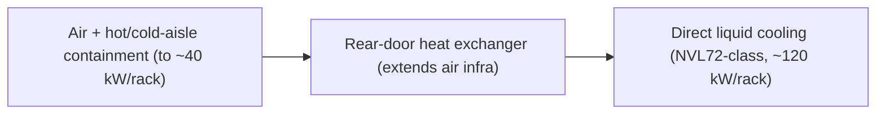
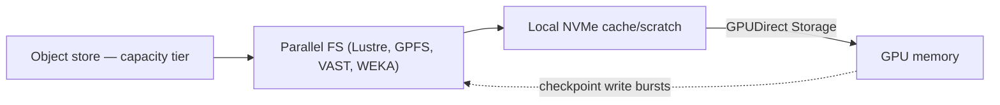

# Week 3 · Day 4 — Datacenter design: power, cooling, and storage for AI

[← Master Plan](../../../MASTER-PLAN.md) · [Week 3 overview](plan.md) · [← previous day](day-3.md) · [next day →](day-5.md)

## Study block (2 h)

Flashcards (15 min), then two half-lessons into [notes.md](notes.md): facilities first, storage second.

### Part 1 — Power and cooling: the physical wall

The numbers to know cold, because they anchor every facilities question:

- A **DGX H100 node draws ~10.2 kW** at full load — one server drawing what a whole traditional rack used to.
- **AI racks run 40–120+ kW**, versus **~10–15 kW** for a traditional enterprise rack. A **GB200 NVL72** rack-scale system sits around **~120 kW in a single liquid-cooled rack**.
- Consequences: power delivery (busways, PDUs, utility feeds), floor loading (liquid-cooled AI racks are *heavy*), and heat rejection become **first-order design constraints** — often the schedule-limiting item for on-prem AI buildouts, ahead of GPU supply.

**The cooling ladder** (each step handles more kW per rack):

1. **Air cooling with hot-aisle/cold-aisle containment** — the classic; practical up to roughly **~40 kW/rack**, and even that takes aggressive airflow engineering.
2. **Rear-door heat exchangers (RDHx)** — a water-cooled coil on the rack's exhaust door; extends air-cooled infrastructure to higher densities without touching the servers.
3. **Direct liquid cooling (DLC / direct-to-chip)** — coolant loops to cold plates on GPUs/CPUs. **Required territory for Blackwell NVL72-class racks**; also the efficient choice, since liquid moves heat far better than air and cuts fan energy.

**The cooling ladder — each step absorbs more kW per rack:**

**PUE — Power Usage Effectiveness** = total facility power ÷ IT equipment power. 1.0 is perfect (every watt goes to compute); typical legacy datacenters ~1.5–1.6; well-run modern/liquid-cooled facilities push toward 1.1 or below. Liquid cooling improves PUE because you stop spending energy on massive air handling. Exam trap: PUE *lower* is better; a PUE of 2.0 means you burn one watt of overhead per watt of IT.

Customer framing: "Can we host 8 DGX nodes in our existing server room?" → do the math out loud (8 × 10.2 kW ≈ 82 kW of IT load plus cooling) — the honest answer is usually colo, retrofit, or cloud, and knowing that *is* the pre-sales value.

### Part 2 — Storage for AI: why slow storage means idle GPUs

**The I/O pattern of training** is unlike enterprise workloads:

- **Many parallel readers**: hundreds of dataloader workers across nodes streaming shuffled samples — high *sequential throughput* demand in aggregate, often random-ish at the file level.
- **Checkpoint bursts**: periodically, the job dumps tens of GB to multiple TB (model + optimizer state) as fast as possible — a huge synchronized *write* spike. Slow checkpointing = GPUs stalled = money burned; it also decides how much work you lose on failure.
- The core equation: if storage can't feed the GPUs, they starve ("data starvation") and your $30k+ accelerators idle at low utilization. Storage throughput is a *GPU utilization* problem, not a storage problem.

**The tier model** (know the categories, not vendor details):

1. **Local NVMe** in each node — scratch space and dataset cache; fastest, smallest, not shared.
2. **Shared high-performance / parallel file systems** — the training working tier: **Lustre**, **IBM Spectrum Scale (GPFS)**, and modern scale-out NAS/flash platforms like **VAST Data** and **WEKA**. Recognize these as "the parallel/high-performance file tier certified in DGX SuperPOD/BasePOD architectures."
3. **Object storage** (S3-style) — the capacity tier: raw datasets, archives, artifacts; highest capacity, highest latency.

The pipeline is a flow *down* the tiers: object store → parallel FS → local NVMe cache → GPU memory. **GPUDirect Storage** (Day 2) accelerates the last hop by DMA-ing straight into GPU memory, and several of the parallel-FS vendors support it end to end.

**Data flows down the tiers toward the GPU; checkpoints burst back up:**

### Exam-trap distinctions for today

- PUE lower = better (ratio, not a percentage).
- Air containment ≈ up to ~40 kW/rack; NVL72-class = liquid, non-negotiable.
- Checkpointing stresses *write* throughput; dataset loading stresses *read* throughput — a question saying "checkpoints take too long" is a storage-write/bandwidth answer, not a dataloader answer.
- Local NVMe is a cache/scratch tier, not shared storage — multi-node jobs need the shared parallel tier.

### Read next

- DGX SuperPOD Reference Architecture — facilities/power and storage sections (skim, note the numbers)
- NVIDIA blog/technical brief on liquid cooling for Blackwell (GB200 NVL72)
- GPUDirect Storage overview — docs.nvidia.com/gpudirect-storage/ (re-skim with today's tier picture)

### Quick check

1. Roughly how much power does a DGX H100 node draw, and what's the range for AI racks vs traditional racks?

Answer
~10.2 kW per DGX H100 node; AI racks run ~40–120+ kW (GB200 NVL72 ≈ 120 kW) versus ~10–15 kW for traditional enterprise racks.

2. Order the cooling ladder and state where liquid cooling becomes mandatory.

Answer
Air with hot/cold-aisle containment (to ~40 kW/rack) → rear-door heat exchangers → direct liquid cooling. DLC is required for Blackwell NVL72-class rack-scale systems and is the norm for the highest-density racks.

3. A facility uses 1.3 MW total to deliver 1.0 MW to IT equipment. PUE? Good or bad?

Answer
PUE = 1.3/1.0 = 1.3. Respectable — better than legacy (~1.5–1.6), worse than the best modern liquid-cooled facilities (~1.1 or below). Lower is better.

4. Training throughput drops every 30 minutes for two minutes at a time; GPUs sit idle. Dataloading is fine. Most likely storage cause?

Answer
Checkpoint write bursts. Periodic checkpointing dumps model + optimizer state as a synchronized large write; if the shared storage tier can't absorb the write burst, all GPUs stall until it completes.

## Build block (4 h)

**SGEMM rung 6 + Nsight Compute deep-dive.** [Project brief](../../../gpu-engineering-lab/01-foundations/week-03-matmul-optimization/README.md)

- Rung 6 `sgemm_vectorized`: 128-bit (float4-style) global→shared loads; store A transposed in smem so the inner loop reads both tiles conflict-free. This rung is the escape hatch's most likely customer — take it after 30 min of fighting, and log it.
- Profile **all** rungs with `ncu --set full`: record occupancy, achieved DRAM %, L2 hit rate, smem throughput, and top stall reason per rung into the RESULTS.md table.
- If attempting rung 7 (WMMA/Tensor Cores), start here.
- Definition of done: rung 6 correct + measured; ncu table filled for rungs 1–6; escape-hatch decisions logged.
- Hint: after transposing A in smem, re-derive the bank-index math — the transpose changes which accesses conflict, and a padding column (`TILE+1`) is the classic fix.

## Close the day (15 min)

- Anki: 10.2 kW / 40–120 kW / ~40 kW air limit / NVL72 ≈ 120 kW liquid; PUE definition + direction; storage tiers; read-vs-write burst distinction.
- One "hardest thing today" line in [notes.md](notes.md).
- Blockers: list any rung whose ncu numbers you can't yet explain — that's Friday's writeup material.
