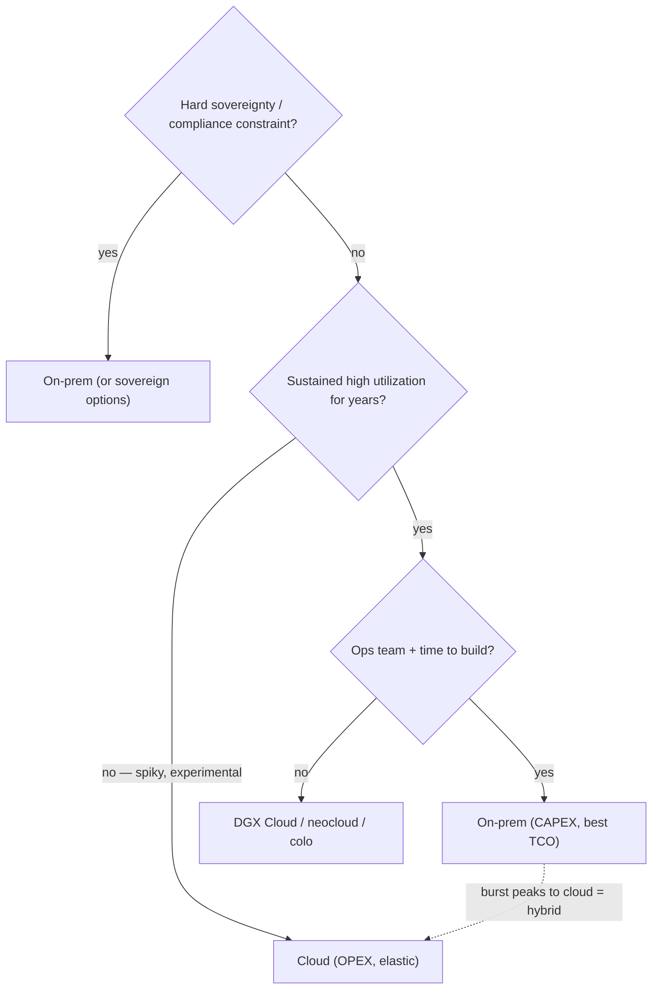

# Week 3 · Day 5 — On-prem vs cloud vs hybrid + Domain 2 review

[← Master Plan](../../../MASTER-PLAN.md) · [Week 3 overview](plan.md) · [← previous day](day-4.md) · [next day →](../week-4/day-1.md)

## Study block (2 h)

Flashcards (15 min), then the deployment-models lesson (~40 min), the full-stack mental map (~20 min), and the closed-notes [self-check](self-check.md) (~45 min).

### Deployment models: the decision every customer conversation lands on

**Cloud**

- **OPEX** economics: pay per hour, no capital outlay, start this week.
- Elasticity: burst to hundreds of GPUs for a training run, release them after.
- Every major cloud offers NVIDIA GPU instance families (A100/H100/B200-class); capacity for the newest parts is often quota-gated and region-constrained — "can you actually get them" is a real question.
- Watch-outs: **data egress costs** (moving results/datasets out is billed), long-running training at list price quickly exceeds hardware cost, limited control of topology/fabric.

**On-prem**

- **CAPEX** economics: buy DGX/HGX systems, own them for years.
- **Best TCO at sustained high utilization** — the crossover argument: if the cluster runs hot most of the time for multiple years, owning beats renting decisively.
- Full control: custom InfiniBand fabrics, rail-optimized topologies, data never leaves the building — **data sovereignty / security / compliance** (health, finance, government) is often the deciding constraint, not cost.
- Costs beyond the invoice: yesterday's power/cooling reality, datacenter space, an ops team, and **long lead times** (procurement to production can be quarters).

**Hybrid**

- The pragmatic default: **steady-state on-prem, burst to cloud** for peaks and experiments.
- The force that decides placement is **data gravity**: large datasets are slow and expensive to move, so compute goes where the data already lives. A 2 PB training corpus on-prem effectively pins training on-prem; data born in cloud object storage pulls training to the cloud.

**The middle paths (name-recognition level)**

- **DGX Cloud**: NVIDIA-operated AI supercomputing rented monthly — SuperPOD-class clusters hosted in partner clouds, with NVIDIA software (Base Command, AI Enterprise) included. Positioning: on-prem-class training infrastructure without building it.
- **GPU clouds / neoclouds** (CoreWeave-style) and colocation: specialist providers with better GPU pricing/availability than general clouds; colo = your hardware, someone else's power and cooling.

### The decision-drivers checklist (rehearse until fluent)

1. **Utilization %** — sustained-high → on-prem; spiky/experimental → cloud.
2. **Data sovereignty/compliance** — hard requirement → on-prem (or sovereign/dedicated options).
3. **Where the data lives** — data gravity pins compute.
4. **Time-to-start** — need GPUs this month → cloud/DGX Cloud; can wait quarters → on-prem.
5. **In-house ops skill** — no infra team → cloud or DGX Cloud, regardless of TCO math.

**The placement decision, driver by driver:**

Exam trap: don't equate cloud=cheap and on-prem=expensive. The exam tests *utilization-based* reasoning: high sustained utilization flips the economics to on-prem; low/bursty utilization favors cloud. And OPEX vs CAPEX labels must land on the right side.

### The full-stack mental map (draw it, 20 min)

Draw the whole Domain 2 picture once, by hand, labeling every layer with this week's vocabulary:

**GPU → node (HGX board, NVLink/NVSwitch) → NVLink domain (NVL72) → rack (power/cooling: 40–120 kW, DLC) → compute fabric (IB Quantum or Spectrum-X, rail-optimized, GPUDirect RDMA, DPU/SuperNIC endpoints) → storage fabric + tiers (NVMe → parallel FS → object) → deployment wrapper (on-prem / cloud / hybrid / DGX Cloud)**

If you can talk through this drawing for three minutes without notes, Domain 2 (40% of the exam) is structurally yours.

### Self-check (45 min, closed notes)

Sit [self-check.md](self-check.md) without notes. Score honestly; restudy misses immediately from [notes.md](notes.md) and the week's sources. Then run the exit-criteria checklist at the bottom of [plan.md](plan.md) — every unchecked box is Monday-morning homework before Week 4's new material.

### Read next

- NVIDIA DGX Cloud page — positioning and what's bundled
- One TCO/cloud-vs-on-prem article for AI infrastructure (NVIDIA or analyst) — read for the utilization-crossover argument
- Your own week-3 notes.md, end to end (it's a source now)

### Quick check

1. A pharma customer with strict data-residency rules and a 3-year, always-busy training roadmap asks cloud or on-prem. Your two-sentence answer?

Answer
On-prem (or sovereign/dedicated infrastructure): data sovereignty is a hard constraint, and sustained high utilization over years makes CAPEX ownership the better TCO anyway. Cloud could still serve burst experimentation on non-sensitive data — a hybrid edge.

2. What is data gravity and what does it decide?

Answer
Large datasets are expensive/slow to move, so compute gravitates to where data already lives. It decides workload placement in hybrid designs — training runs next to the corpus, whether that's on-prem or in a cloud region.

3. What is DGX Cloud in one sentence, and who is it for?

Answer
NVIDIA-operated, SuperPOD-class AI infrastructure rented as a service in partner clouds with NVIDIA's software stack included — for organizations that want on-prem-class training capability without building or operating it.

4. Which economics label goes with which model, and what single metric most often flips the recommendation?

Answer
Cloud = OPEX, on-prem = CAPEX. Sustained utilization is the flipper: high, steady utilization favors on-prem TCO; low or bursty utilization favors cloud.

## Build block (4 h)

**SGEMM finale — chart, roofline, writeup.** [Project brief](../../../gpu-engineering-lab/01-foundations/week-03-matmul-optimization/README.md)

- `make bench`: full sweep {128…4096} × all rungs + cuBLAS → `results/sgemm_ladder.json`.
- `python bench/plot_ladder.py` → GFLOPS bars, %-of-cuBLAS line, scaling chart.
- Build the roofline from Week 2's measured DRAM bandwidth + peak FP32; place all rungs on it.
- RESULTS.md: per-rung honest paragraph (prediction vs ncu reality), escape-hatch log. Push.
- Definition of done: acceptance criteria all green — every rung correct, rung 3 ≥10× naive, best rung ≥50% of cuBLAS at 4096², charts regenerate with one command.
- Hint: benchmark plugged in with a fixed power profile and interleave rungs across the sweep — thermal drift on the laptop 5090 will otherwise bias the later rungs.

## Close the day (15 min)

- Anki: OPEX/CAPEX mapping, five decision drivers, data gravity, DGX Cloud one-liner.
- One "hardest thing today" line in [notes.md](notes.md) — plus your self-check score.
- Blockers: carry any unchecked exit-criteria boxes into Monday as first-thing review; Week 4 starts AI Operations.
