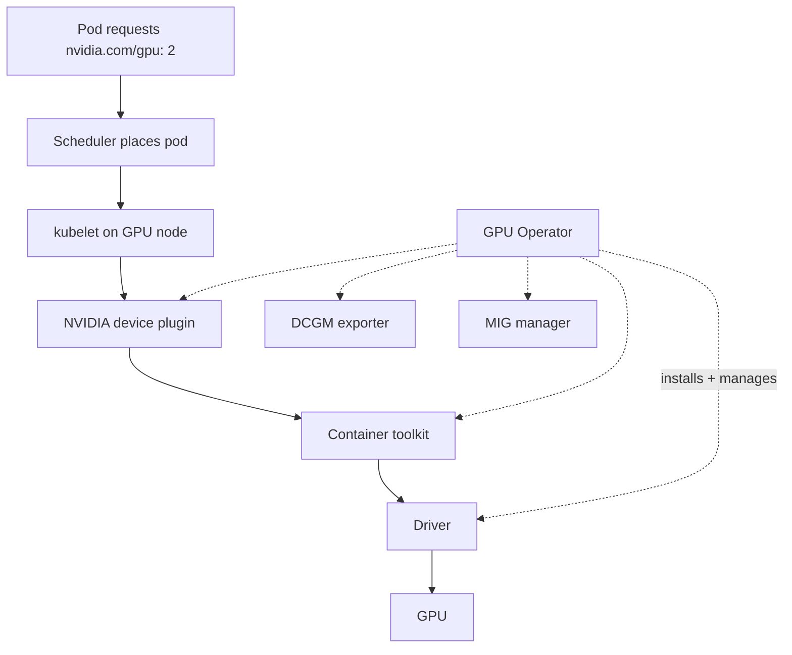
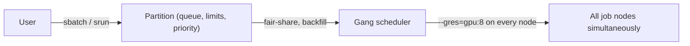

# Week 4 · Day 1 — Cluster orchestration: Kubernetes and Slurm

[← Master Plan](../../../MASTER-PLAN.md) · [Week 4 overview](plan.md) · [← previous day](../week-3/day-5.md) · [next day →](day-2.md)

## Study block (2 h)

Exam week begins — exam is **Friday**. Flashcards across *all* domains (15 min), then today's lesson into [notes.md](notes.md). Domain 3 (AI Operations, 22%, ~11 questions) is the closest to your day job; the goal today is converting what you already do into exam-precise one-liners.

### Kubernetes for AI: how a pod actually gets a GPU

The chain the exam expects you to know, in order:

1. **Containers are the packaging unit** — the model code, framework, and CUDA libraries ship as a container image (typically from **NGC**, NVIDIA's catalog of optimized containers, models, and Helm charts).
2. GPUs are not native Kubernetes resources. The **NVIDIA device plugin** runs on each node and advertises GPUs to the kubelet as an extended resource: `nvidia.com/gpu`.
3. A pod requests GPUs in its spec — `resources.limits: nvidia.com/gpu: 2` — and the scheduler places it on a node with capacity. GPUs are requested in *whole units* (integer), not fractions (sharing comes tomorrow with MIG/time-slicing).
4. For any of that to work, the node needs: the NVIDIA **driver**, the **container toolkit** (so containers can see the GPU), the device plugin, and monitoring.

The **GPU Operator** is the exam-level answer to "who installs all of that": *one operator that deploys and lifecycle-manages the entire NVIDIA software stack on every GPU node — driver, container toolkit, device plugin, DCGM exporter, MIG manager — as containers, keeping nodes consistent and upgradeable.* You run this daily; make sure you can also say it in exactly one sentence, because that's how it's tested.

**How a pod gets a GPU — and what the GPU Operator installs along the way:**

### Slurm: the HPC scheduler

**Slurm** is the dominant batch scheduler from the HPC world, and it runs many of the largest training clusters:

- The model is **jobs in queues**: users submit batch scripts (`sbatch`) or launch interactively (`srun`); jobs wait in **partitions** (named queues with limits/priorities) until resources free up.
- GPUs are **generic resources (gres)**: `--gres=gpu:8` requests 8 GPUs; Slurm tracks and enforces the allocation.
- Strengths: **gang-scheduling** a 512-GPU job as one unit (all nodes at once — critical because a distributed job can't run partially), topology awareness (placing jobs to minimize fabric hops), fair-share accounting between research groups, and efficient backfill of the queue.

**The Slurm job path — queue until resources free, then all nodes at once:**

### K8s vs Slurm — the positioning question (near-certain exam material)

- **Slurm** = batch-oriented, HPC-style **training** clusters: long-running multi-node jobs, queues, fair-share between teams, maximum utilization of a fixed cluster.
- **Kubernetes** = **services and inference** plus cloud-native ML platforms: long-lived deployments, autoscaling, rolling updates, the entire cloud-native ecosystem (monitoring, CI/CD, service mesh).
- Reality (and increasingly the exam's nuance): **many shops run both** — Slurm for the training cluster, K8s for serving — or run K8s with batch-scheduling layers on top (Volcano, Kueue, **Run:ai** — the K8s GPU orchestration/quota layer NVIDIA acquired; also your KAI Scheduler world). If a question offers "K8s with a batch scheduler" for training, it's a legitimate modern answer; but for classic "large multi-node batch training with queues and fair-share," Slurm is the intended choice.

Customer framing: ask *what runs* — "we submit training jobs and want the cluster full 24/7" → Slurm (or K8s + batch layer); "we deploy inference endpoints that must autoscale" → Kubernetes.

### Three one-liners to memorize verbatim

- **NGC**: NVIDIA's catalog/registry of GPU-optimized containers, pretrained models, and Helm charts — the runtime artifact source.
- **Base Command Manager (BCM)**: NVIDIA's cluster provisioning and management software — bare-metal-to-running-cluster (imaging, node management, can deploy K8s or Slurm on top).
- **Run:ai**: Kubernetes-native GPU orchestration/scheduling layer (quotas, fractional GPUs, fair-share between teams), acquired by NVIDIA.

### Read next

- GPU Operator docs — overview page (docs.nvidia.com/datacenter/cloud-native/gpu-operator/)
- GPU Operator Helm chart page on NGC (catalog.ngc.nvidia.com — see what an NGC artifact looks like)
- One "Slurm vs Kubernetes for ML" article (NVIDIA blog or community) — read for the positioning language
- Slurm quickstart (schedmd.com) — just the sbatch/srun/partition/gres vocabulary

### Quick check

1. Walk the chain: how does a pod end up with a GPU in Kubernetes?

Answer
The NVIDIA device plugin on each node advertises GPUs to the kubelet as the extended resource nvidia.com/gpu; the pod requests it under resources.limits; the scheduler places the pod on a node with free GPUs; the container toolkit + driver (installed by the GPU Operator) make the GPU visible inside the container.

2. What does the GPU Operator automate — the one-sentence version?

Answer
It deploys and lifecycle-manages the full NVIDIA stack on every GPU node — driver, container toolkit, device plugin, DCGM exporter, MIG manager — as one Kubernetes operator.

3. In Slurm, what are sbatch, srun, a partition, and gres?

Answer
sbatch submits a batch job script to a queue; srun launches tasks (interactively or within a job); a partition is a named queue of nodes with its own limits/priorities; gres ("generic resources") is how non-CPU resources like GPUs are requested and tracked, e.g. --gres=gpu:8.

4. A research lab runs multi-node training jobs submitted by 12 teams sharing one fixed cluster, and separately serves models to production with autoscaling. Position Slurm and K8s.

Answer
Slurm for the shared training cluster — gang scheduling, queues, fair-share across the 12 teams, maximum utilization; Kubernetes for production inference — long-lived autoscaling services with rolling updates. Running both (or K8s with a batch layer like Run:ai/Volcano for training) is the standard pattern.

## Build block (4 h)

**rusty-kernels Day 1 — PyO3/maturin end-to-end + the binding decision.** [Project brief](../../../gpu-engineering-lab/01-foundations/week-04-pytorch-custom-ops/README.md)

- `maturin develop --release` until `import rusty_kernels` works in the venv (sanity: device capability prints `(12, 0)`).
- Implement the `passthrough` kernel and round-trip a CUDA tensor via `rusty_kernels.ops.passthrough(x)` — proves maturin → PyO3 → data_ptr → PTX → launch before any math.
- Read `ext/src/lib.rs` (complete) until you can explain every validation and every `unsafe`.
- Write the data_ptr-vs-DLPack decision paragraph in RESULTS.md (ownership, contiguity, lifetime, stream-ordering failure modes).
- Definition of done: import works, passthrough round-trips, decision paragraph written.
- Hint: if the extension imports but the launch fails, check that `ext/build.rs` actually rebuilt the PTX for sm_120 — stale PTX from a previous arch is the classic silent failure.

## Close the day (15 min)

- Anki: `nvidia.com/gpu` chain, GPU Operator one-liner, sbatch/srun/partition/gres, NGC/BCM/Run:ai one-liners, Slurm-vs-K8s positioning.
- One "hardest thing today" line in [notes.md](notes.md).
- Blockers: anything shaky from weeks 1–3 flashcards today? Write it down — it goes into Thursday's re-drill list, not tonight.
