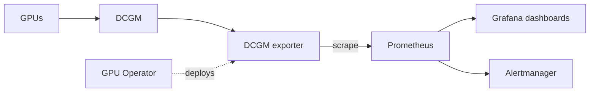
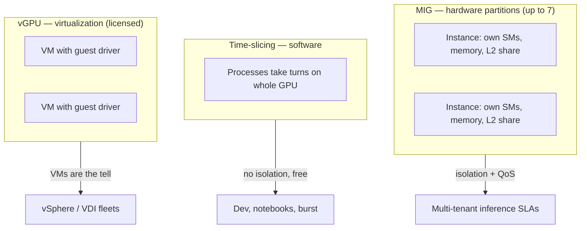

# Week 4 · Day 2 — GPU monitoring + MIG vs time-slicing vs vGPU

[← Master Plan](../../../MASTER-PLAN.md) · [Week 4 overview](plan.md) · [← previous day](day-1.md) · [next day →](day-3.md)

## Study block (2 h)

Flashcards (15 min), then the last new material of the certification — two lessons into [notes.md](notes.md). Tomorrow is the mock; tonight Domain 3 must be complete.

### Part 1 — Monitoring: nvidia-smi vs DCGM

**nvidia-smi** is the on-node CLI that ships with the driver. It shows, per GPU: utilization, memory used/total, temperature, power draw, clock speeds, running processes, and ECC error counts. Its exam positioning: **great for spot checks and interactive debugging on one node; not a fleet monitoring solution** — no history, no alerting, no aggregation.

**DCGM (Data Center GPU Manager)** is the fleet-grade answer:

- **Background health monitoring** with negligible overhead — continuous passive checks on every GPU.
- **Active diagnostics**: `dcgmi diag` runs on-demand test suites at increasing depth (quick sanity → medium → long hardware diagnostics) — the tool for "is this GPU actually healthy?" during node triage or burn-in.
- **Policy and alerting**: react automatically to ECC thresholds, thermal events, XIDs.
- **Job-level statistics**: per-job accounting of GPU usage.
- **The standard Kubernetes pattern** (say it fluently): **DCGM exporter → Prometheus → Grafana** — the exporter (deployed by the GPU Operator) publishes GPU metrics for Prometheus scraping; Grafana dashboards and Alertmanager sit on top.

**The standard K8s GPU monitoring pipeline:**

Exam framing: single node, quick look → nvidia-smi. Cluster/fleet, historical metrics, alerting, K8s → DCGM (+ exporter). If the question says "Prometheus," the answer says "DCGM exporter."

**The metrics you must know cold:**

- **GPU utilization** and **memory utilization/used** — is the GPU actually working; is memory the constraint.
- **Temperature** and **power draw** — and **clock throttling reasons**: the GPU downclocks under thermal or power limits, so "performance degrades but utilization looks fine" → check throttle reasons.
- **ECC errors** — the exam-favorite distinction: **single-bit = correctable** (hardware fixes it silently; rising counts are an early-warning trend to watch) vs **double-bit = uncorrectable** (data corruption; the application is typically terminated, the memory page gets retired, and repeated ones mean the board needs service/RMA).
- **XID errors** — numbered error events reported by the NVIDIA driver in the system log (dmesg); each XID code identifies a failure class (e.g., fallen-off-the-bus, uncorrectable ECC, driver faults). Exam-level: *XID = the driver's error-event vocabulary; specific codes → look up, trends → node triage.*
- **NVLink errors** — CRC/replay counters on NVLink; rising counts point at interconnect health.

### Part 2 — Sharing a GPU: the classic exam triple

One GPU, multiple consumers — three technologies, three different guarantees:

- **MIG (Multi-Instance GPU)** — **hardware partitioning**, Ampere and later (A100/H100/B100-class datacenter parts). Splits one GPU into up to **7 instances**, each with its **own dedicated SM slice, memory slice, and L2/bandwidth share**. That gives real **isolation and QoS**: one tenant cannot starve another, faults are contained. Instances appear as individually schedulable devices (in K8s via the MIG manager the GPU Operator deploys). Best for: **inference and multi-tenant** serving where predictable latency matters; also small parallel jobs on big GPUs.
- **Time-slicing** — **software sharing**: the GPU context-switches between processes over time. **No memory isolation, no QoS guarantee** — one greedy process can OOM or starve the others. Zero hardware requirements, configured via the device plugin in K8s. Best for: **dev/test, notebooks, burst oversubscription** — cheap sharing where interference is acceptable.
- **vGPU** — the **virtualization** answer: a licensed software layer (host driver in the hypervisor + guest drivers, license editions like vWS for workstations/vCS for compute) that shares or partitions a GPU across **VMs**. The keyword is VMs: VMware/ESXi, VDI fleets, enterprise virtualization. On current hardware vGPU can be backed by MIG partitions underneath (MIG-backed vGPU) — but if the scenario says *virtual machines*, the answer is vGPU.

**Three ways to share one GPU — three different guarantees:**

**The decision drill (rehearse all three):**

- "Multi-tenant inference on bare metal/K8s, tenants need guaranteed isolation and predictable latency" → **MIG**.
- "Data scientists share GPUs for notebooks/dev, cost matters more than isolation" → **time-slicing**.
- "Enterprise runs everything as VMs on vSphere / VDI with GPU acceleration" → **vGPU**.

Exam traps: MIG is *hardware* isolation with memory/fault isolation, time-slicing is *not* isolated at all (memory is shared); MIG requires Ampere+; vGPU requires licensing; the number is **7** MIG instances, not 8.

### Read next

- DCGM user guide — introduction/overview (docs.nvidia.com/datacenter/dcgm/)
- MIG user guide — introduction (docs.nvidia.com/datacenter/tesla/mig-user-guide/)
- GPU Operator docs — time-slicing page (skim: how sharing is declared in K8s)
- Optional: NVIDIA vGPU product page for the license-edition names

### Quick check

1. Single-bit vs double-bit ECC error — what happens and what do you do?

Answer
Single-bit: correctable, fixed in hardware transparently; track the trend as an early-warning signal. Double-bit: uncorrectable — data corruption; the affected application is typically killed and the page retired; recurring double-bit errors mean take the board out for service/RMA.

2. What is an XID error and where do you see it?

Answer
A numbered error event reported by the NVIDIA driver into the system log (dmesg); each code identifies a failure class (bus errors, uncorrectable ECC, driver faults). It's the driver's vocabulary for GPU error events and a primary node-triage signal.

3. Describe the standard K8s GPU monitoring pipeline in one sentence.

Answer
The DCGM exporter (deployed by the GPU Operator) exposes per-GPU metrics that Prometheus scrapes, with Grafana dashboards and alerting on top.

4. Recommend MIG, time-slicing, or vGPU: (a) 40 VDI users on vSphere need accelerated desktops; (b) 5 internal teams share H100s for Jupyter dev; (c) a SaaS serves 6 customers' inference on shared H100s with latency SLAs.

Answer
(a) vGPU — VMs/VDI with the licensed driver stack; (b) time-slicing — cheap sharing, no isolation needed for dev; (c) MIG — hardware-partitioned instances give each customer dedicated compute/memory and predictable latency.

## Build block (4 h)

**rusty-kernels Day 2 — fused softmax forward.** [Project brief](../../../gpu-engineering-lab/01-foundations/week-04-pytorch-custom-ops/README.md)

- `softmax_forward_*`: one block per row, **online softmax** — single pass tracking running max `m` and rescaled sum `d`, then one normalization pass. Reuse Week 2's warp/block reduction choreography; the (m, d) merge rule *is* the rescaling trick.
- Wire `rusty_kernels.softmax` in `ops.py` — forward-only today (torch fallback for backward keeps gradcheck honest).
- Definition of done: softmax tests in `tests/test_ops.py` pass; you can state the (m, d) combine rule from memory — it's the FlashAttention interview question.
- Hint: when merging two partials, the combined sum is `d = d1·exp(m1−m) + d2·exp(m2−m)` with `m = max(m1, m2)` — get this right in the warp shuffle before worrying about speed.

## Close the day (15 min)

- Anki: nvidia-smi vs DCGM positioning, dcgmi diag, exporter→Prometheus→Grafana, ECC single/double, XID, throttle reasons, the MIG/time-slicing/vGPU triple + "7 instances".
- One "hardest thing today" line in [notes.md](notes.md).
- Blockers: Domain 3 is now complete — tonight, skim all three weeks' notes once. Tomorrow you sit the mock closed-book; no cramming after that skim.
