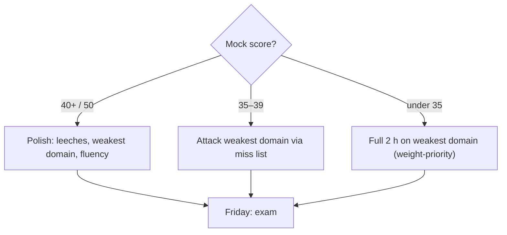

# Week 4 · Day 3 — Mock exam day (closed book)

[← Master Plan](../../../MASTER-PLAN.md) · [Week 4 overview](plan.md) · [← previous day](day-2.md) · [next day →](day-4.md)

## Study block (2 h)

Today produces the single most valuable artifact of exam week: an honest, per-domain map of what you don't know, with 48 hours left to fix it. No new material today.

### Warm-up (10 min)

Flashcards only — all domains, normal review. Stop at 10 minutes even mid-deck.

### Sit the mock (60 min, real conditions)

Take [the mock exam](../mock-exam.md) exactly as Friday will be:

- **50 questions, 60-minute timer** running visibly. Start the timer before you read question 1.
- **Closed book**: no notes, no flashcards, no searches, no peeking at the answer key. Write answers on paper or in a separate scratch file — not inline.
- Use Friday's pacing plan as a live rehearsal: ~70 seconds per question; first pass answers everything and flags doubts; second pass revisits flags only; **no blanks** — guess rather than skip.
- If the timer expires, stop. An unfinished mock teaches you about pacing; a finished-over-time mock lies to you.

### Mark it and map it (45 min)

Score against the key. Then do the part that actually moves your Friday score:

1. **Grade honestly**: a lucky guess is a miss. If you couldn't explain *why* the right answer is right, mark it with the misses.
2. **For every miss and lucky guess**: read the key's explanation, then find the topic in your [notes.md](notes.md) (or weeks 1–3 notes) and re-read that section now, while the wrong reasoning is fresh.
3. **Build the domain map** — tally misses into the three buckets and write it at the top of notes.md:
   - Domain 1, Essential AI Knowledge (38%, ~19 Qs): misses = __
   - Domain 2, AI Infrastructure (40%, ~20 Qs): misses = __
   - Domain 3, AI Operations (22%, ~11 Qs): misses = __
4. For each missed question, add one line to a **miss list**: `topic → which week's notes section → flashcard exists? (make one if not)`. This list is tomorrow's entire agenda.

### Reading your score

- **≥ 40/50 (80%)** — on target. Tomorrow is polish: leeches, weakest domain, exit-criteria fluency.
- **35–39 (70–79%)** — fine, fixable. Tomorrow attacks the weakest domain hard; the miss list is your syllabus.
- **< 35 (< 70%)** — signal, not disaster. Prioritize the weakest domain tomorrow and consider spending the full 2 h Thursday there. Remember the weights: a shaky Domain 2 (20 questions) costs double a shaky Domain 3 (11 questions).

**What your mock score sets as tomorrow's agenda:**

Also harvest *patterns*, not just topics: Did you misread scenario constraints ("lowest latency," "no code changes," "multi-tenant")? Run out of time? Second-guess correct first instincts? Write one line about your dominant error pattern — it's as fixable as a knowledge gap.

### Quick check (on the process — after marking)

1. Which domain gets priority tomorrow if misses are even across all three?

Answer
Domain 2 (AI Infrastructure) — at 40% (~20 questions) each percentage of improvement there buys the most points, then Domain 1 (38%), then Domain 3 (22%).

2. Why do lucky guesses count as misses today?

Answer
The mock's job is to predict Friday and expose gaps. A guess that happened to land hides a real gap; Friday's version of that question may not be so kind. Grade knowledge, not luck.

3. What are the two artifacts today must produce?

Answer
The per-domain miss tally (written at the top of notes.md) and the itemized miss list (topic → notes section → flashcard) that drives tomorrow's re-drill.

4. You finished the mock with 12 minutes to spare but missed several "which option satisfies the constraint" questions. What's the fix?

Answer
Not more speed — more care: use spare time on a disciplined second pass; underline the scenario constraint word (must / lowest latency / multi-tenant / no code changes) before eliminating options. The error pattern is misreading, not knowledge.

## Build block (4 h)

**rusty-kernels Day 3 — fused LayerNorm forward + backward.** [Project brief](../../../gpu-engineering-lab/01-foundations/week-04-pytorch-custom-ops/README.md)

- Forward: per-row mean/variance — choose Welford (one-pass, robust) or two-pass (simpler); write the 3-sentence trade-off note in RESULTS.md.
- Backward: derive dL/dx, dL/dγ, dL/dβ **on paper first** (the dx formula has two mean-of-grad correction terms — derive, don't paste). dγ/dβ reduce over rows: second kernel or atomics.
- Wire `torch.autograd.Function` in `ops.py`; **float64 gradcheck must pass** (that's what the `_f64` stubs are for).
- Definition of done: LayerNorm forward + backward tests green, gradcheck passes, Welford note written.
- Hint: if gradcheck fails by a hair, suspect your dx correction terms' broadcasting over the row, not the epsilon — recheck the derivation before touching tolerances.

## Close the day (15 min)

- Anki: turn every mock miss into a card (or rewrite the existing card that failed you).
- One "hardest thing today" line in [notes.md](notes.md) — plus your mock score and domain tally.
- Blockers: tomorrow's plan is now fixed by the miss list. Also confirm you know your exam appointment time — logistics check is tomorrow.
