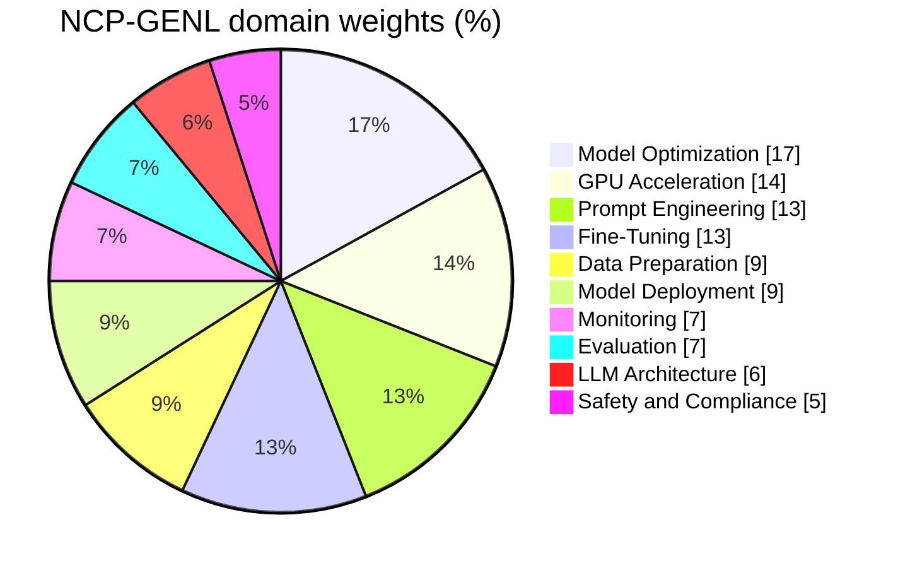

# NCP-GENL — NVIDIA-Certified Professional: Generative AI LLMs

> **Details verified July 2026 against the official exam page — re-check before booking.**
> Official page: https://www.nvidia.com/en-us/learn/certification/generative-ai-llm-professional/

## Exam at a glance

| Item | Detail |
|---|---|
| Price | $200 USD |
| Duration | 120 minutes |
| Questions | 60–70, multiple choice, online proctored |
| Validity | 2 years |
| Level | Professional (mid-level; assumes hands-on LLM experience) |
| Prerequisite competencies | Transformer architectures, distributed parallelism (DDP / FSDP / Megatron-style tensor & pipeline parallelism), PEFT/LoRA |

## Domains and weights

| # | Domain | Weight | Covered in |
|---|---|---|---|
| 1 | Model Optimization | 17% | Week 7 (days 1–2), labs |
| 2 | GPU Acceleration & Optimization | 14% | Week 7 (days 3–5), labs |
| 3 | Prompt Engineering | 13% | Week 5 (days 3–4) |
| 4 | Fine-Tuning | 13% | Week 6 (days 1–3, 5), lab |
| 5 | Data Preparation | 9% | Week 5 (day 5) |
| 6 | Model Deployment | 9% | Week 8 (day 1), lab |
| 7 | Production Monitoring & Reliability | 7% | Week 8 (day 2) |
| 8 | Evaluation | 7% | Week 6 (day 4) |
| 9 | LLM Architecture | 6% | Week 5 (days 1–2) |
| 10 | Safety, Ethics & Compliance | 5% | Week 8 (day 3) |

**The same ten domains as a pie — the top-right third is week 7:**

Heaviest cluster: **Model Optimization + GPU Acceleration = 31%** — this is why week 7 is the densest week. The top four domains together are 57% of the exam; over-invest there.

## Study plan shape (weeks 5–8 of the overall plan)

~2 h/day, 5 days/week. Exam booked for the end of week 8.

- **Week 5** (Aug 10–14, 2026): LLM architecture, prompt engineering, data preparation — 28% of exam
- **Week 6** (Aug 17–21): Fine-tuning + evaluation — 20% of exam, plus the LoRA lab
- **Week 7** (Aug 24–28): Model optimization + GPU acceleration — 31% of exam, plus the DDP lab
- **Week 8** (Aug 31–Sep 4): Deployment, monitoring, safety (21%), quantize/serve lab, full review, timed mock exam, then sit the real thing

## Recommended prep material

**NVIDIA DLI courses** (the exam page lists DLI as primary prep):
- *Building Transformer-Based Natural Language Processing Applications* (core recommended course)
- *Rapid Application Development with Large Language Models* (LLM app patterns, RAG, prompting)
- *Efficient Large Language Model Customization* (NeMo-based PEFT / p-tuning)
- *Generative AI with Diffusion Models* — optional, low exam relevance
- Free short courses on prompt engineering and RAG at https://www.nvidia.com/en-us/training/

**Docs to skim end-to-end at least once:**
- NeMo framework docs (data curation, training, PEFT, alignment): https://docs.nvidia.com/nemo-framework/
- NeMo Curator docs (dedup, filtering, PII): part of NeMo framework docs
- TensorRT-LLM docs (quantization formats, in-flight batching, builds): https://nvidia.github.io/TensorRT-LLM/
- TensorRT Model Optimizer (PTQ/QAT, FP8/FP4, pruning, distillation): https://nvidia.github.io/TensorRT-Model-Optimizer/
- NIM docs (deployment, profiles): https://docs.nvidia.com/nim/
- NeMo Guardrails: https://docs.nvidia.com/nemo/guardrails/
- Triton Inference Server conceptual guide: https://docs.nvidia.com/deeplearning/triton-inference-server/
- vLLM docs (paged attention, quantization, benchmarking): https://docs.vllm.ai/

**Papers worth one careful read each** (the exam tests the *ideas*, not citations): Attention Is All You Need; LoRA; QLoRA; FlashAttention; the vLLM/PagedAttention paper; GPTQ; AWQ; DPO; InstructGPT (RLHF); Chinchilla (scaling/data).

**Your own demo repo is prep material.** The exam's distributed-training and inference questions map directly onto what you already built: DDP/FSDP/Megatron parallelism, NCCL transports, MIG vs time-slicing vs MPS, vLLM/Dynamo/NIM serving, KAI gang scheduling, DRA. Weeks 7–8 cross-reference it explicitly — rehearsing exam answers doubles as rehearsing your evangelist demo narrative.

## Booking checklist

- [ ] Re-verify price, question count, duration, and domain weights on the official page (they change without notice)
- [ ] Create/confirm NVIDIA certification account (exam delivered via the certification portal's proctoring partner)
- [ ] Book the slot now for the end of week 8 (Fri Sep 4 or Sat Sep 5, 2026) — booking early locks the deadline in
- [ ] Government-issued photo ID matching the account name
- [ ] Machine check: webcam, mic, stable connection; run the proctor's system test days before, not the morning of
- [ ] Quiet room, cleared desk, no second monitor (unplug it), phone out of reach
- [ ] Plan timing: 60–70 questions in 120 min ≈ 1.7–2 min/question; flag and skip anything taking >3 min on first pass
- [ ] Re-take `mock-exam.md` timed in week 8; target ≥ 75% before sitting the real exam
