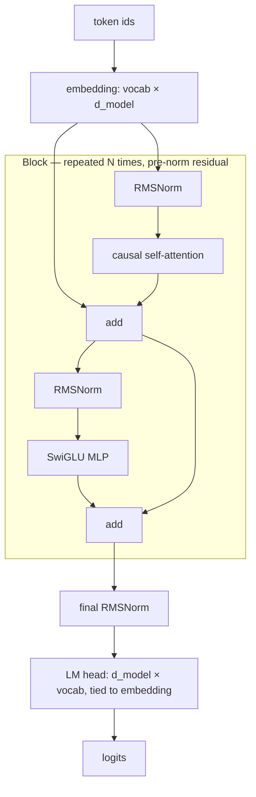
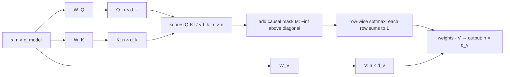
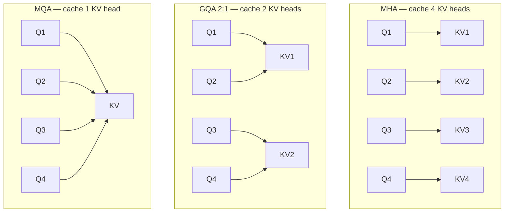

# Week 5 · Day 1 — Transformer internals: attention from first principles

[← Master Plan](../../../MASTER-PLAN.md) · [Week 5 overview](plan.md) · [← previous day](../../month-1-nca-aiio/week-4/day-5.md) · [next day →](day-2.md)

Monday, Aug 10 2026. New cert month, new domain. This week serves **28% of the NCP-GENL exam** (LLM Architecture 6% + Prompt Engineering 13% + Data Preparation 9%). Today is pure architecture — and it is the single most leveraged day of the month, because everything downstream (KV cache, LoRA target modules, quantization, serving) is defined in terms of the pieces you learn today.

## Study block (2 h)

**Exam domain: LLM Architecture (6%).** Small weight, but this material is the *vocabulary* for the heavier domains — Fine-Tuning questions say "q_proj", Optimization questions say "attention heads". Learn it as language, not trivia.

### The decoder-only stack, top to bottom

Every modern LLM (GPT, Llama, Qwen, Mistral) is a **decoder-only** transformer. The 2017 paper had an encoder and a decoder; generative LLMs kept only the decoder and dropped cross-attention. The whole model is:

```
token ids → embedding (vocab × d_model)
  → N × Block:  x = x + Attention(RMSNorm(x))     ← pre-norm residual
                x = x + MLP(RMSNorm(x))
  → final RMSNorm → LM head (d_model × vocab, often tied to embedding) → logits
```

**The same stack as a graph — note the two residual streams flowing *around* each sub-layer, not through it:**



Modern deltas from the 2017 paper — these are exam-favorite "which of these is true of modern LLMs" fodder:

| 2017 original | Modern (Llama-3 / Qwen2.5 era) | Why it changed |
|---|---|---|
| Post-norm LayerNorm | **Pre-norm RMSNorm** | Stable gradients at depth; RMSNorm drops mean-centering → cheaper |
| ReLU/GELU MLP | **SwiGLU** (gated) | Better quality per FLOP |
| Sinusoidal absolute positions | **RoPE** (tomorrow) | Relative positions, context extension |
| Encoder–decoder | Decoder-only | Next-token prediction needs no encoder |

### Attention: the actual math

For each token, project the hidden state three ways: **Q = xW_Q, K = xW_K, V = xW_V**. Then:

```
Attention(Q, K, V) = softmax( Q·Kᵀ / √d_k + M ) · V
```

Shapes matter and get tested: with sequence length *n* and head dim *d_k*, `Q·Kᵀ` is **(n × n)** — this is the quadratic term everyone means by "attention is O(n²)". The softmax runs **row-wise** (each query distributes 1.0 of attention over keys), and the result (n × n)·(n × d_v) → (n × d_v) is a weighted average of value vectors.

**The data flow with every shape labeled — the (n × n) score matrix in the middle is the quadratic bottleneck:**



Three details, each an exam trap:

1. **Why √d_k?** Dot products of random d_k-dim vectors have variance ∝ d_k. Unscaled, large d_k pushes softmax inputs into saturation → near-one-hot weights → vanishing gradients. Dividing by √d_k keeps the variance ≈ 1. (Trap: it is *not* for numerical overflow protection per se — it is gradient/softmax-sharpness control.)
2. **Causal mask M**: an upper-triangular matrix of −∞ added to scores *before* softmax, so token *t* attends only to positions ≤ *t*. After softmax, masked entries become exactly 0. (Trap: masking after softmax would break normalization.)
3. **Q/K/V are different projections of the same input** in self-attention. Cross-attention (encoder-decoder only) takes K,V from a different sequence — decoder-only models have no cross-attention at all.

### Multi-head, and the MQA/GQA compression story

Multi-head attention (MHA) splits d_model into *h* heads of d_head = d_model/h, runs attention independently per head (each head can learn a different relation — syntax, coreference, position), concatenates, and applies output projection W_O. Same total FLOPs as one big head, more expressive.

The variants exist for one reason — **the KV cache** (deep dive tomorrow, but plant the flag now):

- **MHA**: every head has its own K and V → h sets of KV to cache.
- **MQA** (multi-query): all heads share *one* K/V pair → cache shrinks h×, quality dips.
- **GQA** (grouped-query): groups of query heads share a K/V pair — e.g. Llama-3-8B has 32 query heads but only **8 KV heads** (4:1). Near-MHA quality, 4× smaller cache. This is the modern default (Llama-3, Qwen2.5, Mistral).

**Head sharing at a glance — each arrow is a query head reading a cached K/V pair; fewer boxes on the right = smaller KV cache:**



Exam framing: "Why does GQA exist?" → *to reduce KV-cache memory during inference with minimal quality loss.* Not training speed, not accuracy improvement.

### Hands-on (30 min)

In a notebook, implement single-head scaled dot-product attention in ~15 lines of PyTorch on random tensors `(B, n, d)`. Verify: output shape `(B, n, d)`, rows of the softmax sum to 1, and with a causal mask position 0's output is independent of positions 1…n−1 (perturb them and check). This is a dry run of today's build block — same math, throwaway code.

### Read next

- Jay Alammar, *The Illustrated Transformer* — best visual walkthrough of the shapes.
- Lilian Weng, *The Transformer Family v2* — the MHA→MQA→GQA lineage in one post.
- nanoGPT `model.py` (~300 lines) — read `CausalSelfAttention` before the build block.
- Vaswani et al., *Attention Is All You Need* §3.2 only — the source of the √d_k argument.

### Quick check

1. Write the scaled dot-product attention formula and state the shape of the score matrix for sequence length n.
2. Why is the causal mask applied before the softmax and not after?
3. Llama-3-8B has 32 query heads and 8 KV heads. Which attention variant is this, and what does the 4:1 ratio buy?
4. A colleague says the √d_k scaling prevents float overflow. What's the better explanation?

<details><summary>Answers</summary>

1. `softmax(QKᵀ/√d_k + M)V`; scores are **(n × n)** per head (the quadratic term).
2. Softmax must normalize over *only* the allowed positions. −∞ before softmax → exact 0 weight after. Zeroing after softmax would leave the remaining weights summing to < 1 (denormalized) and leak gradient structure.
3. **GQA** (grouped-query attention). The KV cache stores only 8 heads' worth of K/V instead of 32 — 4× less inference memory per token, with near-MHA quality.
4. Dot-product variance grows linearly with d_k; without scaling, softmax saturates toward one-hot, and gradients through it vanish. It's about keeping softmax in a trainable regime, not float range.

</details>

## Build block (4 h)

**This is the pairing that makes this week work: the cert study above *is* the spec for what you build this afternoon.** You just derived `softmax(QKᵀ/√d_k)V` on paper — now you write it in PyTorch and prove it against `F.scaled_dot_product_attention`.

[Project brief](../../../gpu-engineering-lab/02-llm-engineering/week-05-gpt-from-scratch/README.md) — Day 1: tokenizer + one attention head + causal mask.

**Objective:** pick a tokenizer (tiktoken `gpt2` recommended — zero training) and wire it into `src/data.py`; implement `causal_attention(q, k, v)` from the raw formula in `src/attention.py`; then the multi-head `CausalSelfAttention` module (fused qkv projection, head split/merge, output projection).

**Definition of done:**
- `causal_attention` implements scores → scale → mask (−∞) → softmax → weighted sum, no shortcuts
- `CausalSelfAttention` handles `(B, n, d_model)` with fused qkv and head reshape
- `pytest tests/test_attention.py` green: your math path matches SDPA ≤ 1e-5 in fp32
- Tokenizer choice wired into `src/data.py` and round-trips a sample string

**One hint:** the head split is `view(B, n, h, d_head).transpose(1, 2)` → `(B, h, n, d_head)`; the merge is the exact inverse. Off-by-one-transpose bugs here produce plausible-looking wrong outputs — the SDPA parity test is what catches them, which is why you write it first.

## Close the day (15 min)

- **Anki:** add cards for the attention formula + shapes, √d_k reasoning, MHA/MQA/GQA distinction, pre-norm vs post-norm. (~6–8 cards.)
- **notes.md:** one line in `week-5/notes.md` — what clicked, what didn't, tok/s of nothing yet but note the tokenizer you picked and why.
- **Blockers:** if the SDPA parity test isn't green, write down the exact failing tolerance — tomorrow's model assembly depends on this module being trustworthy.
