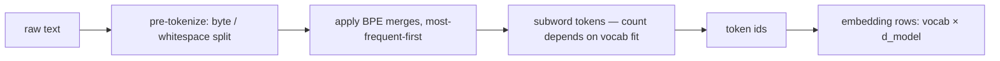

# Week 5 · Day 2 — KV cache, RoPE, and tokenization

[← Master Plan](../../../MASTER-PLAN.md) · [Week 5 overview](plan.md) · [← previous day](day-1.md) · [next day →](day-3.md)

Tuesday, Aug 11 2026. Yesterday was the transformer at rest; today is the transformer *in motion* — how it generates, where the memory goes, and how text becomes tensors in the first place.

## Study block (2 h)

**Exam domain: LLM Architecture (6%), and this day quietly pre-loads GPU Acceleration (14%, week 7).** The KV-cache arithmetic below is the single most reusable calculation in the whole cert: it explains paged attention, GQA, batch limits, and half of the serving questions.

### KV cache: why it exists and how big it is

Autoregressive decoding generates one token at a time. Naively, generating token *t+1* re-runs attention over the whole prefix — recomputing K and V for tokens you already processed. But K and V for past tokens **never change** (causal mask: past tokens can't see the future). So cache them.

- Without cache: each new token costs O(n²) attention work → generating n tokens is O(n³) total.
- With cache: compute Q/K/V for the *new* token only, append K,V to the cache, attend against it → O(n) per token, O(n²) total.

**Cache growth per decode step — one K/V column appended per token, per layer; only the new token computes anything:**

```
prefill (prompt = 4 tokens)      decode step 1        decode step 2
K/V: [t1|t2|t3|t4]               [t1|t2|t3|t4|t5]     [t1|t2|t3|t4|t5|t6]
     all 4 in one parallel        append t5's K,V      append t6's K,V
     pass (compute-bound)              ↑                       ↑
Q:   all 4 tokens                 t5 only               t6 only
     attends: full n×n            1 row × 5 cols        1 row × 6 cols
work: O(n²) once                  O(n) per step — but re-READS the whole cache
```

The price is memory. **Memorize the formula:**

```
KV-cache bytes = 2 × n_layers × n_kv_heads × d_head × seq_len × batch × bytes_per_elem
                 ↑ (one K + one V)
```

Worked example — **Llama-3-8B, 8k context, batch 1, FP16** (2 bytes): 32 layers, 8 KV heads (GQA!), d_head 128:

```
2 × 32 × 8 × 128 × 8192 × 1 × 2 bytes = 1.07 GB   ← per sequence
```

At batch 32 that's **~34 GB — more than the weights** (~16 GB in FP16). Now the exam logic writes itself:

- Why GQA? 8 KV heads instead of 32 → cache is 4× smaller than MHA would make it.
- Why serve in FP8/INT8 KV cache? Halve/quarter `bytes_per_elem`.
- Why PagedAttention (vLLM, week 7)? Cache is allocated per-sequence and mostly *reserved but unused* — paging fixes the fragmentation.
- **Prefill vs decode** (plant the seed for week 7): prefill processes the whole prompt in one parallel pass — big matmuls, **compute-bound**. Decode does one token per step — tiny matmuls against a huge cache, **memory-bandwidth-bound**. One-sentence answer, two exam domains served.

### Positional encodings: from sinusoids to RoPE

Attention is permutation-invariant — without position information, "dog bites man" = "man bites dog". Three generations of fixes:

1. **Absolute** — sinusoidal (2017) or learned embeddings (GPT-2) *added* to token embeddings. Learned ones can't extrapolate past training length at all.
2. **RoPE** (Rotary Position Embedding — the modern default): instead of adding position to the embedding, **rotate each (2-dim pair of) Q and K by an angle proportional to the token's position**, θ varying per dimension pair (like clock hands at different speeds). The magic: the dot product q_m·k_n after rotation depends only on the **relative offset (m − n)** — absolute rotations, relative attention. Applied to Q and K only, never V. Because position lives in the rotation frequencies, you can stretch it: **NTK-aware scaling and YaRN** rescale the frequency base (e.g. Llama-3's θ = 500,000) to extend context beyond training length with little/no fine-tuning.
3. **ALiBi** — no rotation, just a linear penalty on attention scores proportional to distance. Simple, extrapolates well, but lost to RoPE in practice.

Exam shortcut: *"Which positional scheme do modern open LLMs use?"* → RoPE, essentially always (Llama-2/3, Qwen, Mistral). *"What enables long-context extension?"* → RoPE frequency rescaling (NTK/YaRN).

### Tokenization: the layer everyone forgets

LLMs don't see characters or words — they see subword tokens from a fixed vocabulary.

- **BPE (byte-pair encoding):** start from bytes/characters, repeatedly merge the most frequent adjacent pair until vocab budget is hit. **Byte-level BPE** (GPT-2/3/4, Llama-3) starts from raw bytes → *no possible out-of-vocabulary input*; anything is at worst a sequence of byte tokens.
- **SentencePiece / Unigram:** trains on raw text without pre-splitting on whitespace (language-agnostic); Unigram starts big and prunes. Used by T5, older Llama.
- **Vocab size trade-off:** bigger vocab (Llama-3: 128k vs Llama-2: 32k) → fewer tokens per text → more effective context and cheaper inference per document, but a bigger embedding matrix and rarer-token undertraining. Multilingual and code text suffer most under small English-centric vocabs (3–4× more tokens per sentence → less effective context, higher cost).
- Classic tokenizer-blame failures: bad arithmetic (numbers split inconsistently), character-counting/spelling tasks ("how many r's in strawberry"), whitespace-sensitive code. If the exam describes a weird surface-level failure, suspect the tokenizer.

**The tokenization pipeline — where each failure mode enters, and where the vocab-size trade-off bites:**



Hands-on (15 min): paste numbers, Python code, and a non-English sentence into https://tiktokenizer.vercel.app — compare GPT-2 vs GPT-4o vs Llama-3 token counts. Feel the vocab-size trade-off directly.

### Read next

- Su et al., *RoFormer* (2021) §3 — the rotation construction, skim the proofs.
- Karpathy, *Let's build the GPT Tokenizer* (video) — BPE from zero, best single resource.
- vLLM docs, "PagedAttention" concept page — read only the motivation section today.
- kipply's blog, *Transformer Inference Arithmetic* — the KV-cache math done for many models.

### Quick check

1. Compute the KV-cache size for a 24-layer model with 8 KV heads, d_head 128, at seq 4096, batch 8, FP16.
2. Why does the KV cache store K and V but never Q?
3. RoPE applies an *absolute* rotation per position. Why does attention nevertheless become sensitive to *relative* position?
4. A model handles English fine but burns 4× more tokens on Japanese. What property of the tokenizer explains this, and what's the consequence for context?

<details><summary>Answers</summary>

1. 2 × 24 × 8 × 128 × 4096 × 8 × 2 B = **3.2 GB** (≈ 3.22 × 10⁹ bytes). Show the ×2 for K+V or lose the point.
2. Past K/V are reused by every future query; the query is only ever needed *once*, for its own step, then never again. Caching Q would buy nothing.
3. The rotation angles are m·θ and n·θ for query/key; inside the dot product the rotations compose so only the *difference* (m−n)·θ survives — rotation of one vector relative to another.
4. Small/English-centric vocab → Japanese falls back to many tiny (often byte-level) tokens. Consequence: the *same* character budget consumes far more of the context window and costs more per request — effective context shrinks 4×.

</details>

## Build block (4 h)

**Study→build echo, explicit today:** the RoPE rotation you just learned is `src/rope.py` this afternoon, and the pre-norm/RMSNorm/SwiGLU deltas from yesterday's table become `src/model.py`. By dinner you have a full GPT that embodies every line of this week's architecture study. (The KV cache itself lands Thursday — today you build the model it will accelerate.)

[Project brief](../../../gpu-engineering-lab/02-llm-engineering/week-05-gpt-from-scratch/README.md) — Day 2: full block, assemble the model.

**Objective:** implement RoPE (`src/rope.py`: precompute cos/sin cache, rotate q and k), then `src/model.py`: `RMSNorm`, `SwiGLUMLP`, pre-norm residual `Block`, and the full `GPT` — token embedding, N blocks, final norm, LM head tied to the embedding.

**Definition of done:**
- `tests/test_rope.py` green (reference = complex-number rotation + relative-position property)
- `d12` config (~30M params) instantiates and runs a forward pass
- Loss at init ≈ `ln(vocab_size)` — ≈ 10.8 for vocab 50257; if not, the init is wrong
- Weight tying verified: `lm_head.weight is tok_emb.weight`

**One hint:** the ln(vocab) check is the day's real acceptance test — it means the model at init predicts a uniform distribution, i.e. no layer is accidentally scaling logits. If you see ~15 instead of ~10.8, look at your final-norm placement and residual init before anything else.

## Close the day (15 min)

- **Anki:** KV-cache formula (front: "KV cache bytes = ?"), the Llama-3-8B worked example, RoPE two-sentence explanation, BPE vs Unigram, vocab-size trade-off. (~6 cards.)
- **notes.md:** one line — your ln(vocab) number at init and whether RoPE tests passed first try.
- **Blockers:** if RoPE's relative-position test fails, note whether you rotated V by mistake (most common bug) — don't debug past midnight; Day 3's training will expose it anyway via loss.
