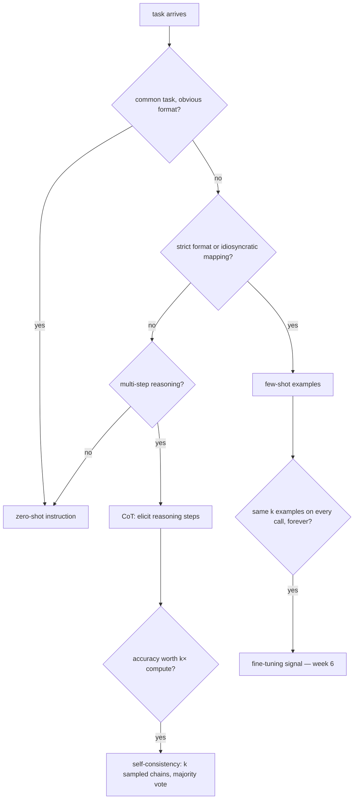
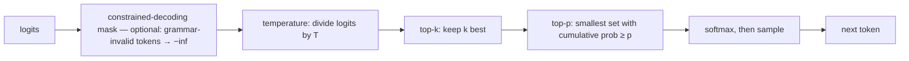

# Week 5 · Day 3 — Prompt engineering: ICL, CoT, templates, sampling

[← Master Plan](../../../MASTER-PLAN.md) · [Week 5 overview](plan.md) · [← previous day](day-2.md) · [next day →](day-4.md)

Wednesday, Aug 12 2026. Architecture pause; today is the highest-weight single domain of the week. Prompt engineering questions are scenario-shaped ("a customer wants X, which technique?"), so study for *decisions*, not definitions.

## Study block (2 h)

**Exam domain: Prompt Engineering (13%)** — tied for the second-largest domain on NCP-GENL. The exam treats this as an engineering discipline: technique selection, sampling-parameter tuning, and template correctness.

### In-context learning: zero-shot → few-shot

A pretrained LLM is a next-token predictor; prompting is programming it *without weight updates*.

- **Zero-shot:** instruction only. Works when the task is common in pretraining (summarize, translate, classify sentiment).
- **Few-shot (in-context learning):** show k input→output examples in the prompt; the model infers the pattern. Helps most for *format compliance* and idiosyncratic tasks; the examples teach the mapping, they are not retrieved knowledge.
- Known fragilities (exam-tested): example **order** matters (recency bias — the last example pulls hardest), **label distribution** in examples biases predictions (all-positive examples → positive predictions), and formatting consistency between examples and query matters more than example correctness.

Trap distinction: **few-shot prompting ≠ fine-tuning.** No weights change; the "learning" evaporates when the context does. It also *consumes context and per-request cost* — if you need the same 20 examples on every call forever, that's a fine-tuning signal (week 6).

### Chain-of-Thought and its descendants

- **CoT:** prompt the model to produce intermediate reasoning steps before the answer. Helps on multi-step problems (math, logic, multi-hop QA); does ~nothing for simple extraction or knowledge lookup. Emergent with scale — small models produce fluent nonsense chains.
- **Zero-shot CoT:** append "Let's think step by step" — no examples needed.
- **Self-consistency:** sample k reasoning chains at temperature > 0, take the **majority-vote answer**. Trades k× compute for accuracy. (Trap: it needs *sampling*; at temperature 0 all k chains are identical and the vote is meaningless.)
- 2026 context worth one sentence: reasoning models (o-series, R1-style) internalize CoT via RL — but the exam concept stands: *explicit intermediate computation improves multi-step accuracy*.

**The technique-selection flow — this decision tree IS the scenario question, walk it for every prompt-engineering stem:**

### System prompts and chat templates — where real deployments break

Chat models are fine-tuned on conversations serialized with **special tokens**. The words and the wrapper both matter:

- **Roles:** `system` (persistent behavior contract: persona, rules, output format), `user`, `assistant`. Instruction hierarchy: system should outrank user — this is also the prompt-injection battleground (full treatment week 8 day 3: injection = adversarial user content trying to override the system contract; mitigations = delimiters, privilege separation, output validation).
- **Chat template:** the model-specific serialization, e.g. Qwen2.5's `<|im_start|>system … <|im_end|>` vs Llama-3's `<|start_header_id|>…<|eot_id|>`. It lives in `tokenizer_config.json` as a Jinja template; `tokenizer.apply_chat_template(msgs, add_generation_prompt=True)` is the only correct way to build the string.
- **The trap the exam loves:** a chat-tuned model prompted *without* its template (or with another model's) degrades badly — it was never trained on that distribution. Symptoms: ignoring instructions, self-continuing the user turn, never emitting EOS. If a question describes a fine-tuned model that "suddenly got worse at inference", check template mismatch between training and serving first.

### Sampling parameters: the decode-time knobs

Logits → probabilities → one token. How you pick is a product decision:

| Knob | Mechanism | Use |
|---|---|---|
| **Greedy / temp 0** | argmax every step | Extraction, classification, determinism-ish |
| **Temperature T** | divide logits by T before softmax; T<1 sharpens, T>1 flattens | 0.6–0.9 typical for chat/creative |
| **Top-k** | keep k most-likely tokens, renormalize | Fixed-size candidate set |
| **Top-p (nucleus)** | keep smallest set with cumulative prob ≥ p | **Adaptive** set — small when confident, large when uncertain; fixes top-k's one-size-fits-all |
| **Repetition/frequency penalty** | downweight already-emitted tokens | Kill loops in long generations |
| **Beam search** | track b best sequences | Translation/summarization era; rarely used for open-ended chat (bland, repetitive) |

**Order of operations at each decode step — the knobs compose left to right, and constrained decoding masks before any of them:**

Exam pairings to memorize: *extraction/structured/legal* → temp 0 (or ≈0); *creative writing/brainstorm* → temp ~0.8 + top-p 0.9; *self-consistency* → temp > 0 by definition. **Structured output** goes one step past sampling: JSON mode / constrained (guided) decoding masks invalid tokens at each step so output *cannot* violate the grammar — vLLM `guided_json`, `outlines`. Constrained decoding guarantees syntax, not semantics.

### Read next

- NVIDIA DLI *Prompt Engineering with LLMs* short course — do it, it's the exam's home turf.
- Anthropic prompt-engineering guide (system prompts, XML delimiters) — techniques transfer; exam is vendor-neutral.
- Wei et al., *Chain-of-Thought Prompting* (2022) — abstract + figures suffice.
- A real chat template: open `tokenizer_config.json` for Qwen2.5-1.5B-Instruct on the HF Hub and read the Jinja.

### Quick check

1. A team needs deterministic JSON from an extraction pipeline. Which sampling settings, and what guarantees valid JSON?
2. Why does self-consistency require temperature > 0?
3. A fine-tuned chat model performs great in the training notebook but babbles at deploy time, never stopping. Most likely cause?
4. Few-shot prompting and LoRA fine-tuning can both teach output format. Name two dimensions on which they differ.

Answers

1. Temperature 0 (greedy) for determinism; validity needs **constrained/guided decoding** (JSON mode, `guided_json`, outlines) — sampling settings alone never *guarantee* syntax.
2. It samples k *diverse* reasoning chains and majority-votes the answers. At temp 0 every chain is identical — you paid k× for one sample.
3. **Chat-template mismatch** between training and inference (or a missing `add_generation_prompt`/EOS handling) — the model never sees its expected special-token structure, so it never learns where turns end.
4. (any two) Weights: unchanged vs updated. Persistence: per-request vs permanent. Cost profile: pay context tokens every call vs pay training once. Capacity: few-shot capped by context length; FT can encode far more behavior.

## Build block (4 h)

**Study→build echo:** today you studied what happens *at* the logits (sampling comes to your own model tomorrow); this afternoon you create the thing that produces them — a real training run. Watching your own loss curve fall is the best possible intuition for "what does a language model actually learn": exactly next-token prediction, the substrate all of today's prompting techniques exploit.

[Project brief](../../../gpu-engineering-lab/02-llm-engineering/week-05-gpt-from-scratch/README.md) — Day 3: training loop, train on TinyStories.

**Objective:** build `src/data.py` (download TinyStories, tokenize ~100M tokens to a uint16 memmap `.bin`, serve random contiguous windows) and `src/train.py` (AdamW, bf16 autocast, grad accumulation to ~0.5M-token effective batch, warmup + cosine decay, grad clipping, CSV logging, periodic eval + checkpointing). Kick off an evening-sized `d12` run.

**Definition of done:**
- `.bin` memmap built; batches load with no visible dataloader stall
- Training runs in bf16 autocast — **no GradScaler** (bf16 doesn't need loss scaling; that's an fp16 artifact)
- Loss starts ≈ 10.8 (yesterday's check) and falls steadily; run launched for the evening
- Target to beat by morning: val loss < ~2.0 nats → perplexity < ~7.5 (e^2.0 ≈ 7.4 — that's the perplexity definition you'll formalize in week 6 day 4)

**One hint:** uint16 works because vocab 50257 < 65536 — halving the memmap size vs int32. If loss plateaus around 6–7 instead of diving under 3, your windows are probably not contiguous token runs (shuffled *within* window = destroyed language structure).

## Close the day (15 min)

- **Anki:** zero/few-shot/CoT/self-consistency decision rules, temperature vs top-p mechanics, chat-template failure mode, constrained decoding guarantee. (~7 cards.)
- **notes.md:** one line — step count launched, loss at launch, loss now.
- **Blockers:** if the run won't fit an evening, cut model size, not the schedule shape — the exit criteria need a *finished* run, not a big one.
