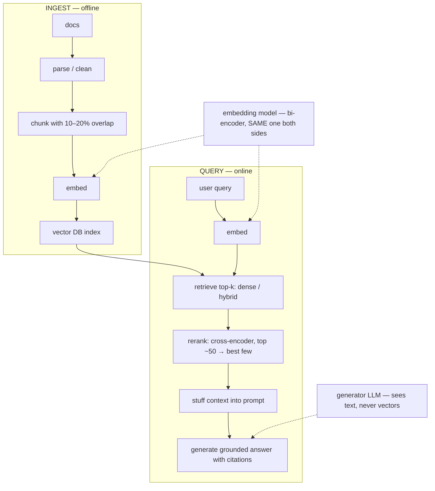

# Week 5 · Day 4 — RAG fundamentals

[← Master Plan](../../../MASTER-PLAN.md) · [Week 5 overview](plan.md) · [← previous day](day-3.md) · [next day →](day-5.md)

Thursday, Aug 13 2026. RAG sits inside the Prompt Engineering domain on this exam — it is, after all, structured context-stuffing. Today's goal: be able to draw the pipeline cold and win the RAG-vs-fine-tuning discriminator every time it appears (it appears a lot).

## Study block (2 h)

**Exam domain: Prompt Engineering (13%) — RAG lives here on NCP-GENL.** Also previews Evaluation (week 6 day 4) and maps directly onto NVIDIA's NeMo Retriever/NIM product story, which the exam name-checks.

### The pipeline, end to end — draw this from memory by Friday

```
INGEST (offline)                          QUERY (online)
docs → parse/clean → CHUNK → EMBED        user query → EMBED (same model!)
     → INDEX in vector DB                       → RETRIEVE top-k (dense/hybrid)
                                                → RERANK (cross-encoder)
                                                → stuff context into prompt
                                                → GENERATE (grounded answer + citations)
```

Two separate models are involved, and conflating them is a classic trap:
- The **embedding model** (bi-encoder, e.g. an NV-Embed / E5-class retriever) maps text → dense vectors. Query and documents MUST use the same embedding model — vectors from different models live in incompatible spaces.
- The **generator LLM** never sees vectors; it sees retrieved *text* pasted into its prompt.

**The pipeline with the two models made explicit — dotted lines show which model touches which stage:**




### Stage-by-stage details the exam actually tests

- **Chunking:** fixed-size (crude, splits mid-thought), recursive (split on paragraphs→sentences→chars, respects structure — the sane default), semantic (embedding-guided boundaries, costlier). **Overlap** (10–20%) prevents losing facts that straddle a boundary. Chunk too big → diluted embeddings + wasted context; too small → orphaned fragments with no context.
- **Retrieval:** dense = cosine similarity / inner product over embeddings (semantic match, survives paraphrase); sparse = BM25 keyword match (wins on exact terms, IDs, part numbers); **hybrid** = both + score fusion — the production default answer.
- **Reranking:** the retriever is a *recall* stage (fast, approximate, over millions of chunks); the **cross-encoder reranker** is a *precision* stage — it reads query+chunk *together* through a transformer and rescores the top ~50–100. Slower per pair, far more accurate. Two-stage funnel: cheap-and-broad then expensive-and-narrow.
- **Generation-side failure modes:** "**lost in the middle**" — models attend best to the start and end of long contexts, so mid-context evidence gets missed (mitigate: rerank properly, put best evidence first/last, don't stuff 100 chunks). Grounding + "answer only from the provided context" + citations = the hallucination mitigation story.

### RAG vs fine-tuning — the discriminator, verbatim-ready

| | RAG | Fine-tuning |
|---|---|---|
| Changes | The **prompt** (context) | The **weights** |
| Best for | **Knowledge**: fresh, private, factual | **Behavior**: style, format, domain dialect |
| Updates | Re-index a document — minutes | Retrain — hours/days |
| Attribution | Citations possible | None — knowledge is diffuse in weights |
| Revocation | Delete the document | Practically impossible without retraining |
| Failure mode | Bad retrieval → bad answer | Forgetting, drift, stale knowledge |

Rule of thumb the exam rewards: *"the model doesn't KNOW something"* → RAG. *"the model doesn't BEHAVE right"* → fine-tune. Often the real answer is **both**: fine-tune a model to follow citation format, RAG for the facts. Tomorrow's build-week transition makes this concrete — week 6 you fine-tune for behavior and watch knowledge *not* change.

### NVIDIA stack mapping (one paragraph, high exam value)

**NeMo Retriever** is NVIDIA's retrieval microservice family: **NIM embedding microservices** (e.g. `nv-embedqa` models) and **NIM reranking microservices**, deployed as containers with standard APIs alongside an **LLM NIM** for generation. The reference RAG architecture is: ingestion pipeline → vector DB (Milvus is the usual reference) → embedding NIM → reranking NIM → LLM NIM, all on Kubernetes. Know which layer each piece covers; the exam asks "which NVIDIA component provides X". Your month-1 NIM deployment demo *is* the serving layer of this diagram — rehearse saying "retriever NIM + LLM NIM on K8s" as one story.

### Evaluation preview (10 min — week 6 day 4 harvests this)

RAG quality is a **triad**: (1) **faithfulness/groundedness** — is the answer supported by retrieved context? (2) **answer relevance** — does it address the question? (3) **context/retrieval relevance** — did we retrieve the right chunks (recall@k)? A system can fail any leg independently: perfect retrieval + hallucinated answer fails (1); grounded answer to the wrong question fails (2). Retrieval metrics (recall@k, MRR) diagnose the retriever separately from the generator — always debug retrieval first.

### Read next

- NVIDIA's RAG reference architecture page (NeMo Retriever + NIM) — study the diagram until you can redraw it.
- Lewis et al., *Retrieval-Augmented Generation* (2020) — abstract + fig 1; it's the namesake, not the modern practice.
- Liu et al., *Lost in the Middle* (2023) — figures only.
- Pinecone/Weaviate learning-center article on hybrid search + reranking (either vendor; the concepts are identical).

### Quick check

1. Your RAG system retrieves plausible chunks but answers contain facts not present in them. Which leg of the RAG triad fails, and name one mitigation.
2. Why must the query be embedded with the same model as the documents?
3. When does BM25 beat dense retrieval, and what's the production compromise?
4. A pharma company needs answers from documents updated daily, with audit-grade citations. RAG or fine-tuning? Give two reasons.

<details><summary>Answers</summary>

1. **Faithfulness/groundedness.** Mitigations: instruct answer-only-from-context, require citations, lower temperature, or add a groundedness checker on output. (Retrieval was fine — don't touch it.)
2. Embeddings from different models are incompatible vector spaces; nearest-neighbor distances across spaces are meaningless.
3. Exact-term matches: IDs, part numbers, jargon, rare names — semantic embeddings blur them. Production compromise: **hybrid search** (BM25 + dense, fused), often followed by a cross-encoder reranker.
4. **RAG.** Daily updates = re-index vs impossible retrain cadence; citations require attributable sources, which weights can't provide. (Also: revocation/compliance.)

</details>

## Build block (4 h)

**Study→build echo:** today's study was about reusing context; today's build is the mechanism that makes long contexts *affordable* — the KV cache. The cache-size formula from Tuesday becomes real tensors you preallocate, and the sampling menu from yesterday (temperature/top-k/top-p) becomes your `generate()` API. Your own model, your own inference stack.

[Project brief](../../../gpu-engineering-lab/02-llm-engineering/week-05-gpt-from-scratch/README.md) — Day 4: KV-cache generation + sampling.

**Objective:** `src/generate.py` — a `KVCache` (preallocated per-layer k/v tensors + append), an incremental single-token decode path through the model, and sampling with temperature, top-k, and top-p. Then benchmark honestly.

**Definition of done:**
- `pytest tests/test_kv_cache.py` green: cached greedy decode **token-for-token identical** to full-recompute decode
- Temperature / top-k / top-p implemented and composable
- `make bench`: median tok/s over ≥50 post-warmup generations, cached vs uncached, prompt+gen up to 512 — JSON + plot saved
- Acceptance line in sight: cached ≥ **5× faster** than naive at seq 512

**One hint:** the incremental path must feed the *position index* of the new token into RoPE (position = cache length, not 0) — the classic bug is rotating every new token as position 0, which passes shape checks and fails the token-identity test. That identity test is the whole point: it catches what eyeballing generations cannot.

## Close the day (15 min)

- **Anki:** RAG pipeline stages in order, RAG-vs-FT table (make it one card per row), bi-encoder vs cross-encoder, lost-in-the-middle, RAG triad, NeMo Retriever component map. (~8 cards.)
- **notes.md:** one line — cached vs uncached tok/s and the speedup multiple.
- **Blockers:** if the 5× target is missed, note the seq length where the curves diverge — you'll revisit with the profiler tomorrow before touching any code.
