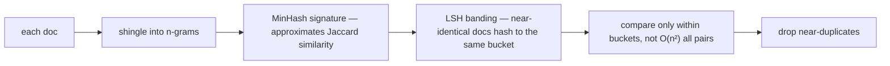

# Week 5 · Day 5 — Data preparation, self-check, and ship day

[← Master Plan](../../../MASTER-PLAN.md) · [Week 5 overview](plan.md) · [← previous day](day-4.md) · [next day →](../week-6/day-1.md)

Friday, Aug 14 2026. Two jobs today: close the week's last exam domain (Data Preparation, 9%) and *ship* — closed-book self-check, exit criteria, progress row, and a pushed repo with honest numbers.

## Study block (2 h)

**Exam domain: Data Preparation (9%).** This is the most NVIDIA-branded domain of the week: most correct answers are, one way or another, "NeMo Curator does that". Learn the generic pipeline first, then attach NVIDIA's names to each stage.

### The pretraining data pipeline — stages in order

Raw web-scale text is mostly garbage; the pipeline is a funnel:

```
acquisition (Common Crawl, code, books)
 → text extraction (HTML → text, boilerplate removal)
 → language identification (fastText-class classifier, route/drop)
 → heuristic quality filters (doc length, symbol/word ratio, repeated lines,
   "gibberish" rules — cheap, catch the obvious junk)
 → model-based quality filtering (a classifier scores "does this look like
   good text?"; keep high scores — catches what heuristics can't)
 → DEDUPLICATION (below — the exam's favorite stage)
 → PII redaction (emails, phone numbers, names → removed/masked)
 → toxicity / NSFW filtering (classifier-based)
 → tokenization + packing into fixed-length training sequences
```

Order matters directionally (cheap filters before expensive ones; dedup before you pay to tokenize) — but the tested content is *what each stage is for*.

### Deduplication — three levels, know all three

1. **Exact dedup:** hash every document (e.g. MD5/xxHash of normalized text); identical hash → duplicate. Catches only perfect copies.
2. **Fuzzy dedup — MinHash + LSH:** shingle each doc into n-grams → **MinHash** signatures approximate Jaccard similarity between shingle sets → **locality-sensitive hashing** buckets near-identical docs (same boilerplate, small edits) without O(n²) comparisons. This is the workhorse for web data.
3. **Semantic dedup:** embed documents, cluster, drop near-duplicate *meanings* (same news story rewritten). Most expensive, GPU-friendly, newest.

**Fuzzy dedup mechanics — MinHash-LSH finds near-duplicates without ever running all-pairs comparison:**



**Why dedup is worth 3+ exam questions:** duplicated data (a) wastes compute on repeated gradients, (b) drives **memorization** — the model regurgitates repeated sequences verbatim (privacy + copyright risk), and (c) causes **eval contamination** — benchmark answers hiding in training data inflate scores and lie to you. If a question links dedup to any of those three, that's the answer.

### NeMo Curator — the NVIDIA answer key

**NeMo Curator** = NVIDIA's GPU-accelerated data-curation framework, scaling across nodes with **Dask + RAPIDS** (cuDF) so the pipeline above runs on GPUs instead of CPU farms. Its named capabilities map 1:1 onto the stages: text cleaning + language ID, heuristic and **classifier-based quality filtering**, **exact / fuzzy (MinHash-LSH) / semantic dedup**, **PII redaction**, and **synthetic data generation** pipelines (using an LLM to generate/augment training data — increasingly how instruction datasets get built). Exam heuristic: data-prep question + NVIDIA product named → NeMo Curator, and match the sub-capability to the stage.

### Fine-tuning data + tokenizer training (the two leftovers)

- **Instruction/SFT data format:** JSONL of chat turns (`role`/`content`) or prompt/response pairs. Quality beats quantity: **LIMA** showed ~1k excellent, diverse examples can align a strong base model — so curation effort goes into *diversity and correctness*, not volume. (Loss masking on prompt tokens is week 6 day 3's business.)
- **Training a custom tokenizer:** when the target domain's text is mangled by an existing vocab — new natural language, DNA sequences, unusual code. Cost: new token IDs are **incompatible with pretrained weights** (embedding rows mean nothing) — you either pretrain from scratch or carefully extend the vocab and train the new embeddings. Wednesday's tokenizer play made this visceral: 4× token bloat is the symptom that justifies it.

### Self-check + wrap (last ~30 min of the block)

1. Run [self-check.md](self-check.md) **closed-book**. Score it. Target ≥ 80%; below → schedule a Monday-morning retake before week 6 day 1's study block.
2. Tick the exit criteria in [plan.md](plan.md) honestly — each unticked box becomes a named weekend gap, not a vague worry.
3. Fill the **week 5 row in [PROGRESS.md](../../PROGRESS.md)**: topics done, labs done (this week: build project, no cert lab), self-check %, confidence /5.

### Read next

- NeMo Curator docs — the "key features" page; map each feature to a pipeline stage.
- Lee et al., *Deduplicating Training Data Makes Language Models Better* (2021) — abstract + §1.
- Penedo et al., *FineWeb* (2024) — skim the pipeline diagram; it is the public state of the art of this exact funnel.

### Quick check

1. Name the three dedup levels and one distinct problem each solves.
2. Why does duplicated training data inflate benchmark scores?
3. A team fine-tuning for a domain has 500 excellent examples and 50k scraped mediocre ones. Exam-preferred guidance?
4. What breaks when you train a brand-new tokenizer for an existing pretrained model?

<details><summary>Answers</summary>

1. **Exact** (hashing) — perfect copies; **fuzzy** (MinHash-LSH on shingles) — near-duplicates/boilerplate variants; **semantic** (embedding clustering) — same content, different words.
2. **Eval contamination:** benchmark questions/answers present in (duplicated) training data get memorized, so the model "recalls" rather than reasons — scores no longer measure capability.
3. Quality > quantity for SFT (LIMA): start from the 500 excellent examples, curate/expand carefully (possibly synthetic generation + filtering) rather than diluting with the mediocre 50k.
4. The new vocab's token IDs don't correspond to the pretrained embedding rows — embeddings (and the tied LM head) are meaningless for the new tokens; you must retrain from scratch or extend-and-train embeddings.

</details>

## Build block (4 h) — ship day

**Study→build echo, week-closing edition:** you spent the week studying LLM architecture for the exam and *built the entire thing* — attention, RoPE, RMSNorm/SwiGLU, training, KV-cache inference. Today you finish like an engineer: profile it, write the numbers down, push. Next week the pairing continues: fine-tuning study ↔ LoRA built by hand *on top of models like this one*.

[Project brief](../../../gpu-engineering-lab/02-llm-engineering/week-05-gpt-from-scratch/README.md) — Day 5: profile, document, publish.

**Objective (bench → README numbers → push):** wrap training steps in `torch.profiler` (CPU+CUDA, stack traces) and answer: what % of step time is attention matmuls vs MLP vs optimizer? Is the GPU idle on the dataloader? What did bf16 autocast change? Then write `RESULTS.md` (loss curve, tok/s table, profiler findings, 3+ sample generations) and push.

**Definition of done:**
- `make test` fully green; `make bench` JSON + plot committed
- Profiler questions answered *with percentages* in `RESULTS.md`
- Loss curve committed (`assets/loss_curve.png`); val perplexity < ~7.5 stated honestly
- 3+ sample generations in `RESULTS.md`, judged honestly (coherent-ish, not Shakespeare)
- Root README results row updated; **pushed to GitHub**

**One hint:** benchmark like the README preaches — median of ≥50 runs post-warmup, `torch.cuda.synchronize()` around timers, record the power limit (`nvidia-smi -q -d POWER`). A laptop 5090 drifts with thermals; the *conditions statement* is what makes your numbers citable in an interview.

## Close the day (15 min)

- **Anki:** pipeline stage order, MinHash-LSH one-liner, dedup's three harms, NeMo Curator capability list, LIMA principle, custom-tokenizer cost. (~7 cards.) Then run the whole week's deck once.
- **notes.md:** two lines this time — self-check score + weakest topic, and the repo's headline number (tok/s with cache).
- **Blockers:** list anything unshipped, assign it a specific weekend hour or explicitly drop it. Monday starts fine-tuning; week 5 debt compounds fast.
