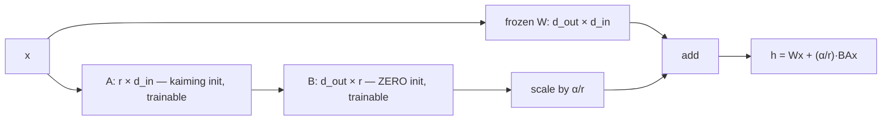

# Week 6 · Day 1 — Full fine-tuning vs PEFT; LoRA mechanics

[← Master Plan](../../../MASTER-PLAN.md) · [Week 6 overview](plan.md) · [← previous day](../week-5/day-5.md) · [next day →](day-2.md)

Monday, Aug 17 2026. New week, new pairing: **Fine-Tuning (13%) + Evaluation (7%) = 20% of the exam**, while the build block implements LoRA from scratch on a real 1.5B model. Today's study block is the most math-dense of the month — and every equation in it becomes code this afternoon.

## Study block (2 h)

**Exam domain: Fine-Tuning (13%)** — tied with Prompt Engineering as the exam's second-biggest domain. Today's question shapes: "why does full FT need X GB", "what does r/α do", "which modules does LoRA target".

### Why full fine-tuning is expensive — the memory arithmetic

Training memory ≠ weights. For mixed-precision AdamW training, per parameter you hold roughly:

```
weights (bf16)              2 bytes
gradients (bf16)            2 bytes
AdamW m (fp32 momentum)     4 bytes
AdamW v (fp32 variance)     4 bytes
fp32 master weights         4 bytes
                          ≈ 16 bytes/param  (+ activations on top)
```

A 7B model → **~112 GB of training state** before a single activation. That's a multi-GPU node for a model that *serves* on one 24 GB card. Add the other full-FT costs: every checkpoint is a full model copy (~14 GB each), and **catastrophic forgetting** — updating all weights on narrow data degrades general capabilities. Full FT is still right when you have large data, need deep behavior/knowledge change, and own the infra (continued pretraining, major domain shifts).

### LoRA — the equation and why every piece is there

**Hypothesis (Hu et al., 2021):** fine-tuning updates have low *intrinsic rank* — the weight delta ΔW lives close to a low-dimensional subspace. So freeze W and learn a low-rank factorization:

```
h = W·x + (α/r) · B·A·x        A ∈ ℝ^(r×d_in),  B ∈ ℝ^(d_out×r),  r ≪ d
```

**The adapter as a bypass lane — gradient only ever flows into the thin A→B path; W never changes:**



Every design choice is exam-testable:

- **Parameter count:** one d×d projection costs d² params to fine-tune fully, but only **2·d·r** with LoRA. d=4096, r=16 → 131k vs 16.8M — **0.78%**. Across a whole model, LoRA typically trains ~0.1–1% of params.
- **B initialized to ZERO, A random (kaiming):** at step 0, B·A = 0, so the adapted model **exactly equals the pretrained model** — no cold-start shock. Why not both zero? Then ∇A = 0 too (gradient of A passes through B) and nothing ever trains. Why not A zero instead? Symmetric argument — exactly one factor must be zero, and convention picks B.
- **α/r scaling:** decouples update *magnitude* from the *choice* of r. Sweep r without retuning the learning rate; the effective scale stays α/r. Convention: **α = 2r** (e.g. r=16, α=32).
- **Target modules:** the attention projections `q_proj, k_proj, v_proj, o_proj` first — note these are exactly the W_Q/W_K/W_V/W_O matrices you *built* last week — often plus the MLP (`gate/up/down_proj`) for more capacity. More targets ≈ more quality, more trainable params.
- **Merging:** after training, fold the adapter in: **W′ = W + (α/r)·B·A**. The merged model is a plain dense model — **zero inference overhead**. Or keep adapters unmerged for multi-tenant serving (one base model, many ~50 MB adapters, swapped or batched per request — S-LoRA / vLLM multi-LoRA).
- **Optimizer-state win (the headline):** AdamW states exist **only for A and B**. The 16-bytes/param tax applies to ~1% of params; the frozen base sits in bf16 doing forward/backward only. That's the entire "fits on one 24 GB GPU" story.

**Where the ~90 GB goes — the full-FT training-state tax vs LoRA paying it on ~1% of params (7B model):**

```
FULL FINE-TUNE                          LoRA (r=16, ~20M trainable)
weights bf16        14 GB  trained      frozen base bf16    14 GB  fwd/bwd only
gradients bf16      14 GB               adapters A,B bf16  ~0.04 GB  trained
AdamW m fp32        28 GB               adapter grads      ~0.04 GB
AdamW v fp32        28 GB               AdamW m+v+master   ~0.24 GB
fp32 master         28 GB               ─────────────────────────────
──────────────────────────              ≈ 14.3 GB + activations
≈ 112 GB + activations                  → one 24 GB GPU
→ multi-GPU node
```


### The rest of the PEFT zoo — name recognition only

- **Prompt tuning / p-tuning:** learn *soft prompt vectors* prepended to the input; the model itself is untouched. NVIDIA heritage — NeMo supported p-tuning early; expect it as a distractor or "which is NOT weight-modifying".
- **Prefix tuning:** learned vectors injected into every layer's KV.
- **IA³:** learned elementwise rescaling vectors on K/V/FFN activations — even fewer params than LoRA.
- **Adapters (classic, Houlsby):** small bottleneck MLPs *inserted* between layers — add inference latency (they stay in the forward pass), which is precisely what LoRA's mergeability fixed.

Why LoRA won in practice: quality ≈ full FT on most tasks, **mergeable to zero overhead**, tooling everywhere (HF PEFT, NeMo), and composable with quantization (QLoRA, tomorrow).

Trap distinctions for today: LoRA **does not speed up training compute per step** (full forward+backward still runs through the frozen base) — it cuts *memory* and checkpoint size. And LoRA is **not** quantization — that's tomorrow's marriage, not today's identity.

### Read next

- Hu et al., *LoRA* (2021) — §4 (method) + Table 2; skim the rest.
- HF PEFT conceptual guide, "LoRA" page — matches what you implement today.
- NeMo docs, PEFT section — the NVIDIA vocabulary for the same ideas.

### Quick check

1. Write the LoRA forward pass for a wrapped linear layer, with shapes of A and B for d_in = d_out = 2048, r = 8.
2. Why is B zero-initialized rather than A — and why not both?
3. A 7B model needs ~112 GB to fine-tune fully but LoRA-tunes on 24 GB. Where exactly did ~90 GB go?
4. Adapters (Houlsby) and LoRA both add small trained modules. What deployment property separates them?

<details><summary>Answers</summary>

1. `h = Wx + (α/r)·B(Ax)`; A: (8 × 2048), B: (2048 × 8). Trainable: 2·2048·8 = 32,768 vs 4.19M full — 0.78%.
2. B=0 makes BA=0 → model starts exactly at pretrained weights. Both zero → ∇A = Bᵀ(∂L/∂h)xᵀ = 0 forever; one factor must be nonzero to break symmetry, and A gets the random init by convention.
3. Optimizer states + fp32 master copies + gradients for the 99% of params that are now **frozen** — the ~14 bytes/param of training state that only adapter params still pay.
4. **Mergeability.** LoRA folds into W (W′ = W + (α/r)BA) → zero inference overhead; classic adapters remain extra layers in the forward pass → permanent latency tax.

</details>

## Build block (4 h)

**Study→build echo — this is the tightest coupling of the whole program:** the equation block above is literally today's file. `B` init zeros, `(α/r)` scaling, suffix-matched `q_proj` targeting — every exam fact becomes an assert in your test suite. When you can *implement* LoRA, the exam's fine-tuning domain becomes recall, not reasoning.

[Project brief](../../../gpu-engineering-lab/02-llm-engineering/week-06-lora-from-scratch/README.md) — Day 1: `LoRALinear` + model surgery.

**Objective:** implement `src/lora.py` — a `LoRALinear` wrapping a frozen `nn.Linear` (A: kaiming, B: zeros, α/r scaling, optional dropout on the LoRA path, `merge_()`/`unmerge_()`) — and `wrap_model_with_lora(model, target_modules, r, alpha, dropout)` that walks `named_modules()` and swaps matching linears by suffix (no hardcoded paths). Freeze everything except A/B.

**Definition of done:**
- Identity-at-init test green: wrapped model output == base model output, ≤ 1e-6 (B=0 working)
- Gradient-flow test green: A and B get grads, base weight does not
- Merge test green: `merge_()` then plain forward == adapter forward
- PEFT parity tests green: trainable-param count matches `peft.LoraConfig` exactly for same (r, α, targets)

**One hint:** module surgery gotcha — you can't replace a module while iterating `named_modules()`. Collect `(parent, attr_name)` pairs first, then `setattr(parent, attr_name, LoRALinear(child, ...))` in a second pass. Match targets by *suffix* (`name.endswith("q_proj")`) so the same code works on Qwen and Llama.

## Close the day (15 min)

- **Anki:** LoRA equation card, 16-bytes/param breakdown, B-zero reasoning, α/r purpose, target-module list, merge formula, PEFT zoo one-liners. (~8 cards.)
- **notes.md:** one line — trainable-param count your wrapper reports for r=16 on the 1.5B model, and whether it matched PEFT first try.
- **Blockers:** if PEFT parity is off, diff *which* modules each wrapped (`model.print_trainable_parameters()` vs your count per layer) — the usual culprit is embedding or lm_head accidentally matched.
