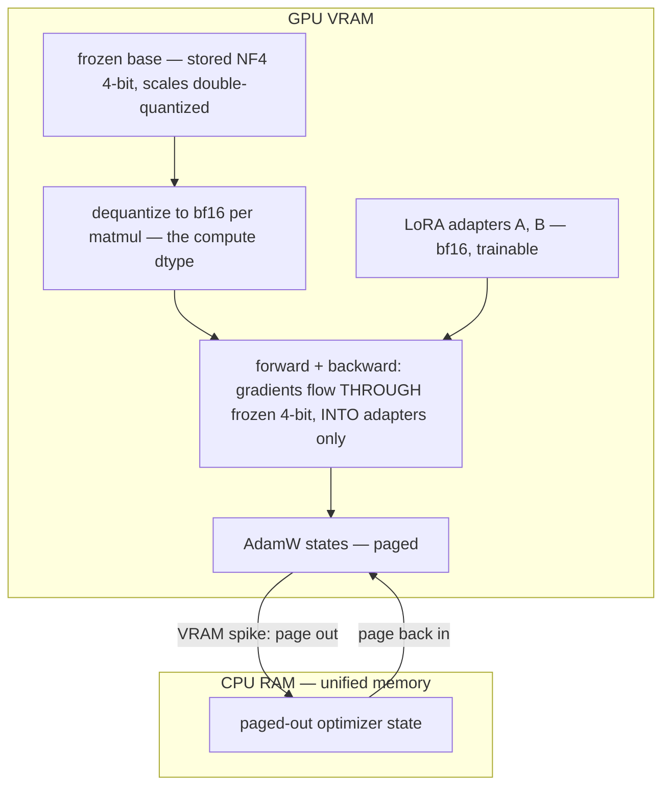

# Week 6 · Day 2 — QLoRA, hyperparameters, and the tooling map

[← Master Plan](../../../MASTER-PLAN.md) · [Week 6 overview](plan.md) · [← previous day](day-1.md) · [next day →](day-3.md)

Tuesday, Aug 18 2026. Yesterday: the LoRA equation. Today: the two things that make it *practical* — quantizing the frozen base (QLoRA) and knowing which knobs to turn. Then a first real fine-tune this afternoon.

## Study block (2 h)

**Exam domain: Fine-Tuning (13%)** — today also feeds **Model Optimization (17%, week 7)** intuition, since NF4 is your first serious contact with quantization. Question shapes: "which QLoRA component does X", "the loss exploded / nothing learned — which hyperparameter", "which tool provides Y".

### QLoRA — three tricks, one insight

**The enabling insight:** gradients never flow *into* frozen weights, only *through* them. The chain rule needs the base weights' *values* for the backward pass, not their gradients — so the frozen base can be stored in 4-bit while bf16 LoRA adapters train on top. Fine-tune a 7–8B model on a single 24 GB GPU.

The three named components (Dettmers et al., 2023) — the exam asks these individually:

1. **NF4 (4-bit NormalFloat):** pretrained weights are approximately normally distributed. NF4's 16 quantization levels are placed at the **quantiles of a standard normal** — equal probability mass per bin — instead of evenly spaced (like INT4). Information-theoretically optimal for normal data; that's the phrase to recognize. Weights are dequantized to bf16 on the fly for each matmul (the **compute dtype**) — compute never happens in 4-bit.
2. **Double quantization:** blockwise quantization stores an fp32 scale constant per 64-weight block — that overhead is itself quantized (quantize the quantization constants), saving ~0.37 bits/param. Small, but it's a named exam term.
3. **Paged optimizers:** optimizer states live in unified memory and page to CPU RAM on VRAM spikes (long sequences, big batches) instead of OOM-crashing. Think "swap for optimizer states".

**The three components in one picture — 4-bit storage, bf16 compute, gradients through the base but only into the adapters:**

**Cost:** dequantizing on every forward makes QLoRA steps **~20–40% slower** than bf16 LoRA. The trade is VRAM ↓ for step time ↑ — your Day 3 build measures this exact number on your own GPU. Trap: QLoRA does **not** train weights in 4-bit, does **not** quantize the adapters (they stay bf16), and is **not** an inference format per se (that's week 7's INT8/FP8/AWQ story).

### Hyperparameters — the numbers to memorize and the failure modes

| Knob | Typical (LoRA SFT) | Wrong-direction symptom |
|---|---|---|
| Learning rate | **1e-4 – 3e-4** (≈10× full-FT's 1e-5 – 2e-5) | Too high: loss spikes/NaN. Too low: flat loss. Full-FT lr on LoRA: barely learns |
| Rank r | 8–64 (16 default) | Too low: underfits complex tasks. Too high: params/VRAM up, diminishing returns, mild overfit risk |
| Alpha α | **2r** convention | Mismatched α/r across sweeps = incomparable runs |
| LoRA dropout | 0.05–0.1 | On the adapter path only |
| Epochs | **1–3** for SFT | More: memorizes the dataset, catastrophic-forgetting flavor — instruct model gets *worse* at general chat |
| Batch | effective batch via **gradient accumulation** (micro-batch × accum steps) | Tiny effective batch: noisy loss; the fix is accumulation, not more VRAM |
| Schedule | linear warmup (~3%) + cosine decay | No warmup at high lr: early instability |
| Precision | **bf16** over fp16 | bf16 has fp32's exponent range → no loss-scaling/GradScaler needed; fp16 needs scaling and can still overflow |

Why LoRA tolerates (needs) ~10× higher lr than full FT: you're training a tiny, zero-initialized subspace from scratch, not perturbing 7B pretrained weights — bigger steps are safe and necessary.

### The tooling map — who does what

- **HF PEFT:** adapter implementations (LoraConfig, get_peft_model) — your parity reference on Friday.
- **HF TRL:** the trainers — `SFTTrainer` (instruction tuning), `DPOTrainer` (Wednesday's topic).
- **bitsandbytes:** the NF4/8-bit CUDA kernels under `load_in_4bit=True`.
- **NVIDIA NeMo:** framework-native fine-tuning with NeMo 2.0 recipes (LoRA/p-tuning/full FT at scale), and **NeMo-Aligner** for RLHF/DPO. Exam heuristic: open-ecosystem question → PEFT/TRL; NVIDIA-stack question → NeMo (Curator → data, NeMo/Aligner → training, NIM → serving; keep the assembly line straight).

**Lab prep (15 min, scheduled by the [week plan](plan.md)):** skim [labs/lab-finetune-lora.md](../labs/lab-finetune-lora.md) end to end — Friday you run it on a rented GPU, and it should feel like *execution, not discovery*. Note how its `LoraConfig(r=16, lora_alpha=32, ...)` and `learning_rate=2e-4` are exactly today's table, and that its expected output ("trainable ≈ 1.18%") is yesterday's arithmetic.

### Read next

- Dettmers et al., *QLoRA* (2023) — §2–3 for the three components; skip the eval sections.
- bitsandbytes docs, 4-bit quantization page — the `BitsAndBytesConfig` flags you'll use tomorrow.
- Sebastian Raschka, *Practical Tips for Finetuning LLMs with LoRA* — the best empirical hyperparameter tour.

### Quick check

1. Name QLoRA's three components and the specific cost each attacks.
2. Why can the base model be 4-bit during training when gradients "can't flow through 4 bits"?
3. A LoRA run uses lr = 2e-5 (copied from a full-FT recipe). Predicted symptom and fix?
4. Why is bf16 preferred over fp16 for fine-tuning, mechanically?

Answers

1. **NF4** → weight storage (4-bit, normal-quantile levels); **double quantization** → the quantization constants' own overhead (~0.37 bits/param); **paged optimizers** → OOM spikes from optimizer state (page to CPU).
2. They can flow *through*: backward needs the weights' values (dequantized to bf16 per matmul), not their gradients — the base is frozen, so no 4-bit weight update ever happens; only bf16 adapters update.
3. Loss decreases glacially / adapter barely trains — LoRA's small zero-init subspace needs ~10× full-FT lr. Fix: 1e-4–3e-4.
4. bf16 keeps fp32's 8-bit exponent (same dynamic range, less mantissa) → gradients don't underflow → no GradScaler/loss-scaling machinery; fp16's 5-bit exponent needs scaling and can still overflow/NaN.

## Build block (4 h)

**Study→build echo:** the hyperparameter table above is your training config this afternoon — r=16, α=32, lr ~2e-4, warmup+cosine, bf16 without GradScaler. You studied *why* each number; now you watch what it does to a real loss curve on your own GPU.

[Project brief](../../../gpu-engineering-lab/02-llm-engineering/week-06-lora-from-scratch/README.md) — Day 2: bf16 LoRA fine-tune on the real model.

**Objective:** `src/train_lora.py` — load Qwen2.5-1.5B-Instruct in bf16 (`attn_implementation="sdpa"`, gradient checkpointing ON), wrap with **your** Day-1 LoRA (targets `q_proj,k_proj,v_proj,o_proj`; r=16, α=32); tokenize alpaca-cleaned into prompt/response format with prompt tokens masked out of the loss (label −100); train ~1 epoch on a 3–10k subset.

**Definition of done:**
- Prompt tokens masked (−100) — verified on one decoded sample before training
- Run completes ~1 epoch; smoothed loss decreases monotonically, no NaNs
- CSV log: loss, tok/s, and `torch.cuda.max_memory_allocated()` recorded (tomorrow's QLoRA comparison baseline)
- Fits in 24 GB at seq 1024, micro-batch 4–8 with checkpointing

**One hint:** build the label mask by tokenizing prompt-only and full text separately — `labels[:len(prompt_ids)] = -100`. Sanity-check by decoding *only* the supervised positions of one example: you should read pure assistant response. If you see instruction text, you're training the model to parrot prompts — the classic silent SFT bug.

## Close the day (15 min)

- **Anki:** NF4 definition, double quantization, paged optimizers, LoRA lr rule (10×), epochs 1–3 + overfit symptom, bf16-vs-fp16 mechanics, PEFT/TRL/bitsandbytes/NeMo-Aligner roles. (~8 cards.)
- **notes.md:** one line — final loss, peak VRAM, tok/s of the bf16 run.
- **Blockers:** if VRAM overflowed, note what you cut (seq length vs micro-batch) so tomorrow's QLoRA comparison changes exactly one variable: the quantization.
