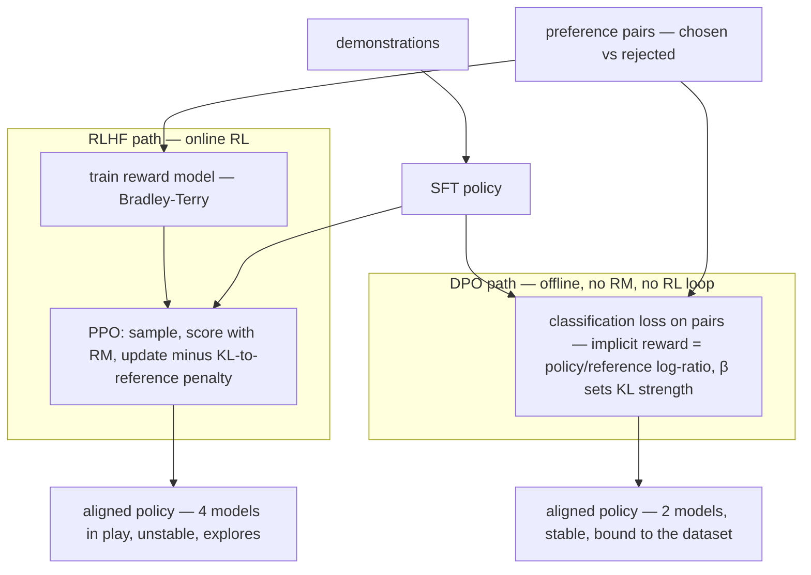

# Week 6 · Day 3 — Instruction tuning, RLHF, and DPO

[← Master Plan](../../../MASTER-PLAN.md) · [Week 6 overview](plan.md) · [← previous day](day-2.md) · [next day →](day-4.md)

Wednesday, Aug 19 2026. How a base next-token predictor becomes a helpful assistant: SFT teaches the *format* of being helpful, preference optimization teaches the *judgment*. The exam loves this pipeline because every stage has a distinct artifact and a distinct failure mode.

## Study block (2 h)

**Exam domain: Fine-Tuning (13%).** Today's material is also the exam's favorite scenario-question generator: "a company wants X — full FT, LoRA, RAG, or DPO?" The decision drill at the end is the actual skill being tested.

### SFT / instruction tuning — mechanics that get tested

Supervised fine-tuning on demonstration data: chat-format datasets (JSONL of `role`/`content` turns), trained with ordinary cross-entropy — but with three details the exam probes:

1. **Loss masking:** prompt/instruction tokens are masked (label −100); loss is computed **only on assistant-response tokens**. You want the model to learn to *answer*, not to *generate user questions*. (You implemented exactly this yesterday — the study/build loop closing in real time.)
2. **Chat-template consistency:** train and inference must serialize turns with the same special tokens — the week-5 day-3 failure mode, now from the training side.
3. **Quality > volume (LIMA):** ~1k excellent, diverse demonstrations can align a strong base model. Data curation effort beats data scale for SFT — ties back to week-5 day-5's curation story.

SFT's ceiling: it can only imitate demonstrations. It can't express "answer A is *better than* answer B" — for that you need preferences.

### RLHF — the InstructGPT pipeline, stage by stage

Three stages; know each one's **input, artifact, and failure mode**:

| Stage | Input | Artifact | Failure mode |
|---|---|---|---|
| 1. SFT | demonstrations | SFT policy (the starting point) | imitation ceiling |
| 2. Reward model (RM) | **preference pairs** (chosen vs rejected, human-ranked) | a model scoring responses | RM is an imperfect proxy for humans |
| 3. PPO | prompts + RM + SFT policy | aligned policy | **reward hacking / RM overoptimization** |

Stage 2: humans *rank* pairs of model outputs (ranking is far cheaper and more reliable than writing demonstrations); the RM trains to score the chosen response above the rejected one (Bradley–Terry loss).

Stage 3: PPO generates responses, the RM scores them, the policy updates toward higher reward — **minus a KL penalty to the SFT policy**. The KL term is heavily tested: it keeps the policy from drifting into degenerate text that *games* the RM (sycophancy, verbosity, repetitive flattery — reward hacking). Remove the KL anchor and the policy overoptimizes an imperfect proxy: high reward, worse actual outputs (Goodhart's law, in exam language "RM overoptimization").

RLHF's cost: four models in play during PPO (policy, reference, RM, value/critic), RL instability, serious infra. Which is why…

### DPO — preference optimization without the RL

**Direct Preference Optimization** skips the explicit reward model *and* the RL loop. The insight: the RLHF objective has a closed-form implicit reward — the log-probability ratio between the policy and a frozen reference model. DPO plugs that into a simple classification-style loss directly on preference pairs:

```
L = −log σ( β·[ log π(y_chosen|x)/π_ref(y_chosen|x) − log π(y_rejected|x)/π_ref(y_rejected|x) ] )
```

Raise the margin between chosen and rejected, where **β controls KL strength** (how far from the reference you may drift — big β = conservative). Trade-offs, exam-ready: DPO is **simpler, cheaper, more stable** (two models, no sampling loop, looks like supervised training — even LoRA-able on one GPU); PPO-RLHF is **online** (explores new responses during training) while DPO is **offline** (bound to the static preference dataset). Frontier labs still use RL variants; most applied teams ship DPO.

**Both alignment routes start from the same SFT policy and the same preference pairs — DPO just deletes the two middle boxes:**



Name-check successors (one line each, distractor-proofing): **KTO** — unpaired thumbs-up/down instead of pairs; **ORPO** — folds preference into SFT, no reference model; **GRPO** — group-relative PPO variant powering reasoning-model RL (R1-style). NVIDIA tooling: **NeMo-Aligner** implements SFT, RM training, PPO, and DPO.

### The decision drill — do this on paper (20 min)

For each scenario pick **full FT / LoRA(+SFT) / RAG / DPO** and one-line justification. This is the exam's exact format:

1. Legal firm: answers must cite current case law, updated weekly.
2. Startup: model must output the company's strict JSON schema, every time.
3. Hospital: model too verbose and occasionally unsafe in tone; has 50k ranked response pairs.
4. Enterprise: wants a German-speaking medical model from an English base, has 2 TB of domain text and a GPU cluster.
5. Agency: wants brand voice in all copy; has 3k exemplar posts, one 24 GB GPU.

<details><summary>Drill answers</summary>

1. **RAG** — fresh, attributable knowledge; retraining weekly is absurd. 2. **LoRA SFT** — format/behavior with limited data (+ constrained decoding at inference, belt-and-braces). 3. **DPO** — ranked pairs are preference data by definition; tone/judgment, not knowledge. 4. **Full FT / continued pretraining** — deep capability + language shift, big data, owned infra. 5. **LoRA SFT** — style transfer on commodity hardware; the week's lab is literally this.

</details>

### Read next

- Ouyang et al., *InstructGPT* (2022) — Figure 2 is the pipeline; internalize it.
- Rafailov et al., *DPO* (2023) — §1–2 (intuition + loss); skip the derivation on first pass.
- HF TRL DPOTrainer docs — see how thin the code is vs PPO; that thinness *is* the argument.
- NeMo-Aligner docs landing page — NVIDIA names for all four stages.

### Quick check

1. Why does PPO-RLHF include a KL penalty to the SFT policy, and what happens without it?
2. What data do you need for an RM vs for DPO — and what does that tell you about DPO's shortcut?
3. Your SFT'd model generates plausible user questions after answering. Which mechanical detail was botched?
4. KTO vs DPO in one sentence.

<details><summary>Answers</summary>

1. It anchors the policy near the SFT distribution so it can't drift into degenerate outputs that exploit RM blind spots. Without it: reward hacking / RM overoptimization — reward climbs, real quality falls.
2. Both need **preference pairs** (chosen/rejected). DPO uses them *directly* with an implicit reward (policy/reference log-ratio), eliminating the separate RM and the RL loop.
3. **Loss masking** — prompt tokens weren't set to −100, so the model was also trained to produce user-turn text.
4. KTO works from **unpaired** binary feedback (this response: good/bad) instead of DPO's chosen-vs-rejected pairs — easier data to collect.

</details>

## Build block (4 h)

**Study→build echo:** this morning covered training *methods* (SFT you already built; RLHF/DPO you now understand); this afternoon covers training *economics* — QLoRA, where yesterday's NF4 theory becomes a measured VRAM-vs-step-time trade-off on your own hardware. The comparison table you produce today is the empirical proof of Tuesday's study block.

[Project brief](../../../gpu-engineering-lab/02-llm-engineering/week-06-lora-from-scratch/README.md) — Day 3: QLoRA.

**Objective:** rerun yesterday's fine-tune with the base loaded via `BitsAndBytesConfig(load_in_4bit=True, bnb_4bit_quant_type="nf4", bnb_4bit_compute_dtype=torch.bfloat16, bnb_4bit_use_double_quant=True)`. Your `LoRALinear` must tolerate a bnb `Params4bit` base layer — call the base as a black box, never touch `.weight` on the QLoRA path.

**Definition of done:**
- QLoRA run completes with your own LoRA wrapper, same data/schedule/seed as Day 2
- Comparison table: peak VRAM, s/step (median), final loss — bf16-LoRA vs QLoRA
- Expected shape confirmed and stated: **large VRAM drop on weights, some step-time cost from dequant**, near-identical loss
- No code path reads `base.weight` directly when quantized

**One hint:** the reason "never touch `.weight`" is a rule: bnb stores a packed 4-bit blob whose dtype/shape lie to you. Your LoRA path only needs `base_layer(x)` + your own `(α/r)·B(A(x))` — if your Day-1 module was written as wrapper-calls-inner-layer (not weight-surgery), today is a config change, not a rewrite. That was the design lesson all along.

## Close the day (15 min)

- **Anki:** RLHF three stages (input/artifact/failure each), KL-penalty purpose, DPO one-liner + β, PPO-vs-DPO trade-off, KTO/ORPO/GRPO one-liners, decision-drill rules of thumb. (~8 cards.)
- **notes.md:** one line — the three-number comparison: VRAM bf16 vs QLoRA, step-time delta, loss delta.
- **Blockers:** if bnb fights your wrapper, note the exact exception; the fallback is wrapping *around* the quantized `Linear4bit` module rather than replacing it — decide tonight, implement tomorrow morning before eval.
