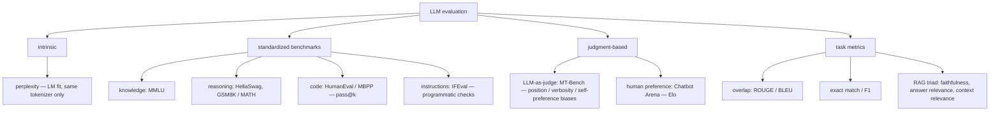

# Week 6 · Day 4 — Evaluation: perplexity, benchmarks, LLM-as-judge

[← Master Plan](../../../MASTER-PLAN.md) · [Week 6 overview](plan.md) · [← previous day](day-3.md) · [next day →](day-5.md)

Thursday, Aug 20 2026. You've spent three days changing model behavior; today is how you *prove* anything changed — and the limits of every proof. Evaluation is the smallest domain of the week but punches above its weight in scenario questions ("the team observed X — which metric/method?").

## Study block (2 h)

**Exam domain: Evaluation (7%).** Three layers: intrinsic (perplexity), standardized (benchmarks), and judgment-based (LLM-as-judge + task metrics). Know what each *can and cannot* claim — the traps live in the "cannot".

**The whole toolbox as one tree — every leaf below gets its own section today:**



### Perplexity — the definition, exactly

Perplexity is the exponential of the average negative log-likelihood the model assigns to a held-out sequence:

```
PPL = exp( −(1/N) · Σᵢ log p(tokenᵢ | tokens₍<ᵢ₎) )
```

Interpretation: the model's *effective branching factor* — "how many tokens is it choosing among, on average". PPL 1 = perfect prediction; uniform over vocab V gives PPL = V. Cross-entropy loss in nats is `ln(PPL)` — your week-5 GPT hitting val loss 2.0 nats *was* perplexity e² ≈ 7.4; you've already computed this metric by hand.

**The two big limitations (exit-criteria item, verbatim):**
1. **Only comparable with the same tokenizer.** PPL is per-*token*; different tokenizers slice text into different numbers of tokens, so cross-tokenizer PPL comparisons are meaningless (compare via bits-per-byte if you must).
2. **Measures language-modeling fit, not task ability.** PPL reliably drops after domain fine-tuning yet says nothing about instruction-following, helpfulness, or safety. A model can have great PPL and be a terrible assistant — and DPO can make a *better* assistant with *worse* PPL.

### Benchmarks — the match-the-name table

| Benchmark | Measures | Format |
|---|---|---|
| **MMLU** | broad knowledge, 57 subjects | multiple choice |
| **HellaSwag** | commonsense continuation | pick the ending |
| **GSM8K / MATH** | grade-school / competition math reasoning | free-form, CoT-scored |
| **HumanEval / MBPP** | code generation | **pass@k** (unit tests) |
| **TruthfulQA** | resistance to common falsehoods | MC + generation |
| **MT-Bench** | multi-turn chat quality | **LLM-judged**, 1–10 |
| **Chatbot Arena** | overall human preference | pairwise battles → **Elo** |
| **IFEval** | verifiable instruction following ("exactly 3 bullets") | programmatic check |

Be able to match all eight blind — the exam asks it straight. Two systemic caveats: **contamination** (public benchmarks leak into pretraining data; scores inflate without capability — the week-5 dedup connection) and **saturation/gaming** (models tuned toward the leaderboard, headroom exhausted; hence newer suites like MMLU-Pro and GPQA).

pass@k deserves one precise sentence: generate k samples per problem; the metric is the probability at least one passes the unit tests — reported as pass@1, pass@10, etc. (Computed with an unbiased estimator, not literally best-of-k.)

### LLM-as-judge — scalable, biased, correctable

Use a strong LLM to grade outputs: **single-answer grading** (score against a rubric) or **pairwise comparison** (A vs B, which is better — generally more reliable). It scales where humans can't; MT-Bench and Arena-Hard run on it. But the judge has **named biases** — exam wants all three plus mitigations:

| Bias | Effect | Mitigation |
|---|---|---|
| **Position bias** | favors the first(-listed) answer | judge both orders (A,B then B,A), average or require agreement |
| **Verbosity bias** | longer ≈ scored better | length-controlled rubrics/metrics |
| **Self-preference** | favors its own/model-family style | different-family judge, judge ensembles |

Plus always: explicit rubrics, and the strongest judge you can afford (weak judges add noise, not signal).

### Task metrics + RAG triad (rounding out the toolbox)

- **ROUGE / BLEU:** n-gram overlap vs references (summarization/translation heritage). Weak for open-ended generation — many valid answers share few n-grams. If a question says "the metric penalized a correct but differently-worded answer", that's overlap-metric failure.
- **Exact match / F1:** extraction and closed QA (SQuAD-style).
- **RAG triad** (from week-5 day-4, now formal): **faithfulness** (answer grounded in retrieved context?), **answer relevance** (addresses the question?), **context relevance** (retrieved the right chunks?) — typically scored by an LLM judge; debug retrieval before generation.
- **Tooling names:** **lm-evaluation-harness** (EleutherAI — the open standard; you run it *today* in the build block) and **NeMo Evaluator** (NVIDIA's managed equivalent — the exam's NVIDIA-flavored answer).

### Read next

- Zheng et al., *Judging LLM-as-a-Judge with MT-Bench and Chatbot Arena* (2023) — §3 (biases) is the exam-relevant part.
- lm-evaluation-harness README — task list + how few-shot k is specified (you'll cite `--num_fewshot` today).
- HF blog, *Perplexity of fixed-length models* — the sliding-window subtlety in 10 minutes.

### Quick check

1. Define perplexity from cross-entropy loss, and convert: val loss 2.0 nats = PPL ?
2. Why can't you compare Llama-3's perplexity to Qwen2.5's on the same corpus?
3. A judge model prefers answer A when listed first and answer B when *it's* listed first. Name the bias and the standard fix.
4. Match: pass@k, Elo, 57-subject multiple choice, verifiable instruction constraints.

<details><summary>Answers</summary>

1. PPL = exp(mean NLL) = e^2.0 ≈ **7.4** — the week-5 TinyStories target, now with its formal name.
2. Different tokenizers → different tokens/text → per-token likelihoods aren't on a common scale. Same-tokenizer only (or bits-per-byte).
3. **Position bias.** Evaluate both orderings and average, or only count consistent verdicts.
4. pass@k → HumanEval/MBPP; Elo → Chatbot Arena; 57-subject MC → MMLU; verifiable constraints → IFEval.

</details>

## Build block (4 h)

**Study→build echo — today they're the same activity:** the study block defined the instruments; the build block points them at your own fine-tune. You'll run lm-evaluation-harness (benchmarks), build a qualitative side-by-side (the honest, human version of LLM-as-judge), and confirm the merge math — then report what you find *even if it's flat*, which the study block just taught you to expect for 1.5B + 3k examples.

[Project brief](../../../gpu-engineering-lab/02-llm-engineering/week-06-lora-from-scratch/README.md) — Day 4: evaluation + merge.

**Objective:** `src/eval.py` + lm-eval-harness on 2–3 cheap tasks (`hellaswag`, `arc_easy`, `winogrande`) — base vs fine-tuned. `src/merge.py`: merge adapters into dense weights (W′ = W + (α/r)·BA), save a standalone model, verify merged == adapter outputs. Build the 8–10-prompt qualitative table for `RESULTS.md`.

**Definition of done:**
- Eval JSON committed: 2–3 tasks × {base, fine-tuned}
- Honest one-line reading of the deltas (small model, small data → benchmarks barely move; **that IS the finding** — style changed, capability didn't, the RAG-vs-FT lesson measured)
- Merge test green: merged model reproduces adapter-model outputs ≤ 1e-4 (fp32 compare)
- Qualitative table drafted: 8–10 fixed prompts, base vs fine-tuned, side by side

**One hint:** run the merged-equivalence check in fp32 — in bf16, rounding in W + (α/r)BA legitimately produces small diffs that will fail 1e-4 and send you debugging correct code. Precision of the *comparison* is part of the experiment design.

## Close the day (15 min)

- **Anki:** perplexity formula + the nats↔PPL conversion, its two limitations, all eight benchmark pairings, three judge biases + mitigations, ROUGE/BLEU failure mode, RAG triad, lm-eval-harness vs NeMo Evaluator. (~10 cards — biggest deck of the week, it's all memorizable.)
- **notes.md:** one line — eval deltas (or their absence) and whether the merge check passed.
- **Blockers:** tomorrow needs a rented GPU for the cert lab — confirm tonight the provider/instance you'll use (L4/A10G/4090 class) so Friday morning is execution, not shopping.
