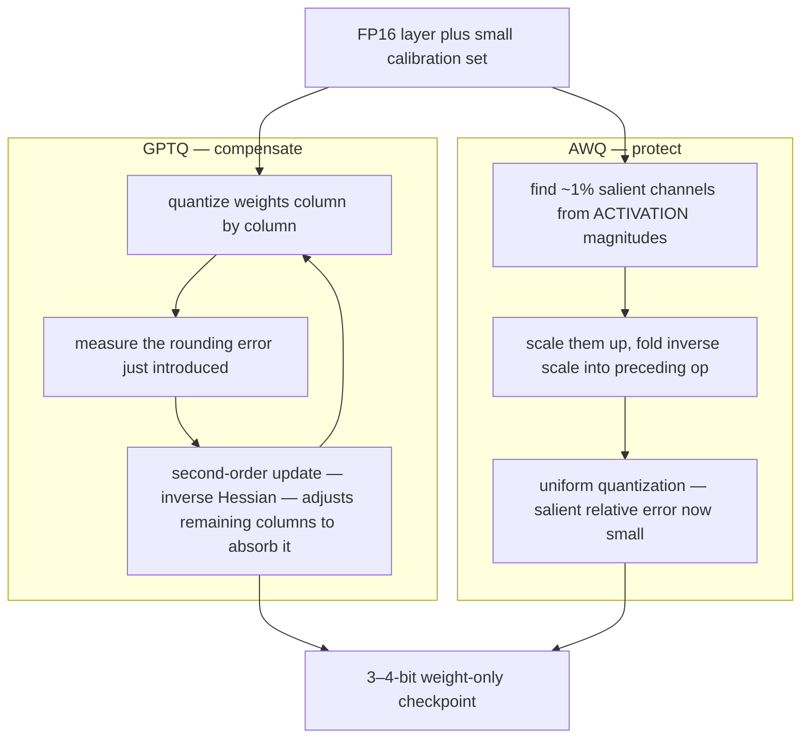
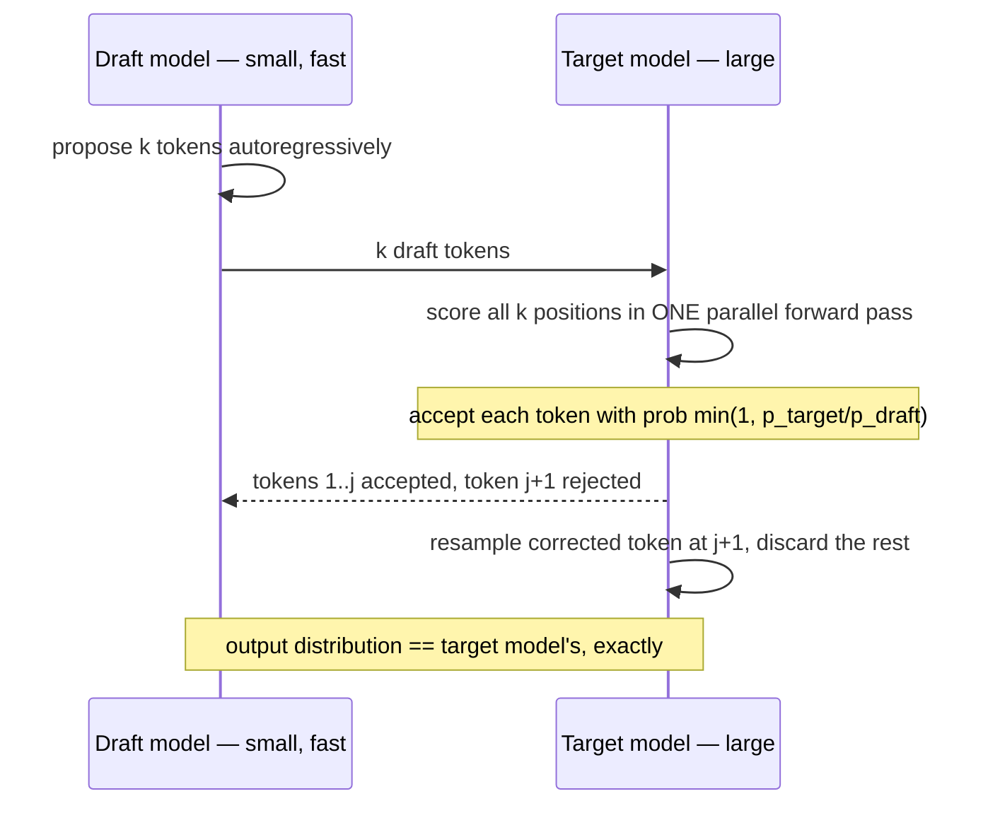

# Week 7 · Day 2 — GPTQ vs AWQ, pruning, distillation, speculative decoding

[← Master Plan](../../../MASTER-PLAN.md) · [Week 7 overview](plan.md) · [← previous day](day-1.md) · [next day →](day-3.md)

## Study block (2 h)

Still in **Model Optimization (17%)** — today covers the four remaining technique families and, crucially, how to tell them apart. The exam's favorite move in this domain is a scenario question ("latency-bound chat app", "24 GB memory ceiling", "accuracy collapsed after 4-bit PTQ") where each answer option is a *real* technique and only one matches the constraint. Learn the techniques as answers-to-constraints, not as trivia.

### GPTQ and AWQ — same goal, opposite philosophies

Both are **PTQ, weight-only, 3–4-bit** methods needing a small calibration set. The difference is *how they spend the error budget*:

- **GPTQ** (error-compensating rounding): descends from Optimal Brain Quantization. It quantizes each layer's weights column by column, and after rounding each column it uses approximate **second-order information** (the inverse Hessian of the layer's reconstruction loss, built from calibration activations) to *adjust the remaining unquantized columns* to compensate for the error just introduced. Result: the layer's output on calibration data stays close to the FP original even at 3–4 bits.
- **AWQ** (activation-aware scaling): observes that roughly **1% of weight channels are "salient"** — and you find them by looking at **activation** magnitudes, not weight magnitudes (big activations amplify small rounding errors). Instead of keeping those channels in FP16 (mixed precision = kernel pain), AWQ **scales salient channels up before quantization** (and folds the inverse scale into the preceding op), shrinking their relative rounding error. No backprop, no Hessian, robust across domains, and it ships with fast fused kernels — which is why AWQ checkpoints dominate practical 4-bit serving.

**Same input, same output format, opposite error-budget strategies — GPTQ repairs damage after rounding, AWQ prevents it before:**

One-line discriminator to memorize: **GPTQ = compensate rounding error with second-order updates; AWQ = protect activation-identified salient channels via scaling.** If an exam option says AWQ uses gradients or retraining, it's wrong. If it says GPTQ quantizes activations, it's wrong — both are weight-only.

### Pruning — removing parameters, not precision

- **Unstructured**: zero out individual weights by magnitude/saliency. Great compression on paper, but irregular sparsity needs special kernels — dense GPUs see no speedup.
- **Structured**: remove whole attention heads, layers, or channels — the tensor physically shrinks, so *any* hardware speeds up. Costs more accuracy per parameter removed.
- **2:4 semi-structured** (the NVIDIA answer): in every contiguous group of 4 weights, exactly 2 are zero. **Sparse Tensor Cores (Ampere and later)** skip the zeros for up to **2× math throughput** with a compact storage format. Requires pruning to the pattern plus fine-tuning/distillation to recover accuracy. This is the exam's canonical "hardware-exploitable sparsity".

### Distillation — transferring capacity

Train a small **student** on the **teacher's soft logits** — a temperature-scaled softmax gives "dark knowledge" (relative probabilities of wrong answers) that hard labels don't carry — via KL-divergence loss, optionally also matching intermediate hidden states/attention maps. NVIDIA's **Minitron** recipe combines the last two families: take a large model, **prune** it (depth and/or width), then **distill** from the original to recover quality — that's how Llama-3.1-Minitron and the small Nemotron models were made, at a fraction of from-scratch training cost. "Prune-then-distill" is a phrase worth having ready verbatim.

### Speculative decoding — an algorithmic speedup with a correctness guarantee

Decode is sequential: one token per full forward pass, memory-bound (Day 3 explains why). Speculative decoding attacks the *sequential* part:

1. A cheap **draft model** proposes `k` tokens autoregressively (fast — it's small).
2. The **target model** scores all `k` positions in **one parallel forward pass** (roughly the cost of generating one token, since decode is bandwidth-bound and the extra positions ride along nearly free).
3. Each draft token is accepted with probability `min(1, p_target(x) / p_draft(x))`. On the first rejection, the remainder is discarded and a corrected token is sampled from an adjusted distribution.

**One draft-verify round — the target model touches its weights once for (up to) k+1 tokens of progress:**

That accept/adjust rule is **rejection sampling**, and it guarantees the output distribution is *exactly* the target model's — not an approximation. Intuition for the speedup: if the per-token acceptance rate is `α`, each verify pass yields on the order of `(1 − α^(k+1)) / (1 − α)` tokens instead of 1 — at `α ≈ 0.8, k = 4` that's ~3 tokens per target-model pass. Speedup therefore depends on **draft/target alignment** (same domain, same tokenizer family) and only materializes when decode is memory-bound with spare compute. Variants: **Medusa** (extra decoding heads on the target model itself — no separate draft), **EAGLE** (drafts at the feature/hidden-state level, currently the strongest acceptance rates).

### The four axes — the decision matrix

| Technique | Attacks | Best when | Watch out |
|---|---|---|---|
| Quantization | **precision** (bytes/param) | memory ceiling, decode latency, cheap win | W4A16 doesn't help prefill; PTQ can fail at ≤4-bit → QAT |
| Pruning (2:4) | **parameter count** | compute throughput on Ampere+, paired with distillation | needs fine-tuning to recover; unstructured ≠ speedup |
| Distillation | **model capacity** | you can afford training; want a permanently smaller model | needs teacher access + data + GPUs |
| Speculative decoding | **algorithm** (sequential decode) | latency-bound, low-batch serving with spare compute | no memory savings; needs aligned draft; gains shrink at high batch |

Scenario drill (say answers out loud): *latency-bound chat* → speculative decoding + quantization; *throughput-bound batch summarization* → W8A8/FP8 (compute-bound at big batch) + bigger batches, spec decode helps little; *24 GB memory ceiling for a 14B model* → 4-bit weight-only + FP8 KV cache; *"we own the training pipeline and PTQ accuracy is unacceptable"* → QAT or distillation.

### Read next

- AWQ paper (Lin et al., 2023), sections 1–3: <https://arxiv.org/abs/2306.00978> — doubles as background for Thursday's build.
- GPTQ paper (Frantar et al., 2022), intro only: <https://arxiv.org/abs/2210.17323>
- *Fast Inference from Transformers via Speculative Decoding* (Leviathan et al., 2023), sections 1–2: <https://arxiv.org/abs/2211.17192>
- NVIDIA Minitron blog — "How to prune and distill Llama-3.1 8B": <https://developer.nvidia.com/blog/how-to-prune-and-distill-llama-3-1-8b-to-an-nvidia-llama-3-1-minitron-4b-model/>

### Quick check

1. One line each: how do GPTQ and AWQ decide *which* weights deserve protection from rounding error?

Answer
GPTQ doesn't "protect" — it quantizes column-by-column and uses second-order (Hessian-based) updates to make the *remaining* weights compensate the error. AWQ identifies ~1% salient channels from *activation* magnitudes and rescales them before uniform quantization so their relative rounding error shrinks.

2. Why does unstructured pruning at 50% sparsity often give zero speedup on a GPU, while 2:4 sparsity gives up to 2×?

Answer
Unstructured zeros are scattered — dense Tensor Core kernels still compute the whole matmul; exploiting them needs sparse formats/kernels that rarely win at 50%. 2:4 is a fixed pattern that Sparse Tensor Cores (Ampere+) support natively in hardware, skipping the zeros with a compact index format.

3. Does speculative decoding change the target model's output distribution? What mechanism guarantees your answer?

Answer
No. Draft tokens are accepted with probability min(1, p_target/p_draft) and rejections are resampled from a corrected (residual) distribution — rejection sampling that provably reproduces the target distribution exactly.

4. A team must fit a 14B model on a 24 GB GPU with long contexts, no training budget. Pick techniques.

Answer
PTQ weight-only 4-bit (AWQ/GPTQ: ~28 GB FP16 → ~8 GB) plus FP8 KV-cache quantization for the long contexts. Distillation/QAT are out (training budget), pruning alone won't fit it and needs recovery training.

## Build block (4 h)

**Today: FlashAttention forward, part 1 — non-causal, numerically correct at one size.** [Project brief](../../../gpu-engineering-lab/02-llm-engineering/week-07-triton-quantization/README.md)

- `src/flash_fwd_triton.py`: single-head-batched (grid over `B*H` and query blocks). Per query block, iterate over KV blocks maintaining running max `m`, running denominator `l`, and un-normalized accumulator `acc`; rescale `acc` and `l` by `exp(m_old − m_new)` whenever a new tile raises the max (online softmax). Never materialize the N×N score matrix in HBM.
- **Definition of done (today):** non-causal version matches SDPA ≤ 1e-2 abs in fp16 at one fixed size (e.g. B=2, H=4, N=1024, d=64). Causal masking and autotuning are tomorrow — don't chase them today.
- Hint: keep `m`, `l`, `acc` in fp32 even though inputs are fp16 — accumulating the online softmax in fp16 is the classic silent-precision bug that "almost passes" the tolerance.
- Before coding, re-derive the online-softmax update on paper once (Milakov & Gimelshein 2018 has it in half a page) — 15 minutes of paper saves 2 hours of debugging.

## Close the day (15 min)

- Anki: GPTQ-vs-AWQ one-liner, 2:4 sparsity + hardware, Minitron prune-then-distill, the acceptance rule `min(1, p_t/p_d)`, and the four-axes table rows.
- One line in [notes.md](notes.md): which scenario→technique mapping felt least automatic.
- Log blockers — if the non-causal kernel isn't correct yet, note exactly which test/shape fails; tomorrow starts there.
