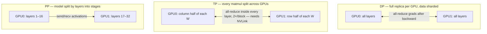
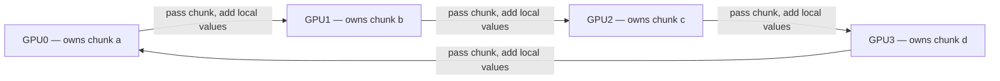

# Week 7 · Day 5 — Distributed training refresher, DDP lab, week close-out

[← Master Plan](../../../MASTER-PLAN.md) · [Week 7 overview](plan.md) · [← previous day](day-4.md) · [next day →](../week-8/day-1.md)

## Study block (2 h)

Last slice of **GPU Acceleration & Optimization (14%)** — the exam explicitly assumes DDP/FSDP/Megatron competency. You've built demos on all of this; today is consolidation into exam-answer form, then the week's second lab, then the closed-book self-check that gates the week.

### Parallelism taxonomy — one paragraph each, recite-ready (30 min)

- **DDP (data parallel)**: replicate the full model on every GPU; each rank trains on a disjoint data shard; after backward, gradients are **all-reduced** so every replica applies the identical update. Constraint: the model (+ grads + optimizer states) must fit on ONE GPU. Cheapest communication, scales until the model doesn't fit.
- **ZeRO / FSDP (sharded data parallel)**: still data parallel, but shard the redundant state — ZeRO-1 optimizer states, ZeRO-2 + gradients, ZeRO-3/FSDP + the parameters themselves. Each layer's weights are **all-gathered** just-in-time for compute and freed after; gradients are **reduce-scattered** so each rank keeps only its shard. Fits far bigger models at the price of more communication per step.
- **Tensor parallel (TP)**: split *individual matmuls* across GPUs (column/row-split weights); partial results merge with an **all-reduce inside every layer**, twice per transformer block. Communication is frequent and latency-sensitive → needs NVLink-class bandwidth → **stay intra-node**.
- **Pipeline parallel (PP)**: split the model by *layers* into stages on different GPUs/nodes; activations flow stage-to-stage via **point-to-point send/recv**. Micro-batches keep stages busy; the startup/drain idle time is the **pipeline bubble**, shrinking as microbatch count grows. Modest bandwidth needs → **inter-node friendly**.
- **Megatron-style 3D**: TP intra-node × PP inter-node × DP across replicas — how frontier models train. Long-context adds **sequence/context parallelism** (shard the sequence dimension, e.g. ring attention for the KV exchange).

**What each strategy actually splits — the model, the matmul, or nothing (just the data):**

### The collectives mapping and NCCL (20 min)

| Strategy | Dominant collective | Placement |
|---|---|---|
| DDP | all-reduce (grads, bucketed, overlapped with backward) | anywhere |
| FSDP/ZeRO-3 | all-gather (params) + reduce-scatter (grads) | anywhere, likes fast interconnect |
| TP | all-reduce per layer (2×/block) | intra-node (NVLink) |
| PP | point-to-point send/recv | inter-node OK |

Handy identity: all-reduce = reduce-scatter + all-gather — which is literally how ring all-reduce is implemented, and why FSDP's traffic isn't as different from DDP's as it first looks.

**Ring all-reduce — each GPU only ever talks to its neighbor; chunks accumulate around the ring (reduce-scatter), then finished chunks circulate (all-gather):**

**NCCL** transport hierarchy (from your demo repo): intra-node it prefers **NVLink/NVSwitch P2P**, then **PCIe P2P**, then **SHM** (staging through host memory); inter-node, **NET/IB with GPUDirect RDMA** if present, else **NET/Socket**. Algorithms: **ring** (bandwidth-optimal, latency grows with ranks) vs **tree** (better latency at scale). Verification is `NCCL_DEBUG=INFO` and grepping the `via ...` lines. Rehearse the sentence: *"NCCL probes topology at init, picks the fastest path per pair, and I verify it from the `via P2P/SHM/NET` lines in the debug log — and I can force the fallback ladder with `NCCL_P2P_DISABLE=1`."* That is simultaneously an exam answer and a demo-booth answer. It also explains the placement rules above: TP wants NVLink, DP/PP tolerate the network.

### Lab (~60 min) — [lab-distributed-ddp.md](../labs/lab-distributed-ddp.md)

Run it on a 2-GPU instance (2×L4 / 2×A10G / 2×4090 — no NVLink required; seeing PCIe/SHM *is* the point). Deliverables into [notes.md](notes.md):

- The **torchrun env-var table** filled in: RANK, LOCAL_RANK, WORLD_SIZE, LOCAL_WORLD_SIZE, MASTER_ADDR/PORT — and what each means.
- Your `nvidia-smi topo -m` prediction vs the actual **NCCL transport line** (`via P2P/CUMEM`, `via SHM`, …) pasted in.
- The forced-fallback result (`NCCL_P2P_DISABLE=1` → SHM; optionally Socket) with rough timings.
- The identical weight-checksum line across ranks — DDP's sync proof.

Terminate the instance when done. Total lab budget: $1–3.

### Week close-out (rest of block)

1. **[self-check.md](self-check.md), closed book** — answer all questions out loud or on paper *before* opening any `
`. Score honestly; target ≥ 80%.
2. Walk the **exit criteria** checklist at the bottom of [plan.md](plan.md) — every unchecked box gets a note about what's missing.
3. Fill in the **week 7 row of [PROGRESS.md](../../PROGRESS.md)**: topics done, labs run (`lab-distributed-ddp`, with `lab-quantize-serve` scheduled Monday), self-check %, confidence /5.

Anything below 80% or confidence ≤ 2: schedule the re-drill into week 8 day 4's review slot now, while it's concrete.

## Build block (4 h)

**Today: benchmark, document, publish** — the Triton/quantization week ships. [Project brief](../../../gpu-engineering-lab/02-llm-engineering/week-07-triton-quantization/README.md)

- `make bench` — full sweep: JSON + plots, median of ≥ 50 runs post-warmup, CUDA events, clocks recorded (`nvidia-smi -q -d POWER,CLOCK` — laptop 5090 clocks wander; interleave compared implementations, never quote a single run).
- `RESULTS.md`: kernel-vs-torch latency tables, the FlashAttention **O(N) vs O(N²) memory plot**, the fp16-vs-int8 perplexity table with memory savings, and an honest paragraph on **where your kernels lose to cuBLAS/cuDNN and why that's expected**.
- **Definition of done:** `make test` green on the 5090; `make bench` produces JSON + all three plots; `RESULTS.md` written including the "where cuBLAS still wins" paragraph; pushed; root README results row updated.
- Hint: write the honest-losses paragraph *first* — it forces you to actually read your benchmark data instead of narrating what you hoped it would say.
- If time remains, pre-read for Monday: the ferrum-serve [week-8 brief](../../../gpu-engineering-lab/02-llm-engineering/week-08-mini-inference-server/README.md) and one Candle generation example end to end — Monday's Candle wiring is fiddly and pre-reading halves it.

## Close the day (15 min)

- Anki: the parallelism-→-collective table, NCCL transport ladder, ring vs tree, pipeline bubble, all-reduce = reduce-scatter + all-gather.
- One line in [notes.md](notes.md): self-check score + the single weakest topic going into exam week.
- Log blockers — and confirm your NCP-GENL exam booking status tonight; week 8's plan assumes it's locked.
