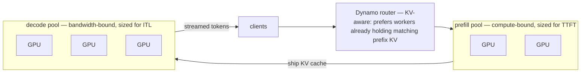

# Week 8 · Day 1 — Deployment: the NVIDIA serving stack + quantize/serve lab

[← Master Plan](../../../MASTER-PLAN.md) · [Week 8 overview](plan.md) · [← previous day](../week-7/day-5.md) · [next day →](day-2.md)

## Study block (2 h)

**EXAM WEEK.** Structure: today deployment, tomorrow monitoring + safety, Wednesday the timed mock, Thursday targeted re-drill + proctoring logistics, Friday the exam. Today's domain: **Model Deployment (9%)** — with **Monitoring (7%)** and **Safety (5%)** tomorrow, that's the final 21% of the blueprint. First: confirm your exam booking and reschedule policy *now* if you haven't (see [booking checklist](../../tools/booking-checklist.md)).

### The serving stack map — be able to draw this from memory

```
model checkpoint (HF safetensors / TRT-LLM engine)
        │
inference ENGINE ──── vLLM · TensorRT-LLM · SGLang        ← paged KV, continuous batching, quantized kernels
        │
server LAYER ───────── Triton Inference Server            ← multi-framework, model repository, ensembles
        │
packaged PRODUCT ───── NIM (NVIDIA Inference Microservice)← prebuilt container, OpenAI API, optimized profiles
        │
ORCHESTRATION ──────── Kubernetes                          ← NIM Operator, autoscaling, MIG/MPS/DRA
```

Layer by layer, what each *adds*:

- **Engine** (vLLM / TensorRT-LLM / SGLang): the GPU-facing machinery from week 7 — paged KV cache, in-flight batching, quantization kernels, spec decode. vLLM = flexible, day-one models; TRT-LLM = compiled peak performance per GPU arch; SGLang = strong at structured output/agentic workloads (RadixAttention prefix caching).
- **Triton Inference Server**: a *server*, not an engine — hosts many models across frameworks (TensorRT, PyTorch, ONNX, Python backends) from a **model repository**, with versioning, **ensembles** (pipelines: e.g. preprocess → LLM → postprocess as one endpoint), **dynamic batching** for stateless models, and LLM in-flight batching via the **TensorRT-LLM backend**. Trap distinction: *dynamic batching* (queue-and-batch identical stateless requests, a Triton scheduler feature) ≠ *continuous batching* (iteration-level LLM scheduling inside the engine).
- **NIM**: NVIDIA's packaging of all of the above — a prebuilt, security-scanned container exposing an **OpenAI-compatible API**; at startup it detects your GPU and **auto-selects an optimized profile** (TRT-LLM engine where one exists for your arch, vLLM fallback otherwise). Enterprise story: pull container, set an NGC key, `docker run`, done — the "we don't want to hand-tune vLLM flags" answer. Ships under NVIDIA AI Enterprise support.
- **Kubernetes**: **NIM Operator** for deploy/scale/cache management, autoscaling on GPU or LLM metrics, plus the GPU-sharing toolbox from your demo repo — **MIG** (hardware partitions, isolation), **time-slicing** (soft sharing, no isolation), **MPS** (concurrent processes, memory limits but weaker isolation), and **DRA ResourceClaims** replacing device-plugin counts with structured GPU allocation; KAI-style schedulers on top.

### Serving topologies — match topology to workload

1. **Single GPU, single replica** — model fits; the baseline.
2. **Tensor parallel across GPUs in one node** — the model *doesn't fit* on one GPU (70B FP16 ≈ 140 GB > any single card): TP=2/4/8 over NVLink. TP buys *capacity and per-token speed*, not efficiency — prefer the smallest TP that fits.
3. **Replicas behind a load balancer** — throughput scale-out for a fitting model; N replicas ≈ N× throughput with no intra-layer communication tax. Scale *out* before you scale *up*.
4. **Disaggregated prefill/decode** — separate GPU pools for compute-bound prefill and bandwidth-bound decode, KV cache shipped between them; each pool sized/optimized independently. This is **NVIDIA Dynamo**'s core idea (plus KV-aware routing: send requests to workers already holding matching prefix KV). The exam tell: "prefill interference with decode ITL at scale" → disaggregation.
5. **Multi-model / multi-tenant** — many fine-tuned variants ≠ many deployments: **multi-LoRA serving** hot-swaps adapters over one shared base model per batch (vLLM/NIM support dozens of adapters on one GPU).

**Topology 4 drawn out — two pools tuned for opposite rooflines, with the KV cache as the hand-off artifact:**



Match-ups to recite: latency-sensitive chat → replicas + (at scale) disaggregation; offline batch summarization → few big TP replicas, maximize batch, throughput over TTFT; 40 fine-tuned tenant variants → one base + multi-LoRA; 70B on 24 GB cards → quantize and/or TP.

### Lab (~55 min) — [lab-quantize-serve.md](../labs/lab-quantize-serve.md)

You skimmed it Thursday; run it now. vLLM FP16 baseline vs the AWQ 4-bit checkpoint of `Qwen2.5-1.5B-Instruct`, benchmarked with `vllm bench serve`. Paste into [notes.md](notes.md): TTFT p50/p99, ITL p99, output tok/s, and `# GPU blocks` for both runs. Predicted shape of the result (from week 7 — verify, don't assume): decode/ITL better under AWQ, TTFT flat-or-slightly-worse, KV blocks **up** because freed weight VRAM became KV pool. If ITL barely moves at request-rate 8, drop to 2 and watch the decode gain appear — that observation is roofline thinking, write it down. Terminate the instance after.

Cross-ref demo repo: today's material *is* your demo narrative (vLLM/Dynamo/NIM, MIG vs MPS, DRA). Rehearse each as a 30-second booth pitch — they double as exam answers.

### Read next

- NIM for LLMs docs — "Getting started" + the model-profile concept: <https://docs.nvidia.com/nim/large-language-models/latest/>
- Triton Inference Server conceptual guide — model repository, dynamic batching, ensembles: <https://docs.nvidia.com/deeplearning/triton-inference-server/user-guide/docs/>
- NVIDIA Dynamo repo README — the disaggregation + KV-routing story (also next-build context: its core is Rust): <https://github.com/ai-dynamo/dynamo>

### Quick check

1. Place these on the stack and say what each adds: Triton Inference Server, vLLM, NIM.
<details><summary>Answer</summary>vLLM = inference engine (paged KV, continuous batching, quantized kernels). Triton = server layer above engines (multi-framework model repository, versioning, ensembles, dynamic batching; LLMs via the TRT-LLM backend). NIM = packaged product wrapping engine+server in a prebuilt container with an OpenAI-compatible API and auto-selected optimized per-GPU profiles.</details>

2. Dynamic batching vs continuous batching — whose feature is each, and for what workloads?
<details><summary>Answer</summary>Dynamic batching: Triton scheduler feature — queues stateless requests (e.g. embedding/vision models) briefly and runs them as one batch. Continuous batching: LLM engine feature — iteration-level admission/eviction of generative sequences every decode step. Confusing them is a designed trap.</details>

3. A chat product suffers ITL spikes whenever users paste huge documents. Which two mechanisms address this, at engine level and at topology level?
<details><summary>Answer</summary>Engine: chunked prefill — interleave the long prompt's prefill chunks with running decodes. Topology: disaggregated prefill/decode (Dynamo-style) — separate GPU pools so prefill can't preempt decode at all, with KV transferred between pools.</details>

4. A customer has 30 LoRA-fine-tuned variants of the same 8B base and one A100. Deployment recommendation?
<details><summary>Answer</summary>Multi-LoRA serving: one shared base model in memory, adapters loaded/hot-swapped per request batch (vLLM or NIM). Thirty full deployments would need 30× the VRAM for weights that are 99% identical.</details>

## Build block (4 h)

**ferrum-serve begins — your first large Rust program.** Today: Candle hello + block-manager design. [Project brief](../../../gpu-engineering-lab/02-llm-engineering/week-08-mini-inference-server/README.md)

- Toolchain sanity: `cd ferrum-serve && cargo test` — everything **compiles and fails red** (the suites are complete, the skeletons are `todo!()`). All-red is correct; the tests are the spec.
- **Candle hello** (budget half the day — hf-hub + VarBuilder + qwen2 config wiring is fiddly the first time): implement `engine::load_model` and `engine::generate_single` — download `Qwen/Qwen2.5-1.5B-Instruct` safetensors via hf-hub, tokenize, greedy-decode one prompt on CUDA. This output becomes the *correctness oracle* for the whole week.
- **Design on paper**: read `tests/blocks_test.rs` top to bottom, then write the `BlockManager` struct fields (free list, ref-counts, block tables) into the TODO. You studied exactly this data structure last Thursday — now you're building it.
- **Definition of done:** `generate_single` prints a coherent greedy completion on CUDA; block-manager fields sketched; `cargo clippy -- -D warnings` and `cargo fmt` habits on from commit one.
- Hint: when Candle wiring fights you, diff your code against `candle-transformers`' own `qwen2.rs` example usage rather than guessing at VarBuilder paths — the config-key names must match the checkpoint exactly.

## Close the day (15 min)

- Anki: the five-layer stack, dynamic-vs-continuous batching, the five topologies + match-ups, NIM profile selection, MIG vs time-slicing vs MPS one-liners.
- One line in [notes.md](notes.md): your lab numbers (TTFT/ITL/tok/s/KV blocks, FP16 vs AWQ).
- Log blockers. Exam logistics check: booking confirmed, reschedule window known.
